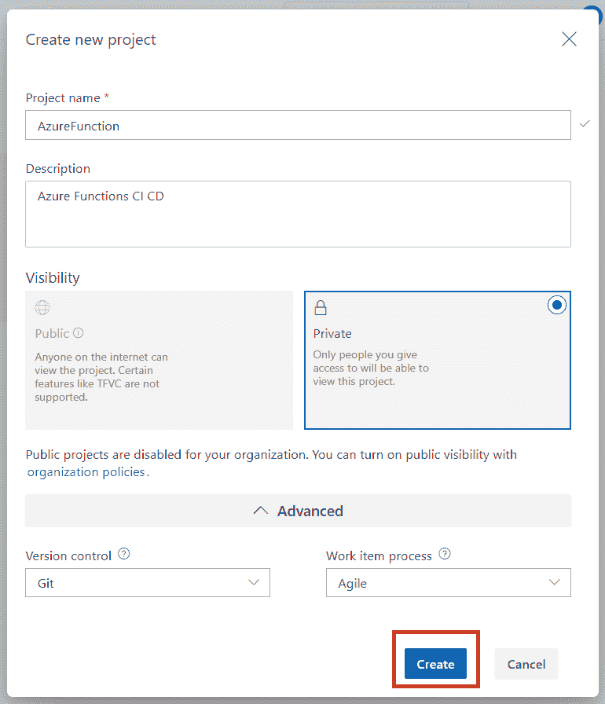
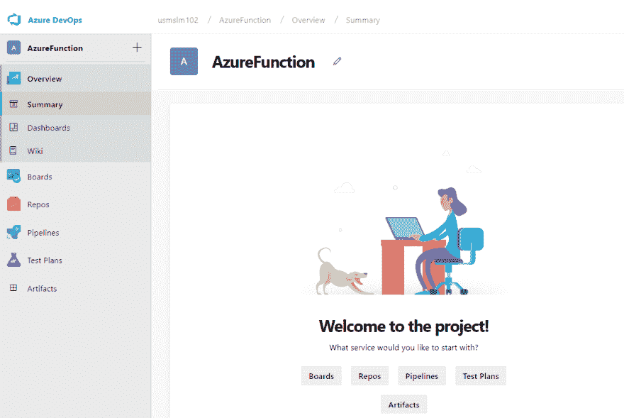
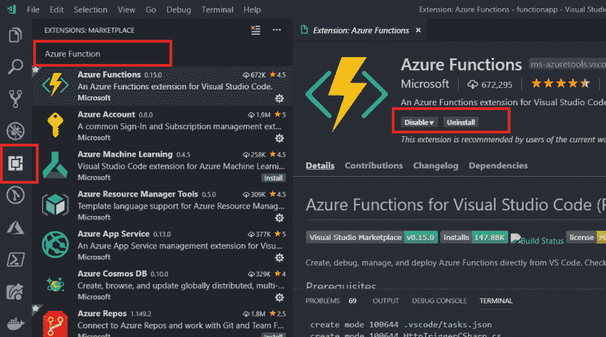
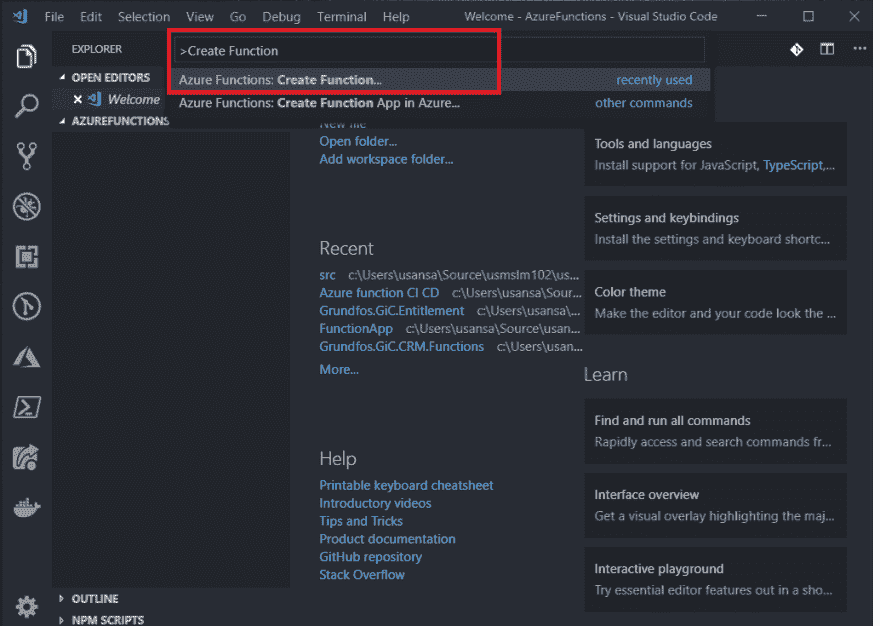
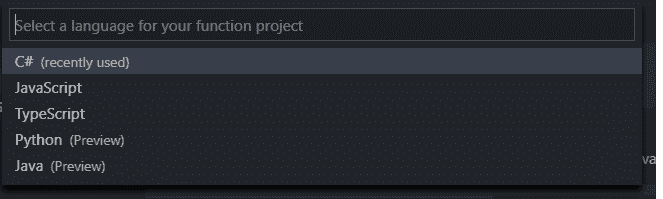
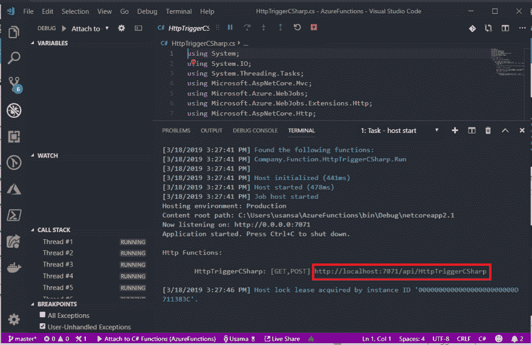
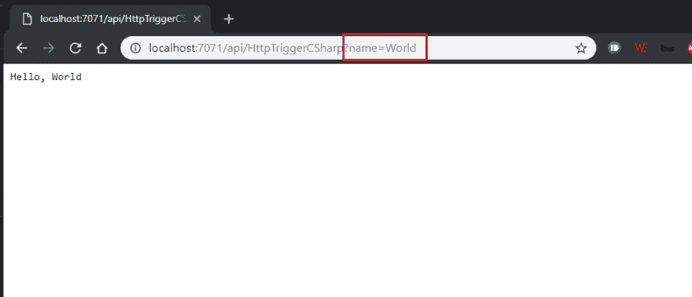

# 使用 VS 代码和 Azure DevOps (CI/CD)创建和部署 Azure 功能⚡

> 原文：<https://dev.to/usmslm102/create-deploy-azure-function-using-vs-code-and-azure-devops-ci-cd-3kmb>

> Azure 函数🚀是微软 faas(功能即服务)产品。在这里，您可以构建应用程序，而不必担心服务器和基础架构会根据需求进行扩展。您可以使用自己选择的编程语言。

我们开始吧...

##### 先决条件

1.  Azure Devops 帐户([免费获得](https://azure.microsoft.com/en-us/services/devops)
2.  Azure 账号([免费注册](https://azure.com/free))
3.  Visual Studio 代码([下载](https://code.visualstudio.com/download))

这篇文章相当长。请随意跳到所需的章节

> 1.  [创建 Azure DevOps 项目](#CreateDevopsProject)
> 2.  [Create Azure function](#CreateFunction) locally
> 3.  [Add Azure Explorer (ARM) template](#AddARM)
> 4.  [Push the code to the git library](#git)
> 5.  [Build/CI (Continuous Integration) pipeline](#CI)
> 6.  [Create Release/CD (Continuous Delivery) pipeline](#CD)

1.  ###### 创建 Azure DevOps 项目

    按照以下步骤创建新的 Azure DevOps 项目:

    1.  登录您的 Azure DevOps 租户[http://dev . Azure . com/[用户名]](http://dev.azure.com/%5Busername%5D) 用您的租户名称替换[用户名],例如 http://dev.azure.com/usmslm102 的
    2.  点击**创建项目**并提供所需的详细信息
    3.  项目创建后，您将被重定向到欢迎页面。

        * * *

2.  ###### 在本地创建 Azure 函数

    按照以下步骤在本地创建并运行 azure 函数

    1.  打开 Visual Studio 代码并安装`Azure Functions`和`C#`扩展，如果你已经安装了，那么跳过。
    2.  点击工具条上的扩展，搜索`Azure Functions`，点击安装按钮
    3.  搜索`C#`扩展并点击安装
    4.  创建一个名为 AzureFunctions 的新文件夹并在 vs 代码中打开
    5.  按下`ctrl/cmd (on MAC) + shift + p`并输入`Create Function` 
    6.  选择*创建功能*并选择当前文件夹
    7.  你会得到一个提示，说“选择的文件夹不是一个功能应用程序项目。初始化项目？”单击是
    8.  选择 C#作为语言
    9.  VS 代码将初始化函数 app，并要求选择函数模板
    10.  选择 HttpTrigger 并按 enter 键，使用默认的“HttpTriggerCSharp”函数名和“Company”。命名空间的函数"
    11.  选择访问权限作为功能，然后按 enter 键
    12.  按 F5 在本地测试我们的函数，并复制函数 URL 
    13.  导航到复制的 URL 并提供名为 name 的参数，例如`?name=World` 
    14.  瞧，我们的功能开始运行了😱

        * * *

3.  ###### Add Azure Explorer (ARM) template

在部署我们的功能之前，我们需要创建 Azure 资源。我们将使用 ARM 模板来创建下面的 Azure 资源。

1.  Azure 功能 App
2.  Azure 存储帐户
3.  消费 app 服务计划

以下 ARM 模板将创建所有 3 个资源:

1.  在文件夹模板中创建一个 functionapp.json 文件，并粘贴到内容下方

    **function app . JSON**T2】