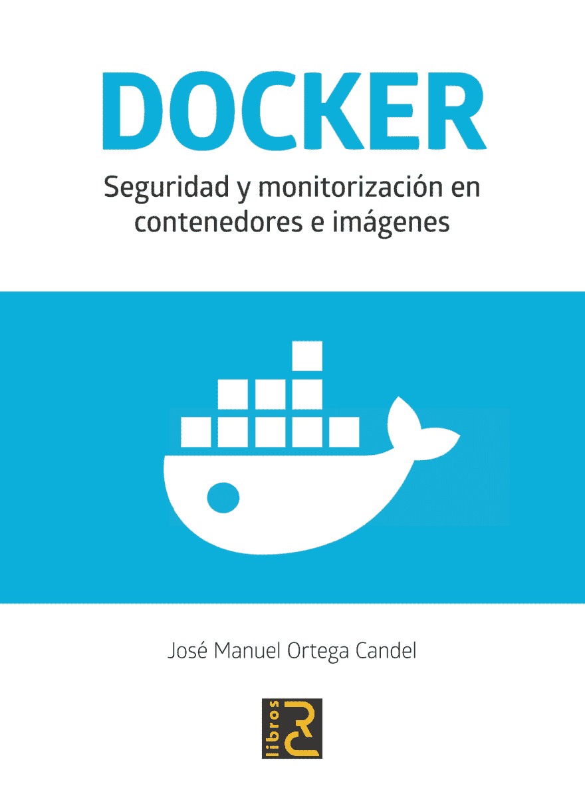

# 码头工人。容器和映像中的安全和监控

> [https://dev . to/jmortega/docker-security-y-monitoring in container-e-images-540 e](https://dev.to/jmortega/docker-seguridad-y-monitorizacion-en-contenedores-e-imagenes-540e)

[https://rcbooks . es/product/docker-security-y-monitoring in container-e-images/](https://rclibros.es/producto/docker-seguridad-y-monitorizacion-en-contenedores-e-imagenes/)中

本书旨在向读者提供必要的知识，使他们了解如何从运行本书的机器以及映像开发和部署的角度来管理安全坞站。

Docker 提供了一系列工具，使用户能够分析图像和容器的每一层，以查找过时的库以及数据库(CVE)中常见的漏洞和暴露。

此外，转向新的 devops 模式将使我们能够看到这些流程如何需要有效地集成到一个持续的开发和部署周期中，以便在保持安全性的同时最大限度地发挥容器的优势。

该书为开发人员提出了一套良好做法，以尽量减少我们的应用程序受到潜在攻击的风险。案文所述集装箱工具的几乎所有方面都得到实际操作实例的支持。因此，该书将帮助您从理论到实践的角度了解如何利用 docker 提供的灵活性、控制能力和便携性