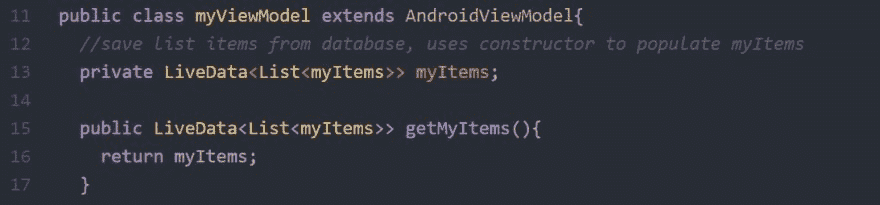
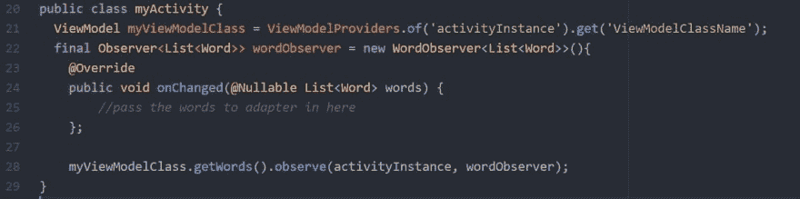
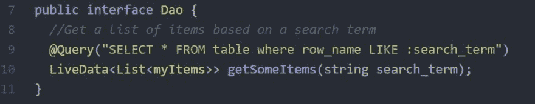
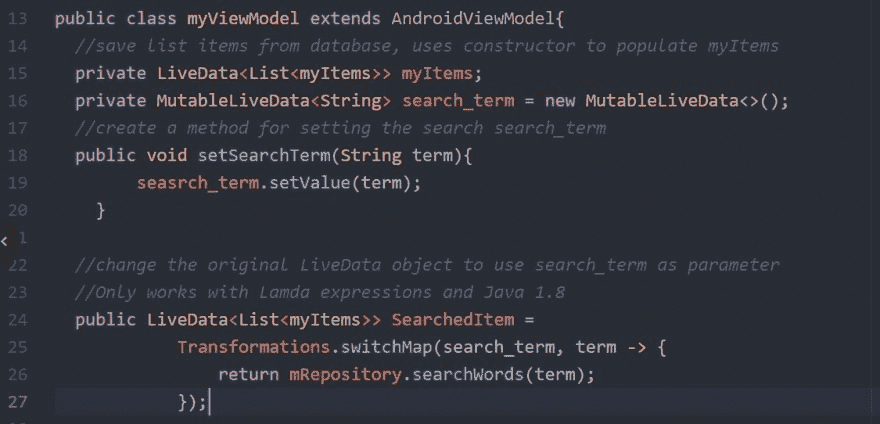
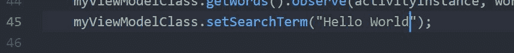
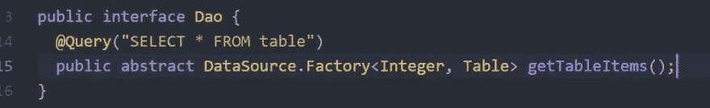
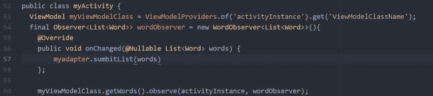

# LiveData 示例

> 原文：<https://dev.to/davidsprogrammingadventures/livedata-examples-3cej>

因此，在 Google Codelabs 教程中，提到了将数据从数据库传递到您的活动的实时观察者。向您展示了如何使用 LiveData 的一个版本，即将一个列表包装在 LiveData <>中，但是还有其他的方法和选项吗？我在这里列举了几个例子，都是我在网上找到的。

### 第一个例子

是一个简单的 Livedata，它包装了一个列表或项目，只有当数据库以单独的方式改变时，它才会改变。

通过存储库(如果有)传递，然后传递到视图模型:

然后 viewmodel 在您的 activity 类中初始化，这样您就可以创建 observer 并将其数据传递给数据容器。

### 第二个例子

向 LiveData 传递参数

修改刀

在 ViewModel 中，您需要使用第二个 LiveData，称为 MutableLiveData。
这个可变 LiveData 将用于从活动中向原始 LiveData 传递一个查询词。

这在活动代码中引起的唯一变化是设置 search_term 的额外调用

### 第三个例子

将 LiveData 传入 PagedList。使用 android architecture Room 从 sql 创建 Datasource.factory 方法。这个方法是填充页面列表的好方法，我只学了一点点，因为在我第一次学习 Android 的时候，我把它误认为是一个页面适配器。

首先修改您的 DAO 以使用数据源。

在 Viewmodel 类中，您设置了分页列表来与 LiveData 交互。

最后，设置一个观察器，并从 pagedList 向适配器传递工厂数据，这基本上与示例 1s 相同。

虽然示例 1 和示例 2 通常可以正常工作，但是根据您的数据，示例 3 可能更难实现，但是目前这是我能写出的最简单的示例。没有通常与页面列表相关联的任何额外内容。