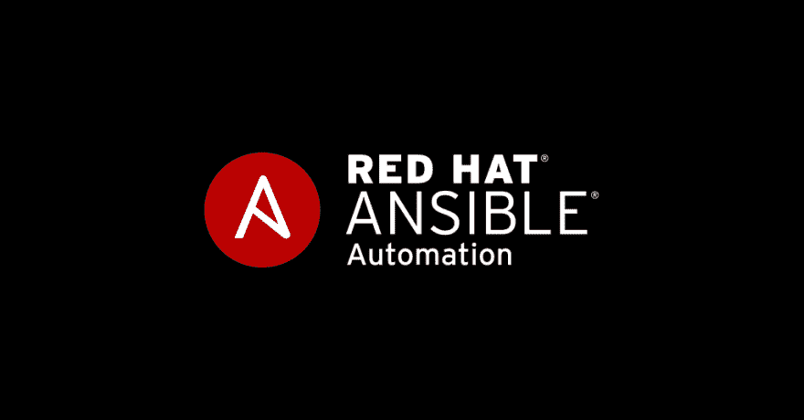
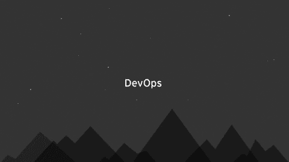
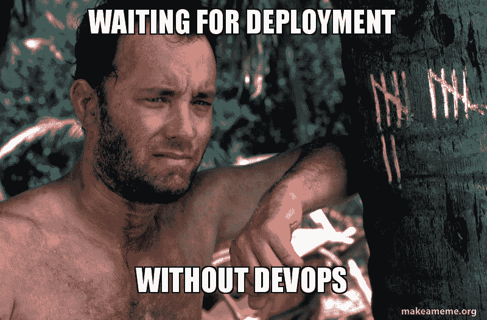
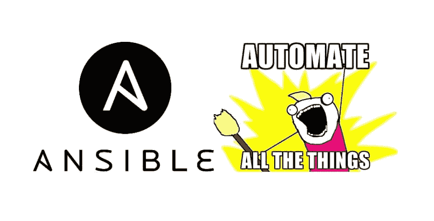

# 基础架构作为可扩展代码(第 1 部分)

> [https://dev . to/notfranco/infra structure-like-code-con-anxible-part-1-3 LPL](https://dev.to/notfrannco/infraestructura-como-codigo-con-ansible-part-1-3lpl)

 
**【基础设施作为代码】**
基础设施作为代码是一种基于软件开发实践的自动化方法。对系统及其特定配置所做的更改在配置文件(脚本、手册、清单、模块)中定义和捕获。

IaC 背后的理念是，将基础架构视为软件可以应用软件开发、持续交付(CD)、持续集成(CI)、版本控制、测试驱动开发(TDD)等方面的常见做法。

使用脚本实现服务器管理自动化并不是什么新鲜事，但随着云的蓬勃发展及其可能采取的各种形式(IaaS、PaaS、SaaS)以及诸如不安、木偶、厨师、Saltstack 等新工具，这些工具与**devotes**携手普及到 IaC

**DevOps？**

这是一个文化运动，它将哲学、良好做法和软件开发人员与运营人员之间的协作结合起来。devops 的目标之一是缩短开发周期并提高部署新业务功能的频率。

**是否应实施 IaC？**

即使采用了最新的虚拟化、容器和云技术，为在生产环境中部署新的业务功能而准备要求所花费的时间也与要配置的服务器数量和项目的重要性成正比。

没有代码和 devops 等基础架构的日常现实是，随着服务器数量从 10 台增加到 100+台，即使在发现问题的情况下，操作人员通常也要负责扑灭例行火灾，因此解决方案可能不适用于所有受影响的系统。服务器版本和配置的差异可能导致在一台服务器上运行的软件和脚本在另一台服务器上不起作用，从而导致服务器之间的不一致状态。

服务器之间的差异不是问题，而是当这些差异无法以易于复制和重建的方式捕获和处理时，IaC 可以捕获和定义这些差异。

在一个特例中，一组用作 loadbalancers 的服务器都共享相似的配置，但有些服务器处理的请求量大于其他服务器，因此需要相应地进行隧道连接，这种差异在一个基础架构中定义为代码，因此为一个需要两周时间的项目调配资源需要 15 分钟

好的，可以吗？

IaC 的两个主要部分是设置和配置，在这两个部分中，我们定义了服务器内容、它们必须具有的配置、必须安装的应用程序以及必须安装的应用程序等。这就是像焦虑这样的工具发挥作用的地方。

**安定器的基本架构**

1.  **连接**:可扩展是指不需要在其管理的服务器上安装代理，使用 SSH 连接到服务器并执行命令。

2.  **Inventory** 是用于定义和分组要由 ansible 管理的主机的位置。