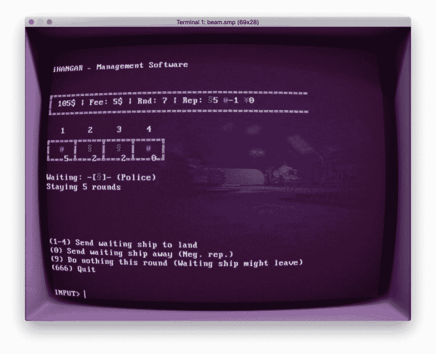

# 开发日志#2:登陆游戏，我们有一个循环！

> 原文：<https://dev.to/niorad/dev-log-2-lander-game-we-have-a-loop-k3i>

着陆器游戏仍在一点一点地摸索，但它已经有了一些规则和一个循环。这主要是我自己的草稿，写得相当匆忙。

**当前状态**:

*   玩家正在看一个太空机库管理软件，并且必须管理接近的船只。这个机库有四个成一排的着陆平台。船只每停留一轮就要付费。

*   到达的船只可能来自三个不同的部门:警察，公司，卡特尔。

*   玩家拥有每个分数的声望。正面的声誉意味着玩家可以从该分数中获得更多的小费。

*   声望会根据玩家如何将特定部分的船只相邻放置而改变。
    举例:把*警察*放在*卡特尔*旁边，用*警察*会提高声望，用*卡特尔*会降低声望。*卡特尔*旁边的*法人*表示带有*法人*的减号和带有*卡特尔*的加号。想想石头剪子布。

*   一艘船将在平台上停留 3 到 6 轮。

*   通过在平台上放置一艘新船来提前送走一艘船将会降低该分数的声望。

*   玩家每轮支付固定的维护费。

**当前的想法和斗争**:

*   一艘船应该为每一轮付费，还是只在登陆时付费，还是只在离开时付费？带薪休假，我可以补充说，如果船过早地被“送回家”，玩家将不会得到报酬。
*   任意数量的平台。从一个或两个开始，随着游戏的进展购买额外的平台。目前，4 个被硬编码到游戏中。
*   一个失败的条件仍然是失踪。如果你没有现金了，也许会输？
*   游戏目标可能是:在第 50 回合前获得 n 笔钱；不要在卡特尔组织中获得负面声誉；挺过 50 回合；从警方的负面报道开始，到第 30 回合时变成正面报道；
*   第四个分数，“休闲”或“私人”，对邻近的船只有影响，但对玩家没有声誉。可能对填补空位有用，我不知道…
*   第二维度。这些平台不仅仅是 4 个，可能是 3×4 个，而且声誉效应时好时坏。
*   事件！这将增加游戏的趣味性和故事性。示例:
    *   如果你不让警察着陆，卡特尔会给你钱
*   游戏目前有即时的状态改变，因为界面仍然是 CLI。这意味着每一个变化都是瞬间发生的，玩家没有转换来帮助想象结果。现在考虑最终视觉效果还为时过早。但我希望这是一个基于浏览器的游戏，如果它上市的话。当然，我不得不做了一点小改动，把 CLI 游戏放到了阴极应用程序中，为了一点没用的科幻网络氛围:

