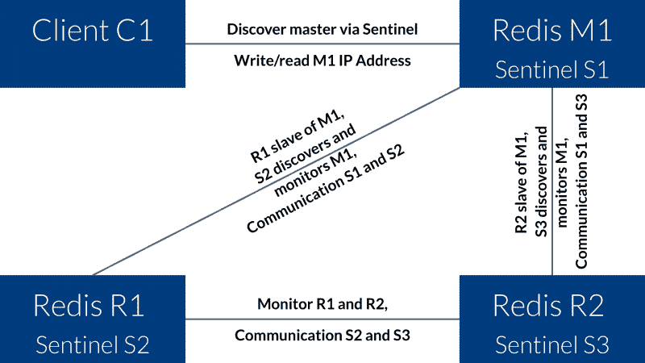

# Redis:复制，第 2 部分-主从复制和 Redis Sentinel

> 原文：<https://dev.to/setevoy/redis-replication-part-2-master-slave-replication-and-redis-sentinel-1hoe>

[](https://res.cloudinary.com/practicaldev/image/fetch/s--rqSEDlVy--/c_limit%2Cf_auto%2Cfl_progressive%2Cq_auto%2Cw_880/https://rtfm.co.ua/wp-content/uploads/2018/05/redislogo.png) 第一部分——[Redis:复制，第一部分——概述。复制与分片。哨兵 vs 集群。雷迪斯拓扑](https://rtfm.co.ua/en/?p=20328)。

下一部分—[Redis:复制，第 3 部分 redis-py 和使用来自 Python 的 Redis Sentinel】。](https://rtfm.co.ua/en/redis-replication-part-3-redis-py-and-work-with-redis-sentinel-from-python/)

整个故事是从我们决定除掉`memcached`开始的。

目前，我们的后端服务器上运行着`memcahced`和 Redis。

和`memcached`，Redis 实例作为独立的应用程序工作，即它们没有以任何复制方式连接，这导致了一个问题:

*   我们有三台后端主机，托管在 AWS 应用程序负载平衡器之后
*   ALB 启用了[粘性会话](https://docs.aws.amazon.com/en_us/elasticloadbalancing/latest/application/load-balancer-target-groups.html#sticky-sessions),但是它与 cookies 一起工作，这被我们的移动应用程序(iOS/Android)忽略了
*   当客户端向后端发出请求时——有时它可以在 Redis 或`memcached`中获取已经在另一个后端主机上删除/更新的缓存数据

我们有这个方案，因为我们从一个旧的基础设施中迁移了我们的后端应用程序，那里只使用了一个主机，但仍然没有时间更新它，尽管它在我们的飞机上已经有很长时间了。

目前，为了解决这些问题，我们在后端有一堆“黑客”进行额外的检查，以确保数据是最新的，现在为了消除它们，我们决定:

1.  完全去掉`memcached`，因为 Redis 可以用于现在使用`memcached`的函数
2.  在所有主机上配置 Redis 复制

这样的设置将在下面的帖子中描述。

第一个示例是基本的主从复制，第二个示例是 Sentinel 的设置和配置。

这里将使用带有 Debian 9 的 AWS EC2 实例。

为了与 Redis 主机一起工作，将使用三个域名——*redis-0.setevoy.org.ua*作为主机，*redis-1.setevoy.org.ua*和*redis-2.setevoy.org.ua*作为它的两个从机。

最小设置中的奴隶可以只有一个，但是第二个例子是哨兵-让我们从一开始就有三个。

### 基本主从复制

这样，从设备将成为主设备的只读副本，保存将添加到主设备的相同数据。

主设备将向其从设备发送所有数据更新——新密钥过期等。

如果主设备和从设备之间的链接断开，从设备将尝试重新连接到主设备，并进行部分同步，以便从先前同步中断的地方更新数据。

如果这种部分同步是不可能的——从机将要求主机进行完全同步，主机将执行其数据完全快照，该快照将被发送到该从机，之后将恢复正常同步。

这里有几点需要记住:

*   一个主机可以有多种类型的从机
*   从节点可以接受来自其他从节点的连接，形成复制节点的“级联”——主节点在顶部，从节点在中间，从节点在底部
*   强烈建议在主服务器上启用数据持久性以避免数据丢失——参见[主服务器关闭持久性时复制的安全性](https://redis.io/topics/replication#safety-of-replication-when-master-has-persistence-turned-off)
*   从机将默认工作在只读模式，参见[只读从机](https://redis.io/topics/replication#read-only-slave)

#### 重定向主配置

安装 Redis:

```
root@redis-0:/home/admin# apt -y install redis-server 
```

编辑一个`/etc/redis/redis.conf`并在`bind`中设置监听接口:

```
...
bind 0.0.0.0
... 
```

您可以在此指定多种类型的 IP，用空格分隔:

```
...
bind 127.0.0.1 18.194.229.23
... 
```

其他有价值的选项如下:

*   很清楚，但要牢记在心
*   `slave-read-only yes`–从节点将以只读模式工作，不会影响主节点
*   `requirepass foobared`–主授权密码
*   `appendonly yes`和`appendfilename "appendonly.aof"`——减少数据丢失几率，参见 [Redis 持久性](https://redis.io/topics/persistence#append-only-file)

重新启动服务:

```
root@redis-0:/home/admin# systemctl restart redis 
```

使用`-a`检查密码:

```
root@redis-0:/home/admin# redis-cli -a foobared ping
PONG 
```

检查数据复制状态:

```
root@redis-0:/home/admin# redis-cli -a foobared info replication
Replication
role:master
connected_slaves:0
master_repl_offset:0
repl_backlog_active:0
repl_backlog_size:1048576
repl_backlog_first_byte_offset:0
repl_backlog_histlen:0 
```

添加新数据:

```
root@redis-0:/home/admin# redis-cli -a foobared set test 'test'
OK 
```

拿回来:

```
root@redis-0:/home/admin# redis-cli -a foobared get test
"test" 
```

好的——这里一切正常

#### 重定向从属配置

在左侧的两台主机上进行从属配置。

对两者来说都是一样的——重复一遍就行了。

安装 Redis:

```
root@redis-1:/home/admin# apt -y install redis-server 
```

编辑`/etc/redis/redis.conf`:

```
...
slaveof redis-0.setevoy.org.ua 6379
...
masterauth foobared
...
requirepass foobared
... 
```

这里:

*   `slaveof`–设置主设备的主机和端口
*   `masterauth`–主人的授权
*   `requirepass`–在此副本上验证

重新启动服务:

```
root@redis-1:/home/admin# systemctl restart redis 
```

检查其状态:

```
root@redis-1:/home/admin# redis-cli -a foobared info replication
Replication
role:slave
master_host:redis-0.setevoy.org.ua
master_port:6379
master_link_status:up
master_last_io_seconds_ago:5
master_sync_in_progress:0
... 
```

检查日志:

```
root@redis-1:/home/admin# tail -f /var/log/redis/redis-server.log
16961:S 29 Mar 10:54:36.263 * Connecting to MASTER redis-0.setevoy.org.ua:6379
16961:S 29 Mar 10:54:36.308 * MASTER <-> SLAVE sync started
16961:S 29 Mar 10:54:36.309 * Non blocking connect for SYNC fired the event.
16961:S 29 Mar 10:54:36.309 * Master replied to PING, replication can continue...
16961:S 29 Mar 10:54:36.310 * Partial resynchronization not possible (no cached master)
16961:S 29 Mar 10:54:36.311 * Full resync from master: 93585eeb7e32c0550c35f8d4935c9a18c4177ab9:1
16961:S 29 Mar 10:54:36.383 * MASTER <-> SLAVE sync: receiving 92 bytes from master
16961:S 29 Mar 10:54:36.383 * MASTER <-> SLAVE sync: Flushing old data
16961:S 29 Mar 10:54:36.383 * MASTER <-> SLAVE sync: Loading DB in memory
16961:S 29 Mar 10:54:36.383 * MASTER <-> SLAVE sync: Finished with success 
```

与主机的连接已建立，同步已完成–好的，检查数据:

```
root@redis-1:/home/admin# redis-cli -a foobared get test
"test" 
```

数据存在-所有工作都在这里。

#### 改变奴隶= >主人的角色

万一主服务器关闭，你必须转换一个从服务器成为新的主服务器。

如果您试图在当前从属服务器上添加任何数据，Redis 将会出现错误，因为从属服务器处于只读模式:

```
...
slave-read-only yes
... 
```

尝试添加一些内容:

```
root@redis-1:/home/admin# redis-cli -a foobared set test2 'test2'
(error) READONLY You can't write against a read only slave. 
```

现在连接到从属服务器:

```
root@redis-1:/home/admin# redis-cli 
```

授权:

```
127.0.0.1:6379> auth foobared
OK 
```

禁用从属角色:

```
127.0.0.1:6379> slaveof no one
OK 
```

立即检查其状态:

```
127.0.0.1:6379> info replication
Replication
role:master
connected_slaves:0
master_repl_offset:1989
repl_backlog_active:0
repl_backlog_size:1048576 
```

再次添加新密钥:

```
127.0.0.1:6379> set test2 'test2'
OK 
```

把它拿回来:

```
127.0.0.1:6379> get test2
"test2" 
```

请记住，正如我们在 Redis 节点中直接进行的那些更改一样——在重新启动后，它将再次成为从节点，因为它仍然在它的`/etc/redis/redis.conf`文件中使用`slaveof`参数进行设置。

### 重复哨兵

现在，让我们将 Sentinel 添加到我们的复制中，它将监视 Redis 节点并自动进行角色切换。

总体方案如下:

[](https://rtfm.co.ua/wp-content/uploads/2019/03/redis-sentinel-800x450.png)

这里:

*   M1 =主人
*   R1 =副本 1 /从属 1
*   R2 =副本 2 /从属 2
*   S1 =哨兵 1
*   S2 =哨兵 2
*   S3 =哨兵 3

M1 和 S1 将登上 redis-0 号，R1 和 S2 将登上 redis-1 号，R2 和 S3 将登上 redis-2 号。

#### 跑步哨兵

要运行 Sentinel 守护进程，`redis-server`可以与单独的配置–`/etc/redis/sentinel.conf`一起使用。

首先，让我们在 Redis 主主机上创建这样的配置文件:

```
sentinel monitor redis-test redis-0.setevoy.org.ua 6379 2
sentinel down-after-milliseconds redis-test 6001
sentinel failover-timeout redis-test 60000
sentinel parallel-syncs redis-test 1
bind 0.0.0.0
sentinel auth-pass redis-test foobared 
```

这里:

*   `monitor`–被监控的主节点地址， *2* 是哨兵做出决策的实例号
*   `down-after-milliseconds`–时间，超过该时间后，主机将被视为出现故障
*   `failover-timeout`–改变从属角色后等待的时间= >主角色
*   `parallel-syncs`–主机改变后同时同步的从机数量

运行它:

```
root@redis-0:/home/admin# redis-server /etc/redis/sentinel.conf --sentinel
10447:X 29 Mar 14:15:53.192 * Increased maximum number of open files to 10032 (it was originally set to 1024).
_._
_.-``__ ''-._
_.-``    `.  `_.  ''-._           Redis 3.2.6 (00000000/0) 64 bit
.-`` .-``
 ``\/    _.,_ ''-._
(    '      ,       .-`  | `,    )     Running in sentinel mode
|`-._`-...-` __...-.``-._|'` _.-'|     Port: 26379
|    `-._   `._    /     _.-'    |     PID: 10447
`-._    `-._  `-./  _.-'    _.-'
|`-._`-._    `-.__.-'    _.-'_.-'|
|    `-._`-._        _.-'_.-'    |           http://redis.io
`-._    `-._`-.__.-'_.-'    _.-'
|`-._`-._    `-.__.-'    _.-'_.-'|
|    `-._`-._        _.-'_.-'    |
`-._    `-._`-.__.-'_.-'    _.-'
`-._    `-.__.-'    _.-'
`-._        _.-'
`-.__.-'
10447:X 29 Mar 14:15:53.193 # WARNING: The TCP backlog setting of 511 cannot be enforced because /proc/sys/net/core/somaxconn is set to the lower value of 128.
10447:X 29 Mar 14:15:53.195 # Sentinel ID is e9fb72c8edb8ec2028e6ce820b9e72e56e07cf1e
10447:X 29 Mar 14:15:53.195 # +monitor master redis-test 35.158.154.25 6379 quorum 2
10447:X 29 Mar 14:15:53.196 * +slave slave 3.121.223.95:6379 3.121.223.95 6379 @ redis-test 35.158.154.25 6379
10447:X 29 Mar 14:16:43.402 * +slave slave 18.194.45.17:6379 18.194.45.17 6379 @ redis-test 35.158.154.25 6379 
```

使用 26379 端口检查 Sentinel 的状态:

```
root@redis-0:/home/admin# redis-cli -p 26379 info sentinel
Sentinel
sentinel_masters:1
sentinel_tilt:0
sentinel_running_scripts:0
sentinel_scripts_queue_length:0
sentinel_simulate_failure_flags:0
master0:name=redis-test,status=ok,address=35.158.154.25:6379,slaves=2,sentinels=1 
```

这里:

*   主人起床了
*   它有两个奴隶
*   `sentinels=1`–目前只有一个 Sentinel 实例在运行

你可以在这里得到一些基本信息，例如——硕士的 IP:

```
root@redis-0:/home/admin# redis-cli -p 26379 sentinel get-master-addr-by-name redis-test
1) "35.158.154.25"
2) "6379" 
```

现在，使用与我们在主节点上相同的配置，在两个从节点上重复 Sentinel start，在 Sentinel 的日志中，您必须看到连接的新实例:

```
...
10447:X 29 Mar 14:18:40.437 * +sentinel sentinel fdc750c7d6388a6142d9e27b68172f5846e75d8c 172.31.36.239 26379 @ redis-test 35.158.154.25 6379

10447:X 29 Mar 14:18:42.725 * +sentinel sentinel ecddb26cd27c9a17c4251078c977761faa7a3250 172.31.35.218 26379 @ redis-test 35.158.154.25 6379
... 
```

再次检查状态:

```
root@redis-0:/home/admin# redis-cli -p 26379 info sentinel
# Sentinel
sentinel_masters:1
sentinel_tilt:0
sentinel_running_scripts:0
sentinel_scripts_queue_length:0
sentinel_simulate_failure_flags:0
master0:name=redis-test,status=ok,address=18.194.229.23:6379,slaves=2,sentinels=3 
```

好的。

此外，Sentinel 会在需要时执行自己的设置更新:

```
root@redis-1:/home/admin# cat /etc/redis/sentinel.conf
sentinel myid fdc750c7d6388a6142d9e27b68172f5846e75d8c
sentinel monitor redis-test 35.158.154.25 6379 2
sentinel down-after-milliseconds redis-test 6001
bind 0.0.0.0
sentinel failover-timeout redis-test 60000
Generated by CONFIG REWRITE
port 26379
dir "/home/admin"
sentinel auth-pass redis-test foobared
sentinel config-epoch redis-test 0
sentinel leader-epoch redis-test 0
sentinel known-slave redis-test 18.194.45.17 6379
sentinel known-slave redis-test 3.121.223.95 6379
sentinel known-sentinel redis-test 172.31.35.218 26379 ecddb26cd27c9a17c4251078c977761faa7a3250
sentinel known-sentinel redis-test 172.31.47.184 26379 e9fb72c8edb8ec2028e6ce820b9e72e56e07cf1e
sentinel current-epoch 0 
```

这里是添加的*sentinel myid FDC 750 c7d 6388 a 6142d 9 e 27 b 68172 f 5846 e 75d 8 c*行和配置重写生成的# *后的整个块。*

#### Redis Sentinel 自动故障转移

现在，让我们来看看如果主服务器关闭会发生什么情况。

你可以通过调用`kill -9`或者使用`redis-cli`并发送`DEBUG`命令来手动关闭一个主机，或者发送一个杀死主机的信号。

```
root@redis-0:/home/admin# redis-cli -a foobared DEBUG sleep 30 
```

主人的哨兵日志:

```
...
10447:X 29 Mar 14:24:56.549 # +sdown master redis-test 35.158.154.25 6379
10447:X 29 Mar 14:24:56.614 # +new-epoch 1
10447:X 29 Mar 14:24:56.615 # +vote-for-leader ecddb26cd27c9a17c4251078c977761faa7a3250 1
10447:X 29 Mar 14:24:56.649 # +odown master redis-test 35.158.154.25 6379 #quorum 3/2
10447:X 29 Mar 14:24:56.649 # Next failover delay: I will not start a failover before Fri Mar 29 14:26:57 2019
10447:X 29 Mar 14:24:57.686 # +config-update-from sentinel ecddb26cd27c9a17c4251078c977761faa7a3250 172.31.35.218 26379 @ redis-test 35.158.154.25 6379
10447:X 29 Mar 14:24:57.686 # +switch-master redis-test 35.158.154.25 6379 3.121.223.95 6379
10447:X 29 Mar 14:24:57.686 * +slave slave 18.194.45.17:6379 18.194.45.17 6379 @ redis-test 3.121.223.95 6379
10447:X 29 Mar 14:24:57.686 * +slave slave 35.158.154.25:6379 35.158.154.25 6379 @ redis-test 3.121.223.95 6379
10447:X 29 Mar 14:25:03.724 # +sdown slave 35.158.154.25:6379 35.158.154.25 6379 @ redis-test 3.121.223.95 6379
... 
```

目前，我们对这两条线感兴趣:

```
...
10384:X 29 Mar 14:24:57.686 # +config-update-from sentinel ecddb26cd27c9a17c4251078c977761faa7a3250 172.31.35.218 26379 @ redis-test 35.158.154.25 6379

10384:X 29 Mar 14:24:57.686 # +switch-master redis-test 35.158.154.25 6379 3.121.223.95 6379
... 
```

Sentinel 执行了从到主的重新配置。

*35.158.154.25*——是现在已经去世的旧主人，*3.121.223.95*是从奴隶中选出的新主人——它运行在 *redis-1* 主机上。

尝试在此添加数据:

```
root@redis-1:/home/admin# redis-cli -a foobared set test3 'test3'
OK 
```

而对现在变成从设备的旧主设备的类似尝试将导致错误:

```
root@redis-0:/home/admin# redis-cli -a foobared set test4 'test4'
(error) READONLY You can't write against a read only slave. 
```

让我们删除一个节点，看看 Sentinel 现在会做什么:

```
root@redis-0:/home/admin# redis-cli -a foobared DEBUG SEGFAULT
Error: Server closed the connection 
```

日志:

```
...
10447:X 29 Mar 14:26:21.897 \* +reboot slave 35.158.154.25:6379 35.158.154.25 6379 @ redis-test 3.121.223.95 6379 
```

嗯——御天敌刚刚重启了那个节点

#### 哨兵命令

| **命令** | **描述** |
| --- | --- |
| `sentinel masters` | 列出所有主文件及其状态 |
| `sentinel master` | 一个主人的身份 |
| `sentinel slaves` | 列出所有从属设备及其状态 |
| `sentinel sentinels` | 列出所有 Sentinel 实例及其状态 |
| `sentinel failover` | 手动运行故障转移 |
| `sentinel flushconfig` | 强制 Sentinel 在磁盘上重写其配置 |
| `sentinel monitor` | 添加新的母版 |
| `sentinel remove` | 将主机从被监视状态中移除 |

### 相关链接

*   再复制
*   T0 英特尔 T1 设置文件示例
*   [Redis Sentinel —高可用性:从开发到生产，您需要了解的一切:完整指南](https://medium.com/@amila922/redis-sentinel-high-availability-everything-you-need-to-know-from-dev-to-prod-complete-guide-deb198e70ea6)
*   [Redis Sentinel:让您的数据集高度可用](https://www.inovex.de/blog/redis-sentinel-make-your-dataset-highly-available/)
*   [如何运行 Redis Sentinel](https://jameshfisher.com/2019/01/08/how-to-run-redis-sentinel/)

### 类似的帖子

*   <small>2019 年 3 月 29 日</small> [Redis:复制，第 1 部分–概述。复制与分片。哨兵 vs 集群。Redis 拓扑。](https://dev.to/setevoy/redis-replication-part-1-overview-replication-vs-sharding-sentinel-vs-cluster-redis-topology-3i27-temp-slug-483121) <small>(0)</small>
*   <small>2018 年 8 月 5 日</small> [【日:儿基会、儿基会、儿基会、](https://rtfm.co.ua/redis-ustanovka-zapusk-primery/)<small>【0】</small>
*   <small>03/26/2019</small> [普罗米修斯:警报管理器的警报接收者和基于严重性级别和标签的路由](https://dev.to/setevoy/prometheus-alertmanagers-alerts-receivers-and-routing-based-on-severity-level-and-tags-3f9c) <small>(0)</small>