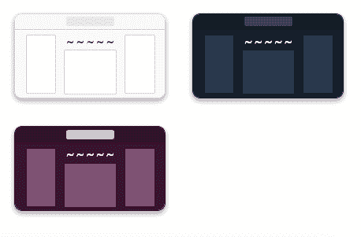

# 诚聘投稿人:夜间模式/开发主题

> 原文：<https://dev.to/devteam/contributors-wanted-night-mode-themes-on-dev-i8n>

我们最近将夜间模式作为[开发到](https://dev.to/)接口的一个选项。您可以在[/设置/杂项](https://dev.to/settings/misc)中更改它们。

进展不错，但仍有一些地方需要更新。如果您遇到任何看起来不太对的地方，我们欢迎您提出请求。

### 你可以在这里看到标注了夜间模式[的现存问题。](https://github.com/thepracticaldev/dev.to/issues?q=is%3Aissue+is%3Aopen+label%3Anightmode)

为了进行更改，在 SCSS 中找到适当的行，并在其后添加一行 CSS 变量，如下所示:

```
color: $medium-gray;
color: var(--theme-secondary-color, $medium-gray); 
```

Enter fullscreen mode Exit fullscreen mode

这两种方式都可以确保浏览器的兼容性。随着时间的推移，我们也许能够消除这种重复。

这是我们目前拥有的用于夜间模式的 CSS 变量列表:

```
--theme-background: #161f2b;
--theme-color: #fff;
--theme-secondary-color: #cedae2;
--theme-top-bar-background: #141d26;
--theme-top-bar-color: #fff;
--theme-top-bar-search-background: #424a54;
--theme-top-bar-search-color: #fff;
--theme-top-bar-write-background: #00af81;
--theme-top-bar-write-color: #fff;
--theme-container-background: #27374c;
--theme-container-accent-background: #384b66;
--theme-container-background-hover: #37475c;
--theme-gradient-background: linear-gradient(to right, #293d56 8%, #282833 18%, #293d56 33%);
--theme-container-color: #fff;
--theme-container-box-shadow: none;
--theme-container-border: 1px solid #141d26; 
```

Enter fullscreen mode Exit fullscreen mode

基本上，这些都是可以放在 SCSS 其他地方的变量

目前，我们只专注于夜间模式，但我们正在构建这一模式，以便在未来可以更动态地定义主题，具体如下:

[](https://res.cloudinary.com/practicaldev/image/fetch/s--ZcaNvatr--/c_limit%2Cf_auto%2Cfl_progressive%2Cq_auto%2Cw_880/https://thepracticaldev.s3.amazonaws.com/i/2r2yjmnerl6ha85d9fbe.png)

为了在本地测试这一点，你必须启动并运行应用程序，但如果你想在不在本地运行应用程序的情况下进行推测性的 PRs，我们不会反对。

多谢了，编码快乐！