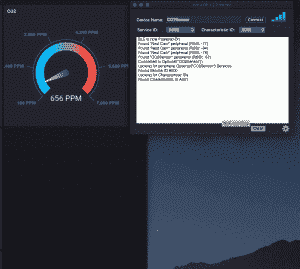

# 从 Swift 向 InfluxDB 发布数据

> 原文：<https://dev.to/davidgs/publishing-data-to-influxdb-from-swift-16p4>

我一直很忙。就在几天前，我写了一个新的 InfluxDB 库，用于将数据从 Arduino 设备写入 InfluxDB v2，现在我再次写了一个新的**库，用于将数据写入 InfluxDB。这次是在 Swift。现在，您的原生苹果应用程序可以轻松地将数据直接写入 InfluxDB v2.0。**

这是一个非常简单的库，你可以从我的 [GitHub](https://github.com/davidgs/InfluxData-Swift) 下载整个 Xcode 项目。您可以使用它将单个数据点写入数据库，或者进行任意大小的批量写入。这里有一个如何使用它的快速教程。

```
let influxdb = InfluxData() 
```

Enter fullscreen mode Exit fullscreen mode

这将得到一个`InfluxData`类的实例。一旦你有了它，你需要为它设置一些配置参数。

```
influxdb.setConfig(server: “serverName", port: 9999, org: “myOrganization", bucket: “myBucket", token: “myToken") 
```

Enter fullscreen mode Exit fullscreen mode

当然，您需要根据 InfluxDB v2.0 服务器的设置来设置所有这些值。您也可以使用
设置时间精度

```
let myPrecision = DataPrecision.ms // for Milliseconds, ‘us' for microseconds, and ’s’ for seconds
influxdb.setPrecision(precision: myPrecision) 
```

Enter fullscreen mode Exit fullscreen mode

此时，您已经准备好开始收集数据并将其发送到 InfluxDB v2.0！对于您收集并想要存储的每个数据点，您将创建一个新的`Influx`对象来保存标签和数据。

```
let point: Influx = Influx(measurement: “myMeasurement")
point.addTag(name: “location”, value: “home”)
point.addTag(name: “server”, value: “home-server”)
if !point.addValue(name: “value”, value: 100.01) {
    print(“Unknown value type!\n)
}
if !point.addValue(name: “value”, value: 55) {
    print(“Unknown value type!\n)
}
if !point.addValue(name: “value”, value: true) {
    print(“Unknown value type!\n)
}
if !point.addValue(name: “value”, value: “String Value" {
    print(“Unknown value type!\n)
} 
```

Enter fullscreen mode Exit fullscreen mode

如您所见，它接受整数、浮点值、布尔值和字符串。如果它不能确定数据类型，它将返回布尔值`false`,所以检查返回值总是一个好主意。

为了获得最佳性能，我们建议将数据分批写入 InfluxDB，因此您需要准备数据进入批处理。这很容易通过调用
来实现

```
influxdb.prepare(point: point) 
```

Enter fullscreen mode Exit fullscreen mode

当需要写批处理时，只需调用

```
if influxdb.writeBatch() {
    print(“Batch written successfully!\n)
} 
```

Enter fullscreen mode Exit fullscreen mode

同样，`writeBatch()`返回一个关于成功或失败的布尔值，所以检查这些值是一个好主意。

如果您想在每个数据点出现时写入它们，只需获取您在上面创建的数据点并调用

```
influxdb.writeSingle(dataPoint: point) 
```

Enter fullscreen mode Exit fullscreen mode

当每个数据点用其测量值初始化时，您可以同时将数据写入多个测量值，并且您可以添加任意数量的标签和字段。

这实际上是 InfluxDB v2.0 Swift 库的第一次通过，因为我将在未来向该库添加查询、创建 buckets 和许多其他 [Flux 语言](https://docs.influxdata.com/flux/v0.12/introduction/getting-started/)的功能，但由于大多数人想要立即做的是将数据写入数据库，我想我会在那里实现这一点。

希望这有帮助！我知道对我来说是这样！你看，我最近一直在用我的 Mac 笔记本电脑从我制作的蓝牙二氧化碳传感器上抓取数据。为此，我构建了一个小的 BLE 应用程序，它连接到传感器，订阅数据 ID，并不断地将数据写入 InfluxDB。不用说，我用了这个库，一直在刮这些数据，愉快地存储。

[](https://davidgs.com/wp-content/uploads/2019/03/2.0CO2.gif) 

我很想知道你们打算用 Swift Library 2.0 做什么，所以请务必[在 twitter 上关注我](http://twitter.com/follow?user=davidgsIoT)，让我知道你们在做什么！

从 Swift 向 InfluxDB 发布数据的帖子[最早出现在](https://davidgs.com/2019/publishing-data-to-influxdb-from-swift/)[的 David G. Simmons](https://davidgs.com) 上。