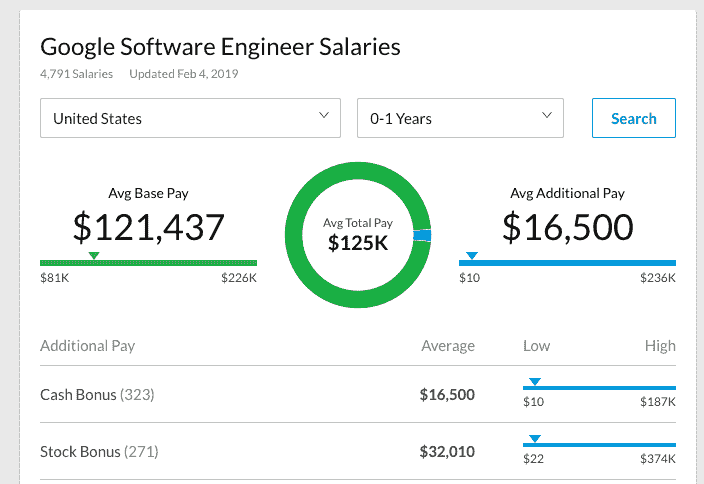
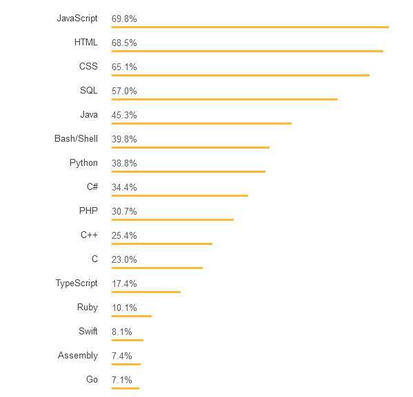

# 2019 年如何开始打码

> 原文：<https://dev.to/tomiwa1a/how-to-start-coding-in-2019-2lbd>

2019 年最值得学习的技能之一就是学习如何编码。因为你想在生活中做出的任何改变最难的部分通常是开始，这里有一个非常详细的分步指南，教你确切地如何开始学习如何编码。

在本教程中，我将介绍如何学习前端开发、后端开发和数据科学的基础。

目录:

*   简介[0:29]
*   为什么编码很重要[0:45]
*   了解你如何学习以及你为什么会放弃[2:55]
*   你应该使用什么工具来编码[4:20]
*   编码类型[5:20]
*   你应该学习什么语言[6:50]
*   前端开发[7:55]
*   后端开发[13:00]
*   数据科学[18:30]
*   综合起来[23:50]
*   一般建议[26:00]
*   结论[28:10]

[https://www.youtube.com/embed/3EpmbXMfM60](https://www.youtube.com/embed/3EpmbXMfM60)

[在 Youtube 上观看](https://bit.ly/tomiwa-start-coding-tutorial-youtube)

[//speakerdeck.com/player/2e138e4f095b4ecbb47f3e585fab4d4b](//speakerdeck.com/player/2e138e4f095b4ecbb47f3e585fab4d4b)

[在 SpeakerDeck 上观看幻灯片](https://bit.ly/tomiwa-start-coding-tutorial-speakerdeck)

[https://open.spotify.com/embed/episode/62LCydLkf8SbXB8Z3Faris](https://open.spotify.com/embed/episode/62LCydLkf8SbXB8Z3Faris)

[在 Spotify 上听播客](https://bit.ly/tomiwa-start-coding-tutorial-spotify)

[在 Itunes 上听播客](https://bit.ly/tomiwa-start-coding-tutorial-itunes)

## **简介**

编码是一个很大的领域，需要很多不同的东西，要知道从哪个分支开始，下一步要学什么可能会让人不知所措。所以除了教如何开始编码，我还会讲你应该先学什么，应该按什么顺序学前端、后端、数据科学之类的东西。如何以一种你确实记得并理解你在做什么的方式学习，并且不失去动力和放弃。

注意，做任何事情都没有唯一正确的方法。但是我明白了，当你问别人如何做 X 时，他们给了你三个不同的选择，但是不要承诺，也不要推荐哪一个。因此，我将以一种固执己见的方式写这篇文章，向你展示不同的选择，并告诉你该选择哪一个。再说一次，没有正确的方法，但至少我们可以花更少的时间在 X 和 Y 之间争论，而花更多的时间实际构建酷的东西。

## 编码为什么重要

软件工程是我能想到的为数不多的既有高质量生活又有高收入的工作之一。大多数高薪工作，如投资银行或油田工作，通常需要你在高压力的环境下长时间工作。而通常工作与生活平衡较好的工作，如教师或会计，薪水也一般不高。

[没有经验的谷歌软件工程师的薪酬](https://www.glassdoor.ca/Salary/Google-Software-Engineer-US-Salaries-EJI_IE9079.0,6_KO7,24_IL.25,27_IN1.htm?experienceLevel=LESS_THAN_ONE)

如果你在谷歌这样的大型科技公司找到一份软件工程的工作，你可以获得大约 12 万美元的基本工资和 1.6 万美元的奖金，外加 0-1 年的工作经验。这意味着，大学一毕业，你就可以挣六位数的薪水！事实上，大学毕业后有很多工作可以让你拿到六位数的薪水，但很少有公司能像大型科技公司的软件工程师一样，提供工作生活平衡、压力小的工作环境。

据说，我们都知道金钱不是万能的。但是编程可以在很多其他方面提高你的生活质量。最重要的是，它能给你很多自由。你可以学习如何使用或编写软件，让你的生活更轻松，从 gmail 扩展到自动化电子邮件，再到帮助你获取感兴趣的数据的脚本。

即使你不在大型科技公司工作。学习编程可以让你周游世界，在任何地方工作，同时仍然作为一名全职远程工作者或自由开发者编写代码。

如果你有一个想开发的软件或服务的想法，不要试图说服或付钱给别人来帮你开发，你可以自己动手开发。

## 了解你如何学习以及为什么你可能会放弃

当我第一次开始编程时，最大的障碍之一就是找出最好的学习方法。我认为学习编码和几乎任何东西的最好方法是实践。基本上这意味着，想出你想要构建的东西，找到一个关于如何做的教程，然后一字不差地跟着教程做。一旦你对事情的工作方式感到满意，你就可以开始逐渐增加越来越多的变化，直到你对你所构建的感到满意。

如今大多数问题的解决基本上只是想出一个聪明的方法，将你的问题转化成一个返回有用结果的谷歌查询。你也应该尝试，看看你是否通过写博客，书籍或视频学得更好。我建议尝试这三种方法，看看哪种方法能最快地帮助你学习新概念。

学习如何学习的很大一部分是理解是什么阻止你学习新东西。这其中很大一部分是失去动力。我的很多建议都有一些策略，可以让你保持动力，欺骗自己继续学习，甚至(特别是)当你想放弃的时候。

。

## 你应该用什么工具来编码

我认为最好的开发机是 Macbook Air。我自己也有一台 15 英寸的 Macbook Pro，因为我上次实习的时候就有一台，而且非常喜欢用它。但在我去年夏天的实习中，他们给了我一台 Macbook Air，它对开发来说出人意料地强大，而且非常轻，所以我建议买一台 13 英寸的 Macbook Air。

现在，你们中的一些人已经认为我建议你们买一台 1200 美元的笔记本电脑是非常精英主义/无聊的，这显然是非常昂贵的。幸运的是，用不到 Macbook 四分之一的价格，你就可以买到[这款叫做](https://amzn.to/2TfZSwF) [Chromebook](https://www.google.com/chromebook/) 的神奇笔记本电脑。Chromebooks 基本上是运行 Chrome OS 的笔记本电脑，因此大多数应用程序都通过网络浏览器在云中运行，你可以使用在线 ide，如 [Cloud 9](https://aws.amazon.com/cloud9/) 来编写代码。我在亚马逊上找到了一款售价为[285 美元的手机，甚至一款别致的触摸屏手机也只需要](https://amzn.to/2V1ksm1)[649 美元](https://amzn.to/2LxXkqC)。甚至，如果你没有得到 Chromebook。看看 cloud 9，它是一个非常强大的工具。

除此之外，任何笔记本电脑都可以。我个人更喜欢基于 unix 的机器，因为我发现 Windows 很难操作，但它们各有各的特点，所以只要选择一台笔记本电脑就可以开始工作了。

我强烈推荐使用 [Github](https://github.com/) 来保存你所有的编码项目。这里有一个非常好的关于 git 和 Github 入门的[教程](https://guides.github.com/activities/hello-world/)。

## 编码类型

有许多类型的编码:网页开发，移动应用程序开发，硬件编程等。如果你是一个初学者，那么你可能应该从 web 开发或移动应用程序开发开始。我认为你应该从网站开发开始，因为当你刚刚开始时，最重要的事情是快速发货。

当你第一次开始编码时，很容易气馁，被安装和设置分心，或者被所有不同的选项淹没。通过 web 开发，您可以编写一个简单的 web 应用程序，并在几分钟内将其部署到一个活动的 url。您还可以非常频繁地更新，不必担心设备的特定功能，并且可以非常快速地与朋友和家人分享您制作的内容。这可以让你更快地尝试新事物，从而学得更快，在你气馁之前看到你的劳动成果。

我还认为，我们正在从移动应用世界转向网络应用世界。人们不想安装另一个应用程序，很难通过应用程序商店被发现，你必须为两个设备开发应用程序等等。你可以看[这篇文章](https://atila.ca/blog/tomiwa/how-to-build-websites-that-work-without-internet-using-angular-service-workers-and-firebase-lets-keep-in-touch)来了解为什么[网络比移动更适合大多数应用](https://atila.ca/blog/tomiwa/why-we-chose-angular-over-react-and-django-over-ruby-on-rails-for-atila-the-essential-software-startup-techstack)。

## 应该学什么语言

[栈溢出 2018 最热门技术](https://insights.stackoverflow.com/survey/2018#most-popular-technologies)

我觉得你应该学习的两种语言是 Javascript 和 Python。从 Javascript 开始。

Javascript 将是大多数前端 web 框架所必需的，Python 也经常用于后端和数据科学应用。

我通常将软件开发分为三个阶段。前端、后端和数据科学。两年前，我只会说前端和后端工程，但我注意到，数据科学正在成为我们与之交互的每个应用程序中越来越重要的一部分。如果你刚刚起步，我认为最好的起点是专注于前端 web 开发。通过创造一些你可以轻松部署、玩和展示给别人的东西，这会让你有动力继续学习更多。与后端或数据科学相比，设置步骤更少，学习曲线也更低。

## 前端开发:

我艰难地认识到，开始构建的最佳方式是采用已经有效的东西，并添加您自己的修改，而不是重新发明轮子。所以在建立网站的时候，我建议使用现有的框架/库，比如 Angular，React，Vue.js 等。见[我的第一个网站](https://tomiwa.ca/schedy/schedy.php)之一，它是我用纯 html/css/js 和 PHP 制作的，无缘无故地让我的生活变得更加艰难。

我开始使用 Angular 是因为我们在大学的一门课上使用了它。我仍然喜欢 Angular，因为他们有一个非常明确的做事方式。我甚至写了一整篇文章来解释为什么我选择用 Angular 来建立我的初创公司 T2。综上所述，我认为你应该开始学习如何使用 React 建立网站。

同样，所有语言都有优点和缺点，你可以阅读[这篇文章](https://medium.com/@TechMagic/reactjs-vs-angular5-vs-vue-js-what-to-choose-in-2018-b91e028fa91d)或[这篇文章](https://medium.com/zerotomastery/react-vs-angular-vs-vue-who-wins-in-2019-5d9acd0843e8)比较不同的 javascript 框架。争论选择哪一个很容易浪费时间(根据经验)。我将简化所有这些论点，从学习 React 开始，因为它是最受欢迎的 Javascript 框架([由 Github star](https://github.com/facebook/react/stargazers) s 衡量)，所以它有最多的工作和自由职业者合同(尽管竞争也最激烈)。此外，因为有如此多的用户，所以有更多的人为开源 React codebase 做出贡献，以便更快地修复 bug 并添加更多功能。

学习 React 的最好方法是在 React 中构建项目。在 React 中构建项目的最佳方式是找到您想要构建的东西的教程，逐字逐句地跟着做，然后复制粘贴即可。如果你不明白你复制和粘贴的是什么，不要担心。当你遇到一个 bug 或决定添加一个修改时，你将逐渐了解事情如何工作的原因背后的理论。这可能是一种非正统的学习方式，但我发现对我来说，这是学习新思想的最快方式，以最快的速度推出产品，我认为这对你也适用。

这是[戴夫·塞迪亚](https://daveceddia.com/)为了开始学习 React 而创建的[React 项目](https://daveceddia.com/react-practice-projects/)的可怕列表。以下是我开始学习 React 的前三个项目:

1.  [简单的待办事项列表](https://hackernoon.com/create-a-simple-todo-app-in-react-9bd29054566b)
2.  [戴夫·塞迪亚的实践项目](https://daveceddia.com/react-practice-projects/)
3.  [无服务器堆栈反应](https://serverless-stack.com/)–更高级的全堆栈 web 应用，在完成其他 3 个教程后构建

在这个阶段你需要学习的最重要的技能是解决问题和坚持。或者像我喜欢的“如何有效地将东西输入谷歌”。如果你是一个完全的初学者，很有可能你会在第一步卡住。不要气馁，只要把他们让你做的任何没有意义的事情复制粘贴到谷歌里，加上一个“如何做”。比如一个教程说“从 Github 克隆教程”只要谷歌“如何从 Github 克隆”甚至“什么是 Github”就可以了。另一个建议是，如果你得到一个错误，你不知道它是什么意思，只需将错误信息的前 5-10 个单词复制到 Google 中，并删除特定于项目的名词。

重要的是，当你第一次开始时，你将要面对的每一个问题都可能已经遇到过，因为互联网是如此之棒，答案可能就在互联网的某个地方。你只需要聪明地知道如何提出好的问题。顺便说一句，问好问题在我看来是生活中的三大技能(魅力和动力/乐观是另外两个),但是我跑题了。

当你完成一个项目时，我建议你做两件事:第一，与世界分享(或者只是朋友和家人),第二，教人们你是如何做的。这有两个原因。我们是社会性的动物，向人们展示你所创造的东西的想法会激励你确保你生产出高质量的东西。其次，如果你有支持你的朋友和家人，他们会对你做的东西做出积极的反应，激励你做更多酷的东西来再次获得那种感觉。

我建议把你刚刚学到的东西教给其他人，因为通过教给其他人，你会发现自己知识中的差距，这有助于你更好地理解这个概念，并且你可以为其他人做些好事。请注意，教学并不一定意味着通过一对一的辅导或讲课来真正地教某人。简单地写一篇博客，制作一个关于你是如何建造东西的幻灯片，或者在你解释你是如何建造东西的时候录制一段自己的视频，仍然会有同样的效果，而且对社交的要求更少，也更耗时。

将您的所有工作保存到 Github。对于前 1 到 2 个项目，我会允许你作弊，不使用 Github，因为学习曲线会让很多人在开始之前就放弃。但是一旦你建立了一两个项目，你就需要开始使用 Github 了。一开始学习它有点烦人，但从长远来看，它会让你的生活轻松很多。

这里有 3 个资源可以用来开始学习 Git:

1.  [官方 Github Hello 世界指南](https://guides.github.com/activities/hello-world/)
2.  [Git 和 GitHub 初学者入门(教程)](https://product.hubspot.com/blog/git-and-github-tutorial-for-beginners)
3.  [GitHub 初学者:不要害怕，开始吧](https://readwrite.com/2013/09/30/understanding-github-a-journey-for-beginners-part-1/)

## 后端工程

后端工程是一个非常有趣的领域，因为这是许多商业价值和技术真正开始脱颖而出的地方。例如，谷歌和必应的主页(前端)看起来相对相似，但它们的后端基础设施却大相径庭。这就是为什么谷歌搜索是一个 590 亿美元/年(2013 年)的产品，相比之下，必应搜索是一个 32 亿美元/年(2013 年)的产品(T2)。

从后端开发开始的最佳方式是构建一个 [REST API](https://searchmicroservices.techtarget.com/definition/RESTful-API) 服务器，它可以根据客户端的动作向不同的客户端发送数据。例如，这里有[一个简单的 REST API](https://atila-7.herokuapp.com/api/scholarships/) 我为提供奖学金信息而构建，这里有一些[的源代码](https://github.com/atilatech/atila-api-demo)。

我建议你从学习 python 开始，并使用像 [Django](https://www.djangoproject.com/) 这样的框架来帮助加速你的学习过程。我推荐 python，因为:

*   Python 是最流行的编程语言之一
*   您可以直接从命令行开始编码
*   语法非常直观，适合说英语
*   Python 在数据科学中被广泛使用，所以如果你决定做更多的 ML 项目，学习曲线会更容易

学习 python 我推荐的两个框架是 [Flask](http://flask.pocoo.org/) 和 [Django](https://www.djangoproject.com/) 。我推荐在 Flask 中构建您的第一个或第二个 python 项目，然后当您感觉更舒服时，开始用 Django 构建应用程序。 [Django Rest 框架](https://www.django-rest-framework.org/)是一个优秀的框架，可以用来构建 REST APIs。Ruby on Rails 是另一个流行的选择。

首先构建一个非常简单的 REST API 服务器，它从用户那里获取一些信息，然后将一些信息发送回来。例如，演示 API 有两个功能:显示奖学金列表和基于用户查询搜索奖学金。然后，您可以逐渐添加更复杂的功能。

为了让您参与进来，我建议构建一个 REST API，为您感兴趣的主题提供数据。例如，如果你对篮球感兴趣，你可以构建一个 API 来显示每支 NBA 球队的 5 名先发球员以及他们每场比赛的得分、篮板和助攻。然后允许用户按位置或每局点数查询 API。你可以使用 [NBA API](https://pypi.org/project/nba-api/) 来获取 NBA 的统计数据，或者只使用谷歌“X api”来查找你感兴趣的任何话题的数据。

然后，您可以将它与前端开发技能结合起来，制作一个移动 web 应用程序，让用户可以研究 NBA 球员。然后，您可以使用您的数据科学技能和 Tensorflow 图像识别，这样，如果您拍摄一名 NBA 球员的照片，它会告诉您该球员是谁以及该球员的统计数据。

这里有五个很棒的教程可以开始学习，Flask，Django 和 Django Rest 框架:

1.  [官方烧瓶教程](http://flask.pocoo.org/docs/1.0/tutorial/)
2.  [米格尔·格林伯格的烧瓶教程](https://blog.miguelgrinberg.com/post/the-flask-mega-tutorial-part-i-hello-world)——绝对惊艳！我做过的最好的教程之一，非常详细
3.  [Django 官方教程](https://docs.djangoproject.com/en/2.1/intro/tutorial01/)&[Django 官方休息框架教程](https://www.django-rest-framework.org/tutorial/quickstart/)
4.  《探戈与姜戈》——这一部唤起了人们的回忆，虽然有点过时，但也涵盖了广泛的主题
5.  [Django 女孩教程](https://tutorial.djangogirls.org/en/)——我喜欢这个，因为它向你展示了如何在 Chromebook 上安装，还有一个关于[互联网如何工作的很酷的部分](https://tutorial.djangogirls.org/en/how_the_internet_works/)

## 数据科学

我在 2017/2018 年的时候意识到，随着越来越多的人进入编码，基本的前端开发甚至一些后端开发技能都会商品化。真正的好机会将会提供给那些解决最复杂的商业增值问题的人。我认为投资回报率最高的最复杂的问题是在数据科学领域。

伟大的本杰明富兰克林阅读机器学习电子书。假发隐藏的 Airpods。

这也是对初学者最不友好的话题，因为这个行业的大多数人至少有硕士或博士学位。然而，我的一个榜样，本杰明·富兰克林，10 岁就完成了学业，甚至没有高中毕业，他发明了避雷针、双光眼镜和其他很酷的东西。所以如果你愿意学习和尝试，你可以在这个领域做得很好。

我首选的学习方法主要包括盲目复制和粘贴机器学习教程。然后，我逐渐修改和混合不同的教程，直到我真正理解我在做什么，在更深的层次上发生了什么。一旦我理解了一个机器学习的概念，我也会试着写一些关于它的东西，或者就我学到的东西做一个简短的演讲，这有助于我将我的知识具体化，其他人也可以学到一些有用的东西。

2017 年 7 月 18 日，在我之前在[RBC Amplify](https://jobs.rbc.com/ca/en/amplify)实习的时候，我给[做了一个关于机器学习的演讲](https://tomiwa.ca/talks/ml.html)

我非常喜欢的一个不错的网站是 pythonprogramming.net。遵循其中一个教程，一旦你完成了教程，试着对最终的项目做一点小小的修改。对各种教程继续这样做，并尝试阅读维基百科或谷歌你遇到的有趣的概念。这样，你学到的概念、科学和数学更有可能被你的大脑记住，就像你应用它们来创建一个实际的项目一样。

另一个你可以查看的网站是[机器学习大师](https://machinelearningmastery.com/)。这个网站一开始可能会有点让人不知所措，所以我建议从你的第一个 Python 机器学习项目[开始，一步一步来](https://machinelearningmastery.com/machine-learning-in-python-step-by-step/)。我还做了一个关于机器学习的介绍，针对初学者和相关专家，你可以查看一下([幻灯片](https://docs.google.com/presentation/d/1lFsKtExuwcgF-rXIMfaRJqzlnlHAq5f5gujqESy7aVo/edit?usp=sharing)，[博文](https://blog.tomiwa.ca/practical-machine-learning/))。

这里有 3 个不错的机器学习教程:

1.  [介绍使用 Scikit Learn 和 Python 进行机器学习](https://pythonprogramming.net/machine-learning-python-sklearn-intro/)
2.  [实用机器学习](https://pythonprogramming.net/machine-learning-tutorial-python-introduction/) ( [我根据这个](https://blog.tomiwa.ca/practical-machine-learning/)做了自己的教程)
3.  [你的第一个 Python 机器学习项目](https://machinelearningmastery.com/machine-learning-in-python-step-by-step/)

## 把所有的东西放在一起

理想情况下，您的编程之旅应该是这样的:

1.  使用 React 或 Angular 教程构建 3 个项目
2.  使用 python 和 Django(或 Ruby on Rails)构建 3 个 REST APIs
3.  创建一个数据科学项目，接受输入，使用机器学习处理输入并生成输出

下面是一个三种柠檬如何结合在一起例子:

1.  用户打开你的网络应用，给两个篮球运动员拍照。
2.  您的数据科学功能对图像进行了一些分析，发现这是一张勒布朗·詹姆斯和迈克尔·乔丹的照片。

3.  您的 REST API 后端服务器将一些数据返回到您的 web 应用程序，比较两个球员的职业统计数据。

## 一般建议:

除了编码，我还推荐一些最佳实践，让人们更容易跟上你的工作。

1.  创建一个个人网页，这样人们可以更多地了解你，你可以把你所有的链接放在一个地方。我推荐 github pages 或者 squarespace

2.  给你在 Github 上的所有项目添加一个详细记录的 README.md ,这样人们可以了解你是如何完成的，以及他们如何在本地机器上运行你的项目。这里有一个[关于 atila-tech-landing](https://github.com/atilatech/atila-tech-landing/blob/master/README.md) 的 README.md 好例子。

3.  选择你最引以为豪的项目，写一篇博文，制作一个视频，解释你是如何完成这个项目的。即使你从来没有向任何人展示过博客文章或视频，记录你思维过程的过程也会帮助你更好地理解你在做什么。

## 结论

互联网是惊人的，像谷歌，亚马逊，脸书等公司。给了我们巨大的工具和巨大的影响力。但是为了让你利用这些机会，你需要学习并应用你所学的东西。

这篇文章里有很多东西，所以只需选择最简单的一个，并开始努力完成它。努力成为 2019 年的那个人，让 2020 年的你感到骄傲。活着是多么美好的时光啊！