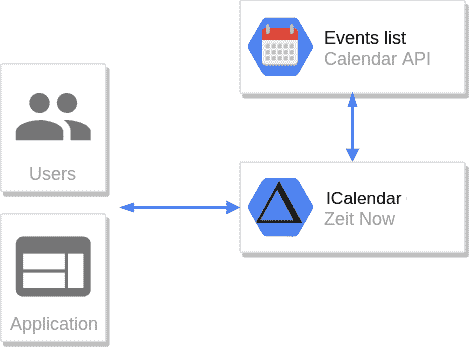

# Android BYOD:保持连接而不失去手机控制

> 原文：<https://dev.to/nickcis/android-byod-staying-connected-without-losing-phone-control-4m67>

几个月前，我工作的公司推出了一项名为*自带设备* *(BYOD)* 的新政策。虽然，许多人已经在我们的手机上免费设置了公司的谷歌邮件，现在我们被鼓励使用我们的个人设备来工作，但为了这样做，我们必须安装一个[谷歌应用程序设备政策](https://support.google.com/a/users/answer/190930?hl=en)。我们被告知，这项政策的目标是保护敏感公司的数据，这个应用程序只会迫使我们有一个锁定代码和设备加密。

根据谷歌的帮助:

> 根据您的管理员如何管理您组织中的 Android 设备，您可能需要在您的设备上安装 [Google Apps 设备策略应用程序](https://play.google.com/store/apps/details?id=com.google.android.apps.enterprise.dmagent)。该应用程序在您的设备上强制实施您组织的安全策略，以保护公司数据并使其更加安全。如果您没有安装该应用程序，但您的管理员要求安装，则您无法在您的设备上访问 G Suite 数据，包括工作电子邮件、日历和联系人。

就最初的描述而言，这款应用并不是我可以抱怨的东西，但在阅读了管理员可以用这款应用做的事情后，它真的让我心烦意乱:

> 一些组织要求他们的用户在其设备上安装 Google Apps 设备策略应用程序。如果您不安装该应用程序，您的邮件、日历和通讯录可能不会与您的设备同步。有关更多详情，请联系您的 G Suite 管理员。
> 
> 您的管理员可以设置以下安全策略:
> 
> *   设备密码强度和所需长度。
> *   以下项目的编号:
>     *   **擦除设备前允许无效密码。**
>     *   被阻止的最近过期的密码。
>     *   设备密码过期前的天数。
>     *   设备自动锁定前的空闲分钟数。
>     *   **天设备在擦除**前未同步。
> *   **应用审计。**
> *   **远程擦除设备或设备上的帐户。**
> *   设备策略应用程序版本要求。
> *   阻止安全受损的设备。
> 
> 您的管理员还可以使用该应用程序配置 Wi-Fi 网络和管理网络访问证书。他们可能会选择隐藏网络的详细信息，以便只有拥有网络名称和密码的用户才能连接到该网络。

什么？为什么我会允许我工作的公司审计我在个人设备上使用的应用程序，并允许他们删除它？。

## 不同步的工作方式

执行该策略时，我的个人设备上的邮件、日历和文件停止同步。起初，我认为，我从来没有在设备上使用过 google drive，我经常会忽略邮件，但如果没有日历，我真的会很痛苦。我有点健忘，所以能够收到关于会议的通知，并且能够在通勤时查看我的日常安排，这对我真的很有帮助。

我第一次尝试将我的日历分享到我的个人帐户，这很有效，但几天后，它停止同步。共享非公共事件也被禁止给不是来自组织的帐户。然后，我记得谷歌允许使用[私人地址](https://support.google.com/calendar/answer/37648?hl=en)导出日历，但是，因为我找不到它，所以我断定这是不允许的。

加强对硬盘和电子邮件的保护是有道理的，但是，我真的不明白为什么不允许我在手机上有一个只读版本的工作日历，尤其是当我被允许有空闲时间的时候。

## 开发者，开发者，开发者

嗯，我是一个开发者，我知道 [google 有一个日历 api](https://developers.google.com/calendar/v3/reference/events/list) ，我还需要什么来同步日历到我的手机？。

显然，有一种谷歌支持同步的[日历格式](https://en.wikipedia.org/wiki/ICalendar)，所以，我的想法是生成一个服务，通过一个 url 以该格式显示我的日历，并将该 url 导入我的个人帐户日历。

我不想在这个项目上花钱，也不想减少维护时间，所以我的要求是:

*   服务应该运行在一个自由层上(nodejs 服务器，静态托管)
*   它应该是无服务器的(又名，函数/λ)
*   该服务不应该存储任何数据(它需要的基础设施越少，我这边的维护工作就越少)。

我想以此为借口尝试一些无服务器的方法，我玩过 Zeit 的 Now v1，但从未有机会用他们的 [v2](https://zeit.co/blog/now-2) 做些什么。它有一个[节点生成器](https://zeit.co/docs/v2/deployments/official-builders/node-js-now-node)和一个 [next js](https://zeit.co/docs/v2/deployments/official-builders/next-js-now-next) ，满足了我的后端和前端需求。

开始就像分叉他们的 [monorepo 示例](https://zeit.co/examples)一样简单。至于 nodejs 端点，事情变得有点棘手。我真的很喜欢 [Zeit 的微观方法](https://github.com/zeit/micro)，虽然它来自同一家公司，但他们还没有一个建设者。有一个[社区建设者](https://github.com/lucasconstantino/now-micro)，但它真的不适合我。因此，我最终构建了一个名为[micro micro me](https://www.npmjs.com/package/micronize)的包，它用微功率增强了常规 labmda 功能。

这个项目很容易开发。Google token 存储在 url 上(类似于 Google 日历的秘密地址)。因此，当日历的端点被命中时，它从 url 读取 google 令牌和日历的 id，调用[事件列表 api](https://developers.google.com/calendar/v3/reference/events/list) ，生成 icalendar 文件并在响应中提供它。我非常依赖 [ical 生成器包](https://www.npmjs.com/package/ical-generator)来生成 ical 输出，这真的让事情变得更容易了。

源代码可以是 [GitHub](https://github.com/NickCis/google-icalendar-sync) 和 [https://gics.now.sh](https://gics.now.sh) 上的工作副本。

* * *

虽然，我在开发这个项目的过程中得到了乐趣，但我真的不明白为什么有时候组织会受到官僚主义的阻碍。我明白，对存储在谷歌产品上的敏感数据的安全担忧很重要，但我不认为实现这一点的方法是禁止人们在个人手机上同步工作账户，尤其是当他们愿意免费同步时。在大多数情况下，这只会降低生产率，而不会增加安全性。我必须强调，我被允许(也受到鼓励)在手机上放松，手机上可能有比工作日程更明智的数据。

* * *

*原贴于[nckweb.com.ar](https://nckweb.com.ar)T3】*