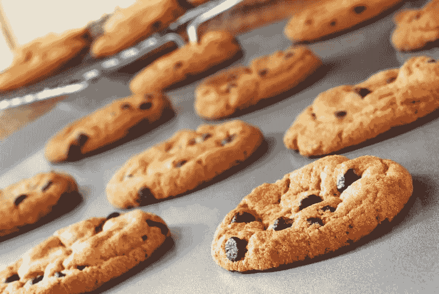

# 对我来说，编码有点像烘焙

> 原文：<https://dev.to/blackmg27/for-me-coding-is-kinda-like-baking-fg6>

我不能告诉你我尝试的第一个食谱，尽管它可能是五香葡萄干饼干(我会为它们的好辩护)。我母亲一边听福音音乐，一边耐心地指导着食谱，使用的混音器已经经受住了至少六位总统的考验(我会确保在她的遗嘱中得到那个混音器)。

有一段时间，我认为所有的会想做的是烘焙，直到我进入代码。

现在，不要误解我的意思，我绝不是专家(老实说，这在这个领域非常罕见)，但我注意到，在一个人如何接近烘焙食谱的代码提示方面有一些相似之处。

以巧克力饼干条为例(这可能是我最容易做的食谱之一)。一件事是，配料可以等于你必须在食谱/程序开始时设置的变量。然后你可以有一个名为`makeCookies()`的整体函数，函数内部有更小的“指令”。其中一个功能是将黄油、糖、鸡蛋和香草精混合在一起，用 while 循环来组装你的干配料。另一个功能可以是烤箱时间的设置超时，用 for 循环检查饼干条(如果使用 18”x 12”x 3/4”烤盘，通常是 22 分钟中的 18 分钟)，可能还有另一个 while 循环用于清理。

我想，当一个人第一次接触代码时，与其他东西比较会有好处，对我来说，这就是烘烤。