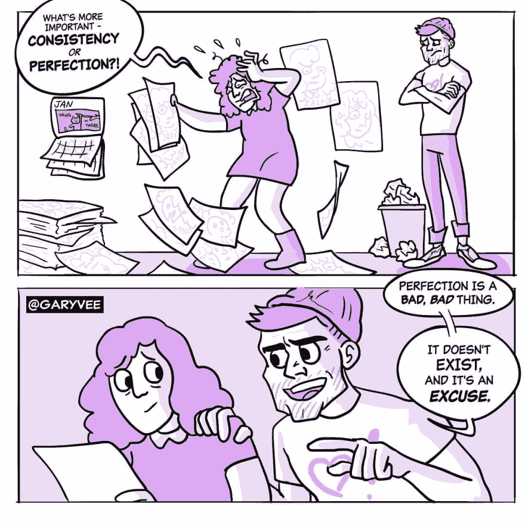

# 你应该完美吗？

> 原文：<https://dev.to/sunnysingh/should-you-be-perfect-14e7>

> 本文原载于[我的简讯](https://sunnysingh.io/news)。

在我的[个人品牌文章](https://sunnysingh.io/blog/personal-brand)中，我谈了很多关于个人品牌和一致性的重要性。但是我确信你们中的一些人可能会想...

> 一致性很好，非常阳光，但我有很高的期望。我重视质量胜于数量。

我认为这些期望很重要，但不是在短期内。达到完美需要时间，但在这个过程中，你必须提高你的技艺。你是怎么做到的？通过运送更多。

## 刚发货

*(你知道，就像[耐克的广告语](https://youtu.be/Fq2CvmgoO7I) )*

独立制作人社区非常重视发布，也就是说尽可能快地向公众发布你正在制作的任何东西。这是一个很好的建议，可以让你的想法在现实世界中得到验证，并有所展示。

实际运送东西更难，尤其是对那些高度重视完美的人来说。但以我最近在加里·维纳查克的 Instagram 上看到的这幅漫画为例:

完美是让你远离出货的借口。润色一个版本以确保用户不会遇到软件错误或简单的语法错误并不可耻，但是在某一点之后，你必须把它放在那里。

我从失败的项目中学到了很多。想象一下，如果我花了很长时间才发布它们，或者更糟，根本没有发布。没有真实世界的反馈、经验和教训可以让我用在未来的项目中。

## 用内容打造品牌

如果你想了解你*应该如何*在社交媒体上用**本地内容**进行营销，而不仅仅是发布你喜欢的平台的链接，看看我的播客中关于[用内容](https://sunnycommutes.fm/episodes/61-building-a-brand-with-content-zl5wOK)建立品牌的一集。

[https://www.youtube.com/embed/9zwrbWcWm9g](https://www.youtube.com/embed/9zwrbWcWm9g)

* * *

> 完美是让你远离出货的借口。

所以**不**，你不需要完美。精益求精，只管出货！