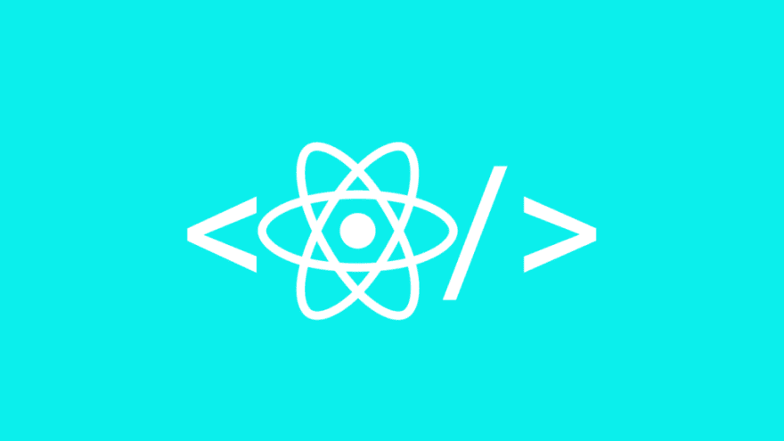
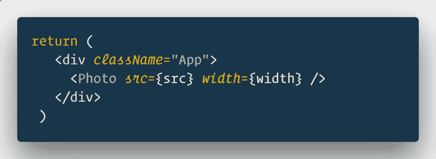
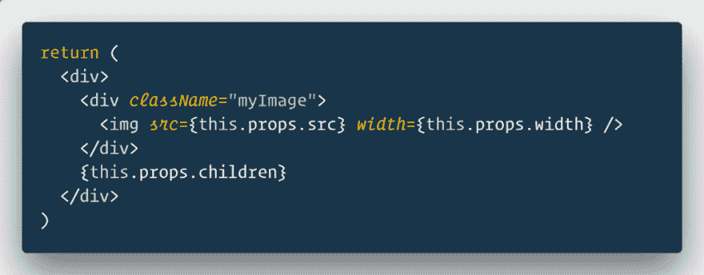
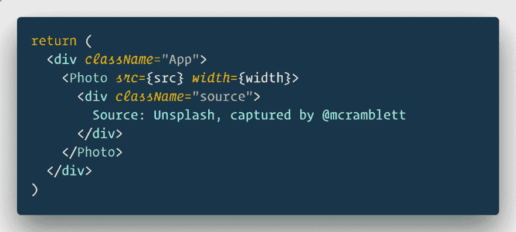

# 如何在 React 中使用道具

> 原文：<https://dev.to/kris/how-to-use-props-children-in-react-bpg>

今天我们就来详细调查一下。关于同样的[你也可以在这里](https://reactjs.org/docs/composition-vs-inheritance.html)参考官方文档。

### 什么是孩子？

在 React 中，子组件指的是通用盒子，其内容在从父组件传递过来之前是未知的。

**这是什么意思？**这仅仅意味着在调用组件时，组件将显示开始和结束标记之间包含的任何内容。该组件通常会从应用程序组件中调用。

### 举例说明

我用 create-react-app 设置了一个基本的 react 应用程序。我将创建另一个组件来呈现带有 img 标签的图像和其他所有内容。

photo 组件编写为自关闭等效于。如果我们没有孩子，我们可以使用自闭式的。你可以把它转换成打开和关闭，中间不加任何东西，效果是一样的。

在我的照片部分，我试着看看道具里有什么

它显示的是图像，除此之外…什么都没有！

这是因为 App 中的照片组件没有子组件。

假设我想传递更多的组件，但是信息并不完整。我想要的只是在照片中为我的任何和所有组件的占位符。

让我们看一看。

不会对照片组件进行任何更改。我只是在照片之间传递了一个 div。

我们现在还能得到什么？

您可能想假设应用程序将在应用程序中呈现为其 html，但它已经在另一个组件照片中。它不会渲染应用程序中的任何内容。但是它知道它们是这个组件的子组件。

组件

>子组件

>子组件

所有这些孩子都可以作为 this.props.children 访问。

### 孩子的力量在于，他们可以成为任何人。

可能的用法有:

*   将未知数量的相似元素分组到一个父元素中。
*   你不知道时间之前的元素。
*   需要包装的嵌套结构。

表演和传递道具以及通过道具获得道具是一样的。孩子们，没什么好担心的。

如果可以发送 props，请避免使用 props.children，因为随着应用程序的增长和需求的变化，很难管理作为子级传递的数据。

如果多个组件需要相同的子组件，考虑将它们赋给 render 中的变量，然后作为子组件传递，我对上面的例子做了同样的处理。

### 精选 React JS 课程

#### [React 16 —完全指南(含 React 路由器 4 & Redux)](https://click.linksynergy.com/link?id=qt/jYwyHv8A&offerid=507388.1362070&type=2&murl=https%3A%2F%2Fwww.udemy.com%2Freact-the-complete-guide-incl-redux%2F)

4.7/5 星 **||** 33.5 小时视频**| |**61597 名学生

学习反应或深入研究。学习理论，解决作业，在演示项目中实践，并构建一个在整个课程中不断改进的大型应用程序:汉堡生成器！ [**了解更多。**T3】](http://thebestdevlist.link/react-the-complete-16-guide-incl-redux)

[React 16:完整课程(包括 React 路由器 4 & Redux)](https://click.linksynergy.com/link?id=qt/jYwyHv8A&offerid=507388.1362070&type=2&murl=https%3A%2F%2Fwww.udemy.com%2Freact-the-complete-guide-incl-redux%2F)

### 免责声明

此帖子包含产品的附属链接。我们可能会收到通过这些链接购买的佣金。

* * *