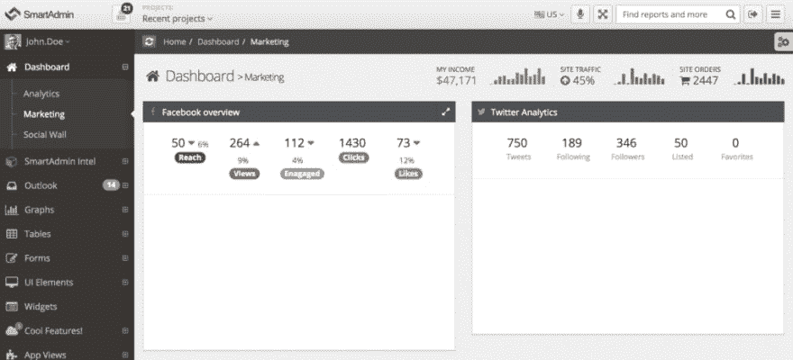
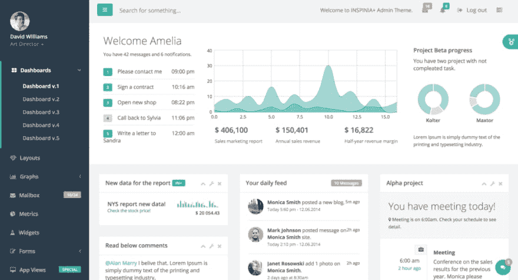
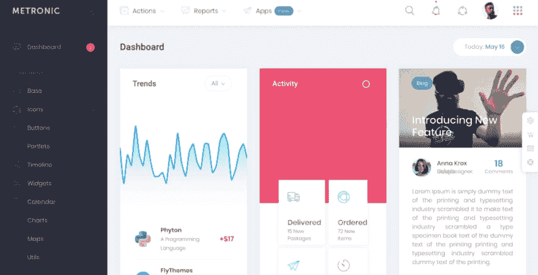
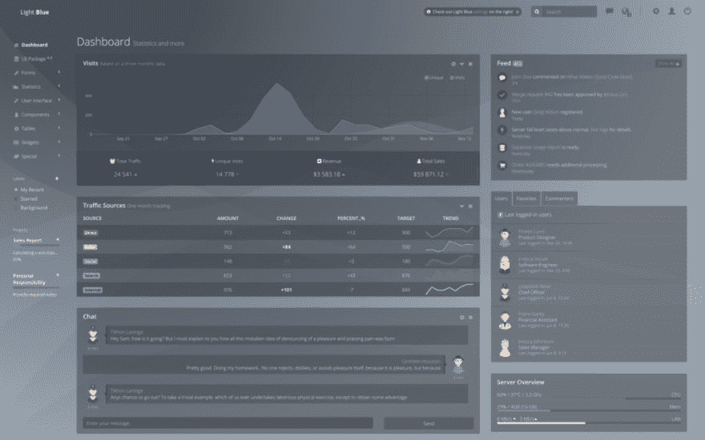
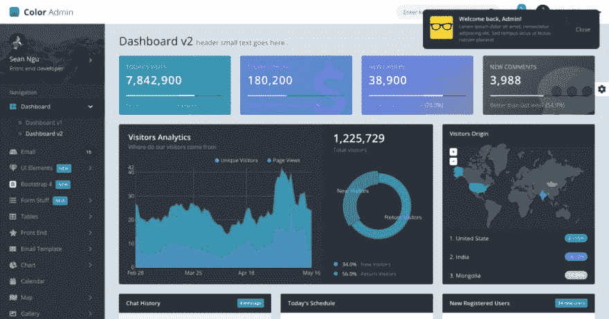
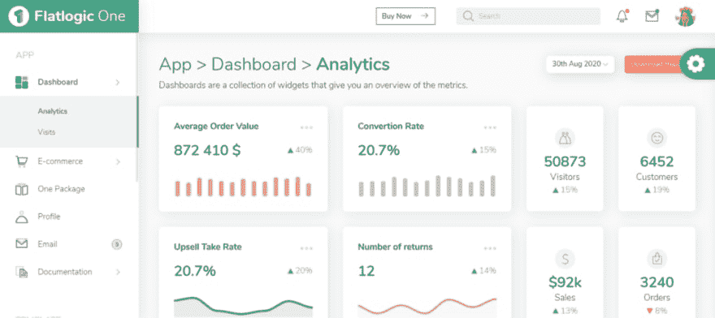
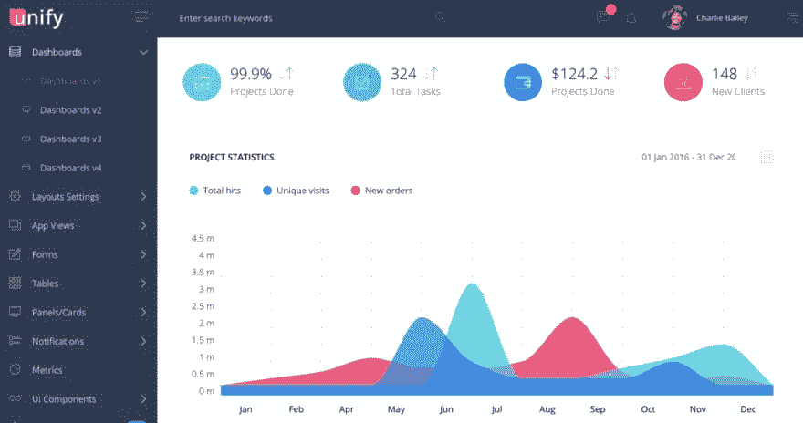

# 前 7 名引导管理仪表板模板

> 原文：<https://dev.to/flatlogic/top-7-bootstrap-admin-dashboard-templates-8mf>

互联网上有大量的管理仪表板模板，还有大量的免费模板可供下载。它们通常包括图形/图表库、仪表板页面、警告框按钮、导航方案、图标、表格等等。我们将努力为您的项目找到一些最合适的 UI(用户界面)工具包。

此处列出的所有管理模板都包括至少一个预构建在模板中的仪表板页面。它可以为您的项目定制。如果您决定创建您的自定义仪表板，您在模板包中有不同的选项，例如组件、UI 元素和卡片的组合。

那么，如何为一个项目选择最好的管理模板呢？当然，对于一个管理模板来说，最重要的事情之一就是把数据和内容放在视觉设计层次的首位。例如，你首先关注的是内容，而不是设计。然而，我们不仅对设计进行了分析，还对版本进行了分析，实际上项目有多少独特的页面，多久更新一次，当然还有价格。

这里有一些关于市场上最流行的管理模板的基本信息。它包含版本、独特页面、价格、引导版本等栏目，当然还有基于上述特征的评级。请注意，这只是我们的观点。然而，这是基于确凿的事实。例如，使用 Bootstrap 4 绝对是一个优势。第四版远远领先于它的前身。你最好把它用在你的项目上，因为在开发你的产品时，保持更新和只使用最新的、高质量的和相关的工具是至关重要的。这证明你永远不会面临安全问题。

## [唱歌 App](https://flatlogic.com/admin-dashboards/sing-app-html5)

Sing App 是一个基于 Bootstrap 4 的管理模板，具有出色的清新和干净的设计。它有静态 HTML、REACT、AngularJS 和 Angular 5 版本。Sing 包含 30 多页。Sing 是惊人的，同时也是先进的。有了这个管理模板，你将能够更有效地开发你的 web 应用程序，这肯定会使你的生活更简单。100%响应式布局。Sing 是小型创业公司和成熟企业的完美选择。它与 Bootstrap 4 兼容，并定期更新。一个合理的价格将是这个项目的额外加分。

[更多信息](https://flatlogic.com/templates/sing-app-html5)
[演示](https://flatlogic.com/templates/sing-app-html5)
[文档](https://angularjs-template.herokuapp.com/documentation/html_start.html)

## [智能管理](https://wrapbootstrap.com/theme/smartadmin-responsive-webapp-WB0573SK0)

SmartAdmin 是一个基于 Bootstrap 3 的管理模板，具有强大的功能和特性。它有静态 HTML，AJAX，PHP，AngularJS 4.0，Ruby On Rails，ReactJS 和 ASP.NET 版本。它包含超过 30 页，包括一个印象登陆页面。100%响应式布局(平板电脑、台式机、移动设备)和现代简洁的设计。不幸的是，它只与 Bootstrap 3 兼容，而且通常不经常更新。

[更多信息](https://wrapbootstrap.com/theme/smartadmin-responsive-webapp-WB0573SK0)
[演示](https://www.gotbootstrap.com/themes/smartadmin/4.5.1/intel_analytics_dashboard.html)

## [inspiria](https://wrapbootstrap.com/theme/inspinia-responsive-admin-theme-WB0R5L90S)

Inspinia 基于 Bootstrap 3 进行专业设计和开发。开箱即用，你得到四个版本:AJAX + HTML + ANGULAR + ANGULAR 5 版本。这个管理模板具有像素完美的设计和充分响应的布局有 70 多页。由于它的多用途性，你可以将 Inspinia 用于许多网络项目。最后一次更新几乎是一年前，所以这可能是这个项目的一个巨大的负分。

[更多信息](https://wrapbootstrap.com/theme/inspinia-responsive-admin-theme-WB0R5L90S)
[演示](http://webapplayers.com/inspinia_admin-v2.9.3/)

## [大都会](https://themeforest.net/item/metronic-responsive-admin-dashboard-template/4021469?ref=mr4k&gclid=Cj0KCQjwhPfkBRD0ARIsAAcYycFOnuV0Y8dnsjtpaBkluYu-d39W1NCBsNq29ccAHWFJo3O9swg7Nr0aAksYEALw_wcB)

Metronic 是一个 70 多页的管理模板，基于 Bootstrap 4。它有 HTML + ANGULAR + ANGULAR 5 版本。这个具有创新设计的管理模板绝对可以改善您的 web 应用程序。扁平设计保证了高质量和现代外观。这种体验对移动设备用户来说是友好的，因为这个管理模板是完全响应的。Metronic 一般大约每月更新一次。

[更多信息](https://themeforest.net/item/metronic-responsive-admin-dashboard-template/4021469?ref=mr4k&gclid=Cj0KCQjwhPfkBRD0ARIsAAcYycFOnuV0Y8dnsjtpaBkluYu-d39W1NCBsNq29ccAHWFJo3O9swg7Nr0aAksYEALw_wcB)
[演示](https://preview.themeforest.net/item/metronic-responsive-admin-dashboard-template/full_screen_preview/4021469?_ga=2.155707768.258894808.1602515102-150337213.1574402697&_gac=1.58588248.1602515102.Cj0KCQjwhPfkBRD0ARIsAAcYycFOnuV0Y8dnsjtpaBkluYu-d39W1NCBsNq29ccAHWFJo3O9swg7Nr0aAksYEALw_wcB)

## [浅蓝色](https://flatlogic.com/admin-dashboards/light-blue-react)

该仪表板基于 Bootstrap 4，包含 30 多个页面。反应灵敏，外观时尚、简单但流畅。这是一个多功能的管理模板，具有响应迅速、灵活的设计，可顺利适应任何设备。它几乎每一两周更新一次。这绝对是一个简单的非侵入式模板。此应用程序模板使用 SEO 和 Node.js 后端的服务器端渲染来加速您的开发过程。

[更多信息](https://flatlogic.com/templates/light-blue-react)
[演示](https://flatlogic.com/templates/light-blue-react/demo)
[文档](https://demo.flatlogic.com/light-blue-react/#/documentation)

## [颜色管理](https://seantheme.com)

色彩管理附带了大量的元素，您可以根据自己的需要和要求进行定制。基于 Bootstrap 4 的管理模板，包括 AJAX + HTML + ANGULAR + ANGULAR 5 版本。100 个独特的网页是一个很大的加分。无论你希望你的管理员有多复杂，色彩管理模板都能满足你的需求。它非常关注用户界面和 web 应用程序。2 个月更新一次。

[更多信息](https://seantheme.com/)
[演示](https://seantheme.com/color-admin/admin/html/index_v3.html)

## 【flat logic One 引导模板】

([https://flatlogic.com/templates/one-bootstrap-template](https://flatlogic.com/templates/one-bootstrap-template)

Flatlogic One 是用 Bootstrap 4.5 构建的，包含了很多可定制的组件。模板设计精美。有四种颜色主题可供选择。顺便说一下，开发者团队已经创建了一个独特的 Flatlogic 排版和 Flatlogic 图标。这个仪表板反应灵敏，因为它与任何设备都很匹配。开发人员在这个模板中填充了许多有用的东西，如各种图表(Amcharts、Echarts、Apexcharts)、谷歌地图、分析和访问仪表板、聊天和电子邮件机会等等。Flatlogic One 是有文档记录的，并且是完全支持的。兼容 Chrome，Firefox，Opera，Edge，IE 10，IE 11。

[更多信息](https://flatlogic.com/templates/one-bootstrap-template)
[演示](https://flatlogic.com/templates/one-bootstrap-template/demo)
[文档](https://templates-flatlogic.herokuapp.com/flatlogic-one/html5/documentation/overview.html)

## [一统](http://ganiev.me/preview/unify-v2.5.1/)

Unify 是一个包含 250 多个短代码页面的模板，有超过 1750 个可重用的 UI 组件。基于 Bootstrap 4 它有 AJAX + HTML + ANGULAR + ANGULAR 5 版本。快速定制和可用元素的组合允许您创建您需要的精确布局。Unify 拥有现代的网页设计，对于你正在开发的许多不同的网页项目来说都很方便。它定期更新，所以这可能是这个模板的一个很大的优势。

[更多信息](https://htmlstream.com/preview/unify-v2.6.3/index.html)
[演示](https://htmlstream.com/preview/unify-v2.6.3/admin-template/dashboards/dashboard-v1.html)

总的来说，管理仪表板是检查你的进度、统计数据、生产力和员工的好工具。具有大量页面和元素的专业制作的管理仪表板可以将您的公司带到一个更高的水平。所以慎重选择极其重要。一个好的模板应该是可靠性和专业性的反映。

最初发布于[https://flat logic . com/blog/top-7-bootstrap-admin-dashboard-templates/](https://flatlogic.com/blog/top-7-bootstrap-admin-dashboard-templates/)