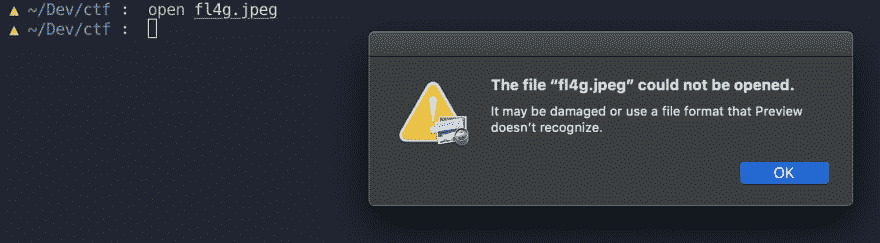
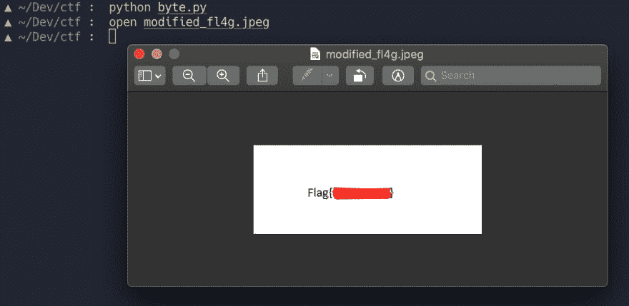

# 解决 CTF 挑战

> 原文：<https://dev.to/atan/solving-a-ctf-challenge-2nbp>

在我寻求[在 dev.to 社区](https://dev.to/atan/what-is-ctf-and-how-to-get-started-3f04)中推广 CTFs 的过程中，这里有一篇文章展示了解决挑战可能是什么样子。

# 任务

这个挑战是用户 RedK 在 CTFLearn 平台上发布的。([链接此处](https://ctflearn.com/problems/671)需要登录)详情如下！

* * *

#### F1l3 M1X3R

我想我那令人惊叹的照片被搅拌机砸到了，现在它坏了。帮我修一下？[https://mega.nz/#!Ds0mWaCJ！4 ukfjejwhupg 7 tvx 8 ret BP 1 refgdzrle 3 yrn 0 l-5Jrg](https://mega.nz/#!Ds0mWaCJ!4uKfJeJwhupG7Tvx8ReTBP1reFgdzRLE3YrN0l-5Jrg)提示:访问:【https://en.wikipedia.org/wiki/List_of_file_signatures】T2 编程可能在这次挑战中有用。

* * *

在阅读我如何解决它之前，请随意下载并尝试这个挑战:)

### 第一步

下载完文件`fl4g.jpeg`后，我做的第一件事就是尝试打开它。

[](https://res.cloudinary.com/practicaldev/image/fetch/s--NXKOI6h1--/c_limit%2Cf_auto%2Cfl_progressive%2Cq_auto%2Cw_880/https://thepracticaldev.s3.amazonaws.com/i/hfw6wryfuyxydh4zj0w6.png)

很明显那没有成功。挑战描述中的提示让我认为图像的文件签名一定被篡改了。让我们看看`fl4g.jpeg`的前几个字节，并将其与预期的文件签名进行比较。jpeg 文件。

这是预期的文件签名。

```
FF D8 FF E0 00 10 4A 46 49 46 00 01 
```

Enter fullscreen mode Exit fullscreen mode

我使用`xxd`命令和`fl4g.jpeg`作为参数来获取前 12 个字节的十六进制转储。

```
$ xxd -l 12 fl4g.jpeg
00000000: e0ff d8ff 464a 1000 0100 4649  ....FJ....FI 
```

Enter fullscreen mode Exit fullscreen mode

乍一看，我发现十六进制值是存在的，但是顺序不对。使用十六进制编辑器(我使用了 [0xed](https://www.suavetech.com/0xed/) ，我删除了前十二个字节，并用正确的签名替换了它。

```
$ xxd -l 12 modified_fl4g.jpeg                                                                                                                            
00000000: ffd8 ffe0 0010 4a46 4946 0001            ......JFIF.. 
```

Enter fullscreen mode Exit fullscreen mode

我以为我完成了，再次打开文件，期望得到奖励，却发现文件还是打不开....😞

### 头脑风暴

修改签名没有成功，但是因为所有的值都是乱码，所以我决定再看一下原始文件，并注意到一个模式。每四个字节按顺序反过来！对于签名的每四个字节,`FF D8 FF E0`已经被反转为读取`E0 FF D8 FF`,以此类推。仅仅修改签名不会有任何效果，因为这种逆转可能已经发生在整个文件上了！为了测试我的假设，我写了一个简短的脚本来反转图像的每四个字节。

### 剧本！

```
with open("fl4g.jpeg", "rb") as file:
    BUF = 4    
    bytes_rev = b""
    bytes_read  = bytearray(file.read(BUF))

    while bytes_read:
        bytes_rev += bytes_read[::-1]
        bytes_read = file.read(BUF)
    with open("modified_fl4g.jpeg", "wb") as newfile:
        newfile.write(bytes_rev) 
```

Enter fullscreen mode Exit fullscreen mode

来分解一下:

```
with open("fl4g.jpeg", "rb") as file: 
```

Enter fullscreen mode Exit fullscreen mode

这里我们用`rb`模式打开`fl4g.jpeg`，表示我们正在以二进制模式读取文件。

```
BUF = 4
bytes_rev = b""
bytes_read = bytearray(file.read(BUF)) 
```

Enter fullscreen mode Exit fullscreen mode

`BUF`设置为 4 表示我们每次从文件中读取的缓冲区将是四个字节。`bytes_rev`被设置为空字节字符串，这样我们就有地方存储反转的字节。然后，该文件作为一个`bytearray`被读取并存储到`bytes_read`中。

```
while bytes_read:
        bytes_rev += bytes_read[::-1]
        bytes_read = file.read(BUF) 
```

Enter fullscreen mode Exit fullscreen mode

接下来，只要 bytes_read 为`True`，我们就进行循环。`bytes_rev`使用切片符号附加 4 字节的反转字节数组。`bytes_read`然后从`file`
中读取下一组四个字节

```
 with open("modified_fl4g.jpeg", "wb") as newfile:
        newfile.write(bytes_rev) 
```

Enter fullscreen mode Exit fullscreen mode

最后，我们打开一个新文件，并向其中写入我们的字节

### 胜负？

运行该脚本会生成一个每四个字节反转一次的`modified_flag.jpeg`文件。

我打开文件....

[](https://res.cloudinary.com/practicaldev/image/fetch/s--TF-blNhL--/c_limit%2Cf_auto%2Cfl_progressive%2Cq_auto%2Cw_880/https://thepracticaldev.s3.amazonaws.com/i/n58seklbefhbcwkqkxng.png)

旗子露出来了！我冒昧地删除了旗帜文本，这样你就可以自己尝试了！