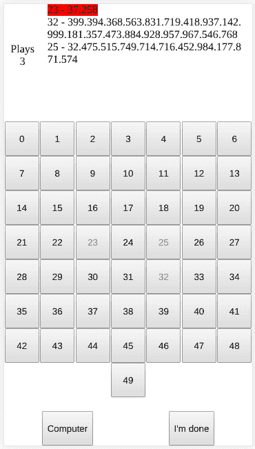

# Googol 游戏或“你应该学会什么时候退出！”-一个 JavaScript 游戏。

> 原文：<https://dev.to/victorqribeiro/googol-game-or-you-should-learn-when-to-quit-a-javascript-game-23j7>

# 古戈尔游戏

...或者“你应该学会什么时候退出”！-一个 JavaScript 游戏。

在这里播放

## 关于

看完这个告诉你戒赌好时机的视频后，我决定开发一个游戏来测试这个理论。

这个游戏非常简单:给定 N 个数字，它们的值可以是 0 到 googol(10 * 100 |有 100 个零的数字 1)，你选择一个数字。你可以带着那个数字回家(如果你认为那是最大的一个)，或者你可以从选项中选择另一个。你最后的选择是你的号码！如果你得到了一个很大的数字，并决定选择另一个，你不能回到你已经拥有的那个。当你认为你有最大的数字时，点击“我完成了”，游戏将回答你是否有最大的数字。

## 实验

视频中的实验表明，如果你把所有的选项(N)除以欧拉数 e，并四舍五入到下一个整数，结果会给你一个很好的所有值的样本。所以你继续挑选数字，直到你得到一个比你从样本中得到的数字更大的数字。视频上说你有 1/3 的概率获胜。很酷，对吧？！没有吗？！不想玩了？好了，就点“电脑”，让电脑为你播放。

## 怎么玩

在右上角，写着“游戏”的地方，是你已经选择的号码数量。

旁边是一个“历史”日志，记录了你选择的所有号码，第一个(红线)是你当前的号码。

下面是所有的数字:1 - N，你只需点击一个选择一个数字。

当你认为你拥有所有数字中最大的一个时，点击“我完成了”，看看你是否答对了。

“电脑”按钮让电脑替你玩游戏(赢的多)。

点击查看代码[。](https://github.com/victorqribeiro/googol)