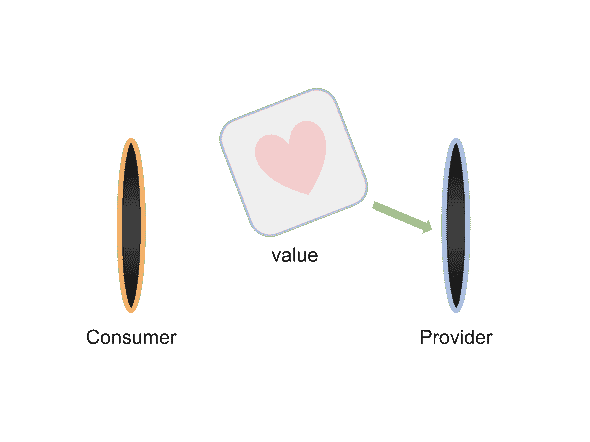

# 反应上下文 API

> 原文：<https://dev.to/satansdeer/react-context-api-da5>

在 React 中，应用程序数据和事件处理程序通过 props 传递给子组件。但是有时您需要同时在几个级别上提供一些数据。

手动通过 props 传递数据可能很麻烦。

为了解决这个问题，react 提供了上下文 api。

您使用`React.createContext()`创建上下文。该方法返回**上下文**对象:

```
{
  Provider, Consumer;
} 
```

Enter fullscreen mode Exit fullscreen mode

简单地说，这是两个组件`Provider`和`Consumer`。您将数据传入`Provider`，然后您可以从连接的`Consumer`访问它。

[](///static/portals-cc1d52c05fb596842b26fc19c6402077-ab5af.png)

这里有一个简单的例子。

```
import React, { createContext } from "react";

const { Provider, Consumer } = createContext();
// We use destructuring assignment to get Provide and Consumer

const App = () => (
  <Provider value={{ valuePassedThroughContext: "Success!" }}>
    <ChildComponent />
  </Provider>
);
// Inside our app we wrap components that will need the data
// into our Provider

const ChildComponent = () => (
  <Consumer>
    {value => {
      // Consumer requires a function as a child
      // and passes the `value` from Provider
      // down to it.
    }}
  </Consumer>
); 
```

Enter fullscreen mode Exit fullscreen mode

我们可以在任何层次的嵌套中使用`Consumer`。

它将从树中任何地方的提供者那里获取数据。

这里需要注意的一点是，`Consumer`将只从创建它的`Provider`中获取数据。

## 传递默认值

您可以将默认值传递给`React.createContext` :

```
const { Provider, Consumer } = React.createContext(defaultValue); 
```

Enter fullscreen mode Exit fullscreen mode

这将只影响消费者，并且只有在树中它上面没有匹配的`Provider`时。

在这种情况下，**默认值**将被传递给`Consumer`函数:

```
<Consumer>
  {defaultValue => {
    // some code
  }}
</Consumer> 
```

Enter fullscreen mode Exit fullscreen mode

## 动态值

每当提供者的`value`属性改变时，作为`Provider`的后代的所有消费者都将重新呈现。

这里有一个例子:

**counter-context.jsx**

```
import React, { createContext } from "react";

const { Provider, Consumer: CounterConsumer } = createContext(0);

class CounterProvider extends React.Component {
  state = { counter: 0 };

  componentDidMount() {
    this.tickInterval = setInterval(() => {
      this.setState({ counter: this.state.counter + 1 });
    }, 500);
  }

  componentWillUnmount() {
    clearInterval(this.tickInterval);
  }

  render() {
    <Provider value={this.state.counter}>{this.props.children}</Provider>;
  }
}

export { CounterProvider, CounterConsumer }; 
```

Enter fullscreen mode Exit fullscreen mode

**counter-view.jsx**

```
import React, { Component } from "react";
import { CounterConsumer } from "./counter-context";

export const CounterView = () => (
  <CounterConsumer>{counter => <p>Current tick: {counter}</p>}</CounterConsumer>
); 
```

Enter fullscreen mode Exit fullscreen mode

**app . js**T2】

```
import React, { Component } from "react";
import { CounterProvider, CounterConsumer } from "./counter-context";

class App extends Component {
  render() {
    return <>
      <CounterProvider>
        <CounterView>
      </CounterProvider>
      <CounterView/>
    </>;
  }
}

ReactDOM.render(<App />, document.root); 
```

Enter fullscreen mode Exit fullscreen mode

在本例中，第一个`CounterView`将在每个节拍更新。

第二个将总是显示默认值，因为它在树中没有相应的`Provider`。

## 传递函数

也可以通过上下文传递函数。如果你想更新来自**消费者**的`Provider`值，这是很有用的。

**auth.jsx**

```
import React, { Component, createContext } from "react";

const { Provider, Consumer: AuthConsumer } = createContext({ loggedIn: false });

class AuthProvider extends Component {
  state = { loggedIn: false };

  logIn = () => {
    this.setState({ loggedIn: true });
  };

  render() {
    return (
      <Provider value={{ loggedIn, logIn: this.logIn }}>
        {this.children}
      </Provider>
    );
  }
}

export { AuthProvider, AuthConsumer }; 
```

Enter fullscreen mode Exit fullscreen mode

这里我们创建了上下文并使用**析构赋值**来创建两个变量`Provider`和`AuthConsumer`。

为了创建变量`AuthConsumer`,我们重命名了从`React.createContext`方法得到的原始变量`Consumer`。

然后我们定义了一个管理授权状态的类`AuthProvider`。它将孩子包装在`Provider`中，并将`loggedIn`状态和`logIn`功能传递给这个`Provider`。

**app.jsx**

```
import React from "react";
import { AuthProvider, AuthConsumer } from "./auth";

const App = () => (
  <AuthProvider>
    <Content />
  </AuthProvider>
);

const Content = () => {
  <AuthConsumer>
    {({ loggedIn, logIn }) =>
      loggedIn ? (
        <p>Congrats! You are logged in!</p>
      ) : (
        <button onClick={logIn}>Log in</button>
      )
    }
  </AuthConsumer>;
}; 
```

Enter fullscreen mode Exit fullscreen mode

## 使用多个上下文

可以一次使用多个上下文。

但是你必须为每个提供者使用不同的消费者:

```
import React from "react";

const AuthContext = React.createContext({ loggedIn: false });

const ProfileContext = React.createContext({ name: "Tom" });

const App = () => (
  <AuthContext.Provider value={theme}>
    <UserContext.Provider value={signedInUser}>
      <Content />
    </UserContext.Provider>
  </AuthContext.Provider>
);

function Content() {
  return (
    <AuthContext.Consumer>
      {({ loggedIn }) => (
        <ProfileContext.Consumer>
          {user =>
            loggedIn ? (
              <p>Logged as: {user.name}</p>
            ) : (
              <p>You are not logged in</p>
            )
          }
        </ProfileContext.Consumer>
      )}
    </AuthContext.Consumer>
  );
} 
```

Enter fullscreen mode Exit fullscreen mode

React 要求将每个消费者作为树中的一个单独的节点。

## 何时使用上下文

当您需要在多个组件之间共享一些数据和回调时，您应该考虑使用 React Context API，但是您必须通过不需要这些数据或回调的组件层来传递它们。