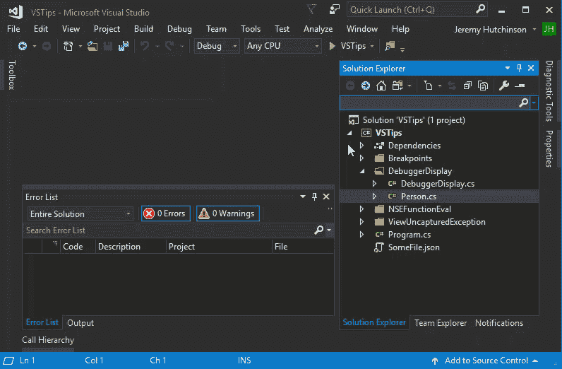
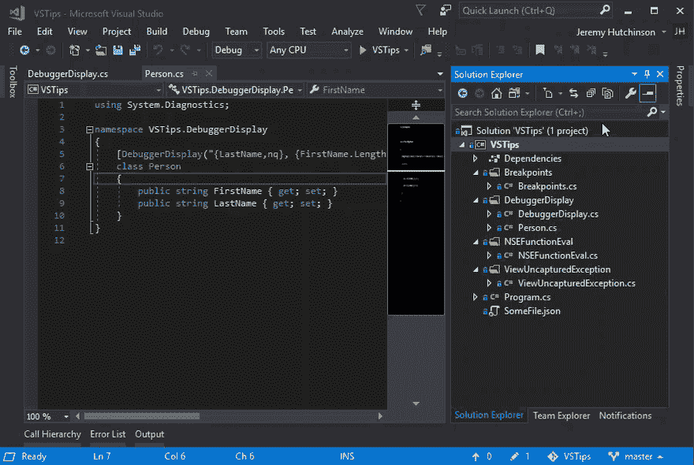

# Visual Studio 提示-解决方案资源管理器搜索

> 原文：<https://dev.to/hutchcodes/visual-studio-tips-solution-explorer-search-34op>

解决方案资源管理器搜索在 Visual Studio 中已经存在一段时间了，但是我认为许多开发人员(包括我自己)忽略了一些特性。这里有一些你可能已经错过了。

默认情况下，搜索将搜索文件名和内容。这是我们大多数时候想要的，但是也可以只搜索文件名。

您可以应用于搜索的一些其他过滤器是打开的文件`Ctrl+[,O`和挂起的更改`Ctrl+[,P`。当您处理的功能需要跨解决方案不同层中的多个文件进行更改时，这些功能尤其有用。在下面的 gif 中，我展示了通过 UI 使用的这些过滤器。

