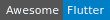
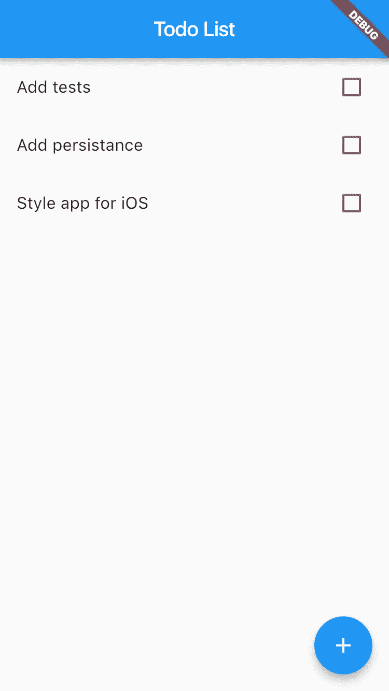

# 带颤动的 TodoList

> 原文：<https://dev.to/lesnitsky/todolist-with-flutter-399>

# 用颤振建立待办事宜列表

 [
T4】](https://stackoverflow.com/questions/tagged/flutter?sort=votes)

> 用 [Git 构建导师](https://github.com/lesnitsky/git-tutor)
> [GitHub 源代码](https://github.com/lesnitsky/todolist_flutter)

本教程将带你完成用 Flutter 构建一个简单待办事项列表的过程

## 入门

确保完成[颤振安装](https://flutter.io/docs/get-started/install)

## 第一步

在您的终端中执行

```
flutter create todo_list 
```

第一行是由 Flutter 提供的`material`库的导入。这个库是各种 android 组件的实现

📄lib/main.dart

```
+ import 'package:flutter/material.dart'; 
```

这个函数是颤振应用的一个切入点。它只调用了`runApp`，但是我们可以在这个函数中做更多的事情(比如让你的应用程序全屏)。

📄lib/main.dart

```
 import 'package:flutter/material.dart';
+
+ void main() => runApp(MyApp()); 
```

让我们真的这样做😏

📄lib/main.dart

```
 import 'package:flutter/material.dart';
+ import 'package:flutter/services.dart'; 
- void main() => runApp(MyApp());
+ void main() {
+   SystemChrome.setEnabledSystemUIOverlays([]);
+   runApp(MyApp());
+ } 
```

颤振中的每个部件都称为`widget`。它可以是`stateless`(读纯)或`stateful`(某个状态的容器)。顶级应用程序组件应该是一个无状态组件，所以让我们创建一个

📄lib/main.dart

```
 SystemChrome.setEnabledSystemUIOverlays([]);
    runApp(MyApp());
  }
+
+ class MyApp extends StatelessWidget {} 
```

每个小部件都应该覆盖`build`函数。它返回包含一些业务逻辑的布局部件(`Container`、`Padding`、`Flex`等)或`stateful`部件的层次结构

📄lib/main.dart

```
 runApp(MyApp());
  }

- class MyApp extends StatelessWidget {}
+ class MyApp extends StatelessWidget {
+   @override
+   Widget build(BuildContext context) {
+     return Container();
+   }
+ } 
```

但是如果是顶级应用程序小部件，它应该从`'package:flutter/material.dart'`返回`CupertinoApp`，或者从`'package:flutter/material.dart'`返回`MaterialApp`

我们将在本教程中使用`material`

📄lib/main.dart

```
 class MyApp extends StatelessWidget {
    @override
    Widget build(BuildContext context) {
-     return Container(); +     return MaterialApp();
    }
  } 
```

让我们添加标题

📄lib/main.dart

```
 class MyApp extends StatelessWidget {
    @override
    Widget build(BuildContext context) {
-     return MaterialApp(); +     return MaterialApp(
+       title: 'Todo List',
+     );
    }
  } 
```

让我们也把`Scaffold`作为我们应用程序的家

`Scaffold`是来自`material`库的助手类，实现基本的应用布局(应用栏，浮动动作按钮)

📄lib/main.dart

```
 Widget build(BuildContext context) {
      return MaterialApp(
        title: 'Todo List',
+       home: Scaffold(
+       ),
      );
    }
  } 
```

现在我们需要添加一个应用程序标题，显示我们的应用程序标题

📄lib/main.dart

```
 return MaterialApp(
        title: 'Todo List',
        home: Scaffold(
+         appBar: AppBar(title: Text('Todo List')),
        ),
      );
    } 
```

最后，我们应用程序的主体是 todolist 本身。让我们添加这一行，稍后实现这个类

📄lib/main.dart

```
 title: 'Todo List',
        home: Scaffold(
          appBar: AppBar(title: Text('Todo List')),
+         body: TodoList(),
        ),
      );
    } 
```

## 渲染列表

基本的全状态小部件如下所示

📄lib/todo_list.dart

```
import 'package:flutter/material.dart';

class TodoList extends StatefulWidget {
  @override
  _TodoListState createState() => _TodoListState();
}

class _TodoListState extends State<TodoList> {
  @override
  Widget build(BuildContext context) {
    return Container();
  }
} 
```

我们还需要导入我们的`TodoList`小部件

📄lib/main.dart

```
 import 'package:flutter/material.dart';
  import 'package:flutter/services.dart';

+ import 'package:todo_list/todo_list.dart';
+
  void main() {
    SystemChrome.setEnabledSystemUIOverlays([]);
    runApp(MyApp()); 
```

现在让我们将`Todo`实体描述为类

📄lib/todo.dart

```
class Todo {
  Todo({this.title, this.isDone = false});

  String title;
  bool isDone;
} 
```

并导入到`TodoList`

📄lib/todo_list.dart

```
 import 'package:flutter/material.dart';
+ import 'package:todo_list/todo.dart'; 
  class TodoList extends StatefulWidget {
    @override 
```

现在我们需要扩展我们的`TodoList`状态并添加一个待办事项列表

📄lib/todo_list.dart

```
 }

  class _TodoListState extends State<TodoList> {
+   List<Todo> todos = [];
+
    @override
    Widget build(BuildContext context) {
      return Container(); 
```

让我们使用`ListView`来呈现我们的待办事项。

📄lib/todo_list.dart

```
 class _TodoListState extends State<TodoList> {
    List<Todo> todos = [];

+   _buildItem() {}
+
    @override
    Widget build(BuildContext context) {
-     return Container(); +     return ListView.builder(
+       itemBuilder: _buildItem,
+       itemCount: todos.length,
+     );
    }
  } 
```

现在我们要实现`_buildItem`,每次 todo 被渲染时都会被调用

我们将使用来自`material`库的`CheckboxListTile`,因为它有我们需要的一切(指示 todo 是否完成的复选框和标题)

📄lib/todo_list.dart

```
 class _TodoListState extends State<TodoList> {
    List<Todo> todos = [];

-   _buildItem() {}
+   Widget _buildItem(BuildContext context, int index) {
+     final todo = todos[index];
+
+     return CheckboxListTile(
+     );
+   } 
    @override
    Widget build(BuildContext context) { 
```

该值指示是否应检查列表项

📄lib/todo_list.dart

```
 final todo = todos[index];

      return CheckboxListTile(
+       value: todo.isDone,
      );
    } 
```

标题是一个应该在第一行呈现的小部件。通常它是一个`Text`小部件

📄lib/todo_list.dart

```
 return CheckboxListTile(
        value: todo.isDone,
+       title: Text(todo.title),
      );
    } 
```

最后，我们需要处理每个列表项上的点击

📄lib/todo_list.dart

```
 return CheckboxListTile(
        value: todo.isDone,
        title: Text(todo.title),
+       onChanged: (bool isChecked) {
+         _toggleTodo(todo, isChecked);
+       },
      );
    } 
```

实施非常简单

📄lib/todo_list.dart

```
 class _TodoListState extends State<TodoList> {
    List<Todo> todos = [];

+   _toggleTodo(Todo todo, bool isChecked) {
+     todo.isDone = isChecked;
+   }
+
    Widget _buildItem(BuildContext context, int index) {
      final todo = todos[index]; 
```

让我们试着添加一些模拟 todos，看看它们是否被正确渲染

📄lib/todo_list.dart

```
 }

  class _TodoListState extends State<TodoList> {
-   List<Todo> todos = []; +   List<Todo> todos = [
+     Todo(title: 'Learn Dart'),
+     Todo(title: 'Try Flutter'),
+     Todo(title: 'Be amazed'),
+   ]; 
    _toggleTodo(Todo todo, bool isChecked) {
      todo.isDone = isChecked; 
```

好的，所有的东西都被正确的渲染了，但是当我们点击物品的时候没有任何反应，奇怪..

让我们添加一个调试输出，看看处理程序是否调用了

📄lib/todo_list.dart

```
 ];

    _toggleTodo(Todo todo, bool isChecked) {
+     print('${todo.title} ${todo.isDone}');
+
      todo.isDone = isChecked;
    } 
```

控制台显示项目已被选中，值`isChecked`为`true`，但复选框从未呈现

问题是我们修改了我们的实体，但是 flutter 不知道发生了什么，所以我们需要调用`setState`。(大家好，react 粉丝们！😏)

📄lib/todo_list.dart

```
 ];

    _toggleTodo(Todo todo, bool isChecked) {
-     print('${todo.title} ${todo.isDone}');
-
-     todo.isDone = isChecked; +     setState(() {
+       todo.isDone = isChecked;
+     });
    }

    Widget _buildItem(BuildContext context, int index) { 
```

现在我们对渲染和更新已经很好了，是时候去掉模拟项目并添加一些 ui 来添加新的待办事项了。

我们再加一个`FloatingActionButton`

📄lib/main.dart

```
 home: Scaffold(
          appBar: AppBar(title: Text('Todo List')),
          body: TodoList(),
+         floatingActionButton: FloatingActionButton(
+           child: Icon(Icons.add),
+         ),
        ),
      );
    } 
```

📄lib/todo_list.dart

```
 }

  class _TodoListState extends State<TodoList> {
-   List<Todo> todos = [
-     Todo(title: 'Learn Dart'),
-     Todo(title: 'Try Flutter'),
-     Todo(title: 'Be amazed'),
-   ]; +   List<Todo> todos = []; 
    _toggleTodo(Todo todo, bool isChecked) {
      setState(() { 
```

好的，但是我们在`onPressed`应该做什么？我们需要访问一个状态`TodoList`,直接从父*状态*窗口小部件处理子状态听起来不是一个好主意

📄lib/main.dart

```
 body: TodoList(),
          floatingActionButton: FloatingActionButton(
            child: Icon(Icons.add),
+           onPressed: () {
+             // 😢
+           },
          ),
        ),
      ); 
```

所以让我们把`Scaffold`小部件移到`TodoList`

📄lib/main.dart

```
 Widget build(BuildContext context) {
      return MaterialApp(
        title: 'Todo List',
-       home: Scaffold(
-         appBar: AppBar(title: Text('Todo List')),
-         body: TodoList(),
-         floatingActionButton: FloatingActionButton(
-           child: Icon(Icons.add),
-           onPressed: () {
-             // 😢
-           },
-         ),
-       ), +       home: TodoList(),
      );
    }
  } 
```

📄lib/todo_list.dart

```
 );
    }

+   _addTodo() {}
+
    @override
    Widget build(BuildContext context) {
-     return ListView.builder(
-       itemBuilder: _buildItem,
-       itemCount: todos.length, +     return Scaffold(
+       appBar: AppBar(title: Text('Todo List')),
+       body: ListView.builder(
+         itemBuilder: _buildItem,
+         itemCount: todos.length,
+       ),
+       floatingActionButton: FloatingActionButton(
+         child: Icon(Icons.add),
+         onPressed: _addTodo,
+       ),
      );
    }
  } 
```

现在我们可以在用户点击`FloatingActionButton`时显示一个对话框

📄lib/todo_list.dart

```
 );
    }

-   _addTodo() {}
+   _addTodo() {
+     showDialog(
+       context: context,
+       builder: (BuildContext context) {
+         return AlertDialog(
+           title: Text('New todo'),
+         );
+       },
+     );
+   } 
    @override
    Widget build(BuildContext context) { 
```

对话框将包含文本输入:

📄lib/todo_list.dart

```
 builder: (BuildContext context) {
          return AlertDialog(
            title: Text('New todo'),
+           content: TextField(),
          );
        },
      ); 
```

以及两个动作按钮:`Cancel`和`Add`

📄lib/todo_list.dart

```
 return AlertDialog(
            title: Text('New todo'),
            content: TextField(),
+           actions: <Widget>[
+             FlatButton(
+               child: Text('Cancel'),
+             ),
+             FlatButton(
+               child: Text('Add'),
+             ),
+           ],
          );
        },
      ); 
```

对话不仅仅是叠加，实际上是一个路径，所以要处理`Cancel`动作，我们可以在当前`context`的`Navigator`上调用`.pop`

📄lib/todo_list.dart

```
 actions: <Widget>[
              FlatButton(
                child: Text('Cancel'),
+               onPressed: () {
+                 Navigator.of(context).pop();
+               },
              ),
              FlatButton(
                child: Text('Add'), 
```

现在我们需要访问一个`TextField`的值来创建一个`Todo`
为此我们需要创建一个`TextEditingController`

📄lib/todo_list.dart

```
 class _TodoListState extends State<TodoList> {
    List<Todo> todos = [];

+   TextEditingController controller = new TextEditingController();
+
    _toggleTodo(Todo todo, bool isChecked) {
      setState(() {
        todo.isDone = isChecked; 
```

并将其提供给`TextField`

📄lib/todo_list.dart

```
 builder: (BuildContext context) {
          return AlertDialog(
            title: Text('New todo'),
-           content: TextField(), +           content: TextField(controller: controller),
            actions: <Widget>[
              FlatButton(
                child: Text('Cancel'), 
```

现在在`Add`动作的`onPressed`中，我们可以记录一个`TextField`的值并清除它

📄lib/todo_list.dart

```
 ),
              FlatButton(
                child: Text('Add'),
+               onPressed: () {
+                 print(controller.value.text);
+                 controller.clear();
+               },
              ),
            ],
          ); 
```

最后，让我们实际创建新的待办事项，并将其添加到现有待办事项列表中(不要忘记用`setState`将代码括起来)

📄lib/todo_list.dart

```
 FlatButton(
                child: Text('Add'),
                onPressed: () {
-                 print(controller.value.text);
-                 controller.clear(); +                 setState(() {
+                   final todo = new Todo(title: controller.value.text);
+
+                   todos.add(todo);
+                   controller.clear();
+
+                   Navigator.of(context).pop();
+                 });
                },
              ),
            ], 
```

微小的 UX 改进:通过将`autofocus: true`传递给`TextField`使键盘自动弹出

📄lib/todo_list.dart

```
 builder: (BuildContext context) {
          return AlertDialog(
            title: Text('New todo'),
-           content: TextField(controller: controller), +           content: TextField(
+             controller: controller,
+             autofocus: true,
+           ),
            actions: <Widget>[
              FlatButton(
                child: Text('Cancel'), 
```

## 重构

`TodoList`正在工作，但是`todo_list.dart`有点乱，难以阅读。最复杂的方法是`_addTodo`，所以让我们从重写它开始。似乎我们可以将`AlertDialog`移动到一个单独的小部件，但是我们现在不能这么做，因为我们依赖于父小部件中的`setState`。相反，我们可以将一个新创建的 todo 传递给一个`Navigator.pop`

📄lib/todo_list.dart

```
 }

    _addTodo() {
-     showDialog( +     showDialog<Todo>(
        context: context,
        builder: (BuildContext context) {
          return AlertDialog(
              FlatButton(
                child: Text('Add'),
                onPressed: () {
-                 setState(() {
-                   final todo = new Todo(title: controller.value.text); +                 final todo = new Todo(title: controller.value.text);
+                 controller.clear(); 
-                   todos.add(todo);
-                   controller.clear();
-
-                   Navigator.of(context).pop();
-                 }); +                 Navigator.of(context).pop(todo);
                },
              ),
            ], 
```

为了能够接收`_addTodo`方法中的`Todo`,我们需要使它成为`async`和`await` `showDialog`函数的结果(如果它被解除，它将是`null`,否则是`Todo`的实例)

📄lib/todo_list.dart

```
 );
    }

-   _addTodo() {
-     showDialog<Todo>( +   _addTodo() async {
+     final todo = await showDialog<Todo>(
        context: context,
        builder: (BuildContext context) {
          return AlertDialog( 
```

并通过状态更新将逻辑移回

📄lib/todo_list.dart

```
 );
        },
      );
+
+     if (todo != null) {
+       setState(() {
+         todos.add(todo);
+       });
+     }
    }

    @override 
```

现在我们对父小部件没有任何依赖，所以我们可以将`AlertDialog`提取到一个单独的小部件中

📄lib/new_todo_dialog.dart

```
import 'package:flutter/material.dart';

import 'package:todo_list/todo.dart';

class NewTodoDialog extends StatelessWidget {
  final controller = new TextEditingController();

  @override
  Widget build(BuildContext context) {
    return AlertDialog(
      title: Text('New todo'),
      content: TextField(
        controller: controller,
        autofocus: true,
      ),
      actions: <Widget>[
        FlatButton(
          child: Text('Cancel'),
          onPressed: () {
            Navigator.of(context).pop();
          },
        ),
        FlatButton(
          child: Text('Add'),
          onPressed: () {
            final todo = new Todo(title: controller.value.text);
            controller.clear();

            Navigator.of(context).pop(todo);
          },
        ),
      ],
    );
  }
} 
```

并在`TodoList`里面使用

📄lib/todo_list.dart

```
 import 'package:flutter/material.dart';
  import 'package:todo_list/todo.dart';

+ import 'package:todo_list/new_todo_dialog.dart';
+
  class TodoList extends StatefulWidget {
    @override
    _TodoListState createState() => _TodoListState();
  class _TodoListState extends State<TodoList> {
    List<Todo> todos = [];

-   TextEditingController controller = new TextEditingController();
-
    _toggleTodo(Todo todo, bool isChecked) {
      setState(() {
        todo.isDone = isChecked;
      final todo = await showDialog<Todo>(
        context: context,
        builder: (BuildContext context) {
-         return AlertDialog(
-           title: Text('New todo'),
-           content: TextField(
-             controller: controller,
-             autofocus: true,
-           ),
-           actions: <Widget>[
-             FlatButton(
-               child: Text('Cancel'),
-               onPressed: () {
-                 Navigator.of(context).pop();
-               },
-             ),
-             FlatButton(
-               child: Text('Add'),
-               onPressed: () {
-                 final todo = new Todo(title: controller.value.text);
-                 controller.clear();
-
-                 Navigator.of(context).pop(todo);
-               },
-             ),
-           ],
-         ); +         return NewTodoDialog();
        },
      ); 
```

下一步–提取待办事项列表组件

列表本身也可以被视为无状态的小部件，状态相关的逻辑可以由父处理

所以我们先把`TodoList`改名为`TodoListScreen`

📄lib/todo_list.dart

```
 import 'package:todo_list/new_todo_dialog.dart';

- class TodoList extends StatefulWidget {
+ class TodoListScreen extends StatefulWidget {
    @override
-   _TodoListState createState() => _TodoListState(); +   _TodoListScreenState createState() => _TodoListScreenState();
  }

- class _TodoListState extends State<TodoList> {
+ class _TodoListScreenState extends State<TodoListScreen> {
    List<Todo> todos = [];

    _toggleTodo(Todo todo, bool isChecked) { 
```

重命名文件

📄lib/todo _ list _ screen . dart = > lib/todo _ list . dart

和修复导入

📄lib/main.dart

```
 import 'package:flutter/material.dart';
  import 'package:flutter/services.dart';

- import 'package:todo_list/todo_list.dart';
+ import 'package:todo_list/todo_list_screen.dart'; 
  void main() {
    SystemChrome.setEnabledSystemUIOverlays([]);
    Widget build(BuildContext context) {
      return MaterialApp(
        title: 'Todo List',
-       home: TodoList(), +       home: TodoListScreen(),
      );
    }
  } 
```

让我们将与列表相关的逻辑移到一个单独的无状态小部件中

📄lib/todo_list.dart

```
import 'package:flutter/material.dart';

class TodoList extends StatelessWidget {
  _toggleTodo(Todo todo, bool isChecked) {
    setState(() {
      todo.isDone = isChecked;
    });
  }

  Widget _buildItem(BuildContext context, int index) {
    final todo = todos[index];

    return CheckboxListTile(
      value: todo.isDone,
      title: Text(todo.title),
      onChanged: (bool isChecked) {
        _toggleTodo(todo, isChecked);
      },
    );
  }

  @override
  Widget build(BuildContext context) {
    return ListView.builder(
      itemBuilder: _buildItem,
      itemCount: todos.length,
    );
  }
} 
```

并从`TodoListScreen`中删除该逻辑

📄lib/todo_list_screen.dart

```
 import 'package:todo_list/todo.dart';

  import 'package:todo_list/new_todo_dialog.dart';
+ import 'package:todo_list/todo_list.dart'; 
  class TodoListScreen extends StatefulWidget {
    @override
  class _TodoListScreenState extends State<TodoListScreen> {
    List<Todo> todos = [];

-   _toggleTodo(Todo todo, bool isChecked) {
-     setState(() {
-       todo.isDone = isChecked;
-     });
-   }
-
-   Widget _buildItem(BuildContext context, int index) {
-     final todo = todos[index];
-
-     return CheckboxListTile(
-       value: todo.isDone,
-       title: Text(todo.title),
-       onChanged: (bool isChecked) {
-         _toggleTodo(todo, isChecked);
-       },
-     );
-   }
-
    _addTodo() async {
      final todo = await showDialog<Todo>(
        context: context,
    Widget build(BuildContext context) {
      return Scaffold(
        appBar: AppBar(title: Text('Todo List')),
-       body: ListView.builder(
-         itemBuilder: _buildItem,
-         itemCount: todos.length,
-       ), +       body: TodoList(),
        floatingActionButton: FloatingActionButton(
          child: Icon(Icons.add),
          onPressed: _addTodo, 
```

现在让我们回顾一下我们的`TodoList`小部件

它缺少`Todo`类导入

📄lib/todo_list.dart

```
 import 'package:flutter/material.dart';

+ import 'package:todo_list/todo.dart';
+
  class TodoList extends StatelessWidget {
    _toggleTodo(Todo todo, bool isChecked) {
      setState(() { 
```

它也没有`todos`，所以让我们从父部件传递它们

📄lib/todo_list.dart

```
 import 'package:todo_list/todo.dart';

  class TodoList extends StatelessWidget {
+   TodoList({@required this.todos});
+
+   final List<Todo> todos;
+
    _toggleTodo(Todo todo, bool isChecked) {
      setState(() {
        todo.isDone = isChecked; 
```

📄lib/todo_list_screen.dart

```
 Widget build(BuildContext context) {
      return Scaffold(
        appBar: AppBar(title: Text('Todo List')),
-       body: TodoList(), +       body: TodoList(
+         todos: todos,
+       ),
        floatingActionButton: FloatingActionButton(
          child: Icon(Icons.add),
          onPressed: _addTodo, 
```

`_toggleTodo`方法依赖于`setState`，所以让我们将它移回父方法

📄lib/todo_list.dart

```
 final List<Todo> todos;

-   _toggleTodo(Todo todo, bool isChecked) {
-     setState(() {
-       todo.isDone = isChecked;
-     });
-   }
-
    Widget _buildItem(BuildContext context, int index) {
      final todo = todos[index]; 
```

📄lib/todo_list_screen.dart

```
 class _TodoListScreenState extends State<TodoListScreen> {
    List<Todo> todos = [];

+   _toggleTodo(Todo todo, bool isChecked) {
+     setState(() {
+       todo.isDone = isChecked;
+     });
+   }
+
    _addTodo() async {
      final todo = await showDialog<Todo>(
        context: context, 
```

并将其作为属性传递给`TodoList`

📄lib/todo_list.dart

```
 import 'package:todo_list/todo.dart';

+ typedef ToggleTodoCallback = void Function(Todo, bool);
+
  class TodoList extends StatelessWidget {
-   TodoList({@required this.todos}); +   TodoList({@required this.todos, this.onTodoToggle}); 
    final List<Todo> todos;
+   final ToggleTodoCallback onTodoToggle; 
    Widget _buildItem(BuildContext context, int index) {
      final todo = todos[index];
        value: todo.isDone,
        title: Text(todo.title),
        onChanged: (bool isChecked) {
-         _toggleTodo(todo, isChecked); +         onTodoToggle(todo, isChecked);
        },
      );
    } 
```

📄lib/todo_list_screen.dart

```
 appBar: AppBar(title: Text('Todo List')),
        body: TodoList(
          todos: todos,
+         onTodoToggle: _toggleTodo,
        ),
        floatingActionButton: FloatingActionButton(
          child: Icon(Icons.add), 
```

## 结论

耶！我们已经有了用 Flutter 编写的结构良好的工作列表应用程序🎉

但是仍然有许多工作要做:

[](https://res.cloudinary.com/practicaldev/image/fetch/s--cbRC1WXD--/c_limit%2Cf_auto%2Cfl_progressive%2Cq_auto%2Cw_880/https://s3.eu-west-2.amazonaws.com/git-tutor-assets/git-tutor-todolist-3.png)

下次教程再见！👋

### 作者

[安德烈·莱斯尼茨基](https://github.com/lesnitsky) [ [推特](https://twitter.com/lesnitsky_a) | [电子邮件](//mailto:andrei.lesnitsky@gmail.com)

> 内置有 [Git 导师](https://github.com/lesnitsky/git-tutor)