# 2021 年 Magento 开发公司 30 强| i-Verve Inc

> 原文：<https://dev.to/kristydavis1989/top-30-magento-development-companies-the-best-magento-developers-2019-i-verve-inc-3pcn>

你是否在寻找顶尖的 Magento 开发公司来帮助你将传统业务转变成一个巨大的电子商务领域？这里有一份美国最好的 Magento 网站开发公司的名单。这些公司在他们的网络技术领域迅速崛起，并为他们的客户提供出色的 Magento 解决方案。

Magento 是一个用于构建电子商务网站和门户的开源平台。通过与领先的 Magento 网站开发服务提供商合作，你可以创建一个定制的在线商店，以专业的方式向网络世界展示你的品牌。使用 Magento 2 的一些优势包括快速的页面加载时间，方便的客户导航，卓越的订单安全性，高效的结账系统和移动& SEO 友好的网络商店。我们在市场上进行了一些研究，列出了 30 家 Magento 开发公司，您可以从中选择。

这里有一个美国最好的 Magento 网络开发公司的列表，帮助你设计响应 Magento 商店来实现你的商业目标。

### 1.i-Verve 公司

[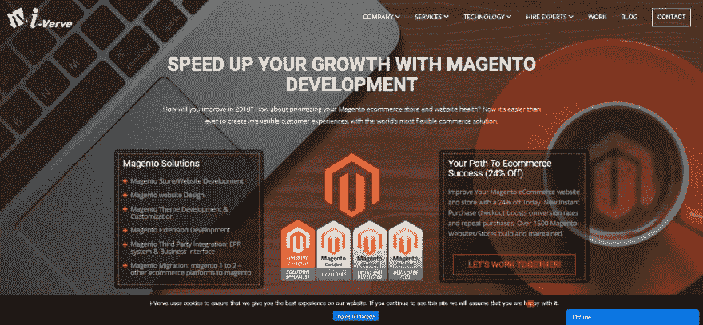](https://res.cloudinary.com/practicaldev/image/fetch/s--KsxvqhaW--/c_limit%2Cf_auto%2Cfl_progressive%2Cq_auto%2Cw_880/https://im4.ezgif.com/tmp/ezgif-4-9f5be0a81259.jpg)

i-Verve 是一家经验丰富的 Magento 开发公司，为您的电子商务企业提供应有的信誉、信任、声誉、品牌建设、销售和曝光度。专家专业 Magento 电子商务开发人员了解客户的要求和商业目标之前，开始任何项目。他们为您的业务提供尖端的技术解决方案，帮助您增加业务收入。他们提供全方位的 Magento 服务，包括 Magento 主题设计、Magento 定制模块、Magento 扩展开发、Magento 咨询、Magento 支持和维护以及其他专业 Magento 服务。他们真的明白，一个伟大的电子商务网站应该是用户友好的，反应灵敏的，最重要的是，它应该产生销售。

### 2.[即时信息解决方案](https://www.konstantinfo.com/ "Konstant Infosolutions")

[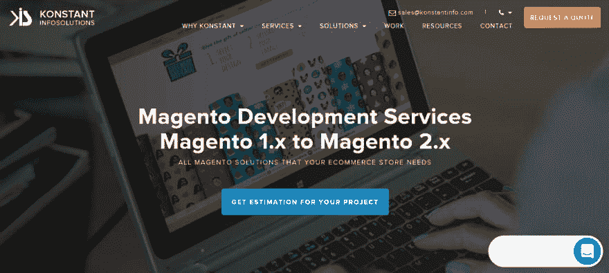](https://res.cloudinary.com/practicaldev/image/fetch/s--RBjfq6Ix--/c_limit%2Cf_auto%2Cfl_progressive%2Cq_auto%2Cw_880/https://im4.ezgif.com/tmp/ezgif-4-661c43d45bae.png)

Konstant Infosolutions 是一家屡获殊荣的 web 和移动应用程序开发和咨询公司，拥有超过 16 年的经验。该公司最近被提名为 2018 年 5 大移动应用供应商和 10 大安卓和 iPhone 应用开发公司。他们已经为各种规模的公司完成了 3500 多个项目，包括 350 多个移动应用程序。

### 3.短篇小说

Contus 是一家总部位于印度的 Magento 开发公司，自 2009 年以来一直提供 Magento 服务和解决方案。他们拥有 50 多名经过认证并获奖的 Magento 开发人员，总体而言，他们已经为 40 多个国家的客户开发了 300 多家 Magento 商店。Contus 有一个内部现成的 Magento 移动应用程序构建解决方案，它是本地的，100%可定制的。

### 4.[妻子](https://www.vaimo.com/ "Vaimo")

[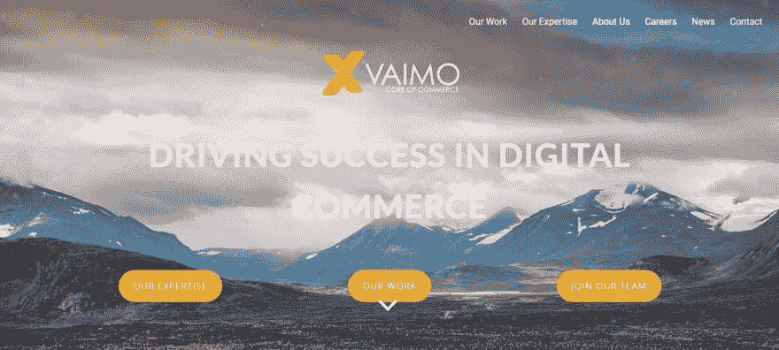](https://res.cloudinary.com/practicaldev/image/fetch/s--eaCp1gOX--/c_limit%2Cf_auto%2Cfl_progressive%2Cq_auto%2Cw_880/https://im4.ezgif.com/tmp/ezgif-4-5232590e93f8.png)

作为全球知名的 Magento Gold Solution 合作伙伴之一，该公司已经成功地为世界各地的商家和品牌交付了 300 多个项目。作为 Magento 平台的先驱，Vaimo 拥有 250 多名专职的内部专家，致力于将客户的电子商务需求和抱负变为现实。出于客户的需求和充足的项目，他们在短短 8 年内已扩展到 10 个国家和 13 个城市。它们通过将平台与重要的第三方系统和服务提供商连接起来，提供了最好的 Magento 集成。Vaimo 与全球知名品牌合作，如 Jack Daniel's、包豪斯、比约恩·博格、fjllrven、Filippa K、Agent Provocateur、Gant、惠普、Oticon Medical 等。

### 5. [Sparx IT 解决方案](https://www.sparxitsolutions.com/ "Sparx IT Solutions")

[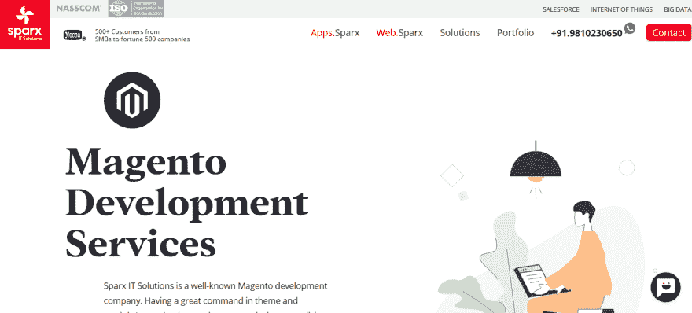](https://res.cloudinary.com/practicaldev/image/fetch/s--Ct9irrvK--/c_limit%2Cf_auto%2Cfl_progressive%2Cq_auto%2Cw_880/https://im4.ezgif.com/tmp/ezgif-4-4b20b4639cd8.png)

Sparx IT Solutions 是一家网络和应用程序开发机构，以构建以用户为中心的网站而闻名。设计吸引观众的应用程序很受欢迎。该公司拥有一支经验丰富的专业团队，帮助他们在预计的时间框架内提供出色的 web 和应用程序开发解决方案。

### 6. [Rave Infosys](https://www.raveinfotech.com/ "Rave Infosys")

[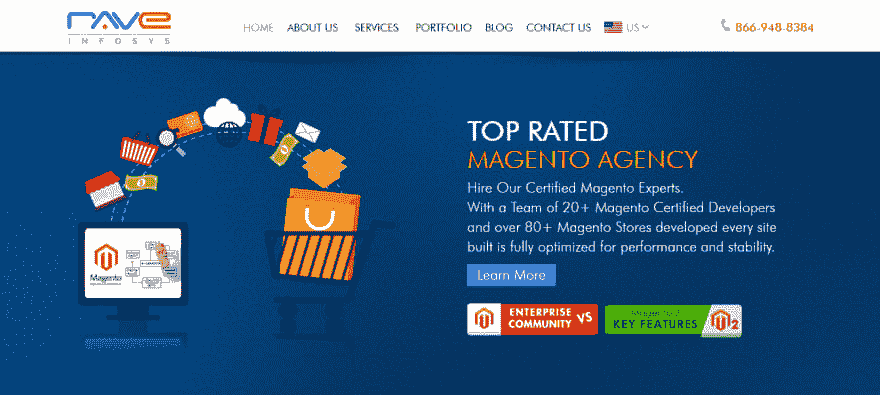](https://res.cloudinary.com/practicaldev/image/fetch/s--5Q5u4MYf--/c_limit%2Cf_auto%2Cfl_progressive%2Cq_auto%2Cw_880/https://im4.ezgif.com/tmp/ezgif-4-f2d4af74fc49.png)

Rave Infosys 认证软件工程师帮助企业实现其业务目标。Rave Infosys 创建高质量的端到端技术服务，包括 Magento 电子商务、Salesforce CRM 和 WordPress CMS。

### 7.[盈方网络](https://www.infront.com/ "Infront Webworks")

盈方网络是一家提供全方位服务的网页设计公司。通过专家团队，他们为客户提供专业的网站、搜索引擎优化(SEO)、营销和云策略，以满足他们的 web 需求；都在一个屋檐下。凭借 20 年的行业经验，他们知道什么是真正适合不同垂直行业客户的。

### 8.[磁电机 IT 解决方案](https://magnetoitsolutions.com/ "Magneto IT Solutions")

万磁王 IT 解决方案是一家电子商务开发公司，总部设在印度艾哈迈达巴德。该公司有一个 90 名员工的团队，他们在拉斯维加斯、巴林和印度浦那的办公室工作。他们成立于 2009 年，专门从事亚马逊和 Linux 平台上的移动应用程序开发，以及 Magento 和 Shopify 的 WordPress 网站开发。他们主要与小企业客户和初创公司合作，帮助他们在市场上站稳脚跟。

### 9.Brainvire 信息技术公司

[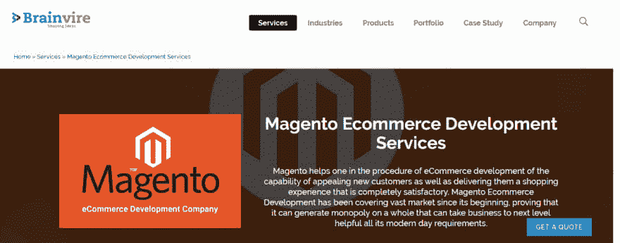](https://res.cloudinary.com/practicaldev/image/fetch/s--vhXhgzuq--/c_limit%2Cf_auto%2Cfl_progressive%2Cq_auto%2Cw_880/https://im4.ezgif.com/tmp/ezgif-4-75ccf8ab6c85.png)

brain vire——顶级软件开发机构和 IT 咨询公司，被 Clutch 授予。该公司以提供卓越的网络和移动应用开发和数字营销服务以及移动 POS、电子商务和趋势技术而闻名，如 IOT、BigData、AI 等。该公司在全球拥有超过 1200 家满意的客户，在数字化转型行业拥有超过 10 年的经验。Brainvire 拥有一支经验丰富的网络和移动开发者团队，帮助实现他们的座右铭，即始终“专注于成为潮流引领者”。

### 10. [Scandiweb](https://scandiweb.com/ "Scandiweb")

[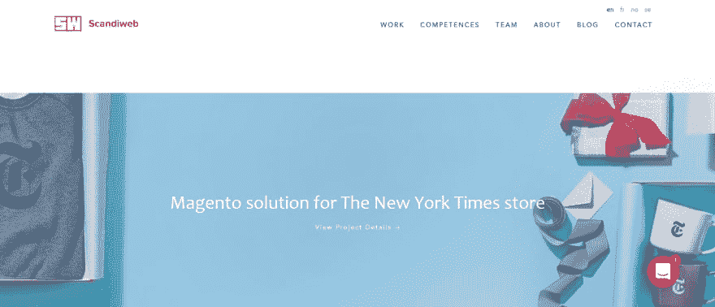](https://res.cloudinary.com/practicaldev/image/fetch/s--nR8gwEmM--/c_limit%2Cf_auto%2Cfl_progressive%2Cq_auto%2Cw_880/https://im4.ezgif.com/tmp/ezgif-4-2bfddc55edfa.png)

Scandiweb 成立于 2003 年，由一群精力充沛、雄心勃勃的年轻开发人员和项目经理组成，他们努力成为世界第一的 Magento 集成商。Scandiweb 是一家拥有经过认证的 Magento 开发人员和 PMP 项目经理的公司。迄今为止，他们已经为 15 个国家的商人交付了 175 个以上的 Magento 项目。

### 11. [Ecomsolver](https://www.ecomsolver.com/ "Ecomsolver")

[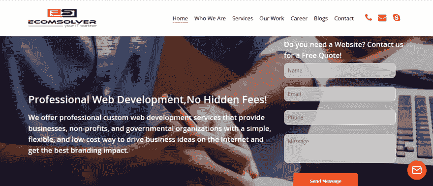](https://res.cloudinary.com/practicaldev/image/fetch/s--BU67Byrl--/c_limit%2Cf_auto%2Cfl_progressive%2Cq_auto%2Cw_880/https://im4.ezgif.com/tmp/ezgif-4-e21408241fca.png)

Ecomsolver 是一家快速发展的 Magento 网站开发公司，目标是在预算范围内为我们的客户提供最好和最优质的服务。公司位于印度斋浦尔，提供定制电子商务网站开发(基于网络和移动项目)的所有支持和服务。

### 12.贝尔夫

[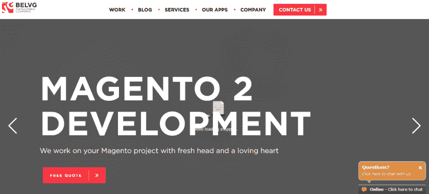](https://res.cloudinary.com/practicaldev/image/fetch/s---EHWz9XB--/c_limit%2Cf_auto%2Cfl_progressive%2Cq_auto%2Cw_880/https://im4.ezgif.com/tmp/ezgif-4-cf1f257c405b.png)

作为一家总部位于白俄罗斯明斯克的领先电子商务开发公司，BelVG 开发了令人惊叹的网站和应用程序。自 2004 年以来，他们的团队超过名员工，专门从事电子商务、网络和移动应用程序开发。

BelVG 为一家零售商建立了一个 Magento 电子商务平台，并添加了 iOS 和 Android 应用程序。该机构改进了他们的平台，并为公司提供了可持续的增长。

### 13.商业专家

[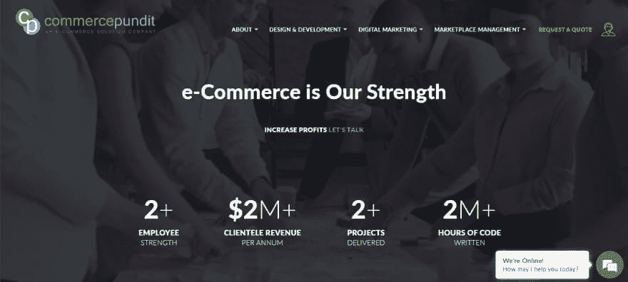](https://res.cloudinary.com/practicaldev/image/fetch/s--g2EDBrdC--/c_limit%2Cf_auto%2Cfl_progressive%2Cq_auto%2Cw_880/https://im4.ezgif.com/tmp/ezgif-4-b0ace532d86e.png)

顾名思义，商业专家在 Magento 电子商务开发方面很有技巧。这是一家总部设在美国的全方位服务网络开发公司，帮助小型和大型企业实现他们的商业目标与恒星网上商店。他们擅长 Magento 响应式设计，致力于用户友好的设计，无论用户使用什么设备，智能手机、平板电脑、笔记本电脑还是台式机。商业专家的团队紧跟技术的最新趋势和需求，因此，会给你的网站一个用户喜爱的外观和功能。

### 14. [Exinent LLC](https://www.exinent.com/ "Exinent LLC")

[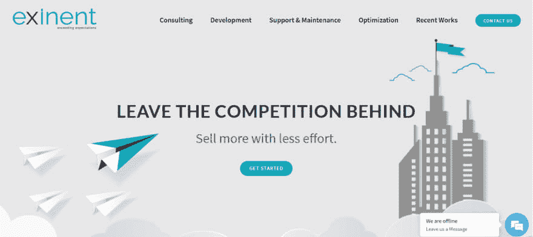](https://res.cloudinary.com/practicaldev/image/fetch/s--mWdw5VUc--/c_limit%2Cf_auto%2Cfl_progressive%2Cq_auto%2Cw_880/https://im4.ezgif.com/tmp/ezgif-4-e4b716c7bb0e.png)

他们是美国 Magento 电子商务网站的全栈代理，帮助零售商建立更好的在线商店，发展更快，并获得更多利润。

### 15.[冰立方数码](https://www.icecubedigital.com/ "Icecube Digital")

[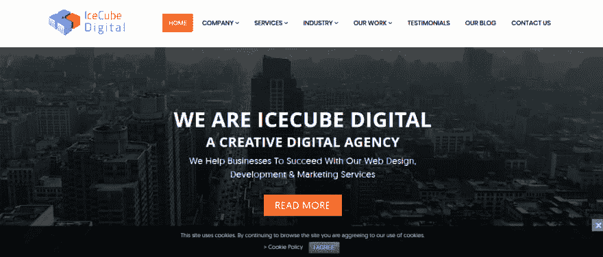](https://res.cloudinary.com/practicaldev/image/fetch/s--r41peFZk--/c_limit%2Cf_auto%2Cfl_progressive%2Cq_auto%2Cw_880/https://im4.ezgif.com/tmp/ezgif-4-caf93b476683.png)

他们是领先的电子商务网页设计，网页开发和移动应用程序开发机构，拥有超过 6 年的经验。他们经验丰富的团队已经成功交付了 Magento、WordPress、Woocommerce、PHP 和移动应用程序项目。他们真的很喜欢为他们尊贵的客户所做的事情，这就是为什么客户喜欢为他们的服务留下很好的评价

### 16. [Iwdagency](https://www.iwdagency.com/ "Iwdagency")

[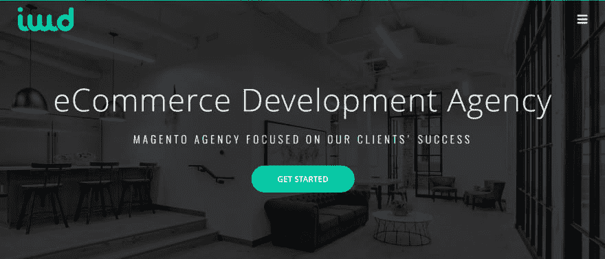](https://res.cloudinary.com/practicaldev/image/fetch/s--6ESukLEa--/c_limit%2Cf_auto%2Cfl_progressive%2Cq_auto%2Cw_880/https://im4.ezgif.com/tmp/ezgif-4-7bfe18ab94be.png)

IWD 是一家位于路易斯安那州巴吞鲁日的电子商务机构，专门从事 Magento 开发。成立于 2001 年，他们的核心团队由电子商务专家组成。他们为希望扩大在线业务的品牌提供优质的电子商务、B2B 和营销解决方案。他们为客户的投资带来了惊人的回报。

### 17. [Magecom](https://magecom.net/ "Magecom")

[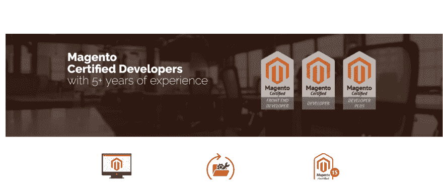](https://res.cloudinary.com/practicaldev/image/fetch/s--Uzxkt_QN--/c_limit%2Cf_auto%2Cfl_progressive%2Cq_auto%2Cw_880/https://im4.ezgif.com/tmp/ezgif-4-bfba621bdfbe.png)

Magecom 是一家专业咨询机构，专门从事 Magento 平台的电子商务 web 应用程序开发。他们的总部位于乌克兰的哈尔科夫，在挪威的奥斯陆也有办事处。自 2009 年以来，他们一直在开发 Magento 电子商务网站，并拥有一支熟练且经验丰富的开发人员、设计师和测试人员团队。

### 18.[沙发](https://divante.co/)

[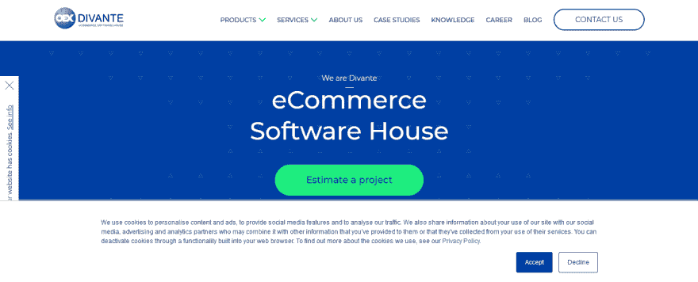](https://res.cloudinary.com/practicaldev/image/fetch/s--KjOiIyLF--/c_limit%2Cf_auto%2Cfl_progressive%2Cq_auto%2Cw_880/https://im4.ezgif.com/tmp/ezgif-4-fd611bd483f2.png)

Divante 是一家位于波兰弗罗茨瓦夫的电子商务开发公司。该机构成立于 2008 年，目前拥有 120 名员工，为其大中型客户提供电子商务开发、web 开发、UX/UI 设计和转换优化服务。

### 19\. [Pixafy](https://www.pixafy.com/ "Pixafy")

[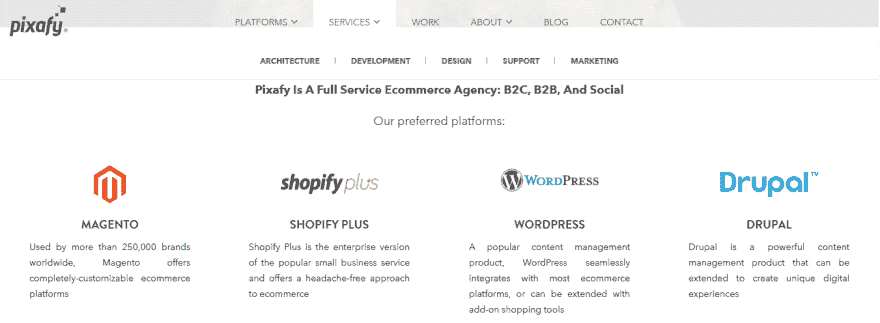](https://res.cloudinary.com/practicaldev/image/fetch/s--wln5AuCv--/c_limit%2Cf_auto%2Cfl_progressive%2Cq_auto%2Cw_880/https://im4.ezgif.com/tmp/ezgif-4-bef4c36c443e.png)

Pixafy 对成为全球电子商务平台专家感到自豪。致力于创新数字化的一切，Pixafy 是一家总部位于纽约的电子商务机构，也是 B2B 和 B2C 实施的在线零售专家。他们提供数字化转型和渠道协调，以扩大您的电子商务业务。Pixafy 团队以开发优秀的 Magento 网站而闻名。他们遵循定义明确的方法和最独特的方法，确保高质量和富有成效的结果。

### 20. [Forix 网页设计](https://www.forixwebdesign.com/ "Forix Web Design")

[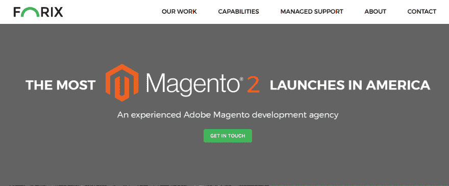](https://res.cloudinary.com/practicaldev/image/fetch/s--Go66wHoo--/c_limit%2Cf_auto%2Cfl_progressive%2Cq_auto%2Cw_880/https://im4.ezgif.com/tmp/ezgif-4-b810680b094a.png)

Forix 网站设计是值得信赖的定制电子商务解决方案与买方为中心的战略设计。它成立于 2007 年，在短短的 9 年时间里就取得了非凡的成就。正如所说，“我们不建立电子商务网站，我们创造销售乘数，”它已经为顶级客户，如阿迪达斯，Asics，GoPro，TEDx，横滨和许多其他人提供同等的网络和移动服务。在电子商务领域，Forix 的 Magento 认证开发人员、设计师、数字营销人员和业务分析师组成的专家团队已经制作了 100 多个成功的店面，并证明了他们在消除扩展相关错误方面的技能。

### 21.QualDev 公司

QualDev Inc 是一家领先的电子商务网站开发、移动应用程序开发和数字营销机构，总部位于纽约梅尔维尔，自 2006 年以来为 400 多家满意的客户提供服务。

### 22. [CueBlocks](https://www.cueblocks.com/ "CueBlocks")

[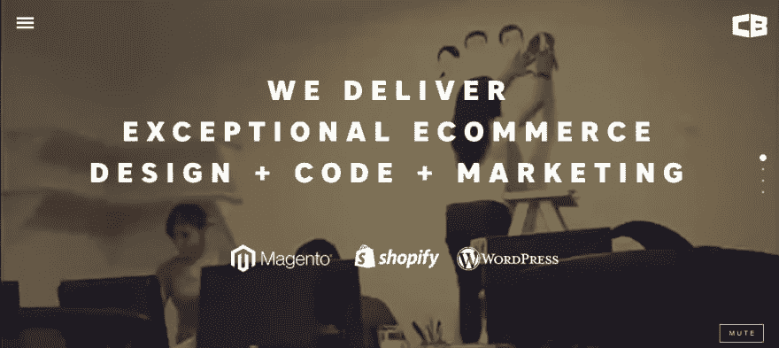](https://res.cloudinary.com/practicaldev/image/fetch/s--X6lOwz2H--/c_limit%2Cf_auto%2Cfl_progressive%2Cq_auto%2Cw_880/https://im4.ezgif.com/tmp/ezgif-4-7ae394e9338f.png)

该公司是一家电子商务数字机构，总部设在印度和捷克共和国。该公司通过提供以下服务专门开发和维护 Magento 在线商店:代码审查和审计、从 Magento 到 Magento 的迁移/替换、定制设计和开发、第三方集成、网站优化。作为 Magento 2 培训的解决方案合作伙伴，CueBlocks 一直在为电子商务商店开发基于 Magento 2 的开发解决方案。

### 23.[雇佣 Magento 极客](http://www.hiremagentogeeks.com/ "Hire Magento Geeks")

[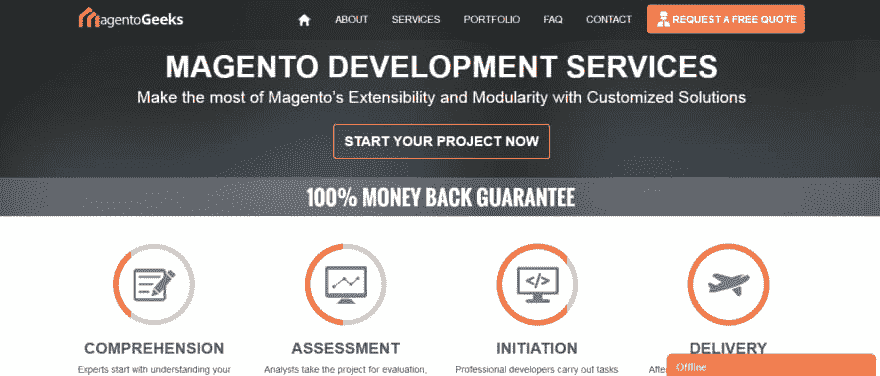](https://res.cloudinary.com/practicaldev/image/fetch/s--0RufcPq1--/c_limit%2Cf_auto%2Cfl_progressive%2Cq_auto%2Cw_880/https://im4.ezgif.com/tmp/ezgif-4-8932a895fff7.png)

Hire Magento Geeks 是一家 Magento 开发公司，为全球客户提供完美的设计转换和电子商务开发服务。他们有一个平台，允许其客户将 designs 的 PSD 转换为 Magento 店面，通过 precision Magento 定制为羽翼未丰的商店提供动力，或者在你雇佣他们的 Magento 程序员为你的项目工作时，从头开始创建整个在线企业。

### 24.[埃尔斯纳技术私人有限公司](https://www.elsner.com/ "Elsner Technologies Pvt Ltd")

[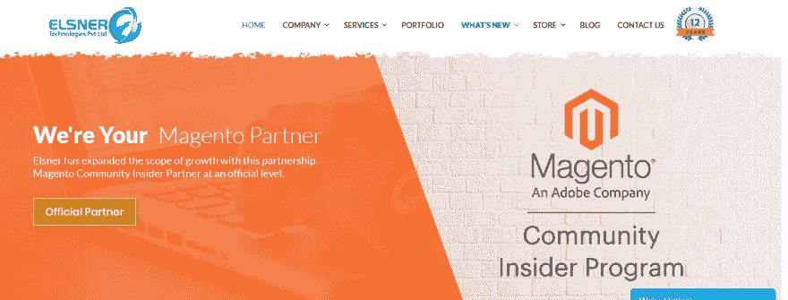](https://res.cloudinary.com/practicaldev/image/fetch/s--62_H-lBs--/c_limit%2Cf_auto%2Cfl_progressive%2Cq_auto%2Cw_880/https://im4.ezgif.com/tmp/ezgif-4-5b8a47c6f566.png)

埃尔斯纳是一个著名的 Magento 开发公司，在那里你可以找到专家级的 Magento 技能。该公司为所有 Magento 版本提供了最吸引人和最有趣的店面模型。Elsner 拥有一个 Magento 认证的开发团队，他们在 web 电子商务定位方面拥有超过 10 年的专业经验。

### 25. [Zaptech 解决方案](http://www.zaptechsolutions.com/ "Zaptech Solutions")

[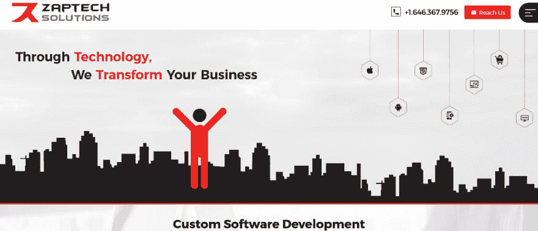](https://res.cloudinary.com/practicaldev/image/fetch/s--RBb8-GOx--/c_limit%2Cf_auto%2Cfl_progressive%2Cq_auto%2Cw_880/https://im4.ezgif.com/tmp/ezgif-4-36d10ff8360e.png)

Zaptech Solutions 以提供根据客户业务需求定制的专业 Magento 开发服务而闻名。他们为您的企业开发有吸引力的功能性 Magento 电子商务网站。遵循行业最佳实践，他们建立了满足 IT 行业未来需求的网上商店。你在找 Magento 2 的专家吗？他们有一个训练有素的 Magento 2 开发团队，可以将您现有的网站转换到 Magento 2。

### 26.[萨拉科技公司](https://www.saratechnologies.com/ "SARA Technologies")

SARA Technologies 在基于 Magento 平台创建全功能电子商务网站方面拥有多年的经验。该公司以为小型和大型企业提供令人惊叹的在线商店而闻名。

### 27.[月球技术](https://www.moontechnolabs.com/)

[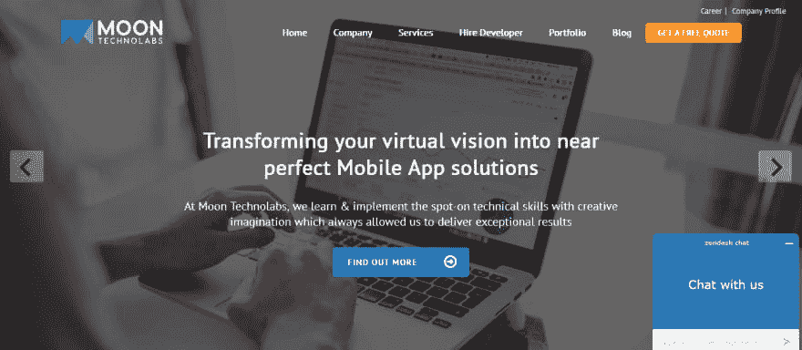](https://res.cloudinary.com/practicaldev/image/fetch/s--87sBRgGt--/c_limit%2Cf_auto%2Cfl_progressive%2Cq_auto%2Cw_880/https://im4.ezgif.com/tmp/ezgif-4-0a38da4245bd.png)

Moon Technolabs 是一家领先的 Magento 开发公司，专门为各种形状和大小的企业建立在线商店。该机构有一个 Magento 开发专家团队，使用最新的工具和技术创建以用户为中心的网站。

### 28.[标记查询](http://www.markuphq.com/ "MarkupHQ")

[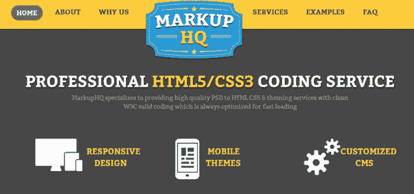](https://res.cloudinary.com/practicaldev/image/fetch/s--ODDZozrX--/c_limit%2Cf_auto%2Cfl_progressive%2Cq_auto%2Cw_880/https://im4.ezgif.com/tmp/ezgif-4-42a376779474.png)

MarkupHQ 是一个由经验丰富的专业人员组成的团队，负责所有 Magento 支持的电子商务网络商店需求。他们提供 Magento 开发的所有不同方面，包括 Magento 电子商务网站的定制和配置、故障排除、优化和业务集成。MarkupHQ 确保 100%手工编码，W3C 验证，跨浏览器兼容和像素完美的 PSD 到 Magento 转换服务。他们不断致力于技术进步，提高主题的质量，降低管理成本，提高效率。

### 29\. [Magentoguys](https://www.magentoguys.com/ "Magentoguys")

[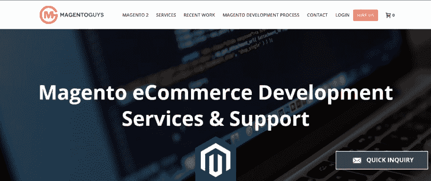](https://res.cloudinary.com/practicaldev/image/fetch/s--8bmlMiaO--/c_limit%2Cf_auto%2Cfl_progressive%2Cq_auto%2Cw_880/https://im4.ezgif.com/tmp/ezgif-4-e68c04c4d14e.png)

MagentoGuys 是一家经验丰富的 Magento 机构，为您的电子商务业务提供所需的信誉、信任、声誉、品牌建设、销售和专业 Magento 电子商务开发商应得的曝光度。

### 30.[丝绸软件](https://www.silksoftware.com/ "SILK Software")

[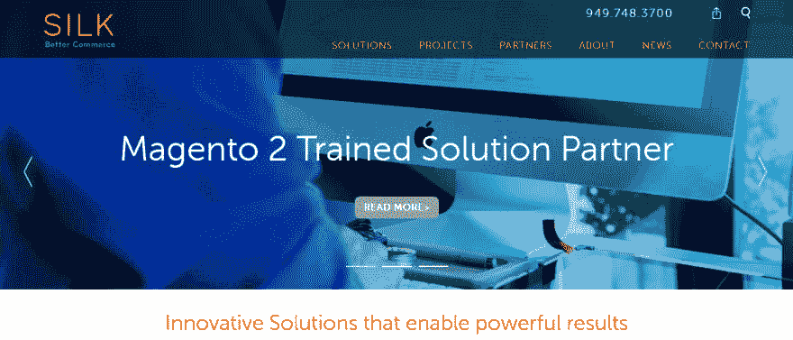](https://res.cloudinary.com/practicaldev/image/fetch/s--VaGfEiW8--/c_limit%2Cf_auto%2Cfl_progressive%2Cq_auto%2Cw_880/https://im4.ezgif.com/tmp/ezgif-4-4e00b47730e6.png)

作为全球知名的 B2B 电子商务专家，SILK Software 为多个行业的客户提供无缝网站设计和交互式移动应用。作为 Magento Gold 合作伙伴，他们实施了从业务战略到技术开发再到创造难忘的用户体验的出色的电子商务解决方案。

### 31.[软科学](https://www.scnsoft.com/services/magento/support "ScienceSoft")

[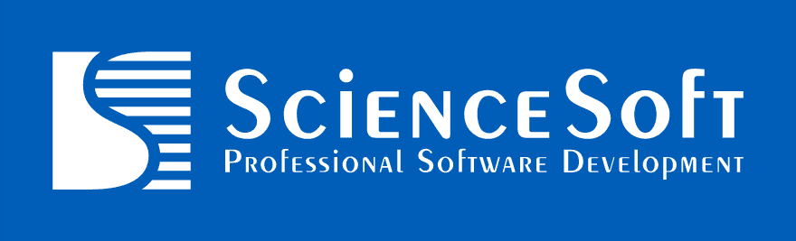](https://res.cloudinary.com/practicaldev/image/fetch/s--ETSHZv3T--/c_limit%2Cf_auto%2Cfl_progressive%2Cq_auto%2Cw_880/https://www.scnsoft.com/logos/sciencesoft-blue-background-logo.svg)

ScienceSoft 不仅仅是一家 Magento 开发公司。该团队拥有出色的咨询技能和以业务为导向的思维，能够设计体验至上的电子商务解决方案。内部开发资源的能力允许以业务发展为目的的各种实施项目和长期合作。

总部位于美国的 ScienceSoft 首先瞄准的是美国电子商务市场。欧洲的办事处允许在国际上扩展服务。

无论你需要一个简单的电子商务网上商店或一个复杂的多商店功能的门户网站，聘请最好的 Magento 开发公司变得很重要。你应该在互联网上做一些研究，选择合适的代理机构来帮助你实现你的商业目标。在为你的下一个项目雇佣 Magento 开发者之前，检查一下你的投资组合并阅读推荐。请确保您在签署合同之前澄清 Magento 网站开发的所有方面。