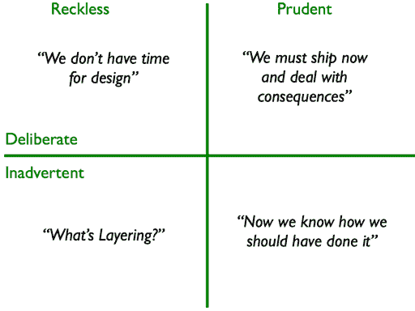
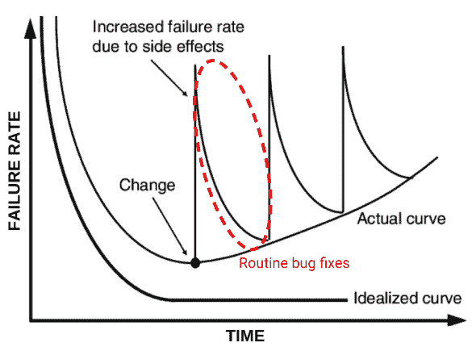

# 将技术债务作为你的下一个工具

> 原文：<https://dev.to/caiorcferreira/using-technical-debt-as-your-next-tool-1bp6>

# 快速汇总

在这篇文章中，我将向你展示我们在软件生命周期中收集的债务是什么，其原因是什么，以及如何偿还。

# 简介

在软件开发中，我们经常面临一个两难的境地:实现特性的最佳解决方案，或者快速交付，但是假设有一些变通方法和代码味道？无论你选择哪一方，都是有代价的。

如果您在遗留项目或高度变化的环境中工作，这个成本甚至会更高。我是一名软件工程师@ B2W，拉丁美洲最大的电子商务，由于其悠久的历史，我们处理 6 年以上的遗留应用程序，其中几十名开发人员在这段时间工作。总结电子商务环境的高竞争力，推动不断变化和新的功能，然后你会有一个百万富翁的决定在你手中。

因此，了解如何管理这一成本是实现产品高质量和短时间上市的关键资产。

# 决定成本

要了解如何管理决策成本，首先要了解什么是成本。我们在软件项目中做出的每一个决定，不仅仅是关于最佳解决方案还是快速和肮脏的，都会产生时间成本。有时我们不能花这个时间，需要更早地确定生产目标。在这种情况下，我们用糟糕的代码来换取时间。随着时间的推移，这种行为会让我们欠下一大笔债。

因此，**技术债务是软件开发中的一个隐喻，基于财务债务，关于一个项目中低质量代码随着时间的积累**。

扩展这个比喻，我们可以把金融债务看作是从某个机构获取的资源，因此，在软件范围内，我们借用的资源是时间而不是金钱，为我们提供这种资源的机构是我们的代码库而不是银行。因此，在技术债务计算中，主要的金额是将代码库重构为干净的设计的时间成本，而利息代表了如果团队不得不在混乱的代码上工作，未来将花费的额外时间。

# 更加负债

尽管“最佳解决方案 vs 快速而不明智的决策”是引入技术债务的一个很好的例子，但这不是它的唯一来源。正如 Fowler (2009) [指出的](https://martinfowler.com/bliki/TechnicalDebtQuadrant.html)，这种情况只是一种谨慎和故意的债务，其中团队知道它正在发生的成本，并知道如何偿还。但是我们总共可以有四种类型的债务。

每种债务类型都有与之关联的来源:

*   谨慎和深思熟虑——团队知道如何构建好的软件，如果他们加快速度，就有机会交付更多的产品价值。他们分析权衡并判断成本/收益比足以证明坏代码的合理性，否则会延迟解决方案。然后，他们计划如何重构债务，并尽早实施。
*   鲁莽和深思熟虑——团队有能力构建一个设计良好的解决方案，但没有工具或支持来这样做。当一个团队有目的地承担债务，但是没有偿还债务的计划，或者在可能永远不会改变的代码中这样做时，就会发生这种情况。这种情况在没有动机的团队、遗留项目中更为常见，这是由于快速交付的管理压力，而不是持续和高质量的交付。
*   鲁莽和疏忽——团队不知道好的设计实践，并且由于缺乏培训、经验和领导而招致成本。
*   谨慎和疏忽——在我们交付一个特性或项目后，我们意识到最好的设计方法不是我们所做的，这是一个常见的情况。由于缺乏领域知识、模糊的需求和技术限制，这种情况是不可预测的，并且可能发生在任何团队中。

当然，这种探索并没有穷尽技术债务的可能原因，而是包括了最常见的原因。

# 负债累累

由于债务原因可能如此之多，项目可能会经历不断增加的技术债务，以至于添加新功能、修复当前错误和运行应用程序变得不可能。

这种类型的场景可能是灾难性的，因为当团队生活在这个应用程序中时，他们将失去灵活性，将观察到不断增加的 bug 数量，失去动力，增加压力，长期的生产问题(长期存在的 bug)，客户抱怨以及在只有少数人知道如何开发和操作项目的情况下可能的单点失败。

当应用程序达到这一点时，我们说它进入了技术破产。

然而，使用正确的策略，我们可以使突出显示的曲线更陡峭，使实际曲线最接近理想曲线。

# 还钱

为了避免应用程序负债累累，或者处理已经负债累累的项目，我们需要建立一个偿还计划。为了重构和付出应有的时间，这可能需要任何努力，但是业界制定了一些已经被证明有效的策略。

1.  **技术待办事项**:每项任务都应该有一个简短的描述，说明变更对项目重要的原因，以及代码库的哪一部分必须变更。像任何其他任务一样，我们应该估计构建一个好的、干净的解决方案所需的工作量。在估计成本时，团队应该增加一个利息成本，这个成本与代码在未来发生变化的概率成正比，因此应该优先考虑成本最高的任务。精确的估计确实很难，但是一个基本的近似值足以指导决策。
    *   使用这种方法，技术债务对所有涉众都变得可见，并且可以根据工作和未来影响来决定是否执行这样的任务。
    *   任务成本很容易追踪。
    *   不要把技术任务和功能任务混在一起。
2.  **重构成本包含在功能评估中:**解释成本是必要的，因为我们遵循的原则是，任何功能都不应该在坏代码之上实现，因此这些代码应该首先被重构(*童子军规则*)。这是一个基本原则，一旦糟糕的代码已经引起人们的兴趣，使用它添加一个新的特性将会成倍地增加这种兴趣，以至于在这个代码上工作的成本将会如此之高，以至于不可能做进一步的改变。

除此之外，根据项目的负债程度，还有另外两种批评策略可以使用。T3】

1.  **缓冲任务:**任务有一部分团队冲刺。它可以用于计划外的重构、未预见的问题、发现等。为了避免任务浪费在不相关的工作上，团队成员应该总是提出他们如何假装使用时间，并与团队的其他成员讨论。
2.  清理发布:定期地或者在批评场景中，团队只能通过技术重构来发布。这个策略只有在已经有重构列表的情况下才有用。此外，业务团队应该给予支持，因为这可能会延迟新功能。当需要更大的努力时，团队应该考虑使用这个，比如大的架构变更、基础设施变更、构建&部署等等。

# 结论

因此，从产品的角度来看，技术债是一个重要的工具。它允许业务人员通过错误代码的成本来提高上市时间和客户满意度。

然而，高额债务会给项目带来巨大的问题，因此，我们必须努力谨慎对待我们的债务，始终将其与还款计划结合起来，使用各种策略来控制债务。

为了实现这一点，所有的利益相关者必须意识到债务的性质和存在，并让开发团队一起参与决策。

# 参考文献

[https://www.infoq.com/presentations/debt-aware-culture](https://www.infoq.com/presentations/debt-aware-culture)
T3】https://martinfowler.com/bliki/TechnicalDebtQuadrant.htmlT5[https://www.infoq.com/minibooks/emag-technical-debt?UTM _ source = minibooks _ about _ technical debt&UTM _ medium = link&UTM _ campaign = technical debt](https://www.infoq.com/minibooks/emag-technical-debt?utm_source=minibooks_about_TechnicalDebt&utm_medium=link&utm_campaign=TechnicalDebt)
[https://books.google.com.br/books?id=pKVFDwAAQBAJ&lpg = PA18&ots = GC 9 VC 8 VF 80&dq =软件质量保证记者 2014&HL = pt-BR&pg = PA18 # v = one page&q =软件质量保证记者 2014 & f=false](https://books.google.com.br/books?id=pKVFDwAAQBAJ&lpg=PA18&ots=Gc9vC8vf80&dq=Software%20Quality%20Assurance%20Pressman%202014&hl=pt-BR&pg=PA18#v=onepage&q=Software%20Quality%20Assurance%20Pressman%202014&f=false)