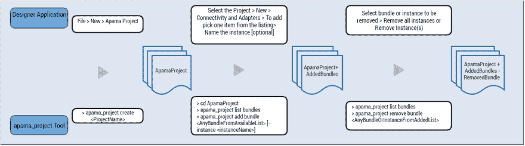

# 阿帕玛项目工具

> 原文：<https://dev.to/tpetrov9/apama-project-tool-24ba>

# 以非设计师的方式打造阿帕玛项目

阿帕玛使用“捆绑包”的概念将 Kafka 或 MQTT 等连接性添加到项目中，并添加 EPL 功能，如日期/时间格式化。迄今为止，唯一的方法是使用 Windows 支持的软件 AG Designer 图形环境。一个名为“apama_project”的新工具也可以让你在 Linux 上从命令行完成这项工作。

该工具可与 Software AG Designer 互操作，因此您可以根据需要在工具之间进行切换。使用 apama_project 工具创建的项目也完全兼容用于项目部署的 engine_deploy 工具。

此图显示了传统软件 AG Designer 应用程序和新开发的命令行工具 apama_project 之间的比较。它展示了如何使用这个工具来管理一个阿帕玛项目和其中的包。

**[](https://res.cloudinary.com/practicaldev/image/fetch/s--S_xPkAcB--/c_limit%2Cf_auto%2Cfl_progressive%2Cq_auto%2Cw_880/http://techcommunity.softwareag.com/documents/10157/10255328/apama_project_tool.png/22ca0d51-1b7e-4b89-aee4-128f3d1d1c87%3Ft%3D1553777807982)T4】**

## 你能用这个工具做什么

**创建一个项目**

该工具在当前目录下创建一个具有指定名称的新项目目录，并将所有与阿帕玛项目相关的文件添加到项目目录中。

```
\> apama\_project create ApamaProject 
```

其中，“ApamaProject”是请求的项目名称。

现在，为了执行其他命令，比如列出包或者添加/删除包，您需要将 shell 的当前目录更改为新的项目目录。

**列出捆绑包**

显示的捆绑包列表由两部分组成。第一部分显示了已经添加到阿帕玛项目中的包。第二部分显示了可以添加到项目中的可用包。此外，第二部分有基于包类型的组，如标准、适配器和连接。

```
\> apama\_project list bundles 
```

**添加捆绑包**

有几种方法可以将包添加到项目中。

首先，您可以传递*包显示名称*，当您在项目中列出包时会显示这个名称。

```
\> apama\_project add bundle Kafka 
```

其中，“Kafka”是包的显示名称。

其次，可以传递 bundle 的*索引号*。在这个特殊的例子中，您需要一个项目中所有包的新列表，然后传递对应于这个包的最新索引号。

```
\> apama\_project list bundles Bundles that have already been added: Bundles that can be added: Connectivity bundles: .. ... 43 User Connectivity \> apama\_project add bundle 43 
```

其中，索引号“43”对应于刷新列表中的“用户连接”捆绑包。

对于某些包，可以添加多个实例。在这些情况下，要有选择地定制这些包的实例名，可以使用“ *- instance MyInstance* ”。这也允许你给他们一个更符合逻辑的名字。此外，实例名被用在连接性配置文件中的不同地方，在某些情况下，还被用在 EPL 代码中，以便与它们进行交互。

**移除捆绑包**

要删除标准 EPL 包，您需要提供包显示名称。要删除连接包，您可以提供*包显示名称*或*包实例名称*。

值得注意的是，连接性包的第一个实例的默认名称是列表中所示的包的显示名称。因此，如果您请求删除该特定实例，那么只会删除该特定实例。

```
\> apama\_project remove bundle Kafka 
```

其中，“Kafka”是包的显示名称。

有关支持的操作和命令格式的更多信息可通过运行部分命令和帮助选项获得，例如- help 或-h。例如:

```
\> apama\_project --help \> apama\_project create --help \> apama\_project add bundle --help \> apama\_project remove bundle --help 
```

## 部署项目

使用 *engine_deploy* 工具，您可以部署使用 *apama_project* 工具创建的项目。这同样适用于使用新工具管理包的项目。以下演示显示了如何使用连接插件创建项目，以允许阿帕玛充当简单的 HTTP 服务器:

首先，创建一个阿帕玛项目，将项目命名为“HTTPServerDemo”，然后添加一个 HTTP 服务器包:

```
\> apama\_project create HTTPServerDemo Project created successfully at location: <currentlocation>\HTTPServerDemo

&gt; cd HTTPServerDemo

&gt; apama_project add bundle "HTTP Server"
Adding bundle "HTTP Server".
"HTTP Server" bundle added successfully.
You may need to configure instance files by editing the following files.
"C:\HTTPServerDemo\config\connectivity\HTTPServer\HTTPServer.properties"
"C:\HTTPServerDemo\config\connectivity\HTTPServer\HTTPServer.yaml"
"C:\HTTPServerDemo\config\connectivity\HTTPServer\swagger_HTTPServer.json"
</currentlocation> 
```

正如在添加包时所建议的，您需要配置实例文件。因此，您通过编辑文件“HTTPServer.yaml”来设置 HTTP 服务器配置:

```
connectivityPlugins: httpServer: libraryName: connectivity-http-server class: HTTPServer dynamicChainManagers: httpServer: transport: httpServer managerConfig: port: 443 bindAddress: localhost dynamicChains: httpServer: - apama.eventMap: defaultEventType: HelloWorld defaultChannel: HelloWorldChannel - jsonCodec - stringCodec - httpServer: automaticResponses: true allowedMethods: [PUT] 
```

接下来，您需要 EPL 在收到 HTTP 请求生成的事件时做一些事情:

```
event HelloWorld {} monitor HelloWorldMonitor { action onload() { monitor.subscribe("HelloWorldChannel"); on all HelloWorld () { log "Hello World" at INFO; } // signal that we are ready to receive events com.softwareag.connectivity.ConnectivityPlugins.onApplicationInitialized(); } } 
```

最后，您使用 *engine_deploy* 工具从项目:
中创建一个部署目录

```
\> engine\_deploy --outputDeployDir ..\HTTPServerDemo-Deployment . \> cd ..\HTTPServerDemo-Deployment \> correlator --config . ... 2019-02-22 00:49:00.261 INFO [3364] - <connectivity.httpserver.manager> Binding to http://localhost:443
</connectivity.httpserver.manager> 
```

#### 注

本文最初发表于[tech community . software ag . com/techniques-blog/-/blogs/apama-project-tool](http://techcommunity.softwareag.com/techniques-blog/-/blogs/apama-project-tool)