# 使用 JSDoc 的类型安全 Web 组件

> 原文：<https://dev.to/dakmor/type-safe-web-components-with-jsdoc-4icf>

编写代码是艰难的，而以一种对他人(或你未来的自己)有意义的方式编写代码更是艰难。这就是为什么文档是每个软件项目中非常重要的一部分。

我相信我们都发现自己处于以下情况:你正在愉快地编码，并且刚刚发现了一个可以帮助你的不错的库，所以你开始使用它...

```
import foo from 'foo-lib';

foo.doTheThing(//... 
```

但是，`foo.doTheThing()`是先取字符串，再取数字，还是反过来呢？

所以你去了[http://foo-lib.org](http://foo-lib.org)，大约 5 次点击后，你得到了函数签名，并找到了如何使用它。首先，你已经很幸运了，因为没有多少库有好的文档😱

然而，它已经痛苦地表明，信息并不像它应该的那样接近您的工作流程。你必须停止编码和搜索信息，而它可以直接在你的编辑器中。😊

所以我们肯定能做得更好🤗让我们从一个非常简单的 web 组件开始。

**注意**:我们将假设正在使用的编辑器是 VS 代码。

如果你想一起玩，所有的代码都在 github 上。

### <标题栏>

[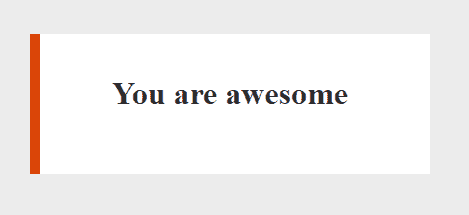](https://res.cloudinary.com/practicaldev/image/fetch/s--1_2KnKrC--/c_limit%2Cf_auto%2Cfl_progressive%2Cq_auto%2Cw_880/https://github.com/daKmoR/type-safe-webcomponents-with-jsdoc/raw/mastimg/title-bar.png)T3】

```

  #shadow-root (open)
    <h1>You are awesome</h1>
    <div class="dot" style="left: 0px; top: 0px" title="I am dot"></div>
 
```

这只是一个小盒子

*   产权属性
*   黑暗模式属性/特性
*   格式化程序功能
*   左侧的侧栏属性

我们将使用 LitElement 来创建它。

**注意**:我们在这里使用 JavaScript 但是在大多数情况下(除了类型转换&定义),这个例子对于 TypeScript 是一样的。

```
import { LitElement, html, css } from 'lit-element';

export class TitleBar extends LitElement {
  static get properties() {
    return {
      title: { type: String },
      darkMode: { type: Boolean, reflect: true, attribute: 'dark-mode' },
      bar: { type: Object },
    };
  }

  constructor() {
    super();
    this.title = 'You are awesome';
    this.darkMode = false;
    this.bar = { x: 0, y: 0, title: 'I am dot' };
    this.formatter = null;
  }

  render() {
    // positioning the bar like this is just for illustration purposes => do not do this
    return html`
      <h1>${this.format(this.title)}</h1>
      <div
        class="dot"
        style=${`left: ${this.bar.x}px; top: ${this.bar.y}`} title=${this.bar.title} ></div>
    `;
  }

  format(value) {
    // we'll get to this later
  }

  static get styles() {
    // we'll get to this later
  }
}

customElements.define('title-bar', TitleBar); 
```

### 使用时得到的东西

让我们查询新创建的元素。😊

```
const el = document.querySelector('title-bar'); 
```

这里我们的编辑无法知道`el`实际上是什么，所以它无法帮助我们写出更好的代码。
这意味着我们自己的属性没有代码完成，即使这些信息是可用的。

[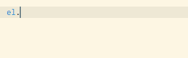](https://res.cloudinary.com/practicaldev/image/fetch/s--4BOpOAvv--/c_limit%2Cf_auto%2Cfl_progressive%2Cq_auto%2Cw_880/https://github.com/daKmoR/type-safe-webcomponents-with-jsdoc/raw/mastimg/autoCompleteMissing.png)

所以我们需要做的就是对它进行造型:

```
const el = /** @type {TitleBar} */ (document.querySelector('title-bar')); 
```

现在我们已经得到了自动完成。🎉

[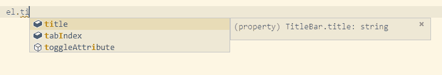](https://res.cloudinary.com/practicaldev/image/fetch/s--5JVnQQIZ--/c_limit%2Cf_auto%2Cfl_progressive%2Cq_auto%2Cw_880/https://github.com/daKmoR/type-safe-webcomponents-with-jsdoc/raw/mastimg/autoCompleteTypes.png)

然而，我们仍然可以编写类似
的代码

```
el.foo = 'bar';
el.title = true; 
```

没有人会抱怨。

让我们改变这一点💪

### 添加林挺类型

向您的项目
添加一个`tsconfig.json`文件

```
{  "compilerOptions":  {  "target":  "esnext",  "module":  "esnext",  "moduleResolution":  "node",  "lib":  ["es2017",  "dom"],  "allowJs":  true,  "checkJs":  true,  "noEmit":  true,  "strict":  false,  "noImplicitThis":  true,  "alwaysStrict":  true,  "esModuleInterop":  true  },  "include":  [  "src",  "test",  "node_modules/@open-wc/**/*.js"  ],  "exclude":  [  "node_modules/!(@open-wc)"  ]  } 
```

这就是你需要得到 VS 代码来标记代码有问题的全部内容:

```
Property 'foo' does not exist on type 'TitleBar'.
Type 'true' is not assignable to type 'string'. 
```

你甚至可以更进一步，在控制台中进行林挺和持续集成。

你需要做的就是:

```
npm i -D typescript 
```

并将这个脚本添加到 package.json

```
 "scripts":  {  "lint:types":  "tsc"  } 
```

那么我们可以这样执行:

```
npm run lint:types 
```

这将给出与上面相同的错误，但是有一个文件路径和行号。

所以只要做这些额外的事情，你的 IDE 就可以帮助你保持类型安全。

老实说，这不会是一个温和的提醒-那些红色的卷线很难忽略，如果你需要一些额外的动力，你可以点击 F8，这只会让你面对下一个错误:p

[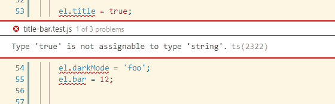](https://res.cloudinary.com/practicaldev/image/fetch/s--KgZuscos--/c_limit%2Cf_auto%2Cfl_progressive%2Cq_auto%2Cw_880/https://github.com/daKmoR/type-safe-webcomponents-with-jsdoc/raw/mastimg/showTypeErrors.png)

## 它是如何工作的？

如果你像我一样，你可能想知道它是如何知道哪些属性属于哪种类型的？我当然还没有定义任何类型！

Typescript 可以基于您的 ES6 代码做出很多假设。真正的魔力在于构造函数:

```
constructor() {
  super();
  this.title = 'You are awesome';
  this.darkMode = false;
  this.bar = { x: 0, y: 0, title: 'I am dot' };
  this.formatter = null;
} 
```

*   标题显然是一个字符串
*   darkMode 布尔值
*   以 x，y 为数字，标题为字符串

所以只要在构造函数中定义你的初始值，你的大部分类型就可以了。👍(别担心，我没有忘记格式化程序，我们很快就会谈到它)

类型已经很棒了，但我们可以做得更好。

### 看 VS 代码中的 intellisense。

[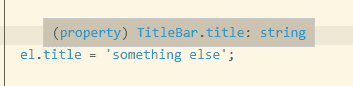](https://res.cloudinary.com/practicaldev/image/fetch/s--3Tw2A-v0--/c_limit%2Cf_auto%2Cfl_progressive%2Cq_auto%2Cw_880/https://github.com/daKmoR/type-safe-webcomponents-with-jsdoc/raw/mastimg/intellisenseTitleTyped.png)

目前它真的很小...所以我们来补充一些 JSDoc:

```
/**
 * The title to display inside the title bar
 * - should be less then 100 characters
 * - should not contain HTMl
 * - should be between 2-5 words
 *
 * @example
 * // DO:
 * el.title = 'Welcome to the jungle';
 *
 * // DON'T:
 * el.title = 'Info';
 * el.title = 'Welcome to <strong>the</strong> jungle';
 * el.title = 'We like to talk about more then just what sees the eye';
 */
this.title = 'You are awesome'; 
```

[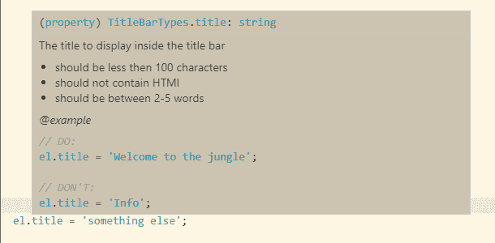](https://res.cloudinary.com/practicaldev/image/fetch/s--pDrVwd67--/c_limit%2Cf_auto%2Cfl_progressive%2Cq_auto%2Cw_880/https://github.com/daKmoR/type-safe-webcomponents-with-jsdoc/raw/mastimg/intellisenseTitleTypedJsDoc.png)

好多了😊

**注意**:你不需要在这里添加`@type`，因为很明显它是一个字符串，如果你添加了它，它可能会在某个时候失去同步。

### 手动设置类型

如果我们看一下

```
this.formatter = null; 
```

仅从这条线看不出该房产将持有什么。
你可以像
一样分配一个空的/默认的函数

```
this.formatter = value => `${value}`; 
```

但这并不是在所有情况下都有意义。
在我们的例子中，如果没有格式化函数，我们想跳过格式化。
拥有一个默认功能会违背它的目的。
在这些情况下，必须提供一个`@type`，你可以使用 JSDoc 来完成。

```
/**
 * You can provide a specific formatter that will change the way the title
 * gets displayed.
 *
 * *Note*: Changing the formatter does NOT trigger a rerender.
 *
 * @example
 * el.formatter = (value) => `${value} for real!`;
 *
 * @type {Function}
 */
this.formatter = null; 
```

这样，如果你提供了一个错误的类型，它会显示一个错误。

```
el.formatter = false;
// Type 'false' is not assignable to type 'Function'. 
```

此外，立即出现的`@example`真的可以很容易地创建自己的格式化程序。

[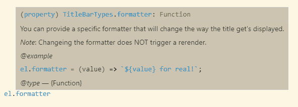](https://res.cloudinary.com/practicaldev/image/fetch/s--UIboiB_b--/c_limit%2Cf_auto%2Cfl_progressive%2Cq_auto%2Cw_880/https://github.com/daKmoR/type-safe-webcomponents-with-jsdoc/raw/mastimg/intellisenseFormatterTypedJsDoc.png)

### 设置自己的类型并使用它们

还有一个属性看起来还不太好看，那就是`bar`属性。

[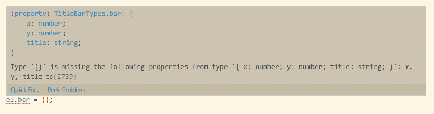](https://res.cloudinary.com/practicaldev/image/fetch/s--1emmKP70--/c_limit%2Cf_auto%2Cfl_progressive%2Cq_auto%2Cw_880/https://github.com/daKmoR/type-safe-webcomponents-with-jsdoc/raw/mastimg/intellisenseBarTyped.png)

我们的类型安全在这里已经起作用了，这很好，但是我们只知道 x 是一个数字；没有其他信息。我们也可以用 JSDocs 来改善这一点。

所以我们定义了一个特殊的类型叫做`Bar`。

```
/**
 * This is a visible bar that gets displayed at the appropriate coordinates.
 * It has a height of 100%. An optional title can be provided.
 *
 * @typedef {Object} Bar
 * @property {number} x The distance from the left
 * @property {number} y The distance from the top
 * @property {string} [title] Optional title that will be set as an attribute (defaults to '')
 */ 
```

这样，我们还可以将某些属性定义为可选的。我们唯一需要做的事情就是分配它。

```
/**
 * @type {Bar}
 */
this.bar = { x: 0, y: 0, title: 'I am dot' }; 
```

[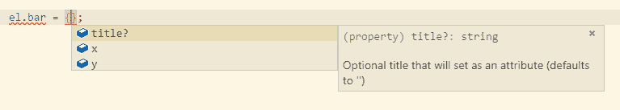](https://res.cloudinary.com/practicaldev/image/fetch/s--a_YGjnlU--/c_limit%2Cf_auto%2Cfl_progressive%2Cq_auto%2Cw_880/https://github.com/daKmoR/type-safe-webcomponents-with-jsdoc/raw/mastimg/intellisenseBarTypedJsDoc.png)

### 给函数参数添加类型

让我们创建一个简单的格式函数，默认允许前缀/后缀，如果你需要更多，你可以覆盖`formatter`。

*注意:这不是一个非常有用的例子，但足以说明问题*

```
format(value = '', { prefix, suffix = '' } = { prefix: '' }) {
  let formattedValue = value;
  if (this.formatter) {
    formattedValue = this.formatter(value);
  }
  return `${prefix}${formattedValue}${suffix}`;
} 
```

同样，通过使用默认选项，它已经知道所有的类型。

[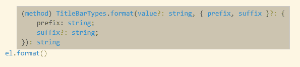](https://res.cloudinary.com/practicaldev/image/fetch/s--o-SB1V4O--/c_limit%2Cf_auto%2Cfl_progressive%2Cq_auto%2Cw_880/https://github.com/daKmoR/type-safe-webcomponents-with-jsdoc/raw/mastimg/intellisenseFormatTyped.png)

因此，您可能只需要添加一点文档。

```
/**
 * This function can prefix/suffix your string.
 *
 * @example
 * el.format('foo', { prefix: '...' });
 */
format(value = '', { prefix = '', suffix = '' } = {}) { 
```

[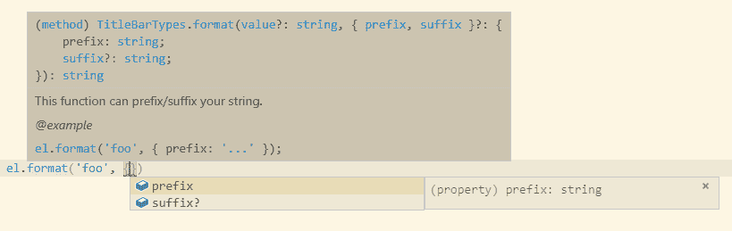](https://res.cloudinary.com/practicaldev/image/fetch/s--7QnBGjLL--/c_limit%2Cf_auto%2Cfl_progressive%2Cq_auto%2Cw_880/https://github.com/daKmoR/type-safe-webcomponents-with-jsdoc/raw/mastimg/intellisenseFormatTypedJsDocsOnlyDescription.png)

或者如果您希望有一个联合类型(例如，允许字符串和数字)。确保只记录你实际需要的东西，因为用这种方法你会覆盖默认类型，这意味着事情会变得不同步。

```
/**
 * This function can prefix/suffix your string.
 *
 * @example
 * el.format('foo', { prefix: '...' });
 *
 * @param {string|number} value String to format
 */
format(value, { prefix = '', suffix = '' } = {}) { 
```

[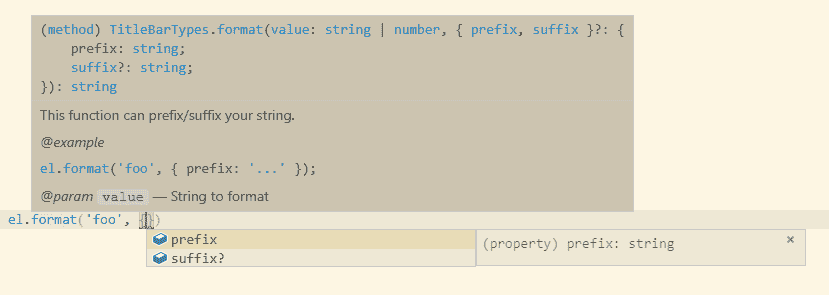](https://res.cloudinary.com/practicaldev/image/fetch/s--FK67mDln--/c_limit%2Cf_auto%2Cfl_progressive%2Cq_auto%2Cw_880/https://github.com/daKmoR/type-safe-webcomponents-with-jsdoc/raw/mastimg/intellisenseFormatTypedJsDoc.png)

如果你真的需要给每个对象选项添加非常具体的描述，那么你需要重复打字。

```
/**
 * This function can prefix/suffix your string.
 *
 * @example
 * el.format('foo', { prefix: '...' });
 *
 * @param {string} value String to format
 * @param {Object} opts Options
 * @param {string} opts.prefix Mandatory and will be added before the string
 * @param {string} [opts.suffix] Optional and will be added after the string
 */
format(value, { prefix, suffix = '' } = { prefix: '' }) { 
```

[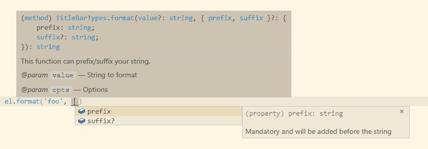](https://res.cloudinary.com/practicaldev/image/fetch/s--JoTUoGnj--/c_limit%2Cf_auto%2Cfl_progressive%2Cq_auto%2Cw_880/https://github.com/daKmoR/type-safe-webcomponents-with-jsdoc/raw/mastimg/intellisenseFormatTypedJsDocExtraAllOptions.png)

### 跨文件导入类型

文件从来都不是孤立存在的，所以可能会出现这样的情况，你需要在另一个位置使用一个类型。
让我们以我们的老朋友待办事项清单为例。
你会有`todo-item.js` & `todo-list.js`。

该项将有一个这样的构造函数。

```
constructor() {
  super();
  /**
   * What you need to do
   */
  this.label = '';

  /**
   * How important is it? 1-10
   *
   * 1 = less important; 10 = very important
   */
  this.priority = 1;

  /**
   * Is this task done already?
   */
  this.done = false;
} 
```

那么我如何在`todo-list.js`中重用这些类型呢？

让我们假设下面的结构:

```
<todo-list>
  <todo-item .label=${One} .priority=${5} .done=${true}></todo-item>
  <todo-item .label=${Two} .priority=${8} .done=${false}></todo-item>
</todo-list> 
```

我们想计算一些统计数据。

```
calculateStats() {
  const items = Array.from(
    this.querySelectorAll('todo-item'),
  );

  let doneCounter = 0;
  let prioritySum = 0;
  items.forEach(item => {
    doneCounter += item.done ? 1 : 0;
    prioritySum += item.prio;
  });
  console.log('Done tasks', doneCounter);
  console.log('Average priority', prioritySum / items.length);
} 
```

上面的代码实际上有一个错误😱
`item.prio`不存在。类型本可以拯救我们，但是怎么救呢？

首先让我们导入类型

```
/**
 * @typedef {import('./todo-item.js').ToDoItem} ToDoItem
 */ 
```

然后我们对它进行类型转换。

```
const items = /** @type {ToDoItem[]} */ (Array.from(
  this.querySelectorAll('todo-item'),
)); 
```

我们已经看到了类型错误💪

[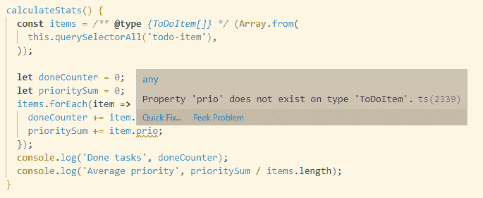](https://res.cloudinary.com/practicaldev/image/fetch/s--MeMn7u6G--/c_limit%2Cf_auto%2Cfl_progressive%2Cq_auto%2Cw_880/https://github.com/daKmoR/type-safe-webcomponents-with-jsdoc/raw/mastimg/importCast.png)

### 使用数据对象创建自定义元素

在大多数情况下，我们不仅希望访问现有的 DOM 并对结果进行类型转换，还希望从数据数组中实际呈现这些元素。

下面是示例数组

```
this.dataItems = [
  { label: 'Item 1', priority: 5, done: false },
  { label: 'Item 2', priority: 2, done: true },
  { label: 'Item 3', priority: 7, done: false },
]; 
```

然后我们渲染它

```
return html` ${this.dataItems.map(
    item => html`
      <todo-item .label=${item.label} .priority=${item.priority} .done=${item.done}></todo-item>
    `,
  )} `; 
```

我们如何使这种类型安全？

不幸的是，简单地通过`@type {ToDoItem[]}`进行造型并不能真正解决问题😭

[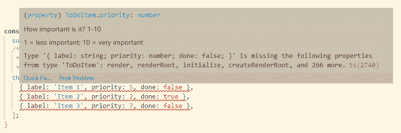](https://res.cloudinary.com/practicaldev/image/fetch/s--v08mfdmR--/c_limit%2Cf_auto%2Cfl_progressive%2Cq_auto%2Cw_880/https://github.com/daKmoR/type-safe-webcomponents-with-jsdoc/raw/mastimg/ElementAsObjectFail.png)

它期望对象是 HTMLElement 的完整表示，当然我们的小 3 property 对象确实遗漏了相当多的属性。

我们能做的就是拥有一个 web 组件的`Data Representation`。例如，定义在 dom 中创建这样的元素需要什么。

```
/**
 * Object Data representation of ToDoItem
 *
 * @typedef {Object} ToDoItemData
 * @property {string} label
 * @property {number} priority
 * @property {Boolean} done
 */ 
```

然后我们可以导入并类型转换它

```
/**
 * @typedef {import('./todo-item.js').ToDoItemData} ToDoItemData
 * @typedef {import('./todo-item.js').ToDoItem} ToDoItem
 */

// [...]

constructor() {
  super();
  /**
   * @type {ToDoItemData[]}
   */
  this.dataItems = [
    { label: 'Item 1', priority: 5, done: false },
    { label: 'Item 2', priority: 2, done: true },
    { label: 'Item 3', priority: 7, done: false },
  ];
} 
```

和🎉web 组件及其数据的类型安全。

[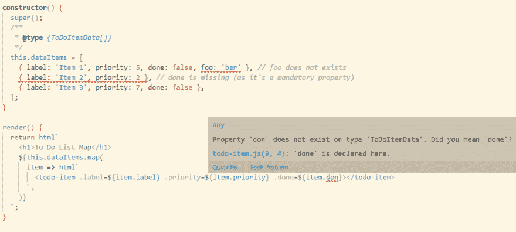](https://res.cloudinary.com/practicaldev/image/fetch/s--S9K999t---/c_limit%2Cf_auto%2Cfl_progressive%2Cq_auto%2Cw_880/https://github.com/daKmoR/type-safe-webcomponents-with-jsdoc/raw/mastimg/ItemDataTypeErrors.png)

## 让你的用户消费你的类型

如果你有类型而不是定义文件，有一件事有点困难，那就是如何使它们可用。

一般来说，你需要让你的用户添加一个像这样的

```
{  "compilerOptions":  {  "target":  "esnext",  "module":  "esnext",  "moduleResolution":  "node",  "lib":  ["es2017",  "dom"],  "allowJs":  true,  "checkJs":  true,  "noEmit":  true,  "strict":  false,  "noImplicitThis":  true,  "alwaysStrict":  true,  "esModuleInterop":  true  },  "include":  [  "**/*.js",  "node_modules/<your-package-name>/**/*.js"  ],  "exclude":  [  "node_modules/!(<your-package-name>)"  ]  } 
```

重要的部分是你的包名的`include`而不是`exclude`。

如果你认为这有点复杂，你是对的。有一些想法可以改善这种流程，但是最近似乎没有得到太多关注——竖起你的大拇指，加入讨论。

对于完整 TypeScript 项目，您可能希望做得更像有 2 个`tsconfigs.json`一个用于林挺，一个用于构建(因为 allowJs 阻止定义文件的自动创建)。

您可以在 Open Web Components 上的 Typescript 设置[中找到关于这种方法的更多细节。](https://open-wc.org/developing/types.html#setup-for-typescript)

## 快速回顾:

有了这些属性/功能选项，你应该可以胜任大多数 web 组件。

*   在构造函数中设置属性的默认值，类型就会自动出现
*   如果您没有默认值，请确保添加`@types`
*   添加 JSDoc 形式的附加信息/文档/示例，以获得更好的开发体验
*   确保对 dom 结果进行类型转换
*   通过控制台/持续集成添加林挺类型，以确保它们是正确的
*   告知你的用户他们如何使用你的类型
*   给[类型脚本 JSDoc 参考](https://github.com/Microsoft/TypeScript/wiki/JSDoc-support-in-JavaScript)添加书签

如果你需要更多关于类型的 JSDoc 特性的信息，请看一下带有 JSDoc 的类型安全 JavaScript。强烈推荐阅读！

完整代码可以在 [github](https://github.com/daKmoR/type-safe-webcomponents-with-jsdoc) 上找到。
想知道你的用户将如何得到它，看看[测试](https://github.com/daKmoR/type-safe-webcomponents-with-jsdoc/blob/master/test/title-bar.test.js)。

## 接下来是什么？

*   这些步骤有助于使 web 组件使用起来更简单、更节省。
*   并不是这里的每样东西对每种情况都有用，肯定会有我们还没有解决办法的情况。
*   如果您遇到任何问题(希望+解决方案),请告诉我们，我们会将它添加到“web 组件类型指南”中。
*   VS Code 正致力于通过 web 组件属性的定义为声明性 html 提供自动完成功能——参见[提案](https://github.com/w3c/webcomponents/issues/776),允许在使用未定义的属性时出现错误:

```
<my-el undefined-attribute> 
```

在 [Twitter](https://twitter.com/daKmoR) 上关注我。
如果你对 web 组件感兴趣，一定要去看看[open-wc.org](https://open-wc.org)。