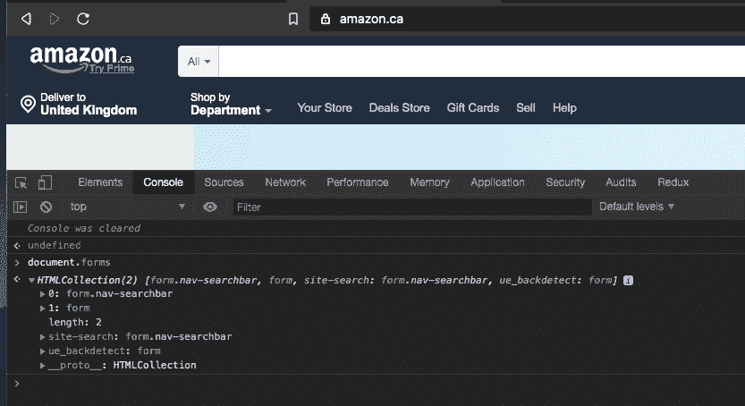
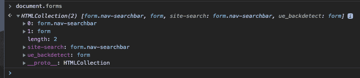
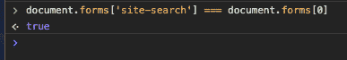
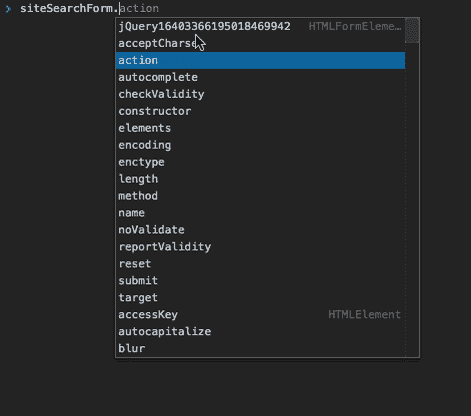
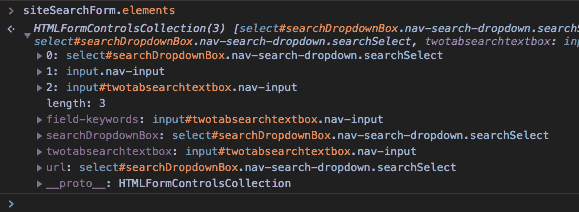

# HTML 表单:回到基础

> 原文：<https://dev.to/nickytonline/html-forms-back-to-basics-1mph>

让我们暂时忘记框架和库。今天我们将讨论`<form />`元素以及在 DOM 中可以用它做的一些事情。

对于年纪稍长的 web 开发人员，您可能对其中的大部分都很熟悉，但是对于较新的开发人员，这可能对您来说是新闻。不管怎样，系好安全带，因为我们要用旧的方式处理表格了。

[](https://i.giphy.com/media/3ohzdIuqJoo8QdKlnW/giphy.gif)

有了像`querySelector`和`querySelectorAll`这样的新 DOM APIs，我们可以通过选择器访问表单，例如`document.querySelector(‘form’);`。您知道您也可以直接从`document`访问表格吗？通过`document.forms`可以获得表格的`HTMLCollections`。继续，我会让你在你最喜欢的编辑器中打开开发工具。很漂亮吧？

假设我们在亚马逊网站上。

[](https://res.cloudinary.com/practicaldev/image/fetch/s--ssqbp-YL--/c_limit%2Cf_auto%2Cfl_progressive%2Cq_auto%2Cw_880/https://dev-to-uploads.s3.amazonaws.com/uploads/articles/gcz82rwr8gldorgtdw73.png)

您有一个如下所示的表单:

```
<form class="nav-searchbar" name="site-search">
...
</form> 
```

Enter fullscreen mode Exit fullscreen mode

好，那么你知道有一个`document.forms`对象。让我们看一看开发工具。

[](https://res.cloudinary.com/practicaldev/image/fetch/s--OEAoLzVo--/c_limit%2Cf_auto%2Cfl_progressive%2Cq_auto%2Cw_880/https://dev-to-uploads.s3.amazonaws.com/uploads/articles/l5iw6ju9j72f65y7st8f.png)

`document.forms[0]`找到我们的表单，页面上还有一个表单，但是`document.forms`上还有两个属性。有`site-search`和`ue_backdetect`。如果我们看看上面表单的标记，我们看到它有一个值为`’site-search'`的`name`属性。那是`document.forms`上的额外属性之一。果然，`document.forms[‘site-search’]`给了我们一个表格。如果我们在开发工具的控制台中执行`document.forms[0] === document.forms[‘site-search’]`，我们将看到它返回 true。

[](https://res.cloudinary.com/practicaldev/image/fetch/s--uLnHduqx--/c_limit%2Cf_auto%2Cfl_progressive%2Cq_auto%2Cw_880/https://dev-to-uploads.s3.amazonaws.com/uploads/articles/qfjpo95l3mht6x2nanr1.png)

如果您还不明白，这意味着您可以通过索引来访问表单，索引代表表单在 DOM 中出现的顺序，但是您也可以通过表单的`name`属性来访问表单。

[](https://i.giphy.com/media/Qh6NZWsFx1G1O/giphy.gif)

好吧，还有更多人。让我们通过在控制台中运行下面的命令来获取对表单的引用。

现在让我们看看表单上有哪些可用的属性。

[](https://res.cloudinary.com/practicaldev/image/fetch/s--HLRXnSl9--/c_limit%2Cf_auto%2Cfl_progressive%2Cq_auto%2Cw_880/https://dev-to-uploads.s3.amazonaws.com/uploads/articles/b6u4q9l1a1lr9hi161hp.png)

好的，我们看到了一些属性，比如`action`，用于指向`GET` / `POST`的 URL，但是当我们在列表中往下看时，有一个属性叫做`elements`。嗯，那会是什么？😉如果我们在开发工具控制台中访问它，我们会得到以下内容:

[](https://res.cloudinary.com/practicaldev/image/fetch/s--LIY5mRB7--/c_limit%2Cf_auto%2Cfl_progressive%2Cq_auto%2Cw_880/https://dev-to-uploads.s3.amazonaws.com/uploads/articles/ldmbv7r0ppsl0sztlxh1.png)

什么？所有的表单输入都在里面！没错，伙计们，你可以通过这个属性访问所有的`<input />`、`<textarea />`等。很酷吧？不仅如此，如果表单输入有一个`name`属性，我们可以做与`document.forms`相同的事情。我们可以通过索引或名称访问表单输入，例如`siteSearchForm.elements[‘field-keywords’]`。

所以访问表单和表单输入可以通过 [`document.forms`](https://developer.mozilla.org/en-US/docs/Web/API/Document/forms) 属性直接在`document`下完成。

最后一个有趣的事实。每个表单元素都有一个`form`属性，该属性是对包含表单元素的`<form />` DOM 节点的引用。

[](https://res.cloudinary.com/practicaldev/image/fetch/s--zvxtrY-F--/c_limit%2Cf_auto%2Cfl_progressive%2Cq_auto%2Cw_880/https://dev-to-uploads.s3.amazonaws.com/uploads/articles/aeirppe0s4qazjc89nr0.png)

希望你喜欢周四的 DOM 回归。

[](https://i.giphy.com/media/3h3ZcimVNfmi0MVvGA/giphy.gif)