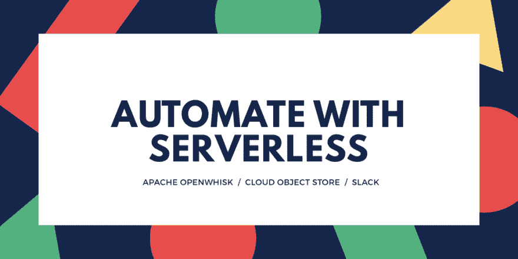
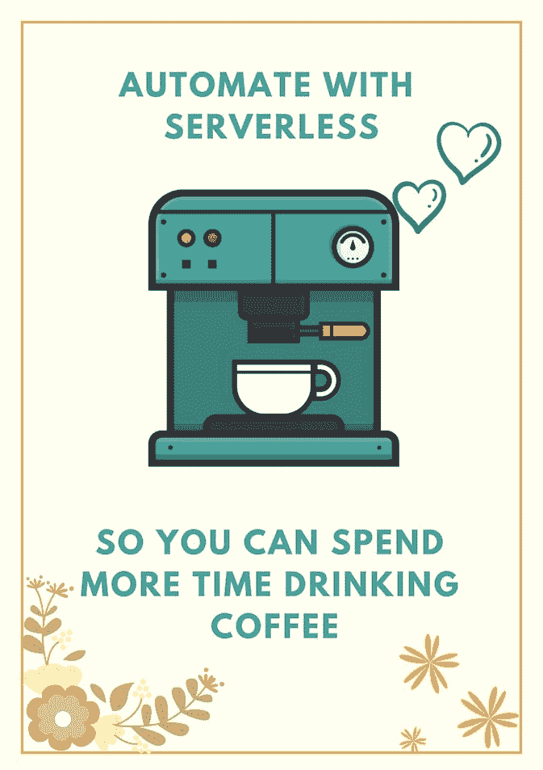

# 让无服务器完成这项工作！

> 原文：<https://dev.to/ibmdeveloper/let-serverless-do-the-work-1m52>

我的一个同事联系我，看我是否可以使用无服务器和 Slack 机器人来自动执行每周状态更新任务。他目前必须在每周一上午 9 点从服务器下载一个 excel 文件，并根据文件内容向团队提供统计数据。这是一个使用 ***周期性触发器*** 和 ***无服务器动作*** 来自动化这个平凡任务的绝佳机会！我使用的是 IBM Cloud Functions 上托管的 Apache OpenWhisk，但是您可以在其他无服务器平台上轻松地遵循相同的方法。

代码分为两个功能/动作

1.  ***read-cos*** :从 IBM Cloud Object Store 中读取文件，并聚集需要与团队共享的统计数据
2.  ***post-slack*** :向 slack 上的给定通道发布消息

我最终创建了一个由以上两个动作组成的序列动作。然后，我链接一个触发器，在每周一上午 9 点调用这个序列！很简单！

该应用程序使用以下解决方案

*   [IBM 云存储](https://www.ibm.com/cloud/object-storage)存储 excel 文件
*   [IBM Cloud Functions](https://www.ibm.com/cloud/functions) 作为托管版的 [Apache OpenWhisk](https://openwhisk.apache.org/) 来存储我们的动作/功能
*   open whish CLI(WSK)从终端创建和测试动作
*   [松弛 API](https://api.slack.com/)

完整的源代码可以在 Github 上找到。此外，我还录制了一段视频，记录了整个过程。看一看…

[https://www.youtube.com/embed/_NHrVbSV3uU](https://www.youtube.com/embed/_NHrVbSV3uU)

您有哪些关于无服务器自动化的故事？请在下面的评论中分享！

想到那一天…

