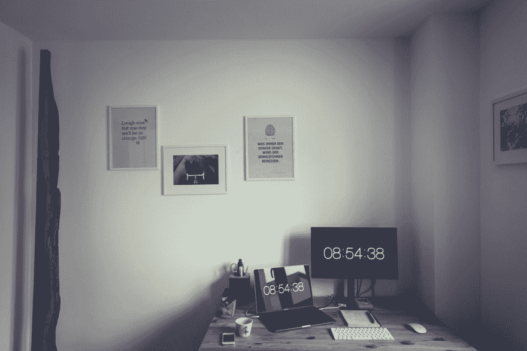
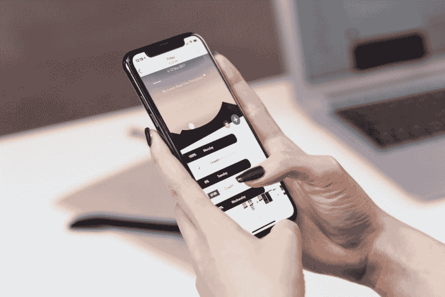

# 鼓励偏远工作场所的健康

> 原文：<https://dev.to/desi/encouraging-wellness-in-a-remote-workplace-17m5>

分布式公司通常很小，即使一个人请病假也会造成影响。通过健康计划让你的员工保持健康——即使你们不能亲自在一起，你们也可以虚拟地激励和授权彼此，这将对他们的生产力、健康和精神状态产生真正的影响。

远程员工还会受到一些独特的影响，这些影响不会对办公室员工产生太大影响。对于天生内向的人来说，这可能是孤立的，他们可能不会自己离开家，他们可能不会注意到对他们心理健康的负面影响(嗨，这就是我！)我还认为，远程办公的员工更有可能感到倦怠，因为你的工作总是在你家里。

 [## 开发者倦怠。我累垮了。

### 泰勒波茨✌️3 月 18 日 193 分钟阅读

#career #beginners #motivation #productivity](/tyler_potts_/developers-burnout-i-burned-out-3n4k)

令人震惊的是，没有很多公司致力于为一个完全分布式的公司创建一个健康计划——我说的“不是很多”是指在几周的研究中，我发现没有一家公司专门从事这项工作。

这意味着公司要自己建立健康计划，这可能是一个积极的方面，因为它允许每个公司根据自己的组织和员工制定自己的政策和计划。

由于分布式公司可以有不同于“传统”企业的结构和支持，我已经包括了 CEO、人力资源经理，甚至员工实施的想法。健康计划可以建立在大的、小的或不存在的预算上——你只需要主动开始！

## 文章不再可用

## 为什么要有健康计划？

让你的员工保持健康是确保他们最佳工作的最佳方式。通过提供一个积极的健康计划，你不仅可以帮助他们感觉良好，做好工作，防止精疲力竭，感觉良好，而且还可以展示自己，使公司受益。

## 3 好东西

在过去的两年里，我每天都和同事分享三件好事。和我一起做这个练习的同事已经随着时间的推移而改变了，但这是一个让你一天都保持积极心态的好方法。有时很难想出任何细节，但这就是重点——当你度过了特别沮丧的一天，你唯一能想到的事情就是咖啡、狗和小睡一会儿，想想一些开心的事情可以帮助你重新调整心态。

你可以通过在项目管理软件中建立一个 Slack 频道或留言板，让任何人分享，甚至可以创建一个提醒机器人，让人们花点时间思考一下。

## 办公预算

完全分散意味着节省传统的公司开支，甚至是像办公空间这样的基本开支。通过提供家庭办公室津贴来回报一些——办公桌、办公椅和键盘或麦克风等设备都是给员工的额外津贴。为了额外促进健康，鼓励购买符合人体工程学的东西:站立式办公桌、摇摆凳、跑步机办公桌或垂直鼠标(鼠标？)都很牛逼。

一些员工在更社会化的环境中成长，所以也可以考虑提供合作办公室或咖啡厅。

#### [这是谁干的:Bandzoogle](https://bandzoogle.com/jobs)

## 在线资源或 EAP

完全远程和分布式的公司肯定熟悉利用 Slack 或 Google Drive 等在线资源，因此将远程服务纳入健康计划也应该是第二天性。

Maven Clinic 是一家面向女性和家庭的在线医疗保健提供商，他们提供与执业护士、妇产科医生、治疗师和精神病医生甚至治疗师的预约，使女性获得医疗保健变得简单方便。保险公司也开始提供“视频访问”——与这些医疗服务提供商之一合作可以在保持你的员工健康和在生病之前进行干预*方面大有帮助。*

向员工提供健康服务的另一种方式是在线治疗提供商，如 [Betterhelp](https://betterhelp.com) 、 [Joyable](https://joyable.com/) 或 [Talkspace](https://talkspace.com) 。提供心理健康服务和治疗表明你真的关心并投资于员工的健康和幸福，这有助于提高生产力。

员工援助计划(EAP)也是向员工提供支持的一种方式。EAP 是几年前我第一次能够去治疗的原因，我将永远不会停止支持它们的有用性和好处。 [Uprise](https://uprise.co/) 是一款专为远程公司打造的 EAP，因此他们确切知道能为您的公司和员工提供什么。

## 精神健康日

...当我们谈到这个话题时，让精神健康成为你的团队的首要任务。

对于任何全职员工来说，带薪病假在任何组织中都是不可协商的，但这是一个不同的话题。

防止精疲力尽应该是你的健康计划背后的旗舰原则之一，一个不问问题的病假政策在其中发挥了重要作用。如果员工觉得他们需要休息一天，因为焦虑、抑郁或其他类似的症状，相信你的员工不会利用这一点，并为他们提供空间，让他们花时间成为快乐、高效的员工。

#### [谁在做这个:缓冲](https://open.buffer.com/benefits-remote-company/)

## 健身预算

有大量的研究表明体育锻炼有很多好处，包括对免疫力和健康的积极影响。为你的员工提供补贴，让他们关注自己的身体健康，这不仅有助于他们的个人健康，还可以减少组织的病假天数。

为员工选择的健身活动提供全额或部分报销，可以帮助他们在努力中获得动力和支持。无论是舞蹈课、健身房会员资格、赛跑、班级会员资格、校内联赛，还是成百上千的其他健身方式，为你的员工补贴这些费用都有很大帮助。不仅身体方面会带来很多好处，而且这也表明你作为一个公司关心他们的热情和成功。

如果不可能提供金钱回扣，即使允许更长的午休时间也是一种显示你优先考虑员工利益的方式。大多数健身课将近 60 分钟，如果你有一个严格的一小时午餐政策，那就切断了大脑休息和白天流汗的能力。提供一个灵活的午休时间，甚至一周一次，可能是一个不错的好处。

支付家庭办公室设置的人体工程学咨询费用，或每月按摩治疗或脊椎按摩治疗的费用，在这方面也有帮助。

一些员工甚至可能选择将工作空间津贴与健身预算结合起来——我的一位前同事经常在当地的攀岩馆工作，因为除了抱石课程之外，他们还有很大的共同工作空间。

#### [谁在做这个:Basecamp](https://basecamp.com/about/jobs)

## 群体冥想

在我的团队中，我们非常幸运地拥有一个非常活跃并且对冥想非常了解的人。在过去的六个月左右的时间里，他主持了每周一次的冥想会议，欢迎并鼓励公司里的任何人加入进来。我每周都期待着它，并能感受到我情绪的显著变化，并专注于我不能参加的那几周。

如果你找不到任何一个感觉舒适的人来领导它，每周留出 20 分钟的休息时间，并使用 StopBreatheThink(有一个免费的 Slack 应用程序)、Headspace 或 calculate 等应用程序来指导你的团队进行一些练习。

## 房屋清洁/洗衣

我认为每个远程员工都在某种程度上反对“在家工作”的刻板印象之一是，我们只是在世界上所有的空闲时间里懒洋洋地整天闲逛，做一些像洗衣或打扫房间这样的事情。我从来不是这样的——我总是不得不故意留出时间来保持东西干净整洁，经常接“第二班”的工作。

为房屋清洁服务或洗衣服务提供津贴或报销，这表明你认可他们付出的辛勤劳动，他们不应该在一天为你付出最大努力的基础上还要承担打扫卫生的第二班工作。(而且，很难不为在家处理第二班的家务感到内疚。)

#### [这是谁干的:MeetEdgar](https://handbook.meetedgar.com/company-handbook-culture-guide/perks-and-benefits/)

## 食物

如果保持你的人民健康是重要的，考虑一个食品交付的选择。像 Instacart 会员或餐盒订阅这样的补充可以带走像购物这样令人讨厌的下班后任务。更有趣的动手活动是，看看他们家附近是否有烹饪班。

一些更偏远的员工可能没有这些选择，所以偶尔送些特别的食物(比如披萨！)可能是他们的拿手好戏。

或者提供每月外出午餐预算——每月报销一两顿午餐，以鼓励员工完全脱离接触，走出家门，哪怕只有一个小时。这种在中午休息的激励措施可以很好地对抗疲劳。收据上必须有他们午休时间的时间戳！

## 个人项目

最后，对员工的生活表现出兴趣并促进健康的最好方法之一是提供津贴来资助他们自己的个人项目。它与教育或工具等其他费用的报销是分开的——把它想象成一个“幸福预算”一些公司可能会选择资助员工自己的梦想假期，支付他们在附近摄影暗房的会员费，或者支付他们编织爱好的费用。这些东西不仅可以帮助他们在办公室之外建立一个网络(阅读:人际互动！)但这也表明，你希望他们成为完整、快乐的人，而不仅仅是高产的员工。

即使是很少的津贴也能显示出你为他们的幸福投资了。

(除了不要掩盖他们的编织爱好。针织*贵*选便宜的，比如无人机飞行。)

#### [谁在做:大卡特尔](https://blog.bigcartel.com/why-we-fund-personal-projects)

向你的员工展示你关心他们的精神和身体健康，这将有助于增强他们的能力并保持他们的健康。病假给雇主造成的损失不亚于 T2 给你们两个人造成的损失。

 [## 你如何处理倦怠🔥？

### John Nyingi ・ Feb 2 '19 ・ 1 min read

#discuss](/j0nimost/how-do-you-handle-burnouts-2e6k)

## 你的公司有健康计划吗？你给过的最好的“额外津贴”是什么？