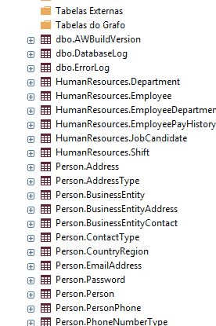
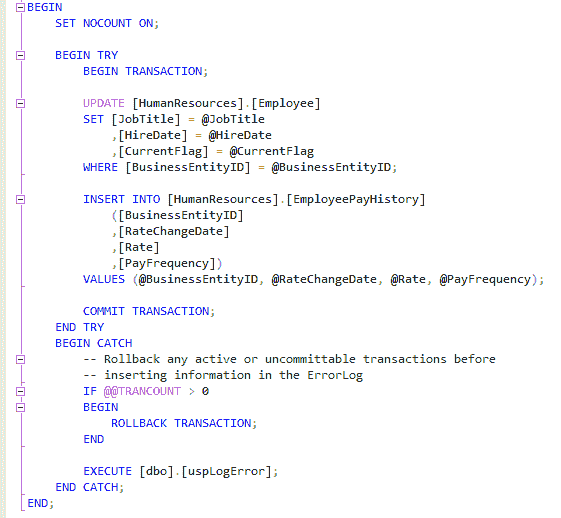

# 如何组织 SQL 遗留数据库

> 原文：<https://dev.to/lleonardogr/how-to-create-an-evolutive-architecure-from-legacy-databases-pt-2-2df9>

这篇文章是讨论如何为 SQL 数据库创建一个好的架构的系列文章的一部分

| [如何使用 GitHub 和 Visual Studio 对 SQL 数据库架构进行版本控制](https://dev.to/lleonardogr/how-to-create-a-scalable-architecture-when-the-businessdomain-logic-is-in-the-database-2bko) |
| --- |
| **如何组织 SQL 遗留数据库** |
| [如何调试 SQL 数据库](https://dev.to/lleonardogr/how-to-create-an-evolutive-architecure-from-legacy-databases-pt-3-32fl) |
| [如何将 SQL 数据库迁移到新版本](https://dev.to/lleonardogr/how-to-migrate-sql-databases-to-a-new-version-server-58mc) |

开始第二部分，更好地使用遗留数据库来创建良好的架构。之前，我介绍了关于数据库在许多公司中如何具有非常古老的设计结构的一般信息，并介绍了用 **GitHub** 对数据库进行**版本控制的简单教程，现在，我将介绍一些关于如何创建良好的建模结构以及创建作业和过程的技巧，以帮助这一过程。**

### 数据库结构

看一看许多数据库项目，它们似乎只有一个责任:**以一种性能方式呈现和存储尽可能多的客户需要的和相关的信息**。事实上，这是支持数据库的主要目标，但似乎组织、一致性、正常形式的充分性、数据结构和程序的易读性等因素并没有得到太多考虑，毕竟，通常是 DBM 负责管理数据库，最终“无人关心”。

但这种方法最终会产生两个问题，或者我们会创建一个庞大的数据库，需要大量的返工，以便以后可以利用它，或者一个手表炸弹，在需要良好性能的情况下会爆炸，这是因为除非我们有 SQL、Oracle、MySQL、MongoDb 或其他数据库服务器的专家，否则我们很少利用这些技术提供的资源来促进工作，所以我将展示一些 SQL 中的示例，以帮助避免创建这样糟糕的数据库。

### 1。计划

组织数据库的一个非常好的资源是使用模式来帮助理解我们所看到的东西。基本上，它允许将数据库分成多个区域，使得将数据库放入多个服务器成为可能，为我们的应用程序提供了灵活性和更高的性能。此外，模式使得读取表变得更加容易，因为它们被更好地分组了。

下一个示例允许我查看哪些表属于哪些域(人员、人力资源、作为日志的辅助表)。

除了使用**茶色**帮助易读性，在这一点上重要的是有一个模式。

### 2。复杂结构

如今，我们在网上越来越依赖于像 JSON 和 XML 这样的模式，产生了 NoSql 和 Sql 数据格式的混合。常见的情况是，我们的数据库中的列不仅仅包含诸如文本和数字之类的原始数据。产品描述可以是 HTML 和 XML 格式，blob 图像、JSON 中的查询结果 API 都是复杂数据只与表中的一列相关的例子。

这些格式将会保留下来，所以使用 JSON 和 XML 可以让您的银行更有条理。新格式使用的一些示例:

*   简化复杂的数据模型
*   存储零售和电子商务数据
*   过程日志和遥测数据
*   存储物联网的半结构化数据
*   简化 REST API 的开发

### 3。记住标准形式

随着时间的推移，我们发现创建完全符合我们要求的数据库的过程是很自然的，这样，我们就可以忘记数据库规范化的重要性。

### 4。构建您的存储过程和作业

许多存储过程最终是以任何方式创建的，没有许多编程规则，更注重快速处理数据，这对任何项目来说都是高风险的。然后是我看到的一些使用程序的提示:

*   使用简单条件和重复结构，如 **IF** 、 **ELSE** 和**而**
*   记得使用**尝试**、**捕捉**、**提交**、**回滚**来防止错误
*   使用 **Print** 记录正在执行的条件结构。
*   尽可能多地注释代码

在代码中拥有良好的结构有利于进化和维护，因此了解和利用尽可能多的服务器可能的资源是很重要的，例如，还有其他有用的 SQL 特性，如使用**视图** **触发器**、**链接服务器**和**文件表**。重要的是要理解，以任何方式运行的数据库最终都会产生许多问题，在下一部分中，我将介绍如何调试 SQL 数据库。

#### 有用的来源:

*   [https://stack overflow . com/questions/45141673/到底什么是数据库模式](https://stackoverflow.com/questions/45141673/what-exactly-is-database-schema)
*   [https://stack overflow . com/questions/246701/what-is-normalization-or-normalization](https://stackoverflow.com/questions/246701/what-is-normalisation-or-normalization)