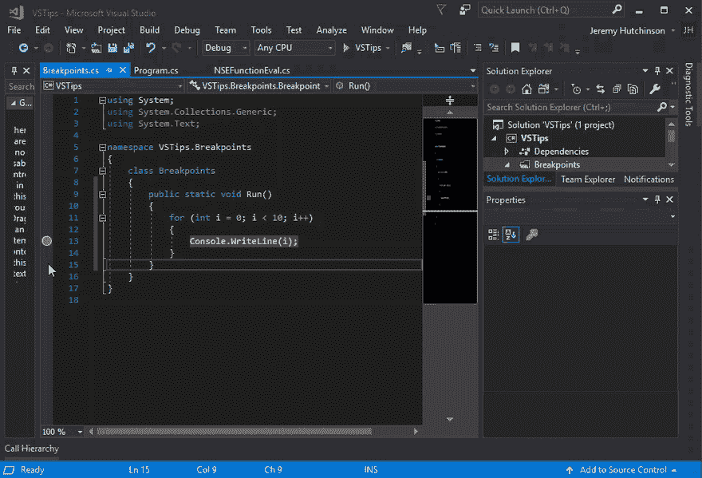
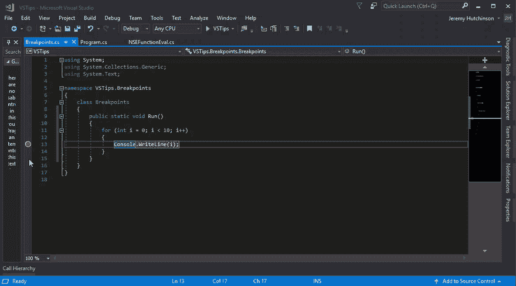
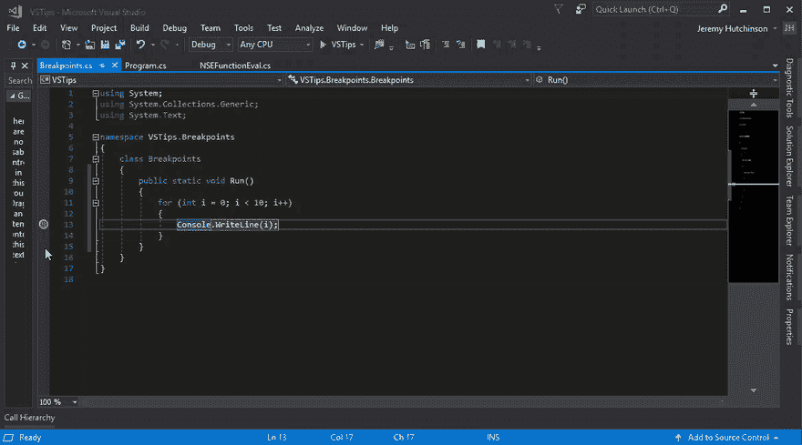

# Visual Studio 提示-断点

> 原文：<https://dev.to/hutchcodes/visual-studio-tips-breakpoints-d5f>

我们大多数人都知道断点以及如何使用它们，但是您应该知道断点的一些未被充分利用的特性。

可以通过多种方式设置简单的断点

1.  将光标移动到要中断的行，然后按 F9 键
2.  右键单击代码行
3.  在檐槽中点击

一旦你设置了一个断点，你可以用它做一些事情。首先，如果你现在不需要断点，但是你认为你可能会回到它，你可以禁用它。

您也可以从 Debug-> Disable all breakpoints 禁用所有断点。当您需要运行并重置，然后重新启用所有断点并再次开始调试时，这很方便。

您还可以根据变量值或任何布尔表达式来设置断点(是的，您可以使用 [No Side Effects](https://dev.to/2019/03/visual-studio-tips-no-side-effects-function-eval/) 格式化程序)。如果您希望在变量值为某个值时中断，这可能会很有帮助。

您还可以根据断点被命中的次数来设置断点的条件。例如，您可能知道第一次遇到断点对您的调试场景来说并不有趣，但之后的每次都很有趣。您可以将点击次数设置为大于 1。

还可以根据名称或 id 将断点筛选到单个线程或排除某个线程。