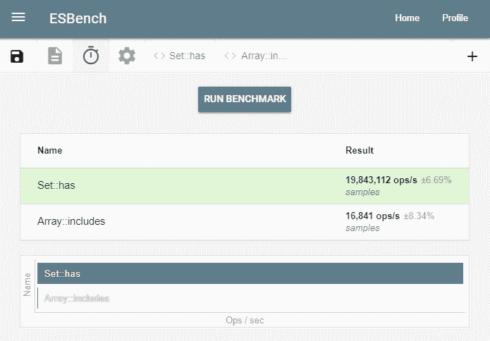

# 数组，慢的部分——我们可以做得更好

> 原文：<https://dev.to/krofdrakula/searching-through-piles-without-breaking-the-bank-pba>

*封面照片由[丹·迪安纳](https://unsplash.com/photos/wnkE42AFNZg)通过 Unsplash*

数组作为一种数据结构有很多优点，这使它们成为某些场景的理想选择，但在其他场景中使用它们的内置方法时，速度会非常慢。在这篇文章中，我们将看看一些替代的数据结构，使工作更加有效。

## 合适的工具适合合适的工作

在上一篇文章中，我们探讨了 Big-O 符号，这样我们就可以更好地决定如何分析我们的算法以获得更好的性能。我们知道，当您通过索引( **O(1)** )访问元素时，数组非常有用，当突变发生在数组末尾( **O(1)** )时，数组也非常有用，因此，如果我们能够避免长数组开头的突变，我们的代码将表现最佳。我们甚至可以通过将数组分割成多个部分来提高`shift()`和`unshift()`的性能，开销是必须分别跟踪每个切片中元素的索引。费力，但是取决于切片的选择，它可能相当快。

不过，有一个操作对于数组来说似乎不可避免地很慢:`indexOf()`及其相关函数`find()`、`findIndex()`和`includes()`。后三个函数只是在内部使用`indexOf()`的便利函数，所以如果我们忽略作为参数传递的函数的开销，它们的性能是相同的。

O(n) 的性能意味着两倍大的数组需要两倍的时间来搜索。我们可以做得更好。好多了。

### 值、变量和引用

你可能知道 JavaScript 有两种类型的值:*原语*和*对象*。通过将这些值赋给一个名称，变量可以引用这些原语和对象。当一个变量引用一个值时，我们说它*包含了对*该值的引用。

```
const a = 3;     // variable `a` points to the primitive value `3`
const b = {};    // variable `b` points to an object instance 
```

Enter fullscreen mode Exit fullscreen mode

原语(如`null`、`undefined`、布尔、字符串和数字)和所有其他对象之间的区别在于原语是不可变的——在同一环境中的任何给定时间都只有一个副本，并且它们在创建后不能更改。无论你创建多少次相同的字符串或数字，结果都是一样的:

```
const a = 3;     // we create the integer `3` and assign it to `a`
const b = 3;     // `3` already exists, so `b` points to the same number

const c = 'hello';   // we create the string 'hello' and assign to `c`
const d = 'hello';   // 'hello' exists, so `d` points to the same string 
```

Enter fullscreen mode Exit fullscreen mode

当我们说我们比较引用时，我们的意思是使用*严格相等* ( `===`)，它比较两个值，看它们是否指向(*引用*)同一个东西。鉴于上述情况，我们应该期望以下情况都是真实的:

`const a = 'hello'; const b = 'hello'; console.assert(a === b); console.assert(a === 'hello'); console.assert('hello' === b); console.assert('hello' === 'hello'); console.log('All good!')`

还和我在一起吗？有趣的地方就在这里:无论何时创建一个对象(即不是原始值)，JavaScript 都会为该对象分配新的内存，不管它包含什么，并返回对它的引用。引用是该值的一种唯一地址，是运行库在需要时知道在哪里查找值的一种方式。

是的，数组也是对象，所以同样的规则也适用。让我们来测试一下:

`const check = (a, b, msg) => console.log(msg + (a === b ? ': yes' : ': no')); const a = {}; const b = {}; const c = b; // check that comparing the value to itself works check(a, a, 'a and a'); check(b, b, 'b and b'); // what about combinations? check(a, b, 'a and b'); check(a, {}, 'a and new'); check({}, b, 'new and b'); // what about newly created objects? check({}, {}, 'new and new'); // what about variables with the same reference assigned? check(c, b, 'c and b');`

即使对象包含具有相同键的相同原始值，它们也将具有唯一的引用。

有两种数据结构很好地利用了这一特性:`Set`和`Map`。

## 使用 [`Set`](https://developer.mozilla.org/en-US/docs/Web/JavaScript/Reference/Global_Objects/Set) 记录参考文献

从概念上讲，引用是 JavaScript 用来在内存中查找特定值的数字。这些数字隐藏在 JavaScript 引擎内部，但是一些内置对象可以访问它们，这使得它们能够提供一些独特的功能。

对于数组，检查其中是否有值需要逐个搜索元素，并查看是否有任何引用与我们正在搜索的元素相匹配。另一方面，`Set`使用引用作为数字，使用二分搜索法树搜索数字。

想象你的桌子上有一大堆手稿。您知道这一堆是有序的，但是有一些页面丢失了，所以您不知道特定页面的确切位置，如果它在这一堆中的话。

你可以偷看一下最上面和最下面的页面，看到它们的范围在 1 到 1000 之间。有人让你检查一下 314 页是否在那堆文件中。你会怎么搜索？

从上到下意味着要走 314 步，所以效率不是很高。但是，如果我们只是选择中间的一堆，看看我们有多接近呢？

让我们把这一堆大致从中间分开，看看下半部分的第一页。我们发现这是第 562 页 :

```
|1.....................562.....................1000|
                        ^ 
```

Enter fullscreen mode Exit fullscreen mode

嗯，这意味着它必须在顶部。我们再来拆分一下上面的部分:

```
|1.........193.........562|
            ^ 
```

Enter fullscreen mode Exit fullscreen mode

好吧，太远了，现在在下半部分:

```
 |193...397...562|
                  ^ 
```

Enter fullscreen mode Exit fullscreen mode

关闭！在这一点上，你会只是翻阅页面，试图找到难以捉摸的 **314** 还是继续分裂这一堆？你怎么知道什么时候停下来？假设拆分一堆文件花费的时间和翻页一样多，哪种方法会更快？如果只劈一堆，你需要几个步骤来完成这个任务？

让我们在代码中测试一下，看看它在逐页搜索中的表现如何:

`// this function creates an array of n numbers with random gaps; // the array is sorted in ascending order and contains unique numbers const createPile = n => { let start = 0; const pile = [start]; while (pile.length < n) { start += 1 + Math.floor(Math.random() * 3); pile.push(start); } return pile; }; // create an array of 1000 numbers const pile = createPile(1000); // uses the list splitting technique described above // returns [steps, index] const smartSearch = (needle, haystack) => { let steps = 0; let min = 0; let max = haystack.length - 1; while (max - min > 1) { steps++; if (haystack[min] === needle) return [steps, min]; else if (haystack[max] === needle) return [steps, max]; const halfway = Math.floor((min + max) / 2); if (haystack[halfway] > needle) max = halfway; else min = halfway; } return [steps, null]; }; // uses a classic for loop from start to finish // returns [steps, index] const naiveSearch = (needle, haystack) => { for (let i = 0; i < haystack.length; i++) { if (haystack[i] === needle) return [i + 1, i]; } return [haystack.length, null]; }; console.log('Smart search [steps, index]', smartSearch(314, pile)); console.log('Naive search [steps, index]', naiveSearch(314, pile));`

根据随机数列表，列表可能包含也可能不包含数字`314`。但是，您会注意到，在寻找(或不寻找)随机数数组中的值所需的步骤数量有明显的不同。

这种方法被称为 [**二分搜索法算法**](https://en.wikipedia.org/wiki/Binary_search_algorithm) 。它属于一个完整的相关算法家族，这些算法具有不同的速度和内存权衡，可以应用于特定情况以获得最大效果。二分搜索法算法的预期复杂度为 **O(log2 n)** 。相比之下，`includes()`使用的是**线性搜索算法**，复杂度为 **O(n)** 。

`Set`是一种数据结构，它使用 JavaScript 引擎中的内部 id 来快速搜索给定的引用，并确定它是否在堆栈中。

那么这与`Array::includes`相比如何呢？下面是我的笔记本电脑上的一个基准测试结果，比较了在 100k 整数数组上使用这两种方法的运行时性能:

[](https://res.cloudinary.com/practicaldev/image/fetch/s--d4FQ8C_v--/c_limit%2Cf_auto%2Cfl_progressive%2Cq_auto%2Cw_880/https://thepracticaldev.s3.amazonaws.com/i/92r2phjrtjutmylcpq81.PNG)

每秒运算次数越高越好。在这个例子中，在 Chrome 73 上，使用一个`Set`来确定所选择的数字是否在数字列表中比**快 1000 倍以上**！这里有一个[到基准](https://esbench.com/bench/5c9a98ce4cd7e6009ef62268)的链接，所以你可以自己测试一下。

当然，这并不总是意味着一种方法要快 1000 倍；这只是意味着在 100k 个元素的规模上，`Set`在这个特定的例子中最终要快 1000 倍。这将取决于您拥有的元素数量，集合越小，差异就越不明显。在大多数情况下，比如说，超过 100 个元素，您应该会看到数量级的改进。

### 什么时候用`Set`

如果您正在解决的问题需要测试一个给定值是否是一组值的一部分，那么这就是适合您的数据结构。这里有几个例子:

`const bunchOfNumbers = [1,1,2,3,5,5,7,9,11,15,17,17,17,3,2,2,5,5]; // create the set const set = new Set(bunchOfNumbers); console.log('does the set contain 5?', set.has(5)); console.log('does the set contain 16?', set.has(16)); // create an array from the set const unique = Array.from(set); // the array created from the set contains only the unique values console.log('unique values', unique);`

## 与 [`Map`](https://developer.mozilla.org/en-US/docs/Web/JavaScript/Reference/Global_Objects/Map) 之间产生联想

如果说`Set`让您可以轻松地在集合中查找引用，那么`Map`让您可以将那个引用与另一个关联起来，本质上就是将从一个值映射到另一个值的*。在我们开始之前，让我们试着用一个数组来模拟这种行为。*

为此，我们将从包含一对值的数组开始，或者一个*元组*。元组是值的有序列表，在我们的例子中，元组将包含一个键和值。

> 注意:为了使这个例子正确工作，元组中的关键字在列表中必须是唯一的，否则重复的关键字将在第一次出现时终止搜索。

```
// we can use any type of reference as the key, so let's create an object
const three = { value: 3 };

// construct the list as an array of arrays
const list = [
  ['one', 'eins'],
  [2, 'zwei'],
  [three, 'drei']
]; 
```

Enter fullscreen mode Exit fullscreen mode

接下来，我们需要一个查找函数。这将接受一个列表和一个键，并返回相关的值，如果没有找到，则返回`undefined`。

```
const get = (list, key) => {
  const pair = list.find(
    (pair) => pair[0] === key
  );
  return pair !== undefined ? pair[1] : undefined;
}; 
```

Enter fullscreen mode Exit fullscreen mode

让我们来测试一下:

`const three = { value: 3 }; const list = [ ['one', 'eins'], [2, 'zwei'], [three, 'drei'], [null, NaN] ]; const get = (list, key) => { const pair = list.find( (pair) => pair[0] === key ); return pair !== undefined ? pair[1] : undefined; }; console.log(get(list, 'one')); // 'eins' console.log(get(list, 2)); // 'zwei' console.log(get(list, three)); // 'drei' console.log(get(list, '2')); // undefined console.log(get(list, { value: 3 })); // undefined console.log(get(list, null)); // NaN`

由于`find()`是线性搜索，其复杂度为 **O(n)** ，远非理想。这就是`Map`真正能带来大人物的地方。

就像`Set`一样，它包含一个`has(key)`方法，该方法基于引用相等返回一个`true`或`false`。它还有一个`get(key)`方法，允许我们通过键获取相关的值。

现在你可能会想，*等等，难道我们不能用对象来做这件事吗？答案是肯定的，只要你所有的键都是字符串，否则你就会失败。如果你想通过字符串进行查找，一个普通的旧对象就可以了:* 

```
const germanNumbers = {
  one: 'eins',
  two: 'zwei',
  three: 'drei'
};

const key = 'one';

germanNumbers[key]; // 'eins' 
```

Enter fullscreen mode Exit fullscreen mode

但是如果您试图分配一个不是字符串的键，这种策略就失败了，因为所有的对象属性查找首先被转换成一个字符串。给定一个对象引用，你将不能查找一个值，因为对象被转换成字符串，导致默认情况下的`"[Object object]"`。你无法区分`2`(一个数字)和`"2"`(一个字符串)。

这就是为什么我们必须将列表实现为键、值对的数组，并使用`===`来比较这些值。`Map`的工作原理是让你指定任何引用作为键，而不仅仅是字符串。

此外，它享有与`Set`相同的速度优势，因此在地图中查找值也具有 **O(log2 n)** 的复杂度。来场快速比赛看看有多快怎么样？

`const get = (list, key) => { const pair = list.find( (pair) => pair[0] === key ); return pair !== undefined ? pair[1] : undefined; }; // create a list of 100k numbers, and create values that represent the number // to 3 significant digits const list = Array(100000).fill(0).map((_, n) => [n, n.toPrecision(3)]); // let's repeat the search this many times const numberOfLoops = 5000; const target = 31415; // time how long it takes to find 3141 using linear search const linearStartTime = Date.now(); for (let i = 0; i < numberOfLoops; i++) get(list, target); console.log( 'it took ' + (Date.now() - linearStartTime) + 'ms to find the value for array' ); // what about a map? const map = new Map(list); const mapStartTime = Date.now(); for (let i = 0; i < numberOfLoops; i++) map.get(target); console.log( 'it took ' + (Date.now() - mapStartTime) + 'ms to find the value for map' );`

[](https://i.giphy.com/media/nC1toglzIfNFC/giphy.gif)

### 什么时候用`Map`

`Map`可用于在无法将键转换为字符串，或者希望避免将其他原始值转换为字符串的情况下保留引用。它的性能比对象属性或者数组索引访问( **O(log2 n)** 而不是 **O(1)** )差一点。

最常见的用例是当您想要创建对象之间的关联时。通常有两种方法可以做到这一点:

*   您可以将关联的值赋给对象的属性；或者
*   您可以生成唯一的 id 并使用它们来查找值。

第一种方法可以创建循环引用，这使得不可能将这些对象转换成 JSON 字符串。第二种方法需要对每个被引用的值进行大量的簿记工作，这通常是不切实际的，实现起来也很慢。

这就是`Map`提供出路的地方:

`// let's create some frozen object so we can't cheat and just assign spouses // as object properties const Jill = Object.freeze({ name: 'Jill' }); const Jane = Object.freeze({ name: 'Jane' }); const John = Object.freeze({ name: 'John' }); const noone = Object.freeze({}); const married = new Map([ [Jill, Jane], // we create an association for Jill -> Jane [Jane, Jill], // we also create a reverse map for Jane -> Jill [John, noone] // John is not married, so John -> noone ]); // who's married to Jill? console.log(married.get(Jill)); // is John taken? console.log(married.get(John));`

我们可以通过创建更多的地图来创建许多不同的关联，并且我们永远不需要修改对象。

### 处理 JSON 数据时要考虑的注意事项

虽然这意味着被映射的值仍然可以被转换成 JSON 字符串，但是`Map`本身不能，因为没有办法序列化引用。在这种情况下，生成惟一的键是必要的，但是跟踪哪些对象需要生成它们的 id 可以由另一个`Map`实例处理，并在`JSON.stringify()`的 [`replacer`](https://developer.mozilla.org/en-US/docs/Web/JavaScript/Reference/Global_Objects/JSON/stringify) 函数中使用。同样，一个 [`reviver`](https://developer.mozilla.org/en-US/docs/Web/JavaScript/Reference/Global_Objects/JSON/parse) 函数可以重新创建地图。我写了一篇关于这个的文章，你可能会觉得有用:

[](/krofdrakula) [## 为了乐趣和利润而扩展 JSON

### Klemen Slavič ・ Oct 28 '18 ・ 6 min read

#javascript](/krofdrakula/extending-json-for-fun-and-profit-3cg3)

## 结论

如果您的数据要求您迭代一个集合，以便检查一个键的存在或查找一个值，您可以考虑使用`Set`和`Map`来代替数组作为数据结构。它们提供了一种快速安全的方法来查找值，如果需要，您可以迭代它们或将它们转换回字符串。

下一次，我们将看看它们的弱引用兄弟姐妹，`WeakSet`和`WeakMap`！