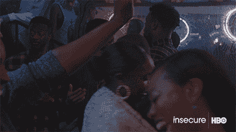
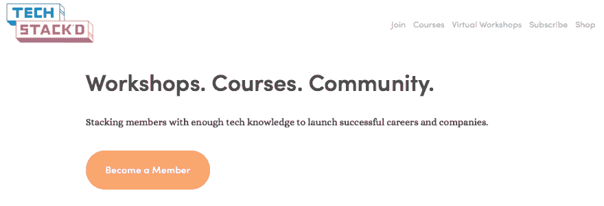
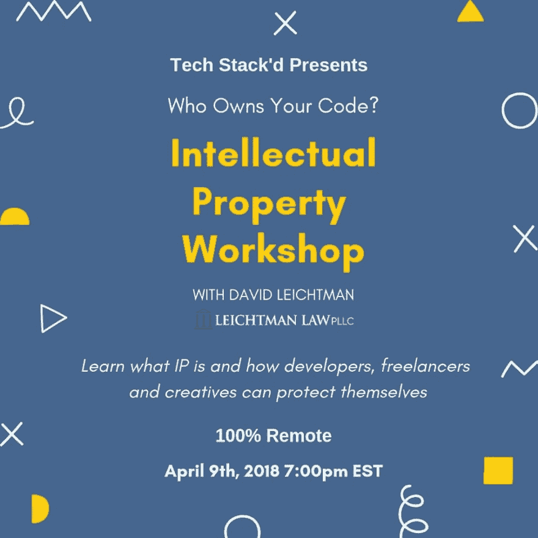

# 你知道谁真正拥有你的代码吗？

> 原文：<https://dev.to/donita/do-you-know-who-really-owns-your-code-4n3a>

嗨，有人在吗？我已经有一段时间没有在这里写文章了，因为面试和**得到了我的第一份软件工程工作(关于那件事的博客文章稍后发布)**

在我的职业转型中，我学到了很多东西，还有很多我需要学习的东西，其中之一就是知识产权。

那句可怕的话，在许多博客文章、训练营甚至大学课堂上都没有提及。

你知道谁真正拥有你的代码吗？

*   你知道吗，许多公司在雇佣合同中都有条款声称拥有你工作内外的所有代码？

*   你知道作为一名开发人员，你有权使用你的代码吗？

*   你想知道如何保护你的专利和代码吗？

*   你是否和一个团队一起工作，却对所有权感到困惑？

所以在过去的几个月里，我有机会和一位名叫布里亚的了不起的女士一起工作。她是谷歌的软件工程师，同时也是 Tech Stack'd 的创始人。

Tech Stack'd 是一个在线社区，面向那些希望在技术领域发展职业的人数不足的成年人，无论是通过创办科技公司还是加入软件工程等技术职业。

Tech Stack'd 提供每月一次的研讨会、每周一次的讨论、指导等等。

这个月，Tech Stack'd 将与 David Leichtman 一起主持一个关于知识产权的研讨会。David Leichtman 是审判律师事务所 Leichtman Law PLLC 的管理合伙人，该事务所成立于 2017 年 4 月，在大型律师事务所执业超过 20 年。他在全国各地的联邦和州法院审理过各种复杂的案件。莱希特曼先生最近首次主持的审判涉及:版权所有权、侵权和有效性索赔。

**在本次研讨会中，我们将回顾:**

*   为什么开发人员知道他们对代码的权利很重要
*   您拥有的与您的公司拥有的
*   你能做些什么来保护你自己和你的工作
*   在项目中与其他人合作时如何确定所有权
*   有多少别人的代码你可以使用并合法赚钱(又名开源)

**还感兴趣？下面报名！**

*   [https://techstackd.typeform.com/to/yiA8om](https://techstackd.typeform.com/to/yiA8om)

这个工作坊将教开发者、自由职业者和创意者什么是知识产权，如何知道和理解你的权利，常见的知识产权错误等等！