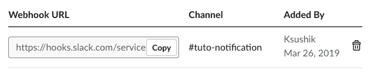
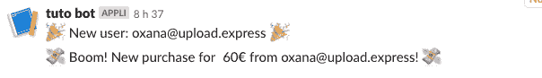

# 用 Ruby on Rails 发送松弛通知

> 原文：<https://dev.to/ksushiva/sending-slack-notifications-with-ruby-on-rails-57m>

在我最近的文章中，我展示了如何在 Ruby on Rails 上集成 Stripe。今天我正在写一个快速教程，关于如何在每次有人在你的网站上购物时得到延期通知。这非常容易和简单。我选择了 Slack notification，因为对我来说，这个平台是与你的合作者即时分享短信的最佳平台。

对于第一部分来说, [Slack 教程](https://api.slack.com/incoming-webhooks)是相当明确的，所以我建议你阅读它，并按照他们说的去做。首先，你需要创建一个 Slack 应用程序，然后激活传入的 Webhooks 并选择一个渠道来发布你的通知。完成 Slack 教程后，导航到你的**应用= >功能= >传入网页挂钩**的页面，你应该会看到这样的内容:

[](https://res.cloudinary.com/practicaldev/image/fetch/s--DW7CvDZD--/c_limit%2Cf_auto%2Cfl_progressive%2Cq_auto%2Cw_880/https://thepracticaldev.s3.amazonaws.com/i/76agc9az74ypqzgdxgwa.png)

现在，转到 Ruby on Rails 应用程序，在终端中打开 nano 编辑器，在加密的 Rails 凭证中添加 web hook URL:

```
$ EDITOR=nano rails credentials:edit 
```

在编辑器中，添加:

```
slack:
   token: 'https://hooks.slack.com/services/your/webhook/url' 
```

使用 Ctrl+X 退出编辑器。

现在在我们的*宝石文件*中添加一个新的宝石:

```
gem 'slack-notifier' 
```

然后，在终端中运行命令“bundle install”来安装它。现在，在*config/initializer 中*创建 *slack_notifier.rb* :

```
module SlackNotifier
  CLIENT = Slack::Notifier.new Rails.application.credentials.slack[:token]
end 
```

最后，最后一步是发送通知。我希望每次有人付钱时，我都能收到一个关于 slack 的通知。因此，我们需要在为用户订阅计划的操作中添加这条消息。如果你跟随[我之前的教程](https://dev.to/ksushiva/integrate-stripe-in-your-ruby-on-rails-app-3dc4)，它将在**订阅**视图中*视图/控制器/计费 _ 控制器. rb* :

```
def subscribe
    #code which you can see in my previous tutorial

      subscription.save
      SlackNotifier::CLIENT.ping "💸 Boom! New purchase for #{subscription.items.data[0].plan.amount / 100}€ from #{current_user.email}! 💸"
end 
```

现在，我还希望在用户注册时有一个通知。为了做到这一点，我们去 *app/models/user.rb* :

```
after_create :notify_slack

  def notify_slack
    SlackNotifier::CLIENT.ping "🎉 New user: #{email} 🎉"
  end 
```

现在我们将测试一切是否正常。因此，我们继续我们的应用程序，创建一个新用户，并为他订阅其中一个计划。您应该会收到两个通知，如下所示:
[](https://res.cloudinary.com/practicaldev/image/fetch/s--0Umd8Z2h--/c_limit%2Cf_auto%2Cfl_progressive%2Cq_auto%2Cw_880/https://thepracticaldev.s3.amazonaws.com/i/o20b258fc51q426rofuw.png)

就是这样！我希望你能经常看到这些通知！