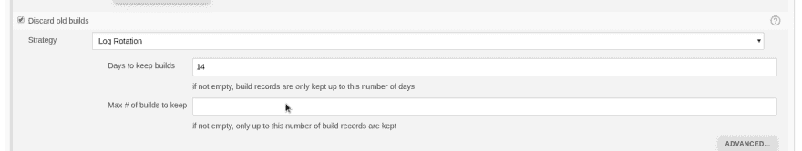

# 詹金斯:你的詹金斯数据目录几乎满了，自动磁盘清理

> 原文：<https://dev.to/setevoy/jenkins-your-jenkins-data-directory-is-almost-full-and-automated-disk-cleanup-297k>

[](https://res.cloudinary.com/practicaldev/image/fetch/s--ZNr-ArAg--/c_limit%2Cf_auto%2Cfl_progressive%2Cq_auto%2Cw_880/https://rtfm.co.ua/wp-content/uploads/2016/01/Jenkins.sh-600x600-e1453134979914.png) 我们有一个带有一堆作业的 Jenkins 实例。

过了一会儿，一个新的警告出现了:

> Jenkins:您的 Jenkins 数据目录/var/lib/jenkins(又名 JENKINS_HOME)几乎满了

使用 [`ncdu`](https://rtfm.co.ua/linux-ncdu-i-pydf-otobrazhenie-informacii-o-zanyatom-svobodnom-meste-na-diskax/) 检查磁盘使用情况，发现有几个作业确实使用了大量空间:

```
root@jenkins-production:/data/jenkins# du -h --max-depth 1 jobs/
..
25G     jobs/APITests
... 
```

并且空间主要由作业日志使用:

```
root@jenkins-production:/data/jenkins# ls -lh /data/jenkins/jobs/APITests/jobs/Projectname/jobs/Stage/jobs/ProjectnameStageAPItests/builds/551/log
-rw-r--r-- 1 root root 77M Mar  1 12:49 /data/jenkins/jobs/APITests/jobs/Projectname/jobs/Stage/jobs/ProjectnameStageAPItests/builds/551/log 
```

有许多旧版本，每个版本都有自己的日志。

解决这个问题最简单的方法是在作业配置中启用*丢弃旧版本*选项:

[](https://rtfm.co.ua/wp-content/uploads/2019/03/Screenshot_20190326_112939-1.png)

显然，它是在 Jenkins v2.х中添加的，因为我记得以前必须在 Jenkinsfiles 中手动描述工作空间清理。

检查现在使用的磁盘:

```
root@jenkins-production:/data/jenkins# du -h --max-depth 1 jobs/APITests/jobs/Projectname/
23G     jobs/APITests/jobs/Projectname/jobs
23G     jobs/APITests/jobs/Projectname/ 
```

保存新设置，运行新版本并在运行后检查磁盘:

```
root@jenkins-production:/data/jenkins# du -h --max-depth 1 jobs/APITests/jobs/Projectname/
7.0G    jobs/APITests/jobs/Projectname/jobs
7.0G    jobs/APITests/jobs/Projectname/ 
```

此外，还有一个[丢弃旧版本](https://plugins.jenkins.io/discard-old-build)插件，它允许更精确地配置清理过程。

### 类似的帖子

*   T002/09/2017 t1t2a zure:将附加驱动器连接到 VM 并迁移 Jenkins t3t
*   <small>2017 年 02 月 08 日</small> [詹金斯:沙盒。RejectedAccessException:脚本不允许使用](https://rtfm.co.ua/jenkins-sandbox-rejectedaccessexception-scripts-not-permitted-to-use/) <small>(0)</small>
*   <small>03/13/2019</small> [詹金斯:将作业导入另一台服务器](https://dev.to/setevoy/jenkins-import-a-job-to-another-server-1dg) <small>(0)</small>
*   <small>03/19/2019</small> [詹金斯:脚本化流水线-生产环境作业确认步骤](https://dev.to/setevoy/jenkins-scripted-pipeline--production-environment-job-confirmation-step-39e0) <small>(0)</small>