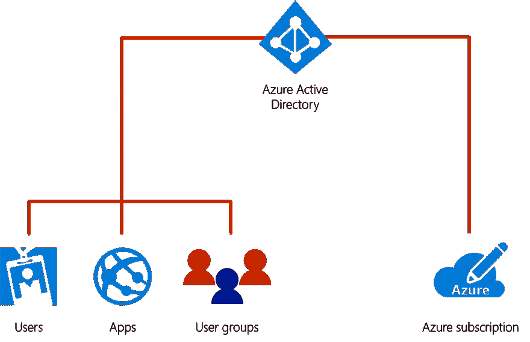
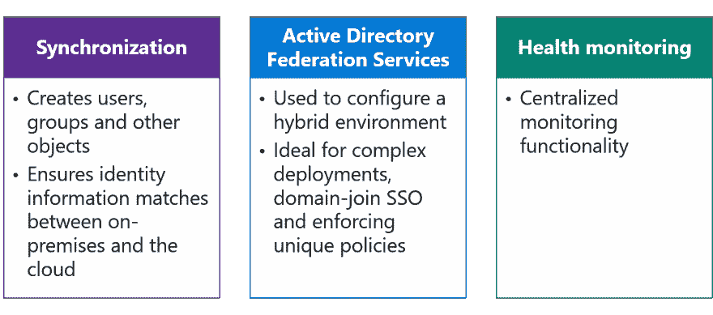

# 使用 Azure AD 实现身份验证

> 原文：<https://dev.to/cheahengsoon/implementing-authentication-with-azure-ad-mb9>

在 Azure AD 中，基于证书的身份验证可用于连接到:

*   由您的组织创作的自定义服务
*   Microsoft SharePoint Online
*   M365 或 MS Exchange
*   Skype for Business
*   Azure API 管理
*   您组织中部署的第三方服务

**Azure 活动目录**

*   身份和访问管理
*   提供
    *   目录服务
    *   身份治理
    *   应用访问管理
*   非常适合本地机器、自带设备和移动设备之间的单点登录
*   Azure 广告应用程序库中的数千个应用程序

**Azure AD vs. Active Directory 域服务**
**Azure Active Directory**

*   身份即服务
*   不是云中的域控制器
*   提供可选的目录服务
*   支持 SAML、WS-Federation 和 Oauth
*   可以与 Active Directory 域服务同步

**活动目录域服务**

*   提供身份服务
*   全功能域控制器
*   使用组织单位(ou)和组策略对象(GPO)管理机器

**Azure AD Connect**

*   将本地目录与 Azure Active Directory 集成
*   由三个主要成分组成: 