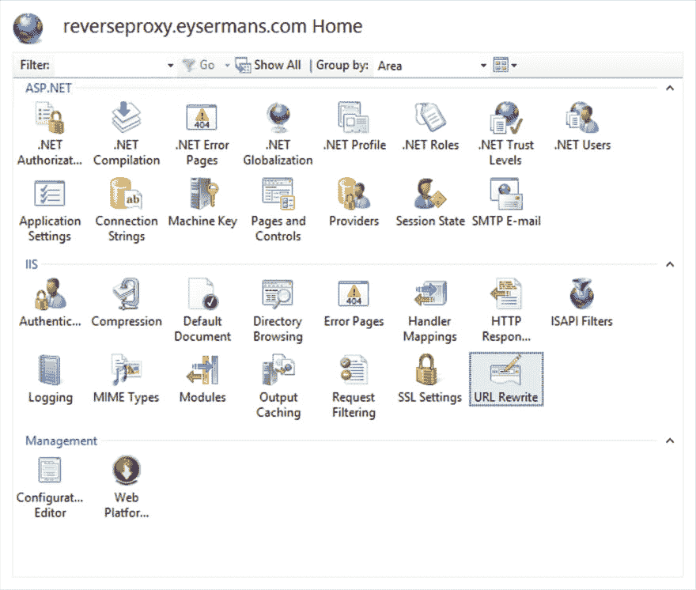
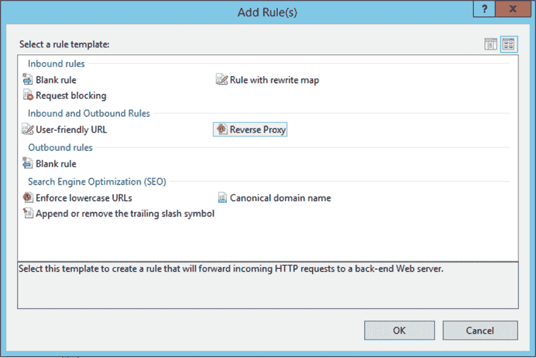
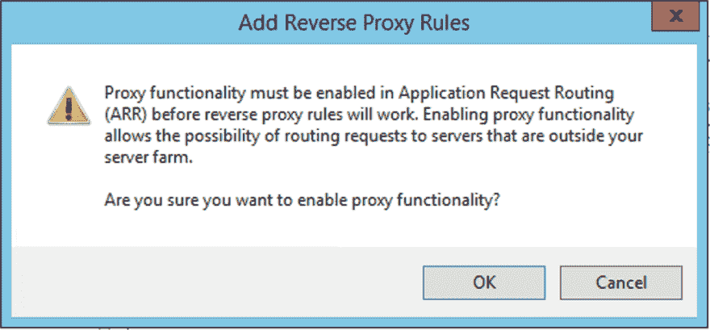
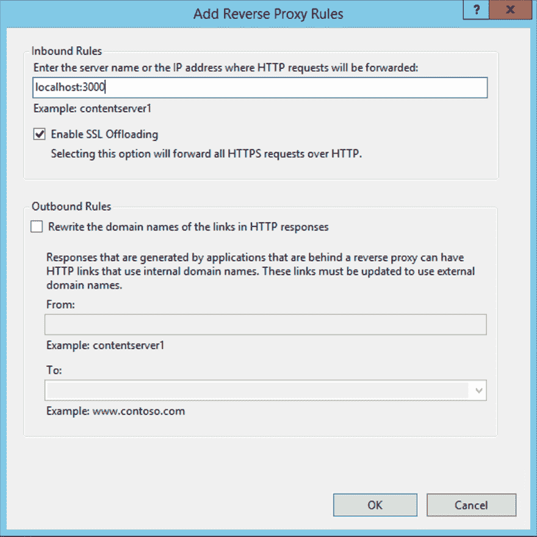
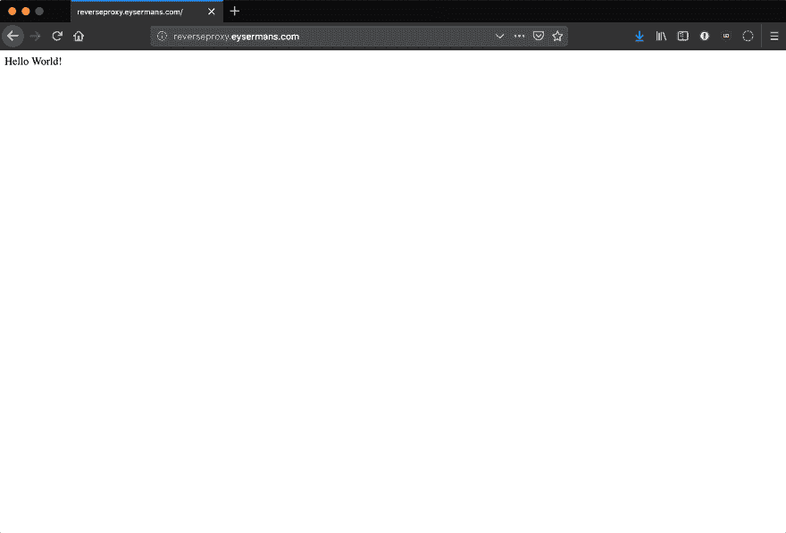

# 使用 IIS 作为反向代理在 Windows 上托管 Node.js 应用程序

> 原文：<https://dev.to/petereysermans/hosting-a-node-js-application-on-windows-with-iis-as-reverse-proxy-397b>

不幸的是，许多公司仍然受困于 Windows 服务器。没有人因为选择微软而被解雇，对吧。作为开发人员，这可能会令人沮丧，因为选择服务器技术通常仅限于 ASP.Net。我已经尝试过使用 [iisnode](https://github.com/Azure/iisnode) 在 Windows 服务器上托管 Node.js 应用程序。但是启动和运行是一件痛苦的事情，设置正确的权限是一件耗时的工作。微软已经控制了项目的发展，但我感觉它不再积极了。有几个 Stackoverflow 问题会让人们放弃配置它。

所以我想走另一条路。如果我们可以使用 Node.js web 服务器并使用 IIS 作为反向代理将流量路由到 Node.js web 服务器会怎么样？我们可以抛弃 iisnode，希望有一个更可靠的解决方案来托管 Node.js web 应用程序。

首先我们需要一个小的测试项目，这个 [hello world Node.js Express 应用](https://medium.com/@adnanrahic/hello-world-app-with-node-js-and-express-c1eb7cfa8a30)将做:

```
var express = require('express');
var app = express();

app.get('/', function (req, res) {
  res.send('Hello World!');
});

app.listen(3000, function () {
  console.log('Example app listening on port 3000!');
}); 
```

为了能够运行它，您需要在您的服务器上安装 Node.js。安装完成后，您可以通过打开命令提示符并键入`node app.js`来运行测试应用程序。如果一切顺利，您现在应该能够通过本地服务器上的`http://localhost:3000`访问测试应用程序。

为了[将 IIS 配置为反向代理](https://tecadmin.net/set-up-reverse-proxy-using-iis/)，您需要安装 [URL 重写扩展](https://www.iis.net/downloads/microsoft/url-rewrite)和[应用请求路由扩展](https://www.iis.net/downloads/microsoft/application-request-routing)。URL 重写扩展允许您定义规则来启用更易于用户记忆和搜索引擎查找的 URL。应用程序请求路由扩展支持可伸缩特性:负载平衡、基于规则的路由等等。

一旦安装了这些扩展，您就可以开始配置 IIS 了。通过打开运行窗口并键入`inetmgr`命令来打开互联网信息服务(IIS)管理器。选择要为其设置反向代理的站点，并打开 URL 重写扩展。

[](https://res.cloudinary.com/practicaldev/image/fetch/s--dZf7ugTP--/c_limit%2Cf_auto%2Cfl_progressive%2Cq_auto%2Cw_880/https://eysermans.cimg/articles/hosting-a-nodejs-application-on-windows-with-iis-as-reverse-proxy/url_rewriting_extension.png)

添加新规则并选择`Reverse Proxy`模板。

[](https://res.cloudinary.com/practicaldev/image/fetch/s--JXDoCiD1--/c_limit%2Cf_auto%2Cfl_progressive%2Cq_auto%2Cw_880/https://eysermans.cimg/articles/hosting-a-nodejs-application-on-windows-with-iis-as-reverse-proxy/add_rule.png)

当系统提示时，启用代理功能。

[](https://res.cloudinary.com/practicaldev/image/fetch/s--UQmIV9It--/c_limit%2Cf_auto%2Cfl_progressive%2Cq_auto%2Cw_880/https://eysermans.cimg/articles/hosting-a-nodejs-application-on-windows-with-iis-as-reverse-proxy/enable_proxy_functionality.png)

将 node.js 网站的地址添加到反向代理规则中，不要忘记包括端口。

[](https://res.cloudinary.com/practicaldev/image/fetch/s--FdR-iJ29--/c_limit%2Cf_auto%2Cfl_progressive%2Cq_auto%2Cw_880/https://eysermans.cimg/articles/hosting-a-nodejs-application-on-windows-with-iis-as-reverse-proxy/add_reverse_proxy_rules.png)

一旦添加了规则，反向代理配置就会起作用。

[](https://res.cloudinary.com/practicaldev/image/fetch/s--1uiVpMeH--/c_limit%2Cf_auto%2Cfl_progressive%2Cq_auto%2Cw_880/https://eysermans.cimg/articles/hosting-a-nodejs-application-on-windows-with-iis-as-reverse-proxy/working_reverse_proxy.png)

最后需要的是运行 Node.js 应用程序的可靠方式。通过命令提示符启动它并保持窗口打开不是一个持久的解决方案。如果有人登录服务器并关闭窗口，网站就会关闭。 [pm2](http://pm2.keymetrics.io/) 是 Node.js 进程管理器，它可以用来保持应用程序运行。使用 npm 安装 pm2 很容易:

```
npm install -g pm2 
```

安装后，我们可以使用这些命令来管理我们的流程:

*   `pm2 start app.js`:启动我们的 Node.js 应用程序
*   `pm2 stop`:停止正在运行的进程
*   `pm2 restart`:重启正在运行的进程
*   `pm2 list`:列出所有正在运行的进程

pm2 可以做得更多，查看他们的网站了解更多信息。我自己的博客目前正在这个平台上运行。

这是我自己的博客中的一篇交叉文章。