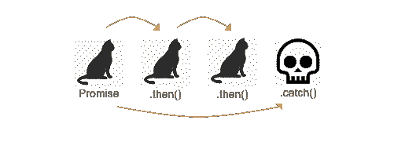

# 以教育的方式解释承诺

> [https://dev . to/vincenussouza/explain-promises-de-uma-form-2pjk](https://dev.to/viniciusersouza/explicando-promises-de-uma-forma-didtica-2pjk)

## 导言

在我们编写代码的同时，我们每天都会无意中遇到我们所说的‘t0’承诺(或承诺)。承诺对象和日常承诺之间的相似性比我们在处理它们所经历的流时想象的要大。

当我们向某人许下承诺时，我们能否兑现这个承诺。在 **JavaScript** 中，这种行为非常相似。在我们订立承诺时，这种回报可能会实现，也可能不会实现——因此，我们就对这些案件(“T0”或“T1”)作出决定。

## Iniciando pelo básico

假设我答应我的猫每天早上喂它们。

在
我们会有:

```
let promessaDeAlimentarGatos = new Promise(function(resolve, reject){
    let poteCheio = true;

    if(poteCheio) {
        resolve('Buchinho cheio');
    } else {
        reject('Fome');
    }
}); 
```

**Resultado:** `'Buchinho cheio'`。

和现实生活一样，在`JavaScript`我们有两个名为`resolve`和`reject`的返回。在上例中，由于`poteCheio`是**真的**，我的猫又长满了一天的肚子，很懒。

因此，在尊重条件的情况下，以`Buchinho cheio`讯息解决了`Promise`。如果`poteCheio`是**假**的话，我的猫就会饿了，a `Promise`会以`Fome`的讯息拒绝。

## 真正的用处在哪里

由于`Promise`的结果直接取决于是否符合条件，所以我们有一个妥善运用这一结果的方法。

我们的`Promise`现在已经存在，所以我们可以根据所得结果运行并显示消息，如下所示:

```
promessaDeAlimentarGatos.then(function(result){
    console.log('Meus gatos estão com ', result)
}).catch(function(result) {
    console.log('Meus gatos estão com ', result);
}); 
```

通过对该代码进行分区，我们有以下流:

1.  履行诺言
2.  如果返回问题得到解决(“T0”)，我们的功能`.then`将被激活，并向我们显示消息`'Meus gatos estão com Buchinho Cheio'`。
3.  如果返回被拒绝(“T0”)，我们的功能`.catch`将被激活，并向我们显示消息`'Meus gatos estão com Fome'`。

而正是`.then`和`.catch`功能给我们带来了使用`Promises`的绝佳适用性。

## 恩卡迪安多的承诺

我现在有三只猫。比方说，我想展示一下哪些猫我已经装满了口粮罐子。

因为我只是一个人，所以我不得不沿着一条线填满所有的罐子。

本活动可转录为

```
let alimentarLuna = function() {
    return new Promise(function(resolve, reject) {
        resolve('Alimentei a Luna');
    });
}

let alimentarJulieta = function(message) {
    return new Promise(function(resolve, reject) {
        resolve(message + ', e' + alimentei a Julieta');
    });
}

let alimentarGatarina = function() {
    return new Promise(function(resolve, reject) {
        resolve(message + ' e ' + alimentei a Gatarina.');
    });
} 
```

上面有三个承诺让我们知道喂了什么猫。但要做到这一点，我必须先把第一只猫的罐子装满，然后再把它放进第二只猫的罐子里。

我们可以把这个抄录成如下──

```
alimentarLuna().then(function(result){
    return alimentarJulieta(result);
}).then(function(result){
    return alimentarGatarina(result);
}); 
```

结果将打印在屏幕上展开承诺结果

`Alimentei a Luna, e alimentei a Julieta e alimentei a Gatarina.`

承诺的结果串连起来，在过程结束时产生了完整的句子。

## 为什么会有承诺呢？

为此，我们需要理解`JavaScript`是一种语言**【单线程】**，也就是说，它只工作一条路─*在一定时间内只运行一行代码*。

为了使我们的程序不会因服务响应而停滞不前，我们制定了**承诺**——滚动这一行代码，方便地通知我们本次运行何时结束。

这一讨论可能会更深入，但为了让我们继续讨论，我将在结束发言时总结说，承诺是存在的，以便“`JS`中的程序能够在不停止整个应用程序的情况下检索服务信息。

## Entendendo promise . all e promise .筹

承诺不一定要按顺序滚动。以此为例，我们可以和我家的另外 2 个居民一起分担喂猫的任务——以的形式同时进行。

我们会这样处理:

```
Promise.all([alimentarLuna(), alimentarJulieta(), alimentarGatarina()]).then(function(){
    console.log('Todas as gatas foram alimentadas');
}); 
```

比如说，随着居民活动的结束出现了新的活动，我们可以使用`.raise`来通知这些步骤何时结束。

```
Promise.raise([limparCaixa(), varrerPelos(), trocarAgua()]).then(function(){
    console.log('Um morador finalizou uma das atividades');
}); 
```

## 结论

简而言之，`Promises`就像我们的承诺一样起作用。它们可能会实现，也可能不会实现，因此我们必须进行谈判，以实现这一结果的积极或消极结局。

[](https://res.cloudinary.com/practicaldev/image/fetch/s--7LTlaP-7--/c_limit%2Cf_auto%2Cfl_progressive%2Cq_auto%2Cw_880/https://thepracticaldev.s3.amazonaws.com/i/lgdi4t57eb88bw2pnkae.png)

用`.then`和`.catch`来处理连锁的承诺，是一个承诺真正闪耀的那种时刻之一。

我希望这篇短文能帮助你，如果我的话有什么不对的地方，请随时纠正我。我将尽可能更新该出版物。