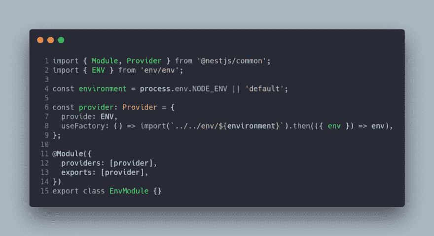
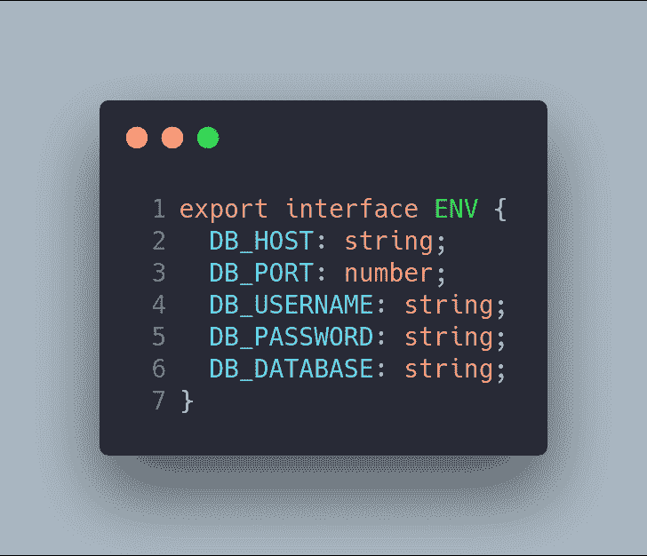
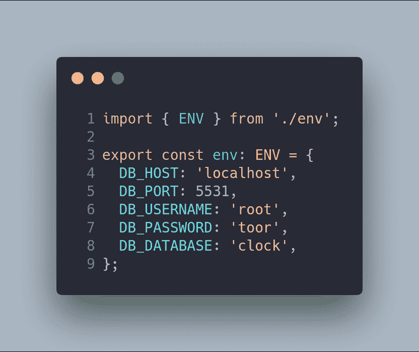
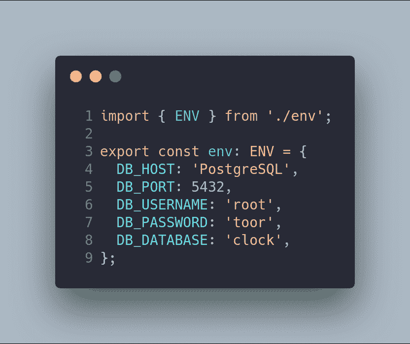
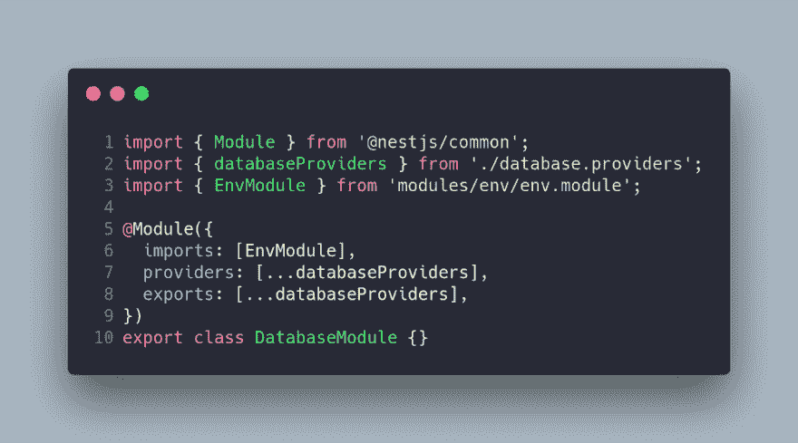
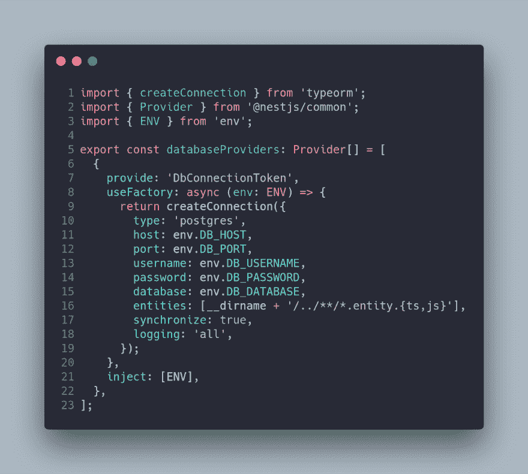
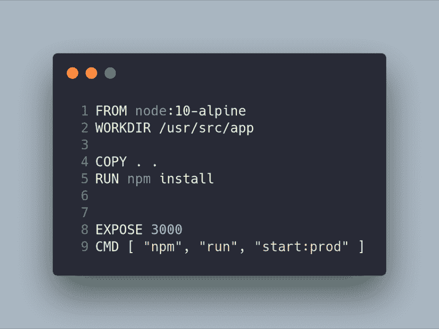
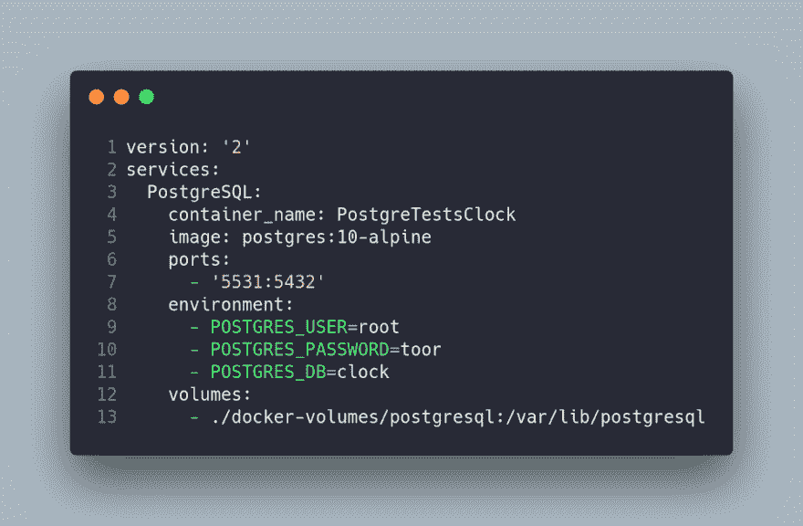
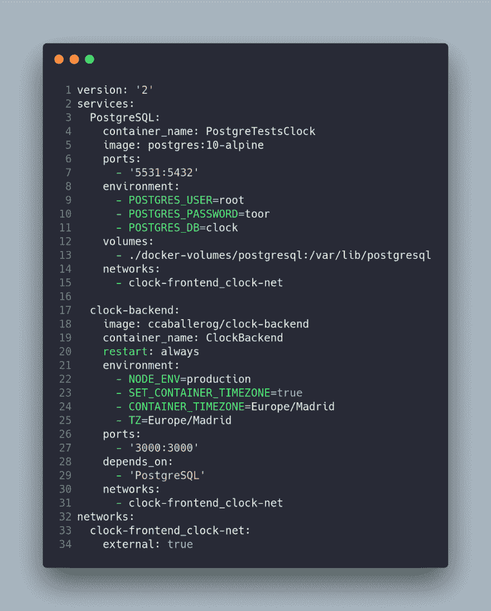

# 第 7 部分。部署后端(nesjs):dock/docker-compose

> 原文：<https://dev.to/carlillo/part-7-deploy-backend-nestjs-dockerdocker-compose-3cmb>

这篇文章是我正在描述的一个上下班打卡系统的系列文章的一部分
如果你想了解更多，你可以阅读下面的文章:

*   第一部分。上下班打卡系统:图表。
*   第二部分。上下班打卡系统:基本后端— AuthModule。
*   第三部分。上下班打卡系统:基本后端—用户模块。
*   第四部分。上下班打卡系统:基本后端应用模块。
*   第五部分。打卡系统:种子数据库和迁移数据
*   第六部分。上下班打卡系统:基本前端。
*   第七部分。打卡/下班系统:使用 docker/docker-compose 部署后端(nestJS)。
*   第八部分。上下班打卡系统:使用环境部署前端(角度 2+)。
*   第九部分。测试:后端测试—单元测试—服务
*   第十部分。测试:后端测试—单元测试—控制器
*   第十一部分。测试:后端测试— E2E 测试
*   第十二部分。测试:前端测试—单元测试
*   第十三部分。测试:前端测试—集成测试

### 简介

当您开发软件应用程序时，您经常在开发环境中编码。然而，迟早，你将需要在生产环境中部署你的应用，同时在你的开发环境中继续开发。

node.js 中有几个关于环境变量管理的解决方案，但是最流行的库是 [dotenv](https://www.npmjs.com/package/dotenv) (可以在 [twilio](https://www.twilio.com/blog/2017/08/working-with-environment-variables-in-node-js.html) 中阅读简单的教程)。

在我们的例子中，我们已经使用 node.js 框架 [NestJS](https://www.nestjs.com/) 开发了我们的后端，它有一个使用 dotenv ( [NestJS-Config](https://github.com/nestjs-community/nestjs-config) )管理环境变量的模块。然而，我开发了自己的 nestJS 模块来管理节点的环境变量，而不使用外部库。

最后，使用 [docker 的容器](https://www.docker.com/)部署我们的代码，我们将从我们的代码中创建一个映像，并使用 [docker-compose](https://docs.docker.com/compose/) 。

### 环境的变量

第一步是开发我们的`EnvModule`，它从一个文件中加载自定义变量。因此，知道可以使用`NODE_ENV`(或任何变量)传递什么样的 it 环境文件是非常重要的。第二步是修改`DatabaseModule`来加载来自`EnvModule`的信息。将使用`docker-compose`传递`NODE_ENV`变量。

### 包装模块

我开发了一个`EnvModule`，它配置了一个`environment`变量，这个
要么是`default`要么是`NODE_ENV`内容。下一步是定义一个
提供者，它使用一个工厂从环境
文件中返回`env`变量。此提供程序被导出以在其他模块中使用。

文件中使用的接口是在`env/env.ts`文件中显示的接口。这个配置是关于数据库及其密码的。让开发中的密码和生产中的密码不同是非常重要的，想象一下公司中的每个人都因为这样的错误而知道了数据库的根密码。

因此，`default`环境将是开发环境，`production`将是生产环境。

注意，`DB_HOST`变量在默认环境中是经典的`localhost`，当环境被设置为生产环境时，它的值是包含`PostgreSQL`数据库的机器的名称(这个名称是由容器指定的)。

### 数据库模块

`EnvModule`导出`ENV`提供者，可以由`DatabaseModule`导入，用于配置`databaseProvider`。因此，第一个修改是`DatabaseModule`，它导入了模块。

因为`EnvModule`正在导出提供者，所以它可以被注入到`DbConnectionToken`提供者中，后者接收`ENV`作为参数。不是`hard-coding`提供者中的配置，而是由服务提供(从环境文件中读取)。

此时，如果您想要在环境之间切换，可以通过运行以下命令来实现:

### 部署:Docker 和 Docker-撰写

这个想法是在开发和生产中使用相同的环境。在这种情况下，Docker 是完美的工具，因为它允许我们配置不同的容器，这些容器使用我们的`EnvModule`来切换配置。我们需要构建自己的图像，这将是一个 docker 容器，之后，这个图像将使用 Docker-compose 进行编排。

### 码头工人

我们的`dockerfile`文件基于`node:10-alpine`图像，因为项目不需要系统库。这个映像只是复制源代码并安装依赖项(使用`npm install`)。

当您构建 docker 映像时，建议使用一个`.dockerignore`文件，就像您使用`.gitignore`一样。

### 码头工-化合物

在我们的项目中，我们有两个不同的 docker-compose 文件。第一个用于我们的开发环境，因为 docker-compose 只管理 DBMS Postgres，这是由于使用这个 npm 脚本:(`npm run start:dev`)在我们的平台上运行代码。注意，我们的服务是基于`postgres:10-alpine`的。

第二个脚本更复杂，因为在本例中，我们有一个名为`clock-backend`的容器，它基于在上一步中构建的`ccaballerog/clock-backend`图像。`clock-backend`容器需要知道`PostgreSQL`容器。为此，我们可能需要一个 DNS 服务器。然而，docker-compose 通过启用`networks`关键字的使用简化了这项任务。注意，两个容器都定义了相同的网络(`clock-frontend_clock-net`)。

`clock-backend`容器有一个环境区域，其中我们将时区和`NODE_ENV`都定义为生产(加载我们的环境文件)。

### 要部署的 Shell 脚本

我们流程的最后一步是自动化容器的构造和执行。我有两个脚本来完成这项任务；第一个脚本创建图像(删除图像，如果有图像的话)，第二个脚本使用 docker-compose 部署代码。

 
为图像键入标题(可选)

### 结论

在这篇文章中，我解释了如何使用 docker 和 docker-compose 用 NestJS 部署后端。这段代码最有趣的特性是，我们可以加载自己的环境变量，在开发和生产环境之间切换。

* * *

最初发布于 2019 年 2 月 1 日 [www.carloscaballero.io](https://carloscaballero.io/part-7-deploy-docker-docker-compose/)