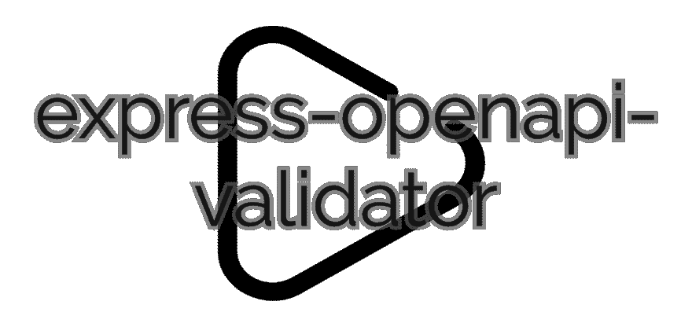
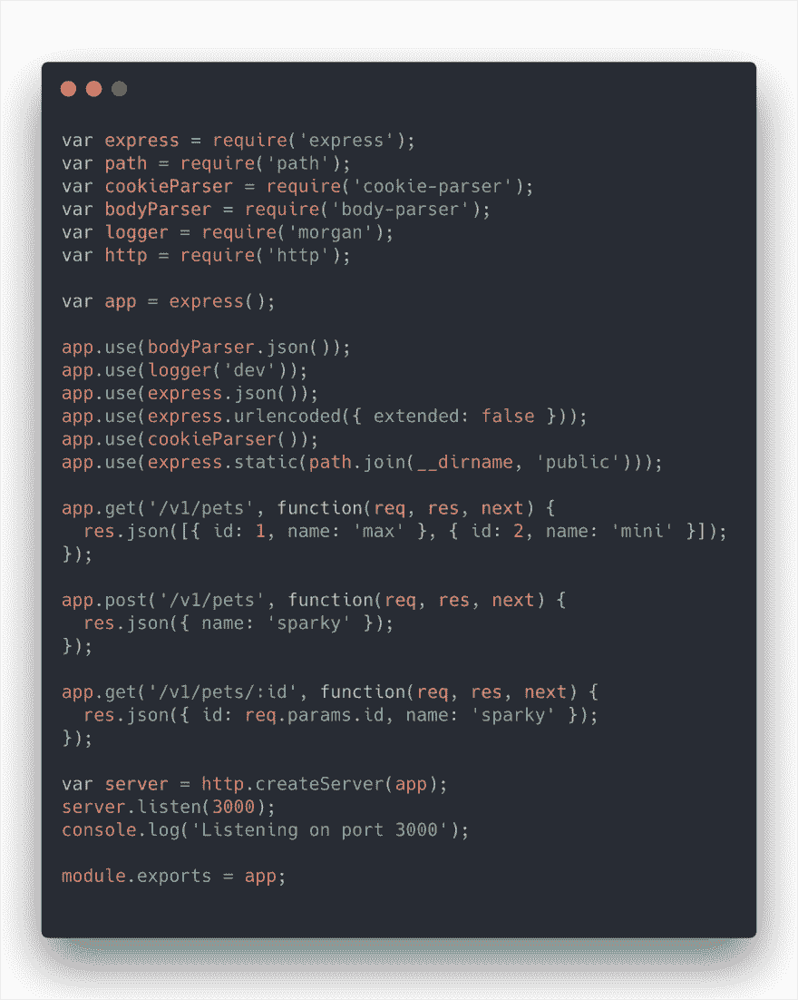
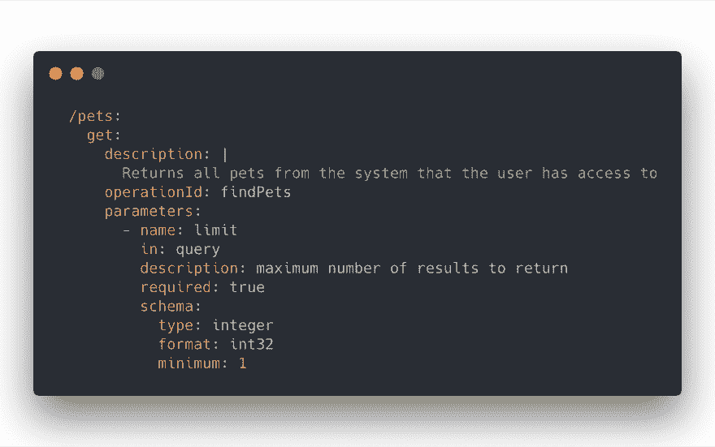
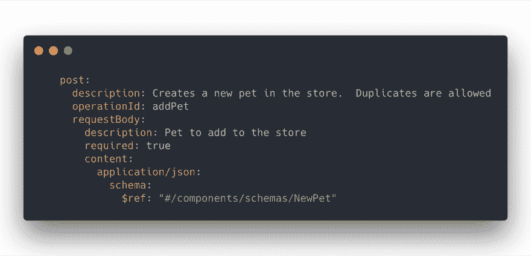
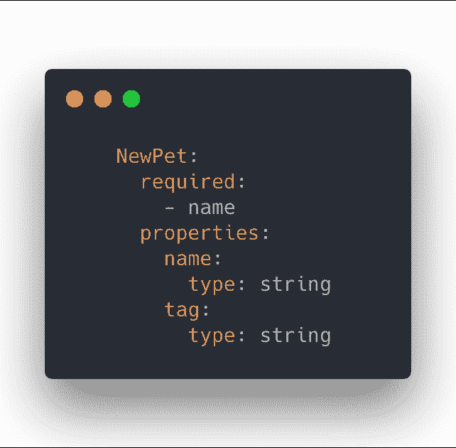
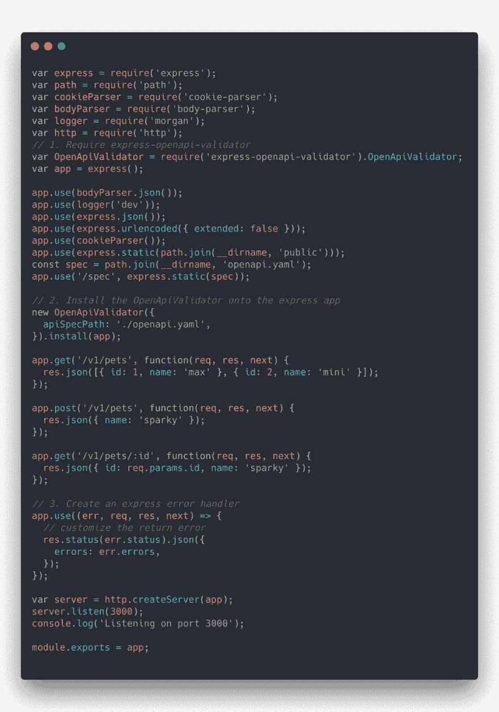
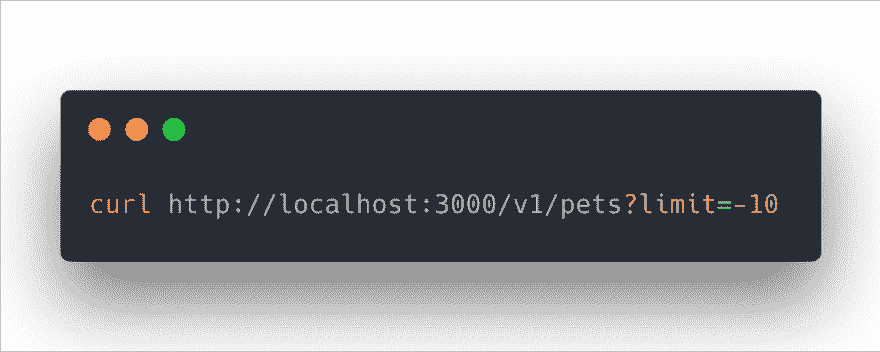
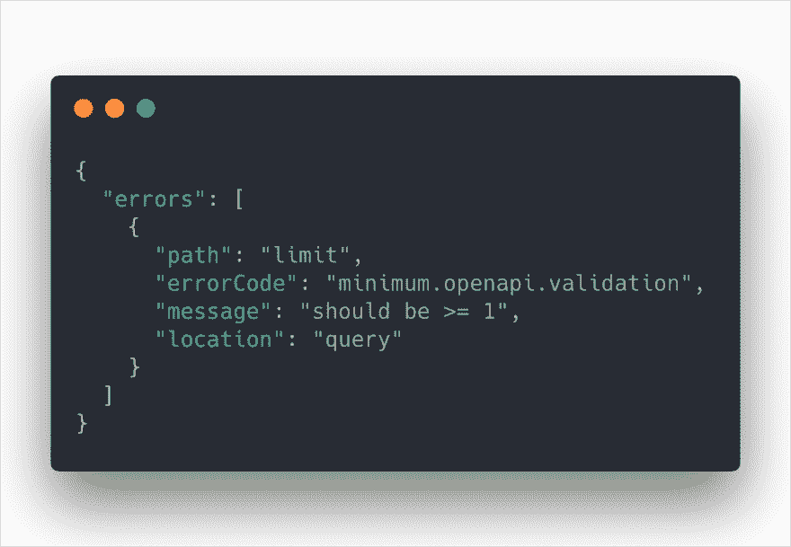
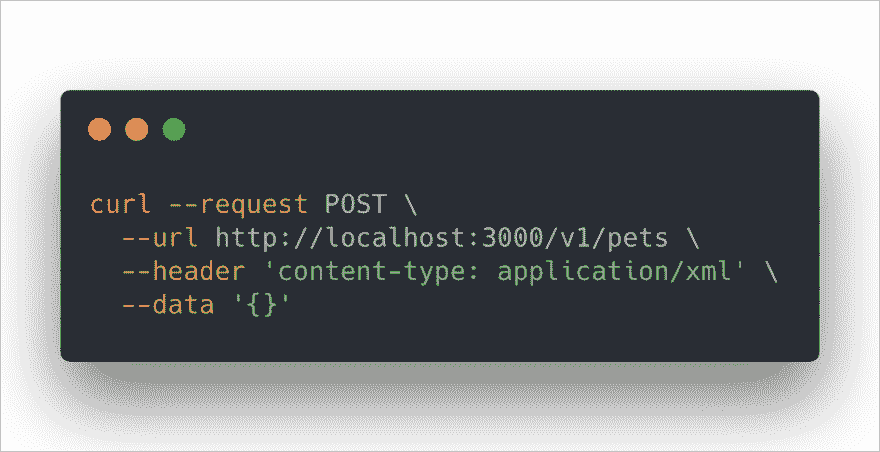
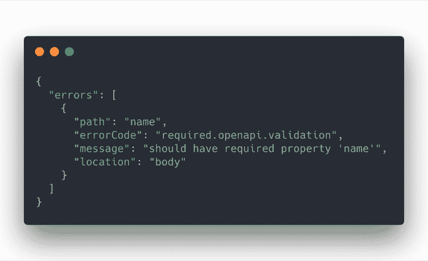

# 用 Node.js 构建 API:使用 OpenAPI 3 规范自动验证 API 请求

> 原文：<https://dev.to/cdimascio/build-an-api-with-nodejs-automatically-validate-api-requests-using-an-openapi-3-specification-2gl5>

Web APIs 是当今应用程序的核心。它们提供的接口很容易被任何平台上用任何编程语言编写的应用程序使用。他们通过展示易于使用的直观界面，使复杂的技术变得简单，使应用程序开发人员能够快速编织令人难以置信的体验。

为了利用和理解一个 API，文档成为一个关键的必需品。像 [OpenAPI 3](https://github.com/OAI/OpenAPI-Specification) 这样的规范使得 API 能够以一种标准格式来描述，这种标准格式可以容易地呈现，例如作为交互式的 HTML 文档。

在本文中，我们将看到如何使用 OpenAPI 规范来自动验证 API 请求！

我们将使用 Node.js 和 Express 构建 API 服务器。我们将利用[express-open api-validator](https://github.com/cdimascio/express-openapi-validator)使用 OpenAPI 3 规范自动验证 API 请求。

让我们开始吧。

## 为我们的简单 API 创建一个快速应用程序

首先，让我们创建一个简单的 Express 应用程序。

运行上述代码将启动一个 API 服务器，该服务器公开以下路由:

*   GET /v1/pets

*   POST /v1/pets

*   GET /v1/pets/:id

注意:*API 返回值是人为设计的，与本教程无关。*

## 创建一个 OpenAPI 规范来描述我们的 API

现在我们已经编写了简单的 API，让我们添加一些验证。但是，我们将通过创建一个 OpenAPI 3 规范来描述我们的 API，而不是编写一堆验证代码。

(我假设你知道如何创建一个 OpenApi 规范，因此我将只描述相关的片段。如果你想看完整的规格，去[这里](https://github.com/cdimascio/express-openapi-validator/blob/master/openapi.yaml)。

让我们要求 GET /v1/pets 的请求必须提供查询参数 **limit** 。让我们也要求极限是一个值**大于零的**整数**。**

我们还要求 POST /v1/pets 的请求必须提供一个包含必填字段的 JSON 主体， **name** 。

我们还将把 NewPets 组件添加到我们的 OpenAPI 3 规范中。

## 集成自动请求验证和 Express-OpenAPI-Validator

**最后**，我们将做一些小的代码调整，使我们的 API 服务器能够使用我们的 OpenAPI 3 规范自动验证 API 请求。

代码调整包括以下内容:

1.  要求[express-open API-validator](https://github.com/cdimascio/express-openapi-validator)—一个根据 OpenAPI 3 规范自动验证 Express 中定义的路由的包

2.  将 OpenApiValidator 安装到我们的 express 应用程序中

3.  提供一个快速错误处理程序来定制我们的错误响应

完成这些更改后，我们的最终代码如下:

*(注意，步骤 1、2 和 3 表示已经添加的新代码)*

启动服务器，然后…

## 试试看

让我们用 **curl** 执行一些 API 请求，并观察自动请求验证的运行情况。

让我们试试 **GET /v1/pets**

退货:

让我们试试 **POST /v1/pets**

返回

这个例子的完整源代码可以在[这里](https://github.com/cdimascio/express-openapi-validator/blob/master/example/app.js)找到。

如果你挖掘[express-open API-validator](https://github.com/cdimascio/express-openapi-validator)，

Github 上的 [Star](https://github.com/cdimascio/express-openapi-validator) it！