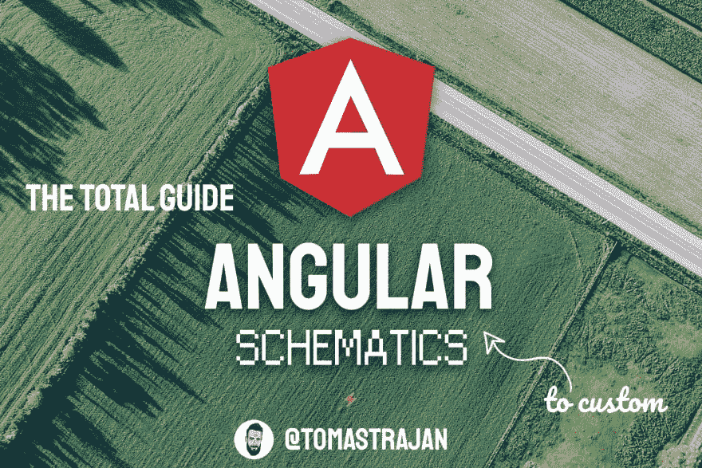

# 自定义角度示意图总指南

> 原文：<https://dev.to/angular/total-guide-to-custom-angular-schematics-3k6f>

### 自定义角度示意图总指南

原理图很棒！它们使我们能够在更短的时间内完成更多的工作！但最重要的是，我们可以少想一些世俗的事情，这样我们有限的注意力就可以集中在解决真正的挑战上了！

☕☕☕☕☕ 20 分钟阅读

> 这篇文章将教你如何根据你的项目或组织的需要创建定制的图表！它会让你和你的同事变得更有效率！

[阅读更多...](https://medium.com/@tomastrajan/total-guide-to-custom-angular-schematics-5c50cf90cdb4)