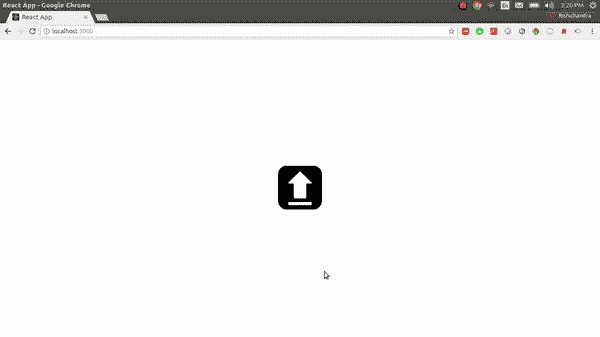
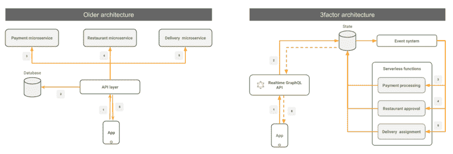
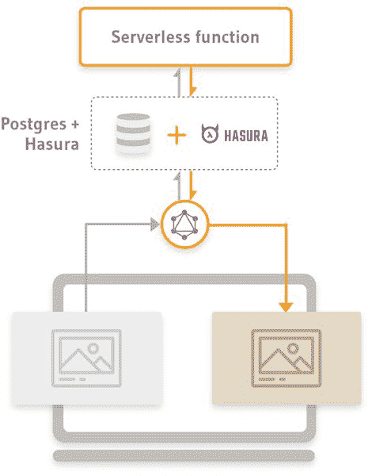
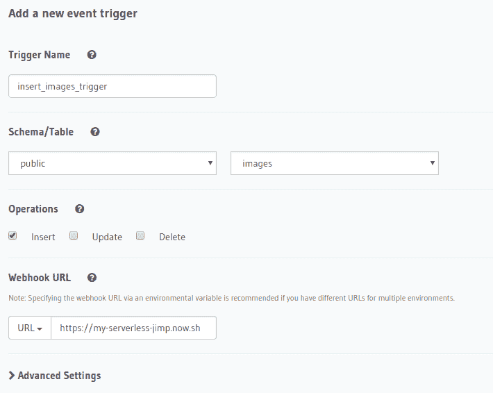

# 使用 GraphQL 和异步无服务器构建图像处理应用

> 原文：<https://dev.to/hasurahq/building-an-image-processing-app-with-graphql-and-async-serverless-7fn>

[](https://res.cloudinary.com/practicaldev/image/fetch/s--v8ZJZd4E--/c_limit%2Cf_auto%2Cfl_progressive%2Cq_66%2Cw_880/https://blog.hasura.io/conteimg/2019/03/image_processing_demo.gif)

## TL；速度三角形定位法(dead reckoning)

*   图像处理最好异步完成，这样应用程序刷新时状态不会丢失
*   无服务器功能可用于运行图像处理逻辑
*   实时 GraphQL 帮助您与处理状态保持同步
*   Hasura GraphQL 引擎通过 Postgres 提供即时实时的 GraphQL APIs
*   源代码:[客户端](https://github.com/wawhal/image-processing-app/tree/master/client)，[图像处理逻辑](https://github.com/wawhal/image-processing-app/tree/master/image-processing-logic)

## 简介

在这篇文章中，我们将构建一个基本的图像处理应用程序，让你上传一张图像，并异步添加棕褐色调。我们不会深入代码的微妙之处，因为这更像是一个关于如何使用实时 GraphQL 和无服务器构建异步图像处理应用的哲学咆哮。

我们将使用:

*   Hasura GraphQL Engine 作为 Postgres 上的免费实时 GraphQL 服务器。

> Hasura 为你提供任何 Postgres 数据库上的实时 GraphQL APIs

*   在突变时触发外部 webhooks 的事件源系统

## 建筑

该应用遵循 3factor.app 架构模式。3factor app 是弹性和可伸缩全栈应用的架构模式。它包括:

*   实时图形 SQL
*   可靠事件
*   异步无服务器

[](https://res.cloudinary.com/practicaldev/image/fetch/s--SJb2xbdO--/c_limit%2Cf_auto%2Cfl_progressive%2Cq_auto%2Cw_880/https://blog.hasura.io/conteimg/2019/03/image-3.png)

在我们的图像处理应用程序中，流程可以归结为:

[](https://res.cloudinary.com/practicaldev/image/fetch/s--BV7SlK4Y--/c_limit%2Cf_auto%2Cfl_progressive%2Cq_auto%2Cw_880/https://blog.hasura.io/conteimg/2019/03/rsz_image_processing_app_flow.jpg)

1.  客户端将图像上传到 cloud，并使用 GraphQL 变体将图像 URL 插入数据库。然后，客户端通过 GraphQL 订阅来观察数据库中该特定映像的变化。
2.  当图像 URL 被插入数据库后，Hasura 的事件系统调用一个带有图像细节的外部 webhook
3.  外部 webhook 将图像转换为棕褐色调，将转换后的图像上传到云，并使用转换后的图像 URL 更新数据库
4.  当转换后的图像上传到数据库时，客户端会收到更新(GraphQL 订阅)

## 后端

第一步是获得一个以 Hasura GraphQL 引擎形式运行的实时 GraphQL 服务器。[点击此处，使用免费 Postgres](https://heroku.com/deploy?template=https://github.com/hasura/graphql-engine-heroku) 将其部署到 Heroku 的免费层(不需要信用卡)。

### 数据模型

对于这个应用程序，我们只需要一个表。

```
images (
  id serial not null primary key,
  image_uri text not null,
  converted_image_uri text
) 
```

[](https://res.cloudinary.com/practicaldev/image/fetch/s--FwhvuZ6t--/c_limit%2Cf_auto%2Cfl_progressive%2Cq_auto%2Cw_880/https://blog.hasura.io/conteimg/2019/03/images_table_create.png)

当您创建这个名为 images 的表时，Hasura 在其 GraphQL 模式中提供了以下根字段:

*   **图片**:查询或订阅`images`列表(附带 where、order_by、limit 等子句)
*   **insert_images** :将一幅或多幅图像插入到`images`表中
*   **update_images** :更新`images`表中的一幅或多幅图像
*   **删除 _ 图像**:删除`images`表格中的一幅或多幅图像

### 图像处理逻辑

我们需要我们的图像处理逻辑来获取上传的图像，并添加棕褐色调。这可以用任何语言或框架编写，并部署在任何平台上。例如，在 NodeJS 中，您可以使用 [jimp](https://www.npmjs.com/package/jimp) 编写这个逻辑，并使用 [Zeit](https://zeit.co) 简化它。代码看起来类似于:

```
const jimp = require ('jimp');

function convertImage(image) {
    return jimp.read(image.image_uri).then(function(i) {
      return i.sepia().writeAsync(`/tmp/${image.id}.png`)
    })
} 
```

上面的函数简单地获取一个如下形式的对象，将其转换为棕褐色，并将转换后的图像存储在/tmp/.png 中。

```
{
    "id": 233,
    "image_uri": "https://mycloudbucket.com/image"
} 
```

图像转换后，您还需要将转换后的图像 URI 更新到数据库中。

```
const fetch = require('node-fetch');

function updateConvertedImage(image) {
  convertImage(image).then(function() {
    uploadToCloud(`/tmp/${image.id}.png`).then(function(uploadResp) {
      fetch(
        'https://image-processing-app.herokuapp.com/v1alpha1/graphql',
        {
          method: 'POST',
          body: JSON.stringify({
            query: `
              mutation ($id: Int, $converted: String) {
                update_images (
                  _set: { converted_image_uri: $converted }
                  where: { id: { _eq: $id } }
                ) {
                  returning {
                    converted_image_uri
                    id
                  }
                }
              }
            `,
            variables: {
              converted: uploadResp.secure_url,
              id: image.id
            }
          })
        }
      ).then(function(response) { return response.json() })
      .then(function(responseObj) { console.log(responseObj) })
    })
  })
} 
```

### 事件采购

Hasura 允许您定义监听突变的事件触发器，并使用突变数据调用外部 webhook。我们将创建一个这样的事件触发器，它监听 insert_images 突变并调用执行上述逻辑的 webhook。

[](https://res.cloudinary.com/practicaldev/image/fetch/s--3mJlB7lC--/c_limit%2Cf_auto%2Cfl_progressive%2Cq_auto%2Cw_880/https://blog.hasura.io/conteimg/2019/03/insert_images_trigger_create.png)

这样，我们的后端就准备好了。

## 前端

大多数逻辑发生在后端，所以前端相当干净。前端有两个屏幕:

*   **上传屏幕**:上传图像到云端，在数据库中插入图像 URL，并通过 URL 参数`id=<image_id>`重定向到转换屏幕
*   **转换屏幕**:等待图像处理并显示转换后的图像

### 上传画面

该屏幕执行以下操作:

*   从用户处获取图像
*   将图像上传到云
*   用 GraphQL 突变将此图像插入数据库
*   使用 URL 参数 id=重定向到新屏幕，其中 image_id 是插入图像的唯一 id

将图像插入数据库的 GraphQL 变体如下所示:

```
mutation  ($uri:  String)  {  insert_images  (  objects:  [{  image_uri:  $uri  }]  )  {  returning  {  id  image_uri  }  }  } 
```

上面的变异将图像 URI 插入数据库，并返回插入行的`id`。接下来，您重定向到 Convert 屏幕，在那里等待处理后的图像。

### 转换屏幕

在 convert 屏幕中，在 URL 参数中查看图像的 id，并使用 GraphQL 订阅对数据库进行实时查询。订阅看起来像:

```
subscription  ($id:  Int)  {  images  (  where:  {  id:  {  _eq:  $id  }  }  )  {  id  image_uri  converted_image_uri  }  } 
```

在呈现 UI 时，您将检查接收到的 converted_image_uri 是否为 null。如果是，则显示加载指示器，或者显示转换后的图像。如果在 React 中使用 Apollo 的订阅组件，它看起来会像这样:

```
import React from 'react';
import { Subscription } from 'react-apollo';
import gql from 'graphql-tag';

const ConvertScreen = () => {
  const urlParams = new URLSearchParams(window.location.search);
  const id = urlParams.get('id');

  return (
    <Subscription
      subscription={
        gql`
          subscription ($id: Int) {
            images (
              where: {
                id: {
                  _eq: $id
                }
              }
            ) {
              id
              image_uri
              converted_image_uri
            }
          }
        `
      }
      variables={{id}}
    >
      {
        ({data, error, loading}) => {
          if (error) { console.error(error); return <ErrorScreen /> }
          if (loading) return <LoadingScreen />;
          if (data.images.length === 0) {
            return "Invalid image ID";
          }
          if (!data.images[0].converted_image_uri) {
            return <LoadingScreen />
          }
          return (
            <ImageScreen
              original={data.images[0].image_uri}
              converted={data.images[0].converted_image_uri}
            />
          );
        }
      }

    </Subscription>
  )
} 
```

如您所见，在上面的组件中:

1.  如果订阅中有错误，我们会呈现一些错误 UI。
2.  如果订阅处于加载状态，我们将显示一个加载 UI。
3.  如果订阅响应为空，即数据库中没有 id 等于给定 id 的行，我们说 URL 参数中的 id 无效。
4.  如果我们得到一个响应，但是 converted_image_uri 为空，我们假设处理仍在进行中
5.  如果我们有一个有效的 converted_image_uri，我们就渲染它。

## 整理完毕

我们讨论了构建异步图像处理应用程序的模式。您可以使用这种架构来构建几乎所有类型的异步应用程序。查看 [3factor.app](https://3factor.app) 和 [hasura.io](https://hasura.io) ，了解更多关于构建弹性和可伸缩的全栈应用的信息。

如果你有任何问题，请在评论中提出来，我们会尽快解答。

### 参考文献

*   [Hasura docs](https://docs.hasura.io)
*   [事件触发单据](https://docs.hasura.io/1.0/graphql/manual/event-triggers/index.html)
*   [图表 QL](https://graphql.org)
*   [阿波罗客户端](https://www.apollographql.com/docs/react/)