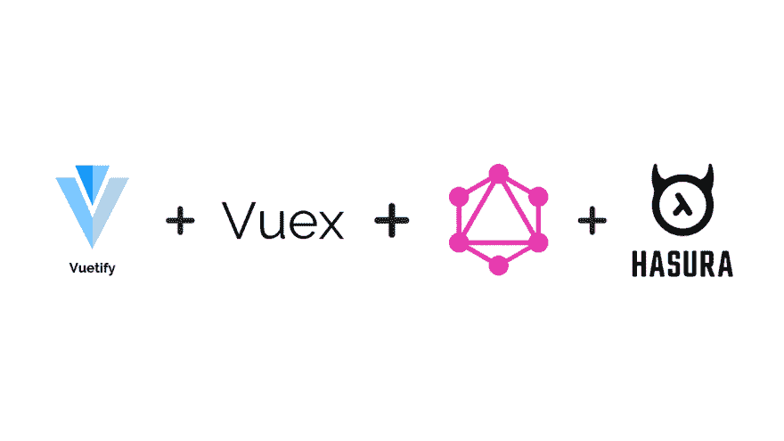
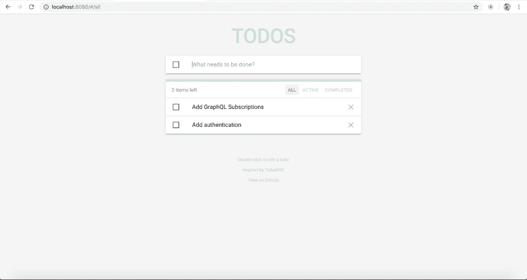

# 使用 Vuetify、Vuex 和 GraphQL 构建渐进式 Todo Web 应用程序

> 原文：<https://dev.to/hasurahq/building-a-progressive-todo-web-app-with-vuetify-vuex-and-graphql-4mlc>

## TL；速度三角形定位法(dead reckoning)

使用 Vuetify、Vuex、VueApollo 构建渐进式 todo 应用程序，并使用 Hasura GraphQL 引擎集成 GraphQL APIs。

即时设置。App 源代码👉[vuetify-vuex-todo-graph QL](https://github.com/hasura/graphql-engine/tree/master/community/sample-apps/vuetify-vuex-todo-graphql)

[](https://res.cloudinary.com/practicaldev/image/fetch/s--Bku7HQHD--/c_limit%2Cf_auto%2Cfl_progressive%2Cq_auto%2Cw_880/https://blog.hasura.io/conteimg/2019/03/vuetify.png)

## 技术堆栈

这个渐进式 web 应用程序使用以下框架/服务器

*   Vue.js 带有用于材料设计 UI 的 Vuetify，用于状态管理的 Vuex，用于进行 GraphQL 查询的 VueApollo
*   [Hasura GraphQL 引擎](https://github.com/hasura/graphql-engine)通过 Postgres 获得即时 GraphQL APIs

## 虚拟化框架

Vue 化是一个面向 Vue 的语义组件框架。它是根据 Google 的材料设计规范构建的，没有复杂的类和标记，具有直观的属性。

在这个应用中，我们在一堆可用的可重用组件中使用了 VGrid、VCard、VList、VTextField、VBtn 等 Vuetify 组件。

progressive todo web 应用程序是[davidgaroro/vuetify-todo-pwa](https://github.com/davidgaroro/vuetify-todo-pwa)的一个分支，它使用

*   用材料设计为 TodoMVC 用户界面赋予价值
*   用于状态管理的 Vuex

下面是使用 Vuetify 的材料设计组件的 todo 应用程序的外观:

[](https://res.cloudinary.com/practicaldev/image/fetch/s--ohtFqvqj--/c_limit%2Cf_auto%2Cfl_progressive%2Cq_auto%2Cw_880/https://blog.hasura.io/conteimg/2019/03/todo-app-landing-page.png)

我们将 **vue-apollo** 添加到这个应用程序中，并配置 **ApolloClient** 进行 GraphQL 查询，以便在数据库中存储和管理 todos。我们将使用 Hasura 来获得即时 GraphQL APIs。

## hasura+vista-Apollo

[Hasura](https://hasura.io/) 是一个[开源](https://github.com/hasura/graphql-engine)引擎，为您提供新的或现有 Postgres 数据库上的实时 graph QL API，内置支持拼接定制 graph QL API 和在数据库更改时触发 webhooks。

我们将把 Hasura GraphQL APIs 集成到这个 todo 应用程序中。参考 [github](https://github.com/hasura/graphql-engine/tree/master/community/sample-apps/vuetify-vuex-todo-graphql) 链接部署 Hasura 并创建 todos 表。

一旦我们部署了 Hasura，我们就可以配置前端来进行 GraphQL 查询。我们添加了配置 ApolloClient 所需的所有模块。

```
npm install --save vue-apollo graphql apollo-client apollo-link apollo-link-http apollo-cache-inmemory graphql-tag 
```

Enter fullscreen mode Exit fullscreen mode

**注意**:如果你不需要对配置进行精细控制，你也可以使用 **apollo-boost**

我们在 todo app 的`src/apollo.js`文件中定义 **ApolloClient** ，

```
import Vue from 'vue'
import VueApollo from 'vue-apollo'
import { ApolloClient } from 'apollo-client'
import { HttpLink } from 'apollo-link-http'
import { InMemoryCache } from 'apollo-cache-inmemory'

const httpLink = new HttpLink({
  // You should use an absolute URL here
  uri: 'https://myapp.herokuapp.com/v1alpha1/graphql'
})

// Create the apollo client
export const apolloClient = new ApolloClient({
  link: httpLink,
  cache: new InMemoryCache(),
  connectToDevTools: true
})

const apolloProvider = new VueApollo({
  defaultClient: apolloClient
})

// Install the vue plugin
Vue.use(VueApollo)

export default apolloProvider 
```

Enter fullscreen mode Exit fullscreen mode

我们只需要在`httpLink`中配置 Hasura GraphQL 引擎端点，在`main.js`中导入这个 apolloProvider，并将其添加到 Vue 实例中，如下所示:

```
import Vue from 'vue'
import App from './App.vue'
import router from './router'
import store from './store'
import apolloProvider from './apollo'
import './registerServiceWorker'
import './vuetify'

Vue.config.productionTip = false

new Vue({
  router,
  store,
  apolloProvider,
  render: h => h(App)
}).$mount('#app') 
```

Enter fullscreen mode Exit fullscreen mode

一旦完成配置，就可以导入 apolloClient 并在整个应用程序中使用。

我们定义 GraphQL 查询/变异，并在 **Vuex 存储**中触发它们。

例如，为了获取所有的待办事项，我们定义了一个简单的查询来获取按最新 id 排序的待办事项。

```
const todoQuery = gql`{
    todos(order_by: [{id: desc}]) {
      id
      text
      is_completed
    }
}` 
```

Enter fullscreen mode Exit fullscreen mode

在我们的操作中，我们使用 apolloClient 进行查询，并使用 **commit** 调用变异处理程序，这将更新状态。

```
const actions = {
  async fetchTodos ({ commit }) {
    const { data } = await apolloClient.query({query: todoQuery})
    commit('fetchTodos', data.todos)
  },
} 
```

Enter fullscreen mode Exit fullscreen mode

注意，我们使用了 **async，await** ，这使得语法更加清晰。

让我们定义一个 GraphQL 变异来插入一个新的 todo。

```
const todoMutation = gql`
  mutation insert_todos($text: String!) {
    insert_todos(objects: [{text: $text}]) {
      affected_rows
      returning {
        id
        text
        is_completed
      }
    }
}` 
```

Enter fullscreen mode Exit fullscreen mode

这个变异接受一个`$text`变量，并将其插入到 todos 表中。

类似地，我们为添加/更新/删除 todos 定义了 GraphQL 突变，并且我们定义了进行突变和更新 Vuex 存储中的状态的动作。

## 渐进式网络应用

这个 todo 应用程序是一个 PWA，带有样板设置

*   应用清单
*   服务行业人员
*   工具箱选项- [缓存谷歌字体](https://developers.google.com/web/tools/workbox/guides/common-recipes#google_fonts)

它可以被配置为获得灯塔分值 100。

## 待办事宜 App 源代码

我已经将该应用程序与完整的 GraphQL 集成在一起，以便您可以快速入门并进一步扩展它！

在 [github](https://github.com/hasura/graphql-engine/tree/master/community/sample-apps/vuetify-vuex-todo-graphql) 上查看。

请注意，这个应用程序还没有任何用户认证，它目前是一个集成 GraphQL 查询/突变与 Vuetify + Vuex 与 Hasura 的演示。