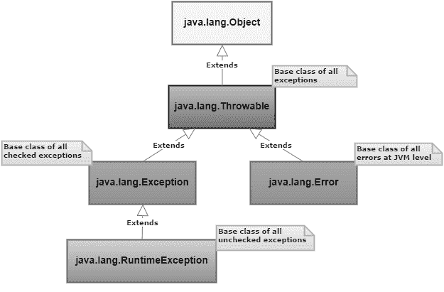

# 20 多个 Java 面试问题

> 原文：<https://dev.to/vijaykhatri96/top-20-java-interview-questions--1lcf>

毫无疑问，Java 是获得高薪工作的主要编程选择之一。毕竟，基于类的、通用的、面向对象的编程语言是世界上使用最广泛的编程语言之一。

这种编程语言有着过多的优秀特性，不仅是经验丰富的专家们喜欢它，编程领域的新手们也喜欢它。因此，这里有 28 个重要的面试问题，它们将帮助你获得一份 Java 工作，或者，至少，增强你的学习。

问:你如何区分 HashMap 和 HashTable？
答:Java 中的 HashMap 是一个基于 Map 的集合类，用于存储 key &值对。它表示为:

散列表或散列表

HashTable 是一个列表的数组，其中每个列表称为一个桶。哈希表中包含的值是唯一的，并且依赖于键。

HashMap 中的方法是不同步的，而 HashTable 中的键方法是同步的。然而，HashMap 没有线程安全性，而 HashTable 却有。对于迭代值，HashMap 使用迭代器，HashTable 使用枚举器。

HashTable 不允许任何空值，而 HashMap 允许一个空键和几个空值。从性能上来说，HashTable 比较慢。相比之下，HashMap 更快。

问:Java 中的集合是什么意思？Java 中集合的组成部分是什么？
答:Java 中的一组对象被称为集合。Java.util 包包含日期和时间工具、国际化、遗留集合类等。，用于收集的各种类和接口。

或者，集合可以被认为是被设计用于存储对象和操纵存储对象的设计的框架。您可以使用集合对对象执行以下操作:

1.删除
2。插入
3。操纵
4。正在搜索
5。整理

以下是集合框架的各个组成部分:

**类**–数组列表、链表、列表、向量
**接口**–集合、列表、映射、队列、集合、排序映射、排序集合
**映射**–HashMap、HashTable、LinkedHashMap、TreeMap
**队列**–优先级队列
**集合**–哈希集合、链接哈希集合、树集合

问:请解释一下 Java 中的地图及其类型。
答:Java Map 是将键映射到值的对象。它不能包含重复的键，并且每个键只能映射到一个值。为了确定两个键是相同还是不同，Map 使用 equals()方法。Java 中有 4 种类型的映射，描述如下:

HashMap -这是一个无序的地图，因此，当不强调顺序时，这是一个很好的选择。HashMap 允许一个空键和多个空值，并且不保持任何插入顺序。
**哈希表**–不允许任何空值，并且有同步的方法。因为它考虑到了线程安全，所以性能很慢。
**linked HashMap**–比 HashMap 慢，但保持插入顺序，迭代速度更快。
**TreeMap**–一种排序映射，支持使用构造函数构造排序顺序。

问:Java 中的优先级队列是什么意思？
答:优先级队列和常规队列一样，是一种抽象数据类型，只是它包含的每个元素都有一个与之相关联的优先级。在优先级队列中，具有高优先级的元素在具有低优先级的元素之前被服务。

优先级队列中的元素要么根据比较器排序，要么自然排序。优先级队列中元素的顺序代表了它们的相对优先级。

问:抽象类和接口有什么不同？
答:Java 中抽象类和接口有几个区别，总结如下:

成分——抽象类包含实例变量，而接口只能包含常量。构造函数和实例化——虽然一个接口既没有构造函数也不能被实例化，但是一个抽象类可以有一个默认的构造函数，当具体的子类被实例化时，这个构造函数就会被调用。
方法的实现——所有实现接口的类都需要为它包含的所有方法提供一个实现。然而，扩展抽象类的类不需要实现其中包含的所有方法。只有抽象方法需要在具体的子类中实现。
方法的类型——任何抽象类都有抽象和非抽象的方法。另一方面，接口只有一个抽象方法。

问:你能解释一下 Java 中各种类型的异常吗？另外，告诉我们处理它们的不同方式。
答: Java 提供了两种类型的异常:

**检查异常**–扩展 Throwable 类的类，除了运行时异常和错误，称为检查异常。这种异常由编译器在编译时检查。这些类型的异常必须有适当的 try/catch 块，或者使用 throws 关键字声明。ClassNotFoundException 是一个已检查的异常。
**未检查的异常**–这种异常在编译时不会被编译器检查。因此，编译器不需要处理未检查的异常。算术异常和 ArrayIndexOutOfBounds 异常是未检查的异常。
Java 中的异常有两种处理方式:

声明 throws 关键字——我们可以在方法的末尾使用 throws 关键字声明异常。例如，
class exception check {
public static void main(String[]args){
add()；
}
public void add()抛出异常{
add()；
}
}
使用 try/catch–任何预期会产生异常的代码段都被 try 块包围。一旦出现异常，try 块后面的 catch 块就会捕获它。比如
class exception check {
public static void main(String[]args){
add()；
}
public void add(){
try {
add()；
}catch(异常 e){
e . printstacktrace()；
}
}
}

问:你能画出 Java 异常的层次结构吗？
答: 

**问:final 关键字在 Java 中起什么作用？它对变量、方法和类有什么影响？
答:**Java 中的 final 关键字是非访问修饰符，只适用于类、方法或变量。根据使用它的上下文，它有不同的用途。

带类:

当一个类被声明为 final 时，它就不能被子类化，也就是说，任何类都不能扩展 final 类。

用一种方法:

任何伴随 final 关键字的方法都不能被子类覆盖。

带有变量:

后跟 final 关键字的变量不能改变它在程序执行过程中保存的值。所以，它表现得像一个常数。

**问:如何用 Java 制作一个线程？举例说明。
答:**为了在 Java 中制作一个线程，有两个选项:

扩展 Thread 类——该线程在 java.lang.Thread 类中可用。为了创建一个线程，您需要扩展一个线程类并覆盖 run 方法。例如，公共类添加扩展 Thread {
public void run(){
}
}

使用 thread 类的一个缺点是无法扩展任何其他类。尽管如此，还是有可能在类中重载 run()方法

实现 runnable 接口——另一种在 Java 中创建线程的方法是实现 Runnable 接口。为此，需要为在
接口中定义的 run()方法提供实现。比如
公共类添加实现 Runnable {
公共 void run () {
}
}

问:我们为什么要使用收益率()方法？
答:yield()方法属于线程类。它将当前运行的线程转换为可运行状态，并允许其他线程执行。换句话说，它给同等优先级的线程一个运行的机会。因为 yield()是一个静态方法，所以它不释放任何锁。

问:你能解释一下 Java 中的线程生命周期吗？
答:线程生命周期有以下状态，遵循以下顺序:

new——在线程生命周期的第一个状态，线程实例被创建，start()方法还没有被调用。该线程现在被认为是活动的。
Runnable——在调用 start()方法之后，但在调用 run()方法之前，线程处于可运行状态。线程也可以从等待或睡眠状态返回到可运行状态。
Running–调用 run()方法后，线程进入运行状态。这是线程开始执行的时候。
不可运行——虽然线程是活动的，但是它不能运行。通常，它会在一段时间后返回到可运行状态。
终止——一旦 run()方法完成执行，线程就进入终止状态。它现在不活了。

* *问:看看下面的两段代码:

爱达荷（Idaho 的缩写）

类加法器{
静态 int add(int a，int b)
{
返回 a+b；
}
静态双加(双 a，双 b)
{
返回 a+b；
}
公共静态 void main(String args[])
{
system . out . println(adder . add(11，11))；
system . out . println(adder . add(12.3，12.6))；
}}
二。

类 Car {
void run(){
system . out . println("汽车正在运行")；
}
级奥迪延伸车{
void run()
{
system . out . prinltn("奥迪百公里安全行驶")；
}
公静态 void main(String args[])
{
车 b =新奥迪()；
b . run()；
}
}
两者有什么重要区别？
A:**代码片段 I .是方法重载的一个例子，而代码片段 ii。演示方法重写。

**问:你对 Java 中同步的理解是什么？它最显著的缺点是什么？
答:**如果几个线程试图访问一个代码块，那么产生不准确结果的可能性就会增加。为了防止这种情况，使用了同步。

使用 synchronization 关键字会使线程需要一个密钥来访问同步代码。简单地说，同步一次只允许一个线程访问一段代码。

每个 Java 对象都有一个锁，并且每个锁只有一个键。只有当线程能够获得对象锁的密钥时，它才能够访问同步方法。以下示例演示了同步:

公共类 ExampleThread 实现 Runnable {
public static void main(String[]args){
Thread t = new Thread()；
t . start()；
}
public void run(){
synchronized(object){
{
}
}
注意:建议避免对所有方法实现同步。这是因为当只有一个线程能够访问同步代码时，下一个线程需要等待。因此，它会降低程序的性能。

问:可以在一个 try 块下写多个 catch 块吗？
答:是的，可以在一个 try 块下写几个 catch 块。但是，方法需要从具体到一般。以下示例演示了同样的情况:

public 类示例{
public static void main(String args[]){
try {
int a[]= new int[10]；
a[10]= 10/0；
}
catch(Arithmetic exception e)
{
system . out . println("第一个 catch 块中的算术异常")；
}
catch(ArrayIndexOutOfBoundsException e)
{
system . out . println("第二个 catch 块中数组索引越界")；
}
catch(Exception e)
{
system . out . println("第三个 catch 块中的任何异常")；
}
}

问:你能说出 execute()、executeQuery()和 executeUpdate()之间的区别吗？答:

**execute()**–用于执行任何 SQL 查询。如果结果是结果集，如运行选择查询，则返回 TRUE 如果结果不是结果集，如运行插入或更新查询，则返回 FALSE。
**execute query()**–用于执行选择查询。它返回结果集，即使没有与查询匹配的记录，结果集也不为空。在执行 select 查询时必须使用 **executeQuery()** 方法，这样当有人试图执行 Insert 或 update 语句时，它会抛出 java.sql.SQLException 和“executeQuery 方法不能用于更新”消息。
**【execute Update()**–用于执行删除/插入/更新语句或不返回任何内容的 DDL 语句。根据语句是数据操作语言(DML)语句还是数据定义语言(DDL)语句，输出会有所不同。对于前一种情况，输出是一个整数，等于总行数，对于后一种情况，输出是 0。
注意:execute()方法只需要在不确定语句类型的情况下使用。在所有其他情况下，请使用 executeQuery()或 executeUpdate()方法。

**问:提供一个 Hibernate 架构的例子:
A:**

问:你能通过一个代码示例演示如何在 JSP 中删除 cookie 吗？
答:下面的代码演示了在 JSP 中删除一个 cookie:

Cookie mycook = new Cookie("name1 "，" value 1 ")；
response . add cookie(my cook 1)；
Cookie kill my cook = new Cookie(" my cook 1 "，" value 1 ")；
killmycook。设置 MaxAge(0)；
killmycook。设置路径("/")；
killmycook。add cookie(kill my cook 1)；

问:编写合适的代码示例来演示 final、finally 和 finalize 的用法。答:

final
final 关键字用于限制类、方法和变量。一个 final 类不能被继承，一个 final 方法被禁止重写，一个 final 变量成为一个常量，即它的值不能被改变。

class FinalVarExample {
public static void main(String args[])
{
final int a = 10；
a = 50；//会导致一个错误，因为现在无法更改该值
}
Finally
无论是否处理了异常，Finally 块中的任何代码都将被执行。

class finally example {
public static void main(String args[]){
try {
int x = 100；
}
catch(异常 e){
system . out . println(e)；
}
finally {
system . out . println(" finally 块正在执行")；}
}
}
}
Finalize Finalize 方法在对象被垃圾收集之前执行清理。

class Finalize example {
public void Finalize(){
system . out . println(" Finalize 被调用")；
}
公共静态 void main(String args[])
{
finalize example f1 = new finalize example()；
finalize example F2 = new finalize example()；
f1=空；
F2 =空；
system . GC()；
}
}

问:throw 关键字和 throws 关键字有什么不同？
答:虽然 throws 关键字允许声明异常，但 throw 关键字用于显式抛出异常。被检查的异常不能只通过 throw 来传播，但是 throw 允许这样做而不需要任何其他东西。

throws 关键字后面是一个类，而 throw 关键字后面是一个实例。throw 关键字在方法中使用，但 throws 关键字与方法签名一起使用。此外，不能抛出多个异常，但可以声明多个异常。

问:你如何区分进程和线程？
答:流程和线程之间有几个基本的区别，陈述如下:

定义–进程是程序的执行实例，而线程是进程的子集。
**变更**–对父流程的变更不会影响子流程。但是，主线程的变化会导致同一进程中其他线程的行为发生变化。
**通信**–当进程需要进程间通信来与同级进程通信时，线程可以直接与属于同一进程的其他线程通信。
**控制**–进程由操作系统控制，并且只能控制子进程。相反，线程由程序员控制，并且能够对它们所属的同一进程的线程进行控制。
**依赖**–进程是独立的实体，而线程是依赖的实体
**内存**–线程运行在共享的内存空间，而进程运行在独立的内存空间。

问:你能比较一下数组和数组列表吗？
答:数组需要在声明时给出大小，而数组列表不一定需要大小，因为它是动态改变大小的。

为了把一个对象放入一个数组，需要指定索引。但是，对于数组列表，没有这样的要求。当数组列表被参数化时，数组不被参数化。

问:请解释一下抽象类和抽象方法是什么意思？
答:Java 中的抽象类是不能实例化的类。这种类通常用于为子类提供基础，以便扩展和实现抽象方法，并覆盖或使用抽象类中定义的已实现方法。

为了创建一个抽象类，它需要跟 abstract 关键字。任何抽象类都可以有抽象和非抽象方法。

Java 中只有声明而没有实现的方法被称为抽象方法。此外，抽象方法名后跟 abstract 关键字。任何扩展抽象类的具体子类都必须提供抽象方法的实现。

问:你对 Java 中的接口了解多少？
答:Java 接口是一个只有方法声明而没有方法实现的模板。这是在 Java 中实现多重继承的一种变通方法。

关于 Java 接口，一些值得记住的要点是:

实现接口的类必须为接口中声明的所有方法提供实现
接口中的所有方法都是内部公共的抽象 void
接口中的所有变量都是内部公共的静态 final
类不扩展但实现接口

**问:什么是 join()方法？举个例子。
答:**我们使用 join()方法将一个线程与当前正在运行的线程的末尾连接起来。它是非静态方法，并且有一个重载版本。考虑下面的例子:

公共静态 void main(String[]args){
Thread t = new Thread()；
t . start()；
t . join()；
}

在前面提到的例子中，主线程开始执行。一旦执行到达代码 t.start()，线程 t 就开始执行自己的堆栈。JVM 在主线程和线程 t 之间切换。

一旦执行到达 t.join()，那么只有线程 t 被执行并被允许完成它的任务。之后，主线程继续执行。

问:在 Java 中如何让一个线程停止？
答:Java 中有三种方法可以停止线程的执行:

**阻塞**–该方法用于将线程置于阻塞状态。一旦满足阻塞条件，执行就会恢复。例如，ServerSocket.accept()是一个阻塞方法，它侦听传入的套接字连接，并仅在建立连接时恢复阻塞的线程。
**休眠**–这个方法用于延迟线程的执行一段时间。使用 sleep()方法的线程被称为进入睡眠状态。它一醒来就进入可运行状态，即睡眠状态结束。sleep()方法的大括号中提到了线程需要进入睡眠状态的时间。它是一个静态方法。
**Waiting**–虽然 wait()方法可以在任何 Java 对象上调用，但它只能从同步块中调用。

问:在 Java 中，Volatile 变量的作用是什么？
答:存储在 volatile 变量中的值不是从线程的缓存中读取，而是从主内存中读取。可变变量主要在同步期间使用。

问:请比较一下 Java 中的序列化和反序列化。
答:序列化是 Java 对象转换成字节流的过程。反序列化是与序列化完全相反的过程，从字节流中检索 Java 对象。

Java 对象通过写入 ObjectOutputStream 进行序列化，通过从 ObjectInputStream 读取进行反序列化。

这就完成了 28 个基本 Java 面试问题的列表。你觉得我们整理的名单怎么样？请在下面的专用窗口中留下您的评论，让我们知道。此外，查看这些最佳 Java 教程，进一步完善您的 Java 技能集。

原贴:[https://hackr.io/blog/java-interview-questions](https://hackr.io/blog/java-interview-questions)