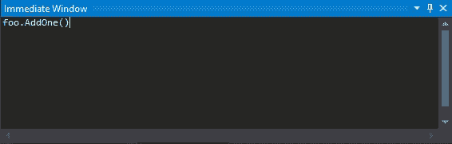

# Visual Studio 提示-评估没有副作用的函数

> 原文：<https://dev.to/hutchcodes/visual-studio-tips-evaluate-a-function-without-side-effects-3mal>

曾经调试并想知道一个函数调用的结果是什么，但是调用它会以一种使继续变得困难或不可能的方式改变状态？你可以评估它，并指出它没有任何副作用。

以这个简单的类为例，它跟踪一个计数，并有一个递增计数的方法。

```
class Foo
{
    public int Count { get; private set; } = 0;

    public int AddOne()
    {
        Count++;
        return Count;
    }
} 
```

如果我们想知道`AddOne()`方法的结果是什么，但是我们不想实际增加计数，因为我们不能把它设置回来，我们可以在监视窗口和即时窗口中使用`nse`(无副作用)格式说明符。

```
foo.AddOne(), nse 
```

[](https://res.cloudinary.com/practicaldev/image/fetch/s--rv7J35Qt--/c_limit%2Cf_auto%2Cfl_progressive%2Cq_66%2Cw_880/https://hutchcodes.net/img/2019/NoSideEffects.gif)