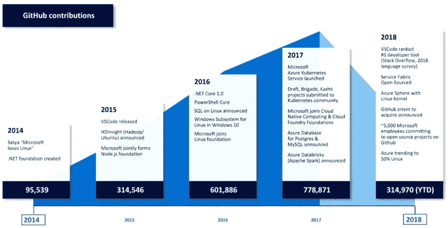
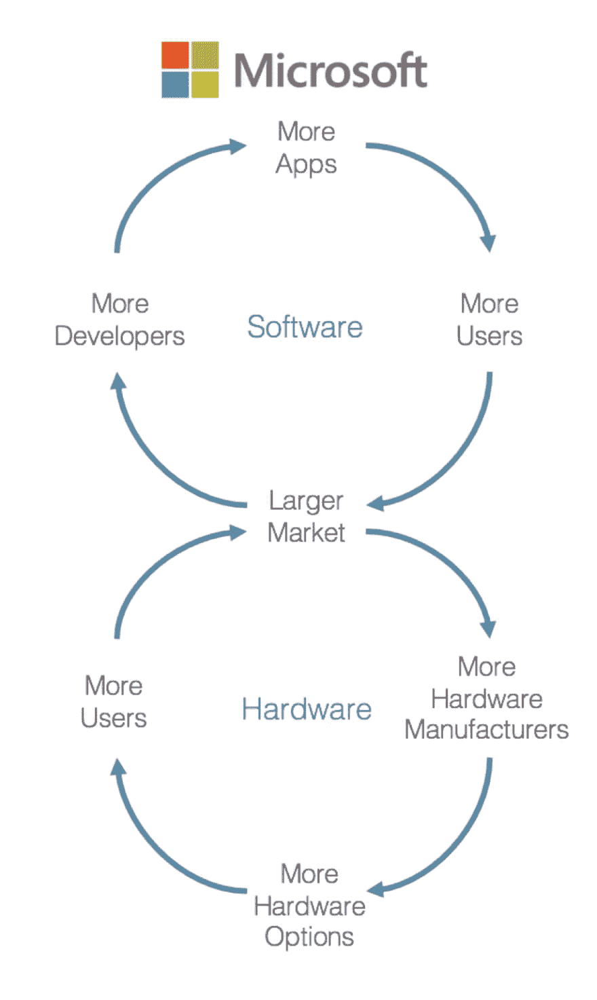

# 代码编辑器战争

> 原文：<https://dev.to/thegeoffstevens/code-editor-wars-3h0j>

## 开发商的民心之战

TL；速度三角形定位法(dead reckoning)

*   微软曾经控制着最伟大的闭源开发者平台——Windows
*   Linux，苹果的 App Store 和 iOS，谷歌的 Android，亚马逊 AWS 让 Windows 黯然失色
*   微软随后拥抱开源，推出 VS 代码，并收购 GitHub
*   微软正在努力赢得开发者的心，以展示在 Azure 云平台上开发的力量

[https://www.youtube.com/embed/bfVHNK8Z94A](https://www.youtube.com/embed/bfVHNK8Z94A)

很久以前，在一个不远、很远的星系(准确地说是我们的星系)，微软作为主导性的开发帝国统治着技术世界，独立软件供应商最强大、最广泛的生态系统为他们的死星 Windows 平台做出了贡献。

世界已经变了。

如今，Windows 已经被苹果(App Store 和 iOS)、谷歌(Android)和亚马逊(AWS)驱动的更强大的新平台所超越。

开发者不再将微软视为邪恶的闭源帝国。相反，塞特亚·纳德拉和他的快乐乐队已经成为新的反叛者，他们在任何地方都可以贡献开源，并主宰 GitHub 贡献的世界。

<figure>

<figcaption>Source: Microsoft Open Source Virtual Conference keynote (2018), originally featured on [Redmond](https://redmondmag.com/articles/2018/09/17/microsoft-outlines-open-source-shift.aspx)</figcaption>

</figure>

为什么曾经的闭源帝国微软如此在意开源？

他们为什么要支付 75 亿美元收购 GitHub，事实上是全球开源回购的大本营？

为什么他们花费如此多的时间和精力来开发一个新的、开源的、免费的文本编辑器，Visual Studio Code，它已经在开发者中迅速上升到第一位？

微软未来战略的答案在于它的过去。

## 开发者平台的力量

首先，理解平台为什么如此有价值很重要。

当 IBM(最初的科技帝国)决定将他们的 PC 操作系统外包给微软时，这使得微软成为 PC 时代事实上的操作系统。与当时希望严格控制其生态系统的苹果不同，微软邀请开发者将他们的操作系统作为一个开放平台。

开发者和独立软件供应商(ISV)围绕该平台形成了一个生态系统，创造了一个应用世界。Windows 应用在不同行业的不同使用案例中激增。因此，该平台的总价值不断扩大和深化，根植于每个行业和企业的每个方面。

应用越多，平台吸引的用户就越多。用户越多，市场越大。市场越大，想开发应用的开发者就越多。

它创造了一个气旋效应，一个用户、开发者和增值的良性循环。

微软还有第二个，硬件旋风效应。

市场越大，硬件制造商就越想为这个市场制造产品。硬件选项越多样、越有趣(拥有这种功能和那种功能的电脑)，用户就越想使用这个平台。

用户越多，市场越大…

[T4】](https://res.cloudinary.com/practicaldev/image/fetch/s--8jWJ-Peu--/c_limit%2Cf_auto%2Cfl_progressive%2Cq_auto%2Cw_880/https://uploads-ssl.webflow.com/5be13d6342a0a15c8f2c5aff/5c54cdaab70744ff59c094d7_microsoft-cyclones.png)

这两股旋风相互促进，微软迅速成长为世界上第一个伟大的应用平台生态系统。

## 终身开发者锁定

开发人员建立了他们的整个职业生涯，几十年的培训和专业知识，在 Windows 生态系统中工作。他们中的许多人将继续在 Windows 上工作，直到退休——终身锁定。

气旋效应和职业发展者是平台如此有价值和持久的原因。时至今日，Windows 这个慢慢萎缩的生态系统，依然拥有超过十亿的活跃用户。

微软不止一次搭建了一个巨型平台。他们在 Windows Server 和微软的数据库 MS SQL Server 上又做了一次，两者都形成了自己有价值的平台生态系统。

结果公司一飞冲天，成为世界上最有价值的公司。

但他们变得过于激进，不公平地利用了微软令人难以置信的资产。

凭借拥有平台的巨大优势，微软建立了自己的竞争应用程序，如 Office 套件，或大规模收购 ISV，从而扩大了规模并取得了成功。他们免费开发产品和应用，比如 Internet Explorer，来摧毁潜在的竞争对手。

最终，一名联邦法官裁定，该公司“通过掠夺性和反竞争行为违反了美国的反垄断法，并在竞争财富的天平上保持了压迫性的拇指。”"

反垄断指控帮助击败了盖茨勋爵，并迫使他退休，但这并不是他们一个人做的。

## 开发商的免费之地

炸毁微软死星需要的不仅仅是政府监管。

这也需要一个名叫理查德·斯托尔曼的嬉皮士程序员。

具有讽刺意味的是，数字时代历史上最重要的时刻之一包括合法许可证的创作。

斯托曼是 GNU 通用公共许可证的主要作者。斯托曼倡导自由软件或自由源代码，发起了 GNU 项目，并创立了自由软件基金会。开源运动后来从他的自由软件运动中分支出来。

如果斯托曼是法律建筑师，那么莱纳斯·托沃兹就是开出不可能一枪引发灾难性连锁反应的开发者。

1991 年，托沃兹在一个早期的新闻组中公布了他的意图，这也许是你能想象到的创新周期中最卑微的开端:

> 你好，所有使用 minix 的人——
> 
> 我在 clones 做一个 386(486)的(免费)操作系统(只是爱好，不会像 gnu 一样大而
> 专业)。这个从 4 月份就开始酝酿
> ，开始准备了。我希望得到任何关于人们喜欢/不喜欢 minix 中的
> 事物的反馈，因为我的操作系统有点像它
> (文件系统的相同物理布局(由于实际原因)
> 等等)。
> 
> 我目前已经移植了 bash(1.08)和 gcc(1.40)，看起来一切正常。这意味着我将在几个月内得到一些实用的东西，并且我想知道大多数人想要什么样的功能。欢迎任何
> 的建议，但我不保证我会
> 实施它们:-)
> 
> Linus([Torvalds @ kruna . Helsinki . fi](mailto:torvalds@kruuna.helsinki.fi))
> 
> PS。是的——它没有任何 minix 代码，并且有一个多线程 fs。它是不可移植的(使用 386 任务切换等)，而且它可能永远不会支持除 AT-harddisks 之外的任何东西，因为我只有 AT-hard disks。

他把他的操作系统叫做 Linux。

## 开源之力

2017 年，基于 Linux 的服务器出货量以 13.9%的五年复合年增长率增长。另一方面，微软视窗操作系统继续以 4%的速度下滑，尽管有大量的持续投资和微创新。封闭的遗留 UNIX 系统(AIX、Solaris 和 HP-UX)的下滑速度更快，达到了 11.9%。

就服务器而言，Linux 是明确的未来。越来越多的开发者在 Linux 上开发更多创新的应用，而且通常是免费的，这创造了一个良性循环，催生了一个新的世界秩序。

此外，平台战争已经从 PC 和服务器转移。浏览器，如谷歌的 Chrome，已经成为主要平台。随着智能手机的崛起，iOS 和谷歌的 Android 现在已经成为世界上最具主导地位的平台，Android 拥有最大份额的市场份额，iOS 拥有最大份额的利润。

嵌套在这些移动平台中的是其他主流平台。例如，脸书是一款可以在 iOS、Android 和 Chrome 上运行的应用。但脸书也是一个平台，让 Zynga 等应用能够在自己的生态系统内形成并上市。

## 最大的平台，云

当然，这就把我们带到了云端。

今天，亚马逊运行着最大的实体平台——亚马逊网络服务。虽然亚马逊主导了基础设施即服务，云平台的最底层和最有价值的层(因为它可以服务于最大的软件用例市场)，但当你包括 Office 365 和 Microsoft SQL Server 作为云服务运行时，微软实际上推动了更多的云收入。

那么，为什么微软一直如此渴望拥抱开源和开发者，发布免费的开源代码编辑器，并通过收购 GitHub 来加强开发者回购？

因为他们的目标是帮助再次发展最强大的开发者平台。

塞特亚·纳德拉知道 Windows 独霸的时代已经结束，开发者仍然是关键。有什么比在开发人员编码和存储代码的地方开发工具更好的方法来影响开发人员，赢得他们的心呢？他们作为开发者的大部分时间都在那里度过。

只要看看 VS 代码让开发人员在 Azure 上构建的轻松程度就知道了。最终，如果他们能够影响开发者，并创建一个应用程序进入 Azure 云的渠道，微软可能会成为曾经和未来主导开发者平台的领导者。

**像我们一样热爱 VS 代码？用我们的开源扩展[代码时间](https://www.software.com)让它更加强大。**