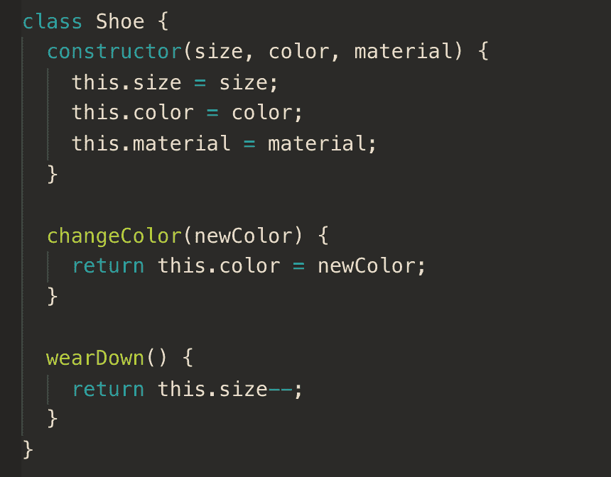
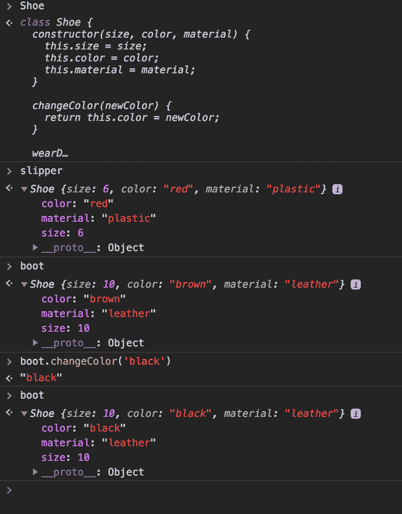
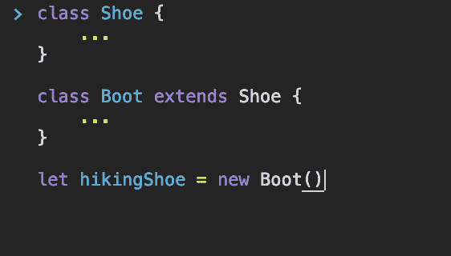
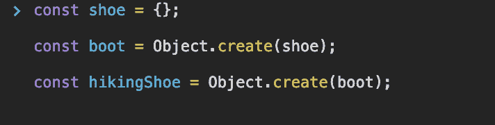
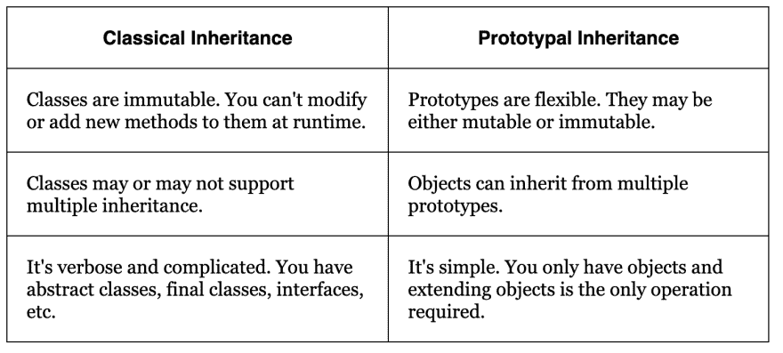
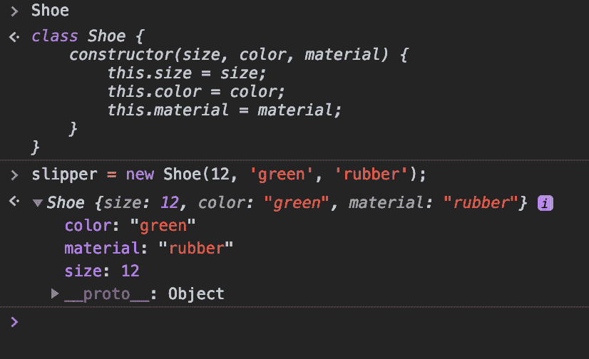

# 经典与原型遗传

> 原文：<https://dev.to/crishanks/classical-vs-prototypal-inheritance-2o5a>

# 物体方位

对象是我们在现实世界中与之交互的物理事物的抽象(或描述性表示)。有些现实世界的东西比其他东西更相似。例如，一只靴子与一只拖鞋的相似之处要比它与一棵树的相似之处多得多。把这两者都称为一只鞋并不过分。在几乎不知道的情况下，我们一直在制造这些心理组织。

面向对象编程的目的是尽可能地模拟这些真实世界的类别。虽然认识到物体之间的相似性很重要，但我们也必须认识到它们的不同之处。让我们以鞋子为例更进一步。

让我们讨论一下鞋子有哪些共同的属性和行为:尺码、颜色和材料。我们可以改变鞋子的颜色，或者鞋子会磨损。

正如我们在现实中所做的那样，我们可以根据它们的共同点对所有的鞋子进行分类，并创建无限量的个人鞋子复制品，这些复制品继承了所有鞋子的所有特征，但也有它们自己独特的特征。

在这种情况下，Shoe 被称为**泛化**；换句话说，对现实世界中的物品的更一般、更不具体的描述。

# 古典的传承

在经典继承中，对象仍然是现实世界‘事物’的抽象，但是我们只能通过*类*来引用对象。类是对象的*概括。换句话说，类是现实世界中某个对象的抽象。(那么，类是现实世界事物的抽象的抽象)。因为一个类是它的前身的另一个引用(或抽象)，每个后代子类增加了抽象层次，从而增加了泛化层次。*

# 原型遗传

与经典继承相反，原型继承不处理不断增加的抽象层。一个对象或者是一个现实世界事物的抽象，和以前一样，*或者*是另一个对象的直接拷贝(换句话说，一个**原型**)。可以凭空创建对象，也可以从其他对象创建对象:

这很重要！这意味着概括(就像总体的鞋子概念)只是其他对象。对于传统的继承，一般化是抽象的抽象的抽象...一直到最近的后代。

这里的抽象层次从来不会深于 1；原型继承中出现的唯一抽象是远离现实世界的抽象。

原型继承包括一些超越经典继承的[关键优势:](http://aaditmshah.github.io/why-prototypal-inheritance-matters/)

# 原型继承的机制

## 构造函数

在 JavaScript 中，所有对象都有一个构造函数。在 JavaScript 类中，我们使用构造函数在类中创建和实例化新对象。每个类只能有一个构造函数。在上面的例子中，我们用所有鞋子对象共有的特征来实例化每个鞋子对象(所有鞋子都有一个尺寸、颜色和材料)。

您可以更深入地了解构造函数(如何查看对象的类，如何更改类，等等。)在 [MDN](https://developer.mozilla.org/en-US/docs/Web/JavaScript/Reference/Global_Objects/Object/constructor) 上。

## 新增操作员

根据 [MDN docs](https://developer.mozilla.org/en-US/docs/Web/JavaScript/Reference/Operators/new) ，新操作员执行以下操作:

1.  创建一个空白的普通 JavaScript 对象。
2.  将此对象链接(设置其构造函数)到另一个对象；
3.  将步骤 1 中新创建的对象作为 this 上下文传递；
4.  如果函数不返回自己的对象，则返回这个。

为了实例化一个 JS 类的原型，我们使用关键字`new`。在上面的例子中，我们定义了新对象的名字`let slipper`，并用`new`创建它。然后我们传入在 Shoe 类的构造函数中定义的参数。这些新的对象实例被称为*类型*。然后，您可以通过调用`slipper.size`或`slipper.color`来访问任何对象属性。

# 结论

经典继承和原型继承之间的差异会很快变得非常复杂。如果你想在更深的层次上研究这些概念，你可以试试 Aadit M Shah 的[“为什么原型继承很重要”](http://aaditmshah.github.io/why-prototypal-inheritance-matters/)。