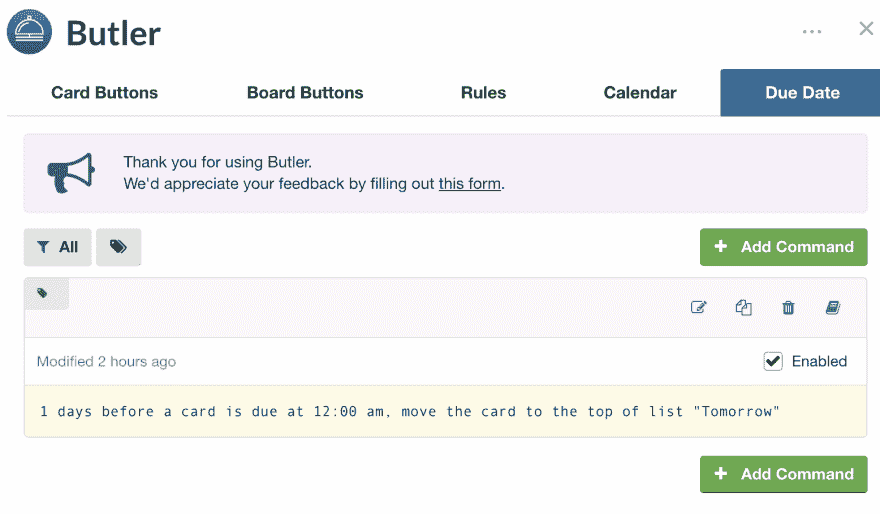
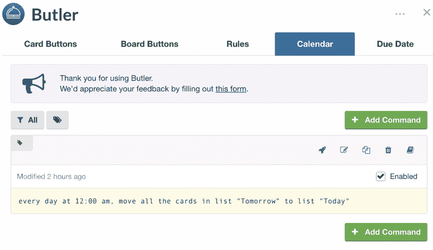
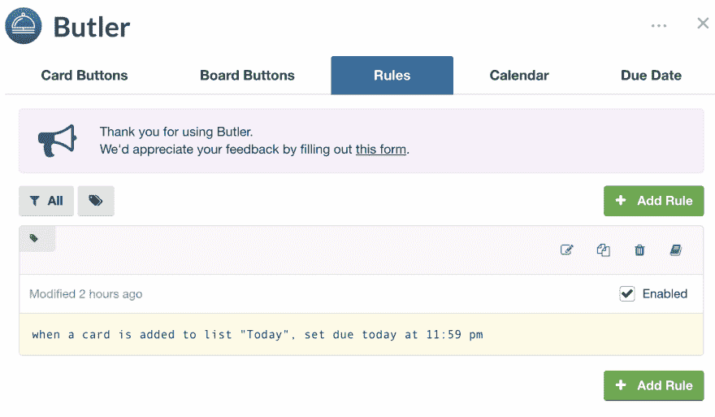

# 如何自动化任务管理，并且不要忘记那个该死的任务。

> 原文：<https://dev.to/diiaablo95/how-to-automate-tasks-management-and-not-to-forget-about-that-fg-task-2g8f>

# 一点脉络

不到三周前，我写了我的第一篇关于 DEV 的博客，实际上是我的第一篇博客。

 [## 那天我决定让我的日子过得更长。

### 安东尼奥 3 月 9 日 196 分钟阅读

#productivity #technology #tips #challenge](/diiaablo95/that-day-i-decided-to-make-my-days-last-longer-2h4g)

所以，简而言之，我仍然在不断地为最大化的计划和效率而努力。我写这几行是为了让你们知道，如果你们正在寻找相同或非常相似问题的解决方案(因为我找到的工具非常灵活)，那么这可能会对你们有很大帮助。至少我会给自己寄一份价值 5 美元的礼物。

# 问题

我把 Trello 作为主要工具来管理我日常的、微弱的、重复的、无止境的任务。但是有一件事特别让我困扰，因为它已经被搁置了将近一年。我从来没有时间坐下来花些时间在这上面。

基本上，我想开发一个非常小的系统，至少可以在每天中午 12:00 将我所有的卡从明天的*移到今天的*，并且在离到期日只差一天的时候从任何一个板移到明天的*。***

 ***因为我不想花钱购买 AWS 或任何其他提供 lambda 功能的提供商，也因为我没有调查是否有免费的替代方案，所以我想从壁橱里拿出我的旧 Raspberry Pi，开发脚本，用 cron 作业调度它们，并让它永远运行下去。

# 实际解

今天，2019 年 3 月 25 日，在很长一段时间之后，我终于有了一个空闲的晚上，尤其是愿意更深入地调查这个问题。这就是为什么昨天睡觉前，我把卡从*池*列表移到了今天*的*。现在，我的自制力迫使我采取行动，以便尽快将卡移动到*完成*。

这时，我做了一些研究，找到了一个解决方案，正好解决了我想要解决的问题，但是只产生了 0 行代码(不幸的是😥).

## 第一步:特雷罗打气💪

首先，我发现了**惊人的**特雷罗加电[巴特勒](https://trello.com/power-ups/5935cab6b26816f9d49fd814/butler)。这已经解决了我 80%的问题。您可以在每天、每周、每月的特定时间为新添加的卡、即将到期的卡或基于时间的操作设置触发器。它是免费的，因为 Trello 允许在其免费版本中使用一个电源。

因此，我在这次加电中所做的，是添加 3 个简单的规则:

第一个规则是到期日期触发器，每天中午 12:00，任何在 1 天内到期的卡，即第二天的任何时间，都将从板中的任何列表移动到明天的*列表，这是我为第二天到期的任务(猜猜是什么)制定的列表。到目前为止一切顺利。*

第二个规则是一个纯粹基于日历(或时间)的规则，每天上午 12:00，将卡片从*明天*列表移动到*今天*列表。**我看到了隧道尽头的光明**！

第三个也是最后一个规则是基于事件的触发器。每当一张卡被移动到今天的*列表时，每个触发器被激活。它只是将到期日设置为今天晚上 11:59(这是应该的)。特定的卡当然可以单独调整。非常好！*

但是仍然有一个大问题。如果有我应该在早上很早就完成的任务，我会简单地忘记并且记得太晚。我也不想在手机上设置提醒或闹钟，因为那需要多走一步(而且我太懒了)。

## 第二步:IFTTT(如果这个那么那个)

对于那些不知道那是什么的人来说，那只是你曾经需要的任何东西。

来自[网站](https://ifttt.com):

> IFTTT(如果这个，那么那个)是让你的应用和设备协同工作的简单、免费的方法。互联网并不总是一帆风顺，但我们是来帮忙的。

嗯，好吧，描述不是超级清楚。但 IFTTT 是一个网站(它依赖于大多数平台上可用的配套移动应用程序)，在那里你可以利用许多服务的 API 创建许多许多自动化任务，从 Spotify 到脸书，从 Telegram 到亚马逊 Alexa。例如，它可以让你在早上选定的时间收到来自地下气象站的降雨警报，这样你出门就不会不带伞了。

我已经在使用 IFTTT 完成一系列其他任务(称为 Applets)，比如获取 NASA 的每日图片、维基百科的每日词汇或者我目前居住的地方的天气。

但后来，我发现它与 Telegram 的整合非常好，尽管与 Trello 的整合并不那么强大。例如，不可能在早上 8:00 获得具有今天*列表中所有卡片的每日摘要(这些卡片已经被 Butler 自动化引擎自动移动)。但是，在另一端，可以简单地与 IFTTT 机器人建立私人对话，并在每天的特定时间接收定制的电报消息。*

# 结果

最后的结果？我只是每天早上 6:00 给自己发一条信息，告诉我检查一下特雷罗的公告板。Trello 板本身经过一夜的更新，由我配置的解决我特定需求的 Butler 启动。

我发现这个解决方案非常好，可能比其他电子邮件更好，因为(我们都知道)电子邮件很容易被忽略，尤其是在早上。

由于 Butler power-up 和 IFTTT 非常灵活，并且提供各种各样的定制，我认为与此非常相似的设置可能会解决大量类似的问题，同时仍然不涉及任何成本或任何特定的基础架构/开发工作。

嗯，那都是从我这边来的！我希望听听你们是如何找到提高生产力的最佳设置的。

干杯！***