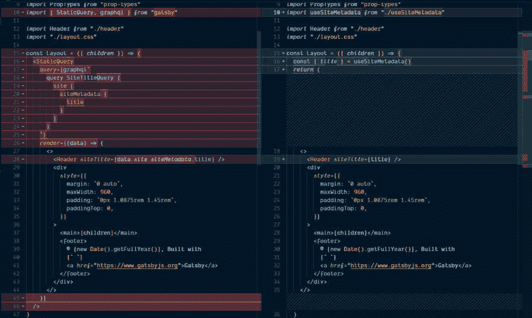
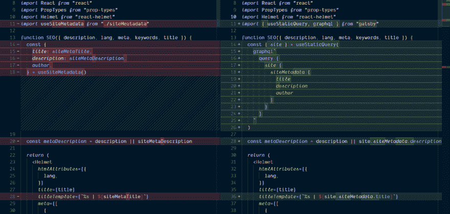

# 为 Gatsby 站点元数据创建自定义 React 挂钩

> 原文：<https://dev.to/spences10/creating-a-custom-react-hook-for-gatsby-site-metadata-12c3>

###### Etienne Girardet 在 Unsplash 上拍摄的照片

## 挂钩 ahoy！

好了，让我们开始新一轮的热舞吧，反应钩子！

这是一个指南封面，使用 Gatsby custom React hook 为`StaticQuery`制作，现在被替换为`useStaticQuery`。

如果您以前没有使用过 Gatsby，那么`StaticQuery`就是一种在 Gatsby 组件(即 react 组件)或 Gatsby 页面中查询数据的方法，其中查询输入不会改变。这是不会改变太多的数据的一个很好的用例，比如你的站点元数据。

## TL；博士；医生

这里我试图用 [codesandbox.io](https://codesandbox.io) 来 [even](https://youtu.be/8ruJBKFrRCk?t=93) ，同时我转换 [codesandbox.io](https://codesandbox.io) 上的一些 Gatsby 默认启动程序来使用`useSiteMetadata`自定义钩子。

使用 [codesandbox.io](https://codesandbox.io) ,我们来看看如何实现一个定制的 react 钩子来获取 Gatsby 中的站点元数据。

**这里有一个视频:**

[https://www.youtube.com/embed/qWay-LjXwbk](https://www.youtube.com/embed/qWay-LjXwbk)

`StaticQuery`组件使用[渲染道具](https://reactjs.org/docs/render-props.html)模式，这意味着它接受一个函数并基于该函数返回/渲染。

我以前在一篇关于使用 react context api 的帖子中详细描述过这种模式，它是一个组件，你将一个函数传递给它，以呈现一个组件。

这样想:

```
<Component>
 {() => ()}
</Component> 
```

Enter fullscreen mode Exit fullscreen mode

第一个括号是参数/变量，第二个是要呈现的内容，所以在 Gatsby `StaticQuery`的情况下，您传递一个带有`graphql`标签的查询，然后从那里返回的`data`就是在该组件的呈现中使用的内容。这样，您就有了返回并呈现子组件的包装组件，就像这样。

```
<WrappingComponent>
  {args => <ComponentToRender propsForComponent={args.propNeeded} />}
</WrappingComponent> 
```

Enter fullscreen mode Exit fullscreen mode

这里有一个在 [codesandbox.io](https://codesandbox.io) 上的 Gatsby 默认启动器中使用的`StaticQuery`组件的精简版本

我去掉了发型，把它剪短了一些:

```
const Layout = ({ children }) => (
  <StaticQuery
    query={graphql`
      query SiteTitleQuery {
        site {
          siteMetadata {
            title
          }
        }
      }
    `}
    render={data => (
      <>
        <Header siteTitle={data.site.siteMetadata.title} />
        <div>
          <main>{children}</main>
          <footer />
        </div>
      </>
    )}
  /> )

export default Layout 
```

Enter fullscreen mode Exit fullscreen mode

`StaticQuery`接受两个道具，`query`和你想用`render`渲染的东西，在这里你可以从查询返回的`data`道具中析构你需要的数据。

我从来不喜欢这样做，所以我采用了一个类似的模式，但是组件包含在它自己里面，然后单独添加到`StaticQuery`中。像这样:

```
const Layout = ({ children, data }) => (
  <>
    <Header siteTitle={data.site.siteMetadata.title} />
    <div>
      <main>{children}</main>
      <footer />
    </div>
  </> )

export default props => (
  <StaticQuery
    query={graphql`
      query SiteTitleQuery {
        site {
          siteMetadata {
            title
          }
        }
      }
    `}
    render={data => <Layout data={data} {...props} />}
  />
) 
```

Enter fullscreen mode Exit fullscreen mode

我发现这更容易接受，因为您不必将所有代码捆绑到`StaticQuery`组件中。

这些都有道理吗？

很好，现在忘掉这一切吧！是时候在《盖茨比》中使用新的性感元素了。💪

## 版本:

本指南正与以下依赖版本一起使用。

*   盖茨比:2.1.31
*   反应:16.8.4
*   反应范围:16.8.4

您还可以查看[示例代码](https://codesandbox.io/s/1vnvko0zqj)。

* * *

Gatsby 文档涵盖了它的使用，以及如何让你自己的定制 react 钩子使用`useStaticQuery`，这里是我在视频中使用的那个。

*useSiteMetadata.js*

```
import { graphql, useStaticQuery } from 'gatsby'

const useSiteMetadata = () => {
  const { site } = useStaticQuery(
    graphql`
      query SITE_METADATA_QUERY {
        site {
          siteMetadata {
            title
            description
            author
          }
        }
      }
    `
  )
  return site.siteMetadata
}

export default useSiteMetadata 
```

Enter fullscreen mode Exit fullscreen mode

这现在可以在剩下的代码中实现为一个函数调用:

```
const { title, description, author } = useSiteMetadata() 
```

Enter fullscreen mode Exit fullscreen mode

## 来实施吧！

在`layout`组件中导入`useSiteMetadata`钩子，然后我们可以移除`StaticQuery`组件并从`useSiteMetadata`钩子中析构`title`。

它看起来应该是这样的，为了简洁，我去掉了样式:

```
import React from 'react'
import PropTypes from 'prop-types'
import useSiteMetadata from './useSiteMetadata'

import Header from './header'
import './layout.css'

const Layout = ({ children }) => {
  const { title } = useSiteMetadata()
  return (
    <>
      <Header siteTitle={title} />
      <div>
        <main>{children}</main>
        <footer>
          © {new Date().getFullYear()}, Built with
          {` `}
          <a href="https://www.gatsbyjs.org">Gatsby</a>
        </footer>
      </div>
    </>
  )
}
Layout.propTypes = {
  children: PropTypes.node.isRequired
}

export default Layout 
```

Enter fullscreen mode Exit fullscreen mode

对比如下:

[](https://res.cloudinary.com/practicaldev/image/fetch/s--qwJsHdLx--/c_limit%2Cf_auto%2Cfl_progressive%2Cq_auto%2Cw_880/https://thepracticaldev.s3.amazonaws.com/i/3uh5qqzx2d40fzx8e57m.png)

现在对`seo`组件，同样，再次删除`StaticQuery`和使用`useSiteMetadata`在它的位置。

对比如下:

[](https://res.cloudinary.com/practicaldev/image/fetch/s--3_WLFYkw--/c_limit%2Cf_auto%2Cfl_progressive%2Cq_auto%2Cw_880/https://thepracticaldev.s3.amazonaws.com/i/egl2xmdnmcgkcfaqmdnm.png)

如果你想检查代码，这里有例子:[例子代码](https://codesandbox.io/s/1vnvko0zqj)

## 总结一下！

就是这样！我们已经从使用了不起的《盖茨比》中的渲染道具模式发展到更了不起的反应钩子。

**感谢阅读**🙏

如果你喜欢这个，请看看我的其他内容。

在 Twitter 上关注我，或者在 GitHub 上关注 T2 问我任何问题。