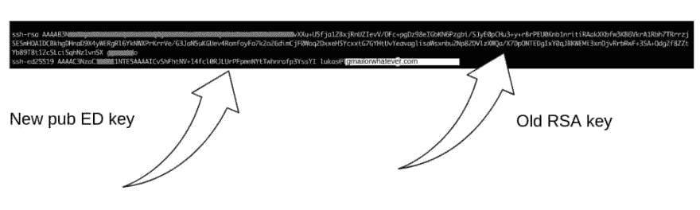

# 将您的 SSH 私钥从 RSA 升级到 ED25519 +对称密码保护

> 原文：<https://dev.to/web3coach/levelling-up-your-ssh-private-key-from-rsa-to-ed25519--symmetric-password-protection---3175>

今天，为了访问我的新区块链节点，我必须生成一个单独的私钥和公钥，所以我借此机会设置了一个新的、唯一的密钥对，它也受到 2FA 身份验证和交互式密码的保护。以后我会更进一步，用 Yubikey 保护它。

尽管 RSA 多年来一直是不对称 SSH 密钥的标准，但由于硬件的发展，2048 位以下的密钥不再被认为是安全的。是时候升级到更强的椭圆曲线算法 ED25519 了，它更快、更安全、字节更短。

## 要求

对 SSH 和安装的 **ssh-keygen** 有基本的了解。

## 第 1/3 步-生成新的 ED25519 Priv 密钥

```
ssh-keygen -t ed25519 -C "lukas@gmailorwhatever.com" 
```

Enter fullscreen mode Exit fullscreen mode

*感谢我亲爱的同事[安德鲁](http://andrewzappella.com/)的命令推荐！*

将提示您输入密钥目的地路径，

```
Enter file in which to save the key: 
/Users/enchanterio/.ssh/id_ed25519_devto_tutorial 
```

Enter fullscreen mode Exit fullscreen mode

选择一个密码(**不要留空**)。

```
Enter passphrase (empty for no passphrase):
Enter same passphrase again: 
```

Enter fullscreen mode Exit fullscreen mode

您的私钥已保存在 */Users/enchanterio/中。ssh/id _ ed 25519 _ devto _ tutorial*。

您的公钥已保存在 */Users/enchanterio/中。ssh/id _ ed 25519 _ devto _ tutorial . pub*。

关键指纹是:
*sha 256:qxcxjp 6 thlj 59 cjqky+qTrPnlTNfCq/RKNP+bycwya 8[lukas@gmailorwhatever.com](mailto:lukas@gmailorwhatever.com)*

钥匙的随机图像是:

```
+--[ED25519 256]--+
|                 |
|                 |
|    .            |
|   . o           |
|. ..=.. S        |
| Eo+oo*. .       |
|.=++o& =o.       |
|+.+=O.@.=.       |
|o=B+.*==..       |
+----[SHA256]-----+ 
```

Enter fullscreen mode Exit fullscreen mode

## 步骤 2/3 -配置 SSH 代理

连接到服务器，将新的本地公钥`cat ~/.ssh/id_ed25519_devto_tutorial.pub`的内容添加到服务器的`.ssh/authorized_keys`文件中，并删除旧的 RSA 密钥:

[](https://res.cloudinary.com/practicaldev/image/fetch/s--ARapDeZ0--/c_limit%2Cf_auto%2Cfl_progressive%2Cq_auto%2Cw_880/https://rablater.sirv.cimg/DevTo/ecdsa_authorized_keys.jpg) 
*忽略图像上的键和上面的不一样在这个教程里，我是在写教程之前截图的*

断开与服务器的连接。现在，我们将使用一个额外的技巧，将特定的 IP 地址与这个新的私有密钥相关联，而不会影响基于旧 RSA 密钥的其余 SSH 连接。

```
vim ~/.ssh/config 
```

Enter fullscreen mode Exit fullscreen mode

```
Host blockchain-node
        HostName <YOUR_IP_ADDRESS>
        User root
        IdentityFile /Users/enchanterio/.ssh/id_ed25519_devto_tutorial 
```

Enter fullscreen mode Exit fullscreen mode

## 步骤 3/3 -拨号连接

执行:

```
ssh blockchain-node 
```

Enter fullscreen mode Exit fullscreen mode

系统将提示您通过密码解锁 SSH 密钥:

```
Enter passphrase for key '/Users/enchanterio/.ssh/id_ed25519_devto_tutorial':
<type pwd...>

Done! Connected. Welcome to Ubuntu 18.04.1 LTS (GNU/Linux 4.15.0-43-generic x86_64) 
```

Enter fullscreen mode Exit fullscreen mode

你刚刚连接到的服务器，根据你的新密码保护，ED25519 椭圆私钥对你进行验证。Gg。