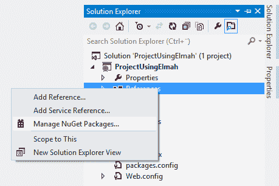
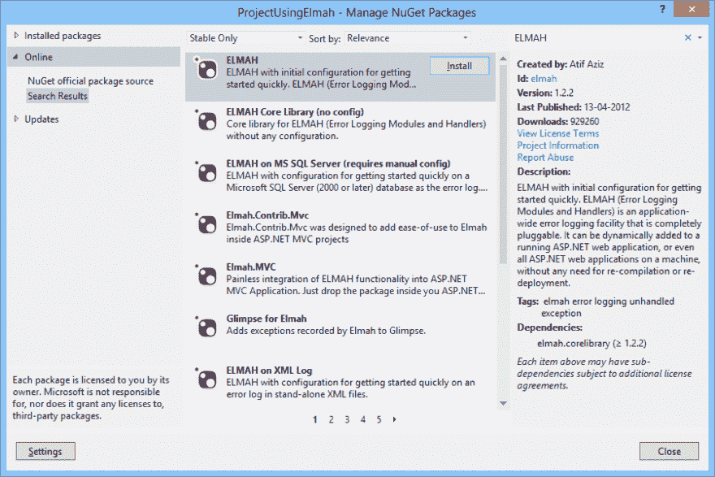
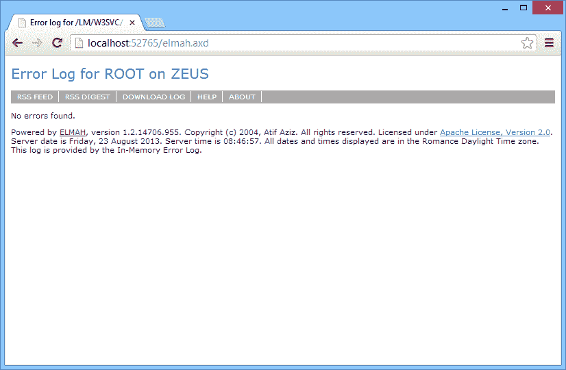
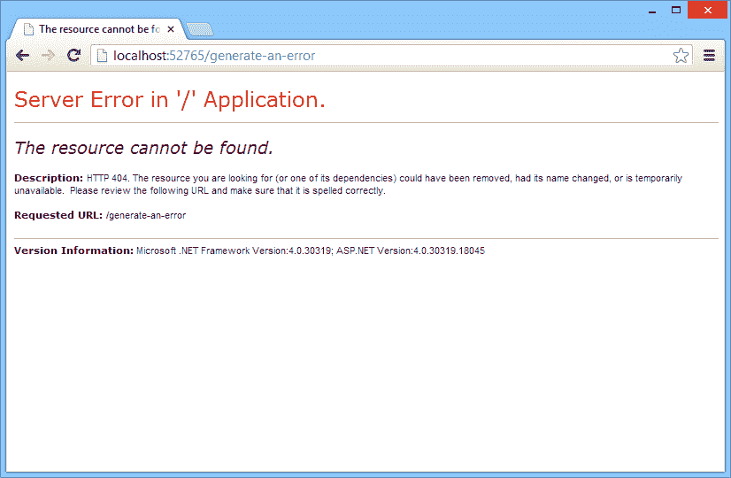
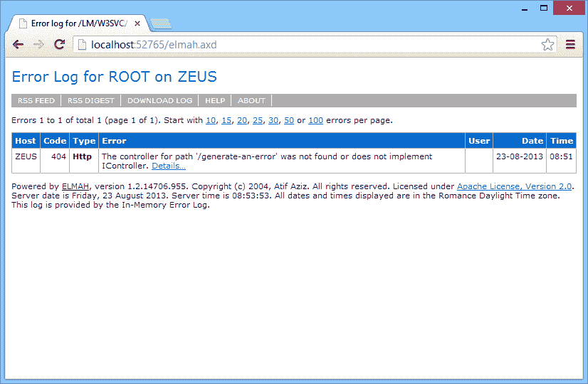
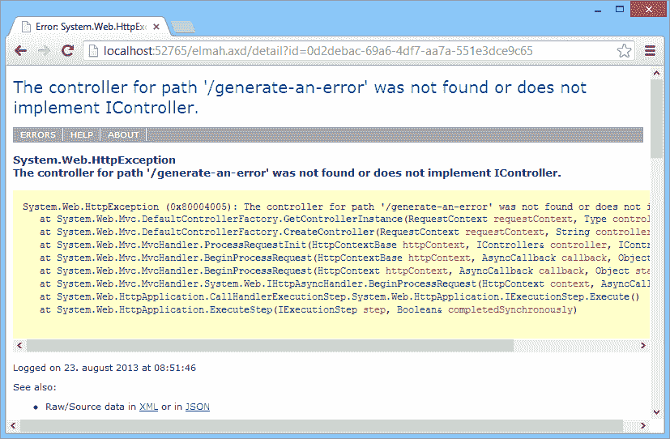
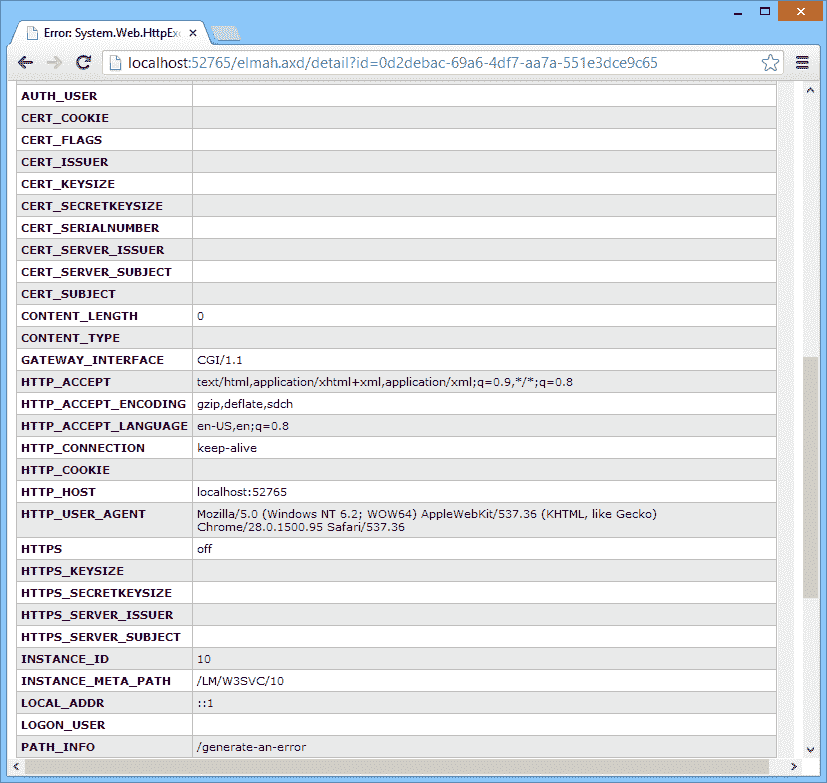

# 终极 ELMAH 教程

> 原文：<https://dev.to/thomasardal/the-ultimate-elmah-tutorial-1837>

有很多文章试图解释 ELMAH，但大多数文章都假设你已经了解 ELMAH。这篇文章试图用最简单的方式解释如何开始使用 ELMAH。

所以让我们从 ELMAH 是什么开始说起。ELMAH 基本上是一个 NuGet 包。NET web 应用程序，将一个或多个网站上发生的每个异常记录到您选择的一些存储中。与其他日志记录框架不同，当以最简单的形式配置时，ELMAH 会自动记录每个异常。当然，有一个 API 可以用来记录自定义错误，但是大多数人只使用自动部分。在本教程中，我们将只关注基本部分。

## 安装

设置 ELMAH 最简单的方法是通过 NuGet。

运行以下命令:

```
Install-Package  ELMAH 
```

...或者通过右键单击引用来添加 ELMAH:

[](https://res.cloudinary.com/practicaldev/image/fetch/s--JYkd6BEv--/c_limit%2Cf_auto%2Cfl_progressive%2Cq_auto%2Cw_880/https://blog.elmah.io/conteimg/old/manage_nuget_packages.png)

寻找 ELMAH:

[](https://res.cloudinary.com/practicaldev/image/fetch/s--R0dhe-RM--/c_limit%2Cf_auto%2Cfl_progressive%2Cq_auto%2Cw_880/https://blog.elmah.io/conteimg/old/nuget_dialog.png)

单击 Install，ELMAH 将安装在您的项目中。

在您的 web.config 中已经设置了很多配置，但是现在只需启动您的 web 项目。启动后，导航到:`http://localhost:port/elmah.axd`(用您的 web 应用程序端口号替换端口)。您应该会看到这样一个网站:

[](https://res.cloudinary.com/practicaldev/image/fetch/s--B07HgfZJ--/c_limit%2Cf_auto%2Cfl_progressive%2Cq_auto%2Cw_880/https://blog.elmah.io/conteimg/old/elmah_page.png)

## 记录错误

在默认配置中，ELMAH 使用内存日志记录器，这意味着 web 服务器上的错误只记录在内存中。内存日志记录器仅用于开发，我们将在本文后面讨论如何配置持久日志记录器。

现在通过输入一个没有找到的 URL 生成一个 404，比如:`http://localhost:port/generate-an-error`。除非您配置了自定义错误页面，否则将显示默认错误页面:

[](https://res.cloudinary.com/practicaldev/image/fetch/s--JdjXz4QF--/c_limit%2Cf_auto%2Cfl_progressive%2Cq_auto%2Cw_880/https://blog.elmah.io/conteimg/old/404.png)

在幕后，ELMAH 默默地连接到错误事件并记录错误。

## 错误列表

尝试再次导航到 ELMAH:`http://localhost:port/elmah.axd`:

[](https://res.cloudinary.com/practicaldev/image/fetch/s--_my1WDKv--/c_limit%2Cf_auto%2Cfl_progressive%2Cq_auto%2Cw_880/https://blog.elmah.io/conteimg/old/elmah_page_with_error.png)

通过访问非法 URL (/generate-an-error)生成的错误现在显示在列表中。ELMAH 在表格中显示了最重要的变量，但是如果您想要完整的图片，您可以单击错误消息末尾的详细信息…链接。这将显示 ELMAH 的详细视图:

[](https://res.cloudinary.com/practicaldev/image/fetch/s--BAlbwe4q--/c_limit%2Cf_auto%2Cfl_progressive%2Cq_auto%2Cw_880/https://blog.elmah.io/conteimg/old/elmah_error_details.png)

details 视图显示了一些关于抛出错误的详细信息。通常，您会直接进入堆栈跟踪，但有时如果您查看服务器变量(cookies、http 头等),调试会更容易。).向下滚动查看失败的 HTTP 请求中包含的所有服务器变量:

[](https://res.cloudinary.com/practicaldev/image/fetch/s--GItVKHGJ--/c_limit%2Cf_auto%2Cfl_progressive%2Cq_auto%2Cw_880/https://blog.elmah.io/conteimg/old/elmah_error_details_headers.png)

## 登录到 SQL Server

完美！我们新的错误日志工作正常。如果您可以忍受错误被记录在内存中，那么您现在就可以完成本教程。但是，请记住，如果您的网站被回收或类似的错误被清除。大多数人配置一个受支持的日志实现来保存错误。您运行 SQL Server 的机会可能比任何其他数据库都大，这就是为什么我们选择在本教程中展示 SQL Server logger。请访问 ELMAH 官方网站了解其他伐木工的描述。

设置新的记录器通常需要一些 ELMAH 配置和一些连接字符串。打开 web.config 文件并找到

元素。格式可能有点混乱，但通过在 Visual Studio 中单击“编辑”|“高级”|“设置文档格式”可以很容易地解决这个问题。标记如下所示:

```
<elmah>
  <!--
    See http://code.google.com/p/elmah/wiki/SecuringErrorLogPages for
    more information on remote access and securing ELMAH.
  -->
  <security allowRemoteAccess="false" />
</elmah> 
```

如果你喜欢，继续删除评论。请注意，除了安全元素之外，不存在任何记录器配置。如前所述，当没有指定记录器时，ELMAH 使用内存中的记录器。安全元素上的 allowRemoteAccess="false "属性告诉 ELMAH 不允许连接到除本地主机以外的错误。您通常不希望让其他人查看您的错误日志，这就是我们建议您保留这些安全设置的原因。稍后会详细介绍。

要配置 SQL Server 日志，请添加一个新的错误日志，如下所示:

```
<elmah>
  <errorLog type="Elmah.SqlErrorLog, Elmah" connectionStringName="ErrorLog"/>
  <security allowRemoteAccess="false" />
</elmah> 
```

在第 2 行中，添加了一个新元素。ELMAH 的每个错误记录器都是使用这个元素配置的。每个项目只能有一个错误记录器。type 属性告诉 ELMAH 使用什么样的错误记录器。在这种情况下，我们使用 Elmah 程序集中的 SqlErrorLog 类，我们已经通过 NuGet 添加了该类。其他错误记录器可能要求您添加额外的包。SqlErrorLog 记录器需要另一个名为 connectionStringName 的属性。同样，不同的错误记录器需要不同的配置才能运行。connectionStringName 应该指向 SQL 连接字符串名称 ErrorLog:

```
<connectionStrings>
  <add
    name="ErrorLog"
    connectionString="Data Source=localhost;Initial Catalog=ELMAH;Integrated Security=SSPI;"
    providerName="System.Data.SqlClient" />
</connectionStrings> 
```

在本例中，我们选择将 ELMAH 配置为使用它自己的名为 ELMAH 的数据库，该数据库位于本地主机上的 SQL Server 实例上。我们建议为 ELMAH 使用单独的数据库，但是如果您愿意，也可以使用现有的数据库。

ELMAH 要求在已配置的数据库上创建一些表和存储过程。ELMAH 1.2 的脚本可以在这里找到:[ELMAH 1.2 MS Sql Server DB 脚本](https://github.com/elmah/SqlErrorLog/blob/master/src/SQLServer.sql)。

## 手动记录错误

通常，您希望在向客户端返回错误响应之前捕获错误。因为 ELMAH 只记录未被捕获的异常，所以您需要某种方式来手动将错误记录到 ELMAH。有了 ELMAH 的`ErrorSignal`类，我们就可以做到这一点:

```
try
{
    int i = 0;
    int result = 42 / i;
}
catch (DivideByZeroException e)
{
    ErrorSignal.FromCurrentContext().Raise(e);
} 
```

在上面的例子中，我们使用`FromCurrentContext`助手来创建一个新的`ErrorSignal`实例。ELMAH 也在 web 服务器的上下文之外工作，在这种情况下，您只需使用默认的日志记录器，将 null 作为 HTTP 上下文:

```
ErrorLog.GetDefault(null).Log(new Error(e)); 
```

## 保护错误日志

当通过 NuGet 安装时，ELMAH 会自动将`allowRemoteAccess`属性设置为`false`。这意味着你只允许在本地主机上运行时访问`elmah.axd`。如前所述，不建议将其设置为`true`。

为了保护对 elmah.axd 的访问，通过 ASP.NET 的授权特性，elmah 支持授权。要仅允许单个角色访问`elmah.axd`，请找到`elmah.axd`的配置部分，并拒绝除管理员角色(角色名称可能与您的设置不同)以外的所有用户:

```
<location path="elmah.axd">
    <system.web>
        <httpHandlers>
            <add verb="POST,GET,HEAD"
                 path="elmah.axd"
                 type="Elmah.ErrorLogPageFactory, Elmah" />
        </httpHandlers>
        <authorization>
            <allow roles="admin" />
            <deny users="*" />
        </authorization>
    </system.web>
    <system.webServer>
        <handlers>
            <add name="ELMAH"
                 verb="POST,GET,HEAD"
                 path="elmah.axd"
                 type="Elmah.ErrorLogPageFactory, Elmah"
                 preCondition="integratedMode" />
        </handlers>
    </system.webServer>
</location> 
```

如果你想了解更多关于保护你的 ELMAH 日志的信息，你应该通过 [ELMAH 安全和允许远程访问](https://blog.elmah.io/elmah-security-and-allowremoteaccess-explained/)做好准备

## 开启/关闭日志记录

ELMAH 没有提供一个内置的机制来方便地打开/关闭错误记录。在大多数情况下，您希望打开错误日志记录，但是我已经看到许多人要求一种简单的方法来做到这一点。最简单的方法可能是注释掉`httpModules`和`modules` :
中的`ErrorLog`模块

```
...
<httpModules>
    <!--add name="ErrorLog" type="Elmah.ErrorLogModule, Elmah" /-->
</httpModules>
...
<modules>
    <!--add name="ErrorLog" type="Elmah.ErrorLogModule, Elmah" preCondition="managedHandler" /-->
</modules>
... 
```

另一种方法是注释掉`errorLog`元素:

```
<elmah>
    <!--errorLog ... /-->
</elmah> 
```

这实际上不会禁用日志记录，而是切换到 ELMAH 的内置内存记录器。

最后，如果你想要一个简单的开关，可以通过手动修改设置、Azure 或者其他方式来控制。第三，创建一个新的应用设置:

```
<appSettings>
    <add key="ELMAH:disable" value="false" />
</appSettings> 
```

在`Global.asax.cs`文件中，添加以下方法:

```
void ErrorLog_Filtering(object sender, ExceptionFilterEventArgs e)
{
    if (bool.Parse(ConfigurationManager.AppSettings["ELMAH:disable"]))
        e.Dismiss();
} 
```

## 你的用户会喜欢更少的错误吗？

elmah.io 是一个简单的错误记录和正常运行时间监控服务。通过对所有的支持，重新控制你的错误。NET web 和日志框架。

➡️ [错误监控。NET 网络应用](https://elmah.io/?utm_source=devto&utm_medium=social&utm_campaign=devtoposts) ⬅️

这篇文章最初出现在 elmah.io 的博客上，时间是[https://blog.elmah.io/elmah-tutorial/](https://blog.elmah.io/elmah-tutorial/)