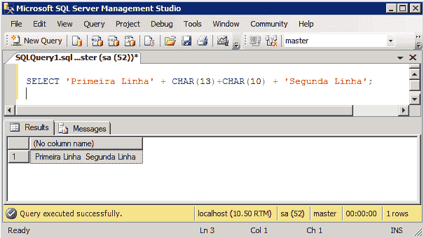
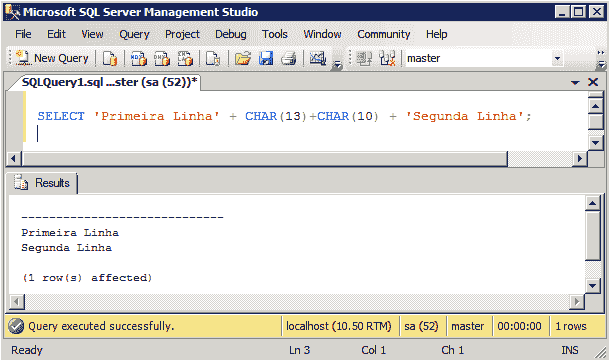
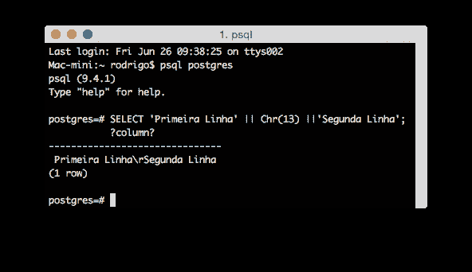

# SQL:在查询中添加换行符

> [https://dev . to/rdeavila/SQL-如何添加-uma-query-3g02](https://dev.to/rdeavila/sql-como-adicionar-uma-quebra-de-linha-em-uma-query-3g02)

下面是两个例子。一个用于 PostgreSQL，另一个用于 SQL Server。

```
-- Exemplo para PostgreSQL
SELECT 'Primeira Linha' || Chr(13) ||'Segunda Linha';

-- Exemplo para SQL Server
SELECT 'Primeira Linha' + CHAR(13)+CHAR(10) + 'Segunda Linha'; 
```

Enter fullscreen mode Exit fullscreen mode

`CHAR(13)`相当于`CR`。遵循 DOS/Windows 的`CRLF`风格，需要`CHAR(13)+CHAR(10)`。

执行查询时，它会添加换行符，无论是 windows 换行符还是 Unix 换行符。但是，查看这些断点取决于我们用来执行它的工具。请参见以下示例:

#### SQL Server

在 Management Studio 中运行查询时，有两种查看结果的方法:网格模式和文本模式。

在网格模式下查看时，Management Studio 不显示换行符:

[](https://res.cloudinary.com/practicaldev/image/fetch/s--3DpIRLiM--/c_limit%2Cf_auto%2Cfl_progressive%2Cq_auto%2Cw_880/https://avila.net.br/assets/sqlserver-result-to-grid.png)

但是，当我们在文本模式下查看时，它会按预期方式进行拆分:

[](https://res.cloudinary.com/practicaldev/image/fetch/s--Lgw1bCGP--/c_limit%2Cf_auto%2Cfl_progressive%2Cq_auto%2Cw_880/https://avila.net.br/assets/sqlserver-result-to-text.png)

#### PostgreSQL

使用`psql`进行预览时，会显示`\r`，这是换行字元的表示法:

[](https://res.cloudinary.com/practicaldev/image/fetch/s--5a-j178b--/c_limit%2Cf_auto%2Cfl_progressive%2Cq_auto%2Cw_880/https://avila.net.br/assets/pgsql-terminal.png)

当我们从 PgAdmin 那里看到的时候，他就像这样：

[](https://res.cloudinary.com/practicaldev/image/fetch/s--K68GSjim--/c_limit%2Cf_auto%2Cfl_progressive%2Cq_auto%2Cw_880/https://avila.net.br/assets/pgsql-pgadmin.png)

#### 但是，我的申请呢？

如果在自己开发的应用程序中使用此提示，则需要处理查询结果，并根据需要显示换行符。例如，如果您正在开发 web 应用程序，则可以在视图图层中将换行符替换为“`<br/>`”。