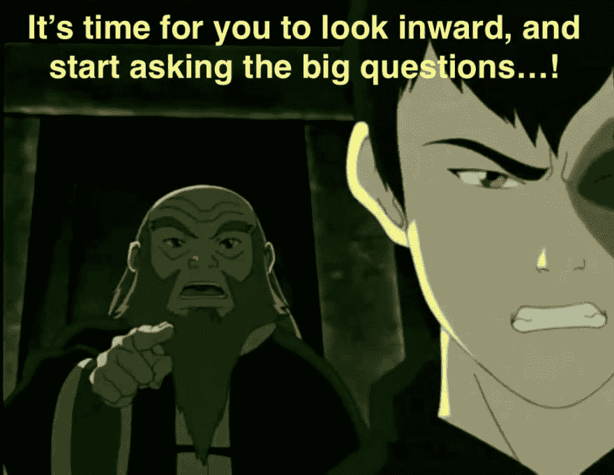
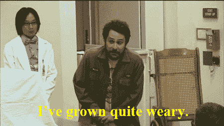

# 反思学习、失败和处理时间(人类)

> 原文：<https://dev.to/isalevine/reflecting-on-learning-failure-and-processing-time-the-human-kind-f0a>

上辈子(即前两份工作)，我是一名蒙特梭利中学教师。我相信我所使用的课程中最有价值的部分是个人反思的专门科目，它在每个学校日都建立了时间来学习和练习内省、正念和情感意识的技能。

 
*一部电视剧给我的最好建议。*

我在西雅图熨斗大厦开始学习编码的准备工作的一部分就是重温这些技术。我知道，开发应对与编码相关的压力的方法将是进入科技世界不可或缺的一部分(还有其他担忧，例如第一次在专业环境中作为跨性别者出现)，本周末我花了一些时间反思这些努力是如何进行的。到目前为止，以下是我的一些心得和有用的提醒:

## 1。学习既让人精力充沛*又让人疲惫不堪*，而编码放大了两者的感觉——花时间休息吧！

 
*Me irl*

我喜欢学习。我是那种在半夜想到新点子时兴奋得睡不着觉的人。编码所需要的持续不断的学习让我以这种方式保持活力，特别是因为新的想法可以很容易实践——新的编码技术可以马上实践，这使得学习体验变得如此直接和加速。继续下去也很容易，因为在代码世界中，一件事总是会导致另一个有趣的联系，就像一个无限深的维基百科漏洞([就像我最近掉下的这个特殊的洞](https://en.wikipedia.org/wiki/Bloom_filter))。

但是这种持续的刺激正在流失。我记得我当老师时有过类似的经历——经常醒来写下课程和项目想法，然后这些想法被新的想法冲走。我不能永远保持下去；没人能。虽然不是每个人对学习新事物都有这种反应，但学习编码总是需要你的大脑和身体做一些工作——所以即使它令人兴奋，也是令人疲惫的。

所以，抓紧时间休息是有好处的。练习注意你的身体有多疲劳也是如此，即使你很兴奋，情绪很激动。放慢脚步，让自己停下来休养生息，这不是一个错误或个人的失败。

说到失败…

 
*不要听这部分你的内心独白！*

## 2。生产力需要失败，而编码提供了大量的机会。

这是编码中微妙(也不那么微妙)消耗的很大一部分——它需要大量的失败，而这种失败可能会适得其反。但其实不是！我可以喋喋不休地谈论卡罗尔·德韦克的“成长心态”或其他与“T2”、“生产性失败”相关的观点，或者不科学地推测失败与“学习生物学”和“T7”之间的联系(这两者我都曾在家长会上做过)。相反，我一直在花时间反思编码中“失败”的本质是什么，对这种模糊性的思考帮助我认识到需要以更有针对性的方式解决这些经历。

编码失败意味着什么？是你写代码的时候不行吗？这是一种优化措施，还是编写优雅代码的措施？是依靠旧习惯而不是尝试新技术吗？是不是没有完成你或别人设定的明确目标？我当然经历过以上所有的事情——你觉得你在编码时经历“失败”的其他方式有哪些？

同样重要的是:你有什么方法帮助自己以积极和富有同情心的方式重新定义这些经历？

 
*有时候对自己很难做到宽容和富有同情心！*

## 3。每个人都需要时间来适应。

这是我试图传授给所有学生的第一课，直到今天我还在告诉自己:理解需要时间。回到蒙特梭利世界，我们称之为[‘处理时间’](https://www.thesienaschool.org/Customized/Uploads/ByDate/2015/October_2015/October_12th_2015/ascdfull68960.pdf)，这可能是一个在编码世界里有点不合适的术语。无论如何，认识到学习是一个更类似于[展开](https://www.youtube.com/watch?v=3IrlBKv1sE0)而不是[调和](https://www.youtube.com/watch?v=5LqTFO7ea74)的过程是有帮助的，因为它的最终结果并不总是立竿见影的——或者甚至是*可知的。*

是的，学习编码的诱惑之一是你可以多快地玩新的技巧和想法。但是，立即动手学习并不是过程的结束。在想法之间建立新的联系，实现感知代码的新方式，开辟新的知识领域进行探索——所有这些都需要时间，每个人的时间长短都不同。

在尝试学习不同的东西时，试着看看你的处理时间有多长！例如，你可能不会以同样的速度学习如何用一种新的语言编写代码和如何烹饪一种新的菜肴(我知道我不会)——我认为了解你学习不同事物的不同速度是非常有趣和健康的。只知道处理时间长不是坏事，不是衡量天赋或者先天能力的标准！这只是你个人学习节奏的一部分——就像休息和失败一样。

 
*或多或少准确的描绘了我休息时的样子。顺便说一句，鲍比·希尔是我的灵魂伴侣。<3T7】*

最后，我从这些反思中最大的收获是让自己确信学习是一个动态的、不断发展的过程。它随着时间的推移而展开，留出休息的时间和原谅失败都是这个过程的必要部分。

我也很想听听你是如何应对学习编码的压力的！

### *链接和积分*

[https://fs.blog/2015/03/carol-dweck-mindset/](https://fs.blog/2015/03/carol-dweck-mindset/)

https://www . kqed . org/mind shift/44726/how-productive-failure-for-students-can-help-lessons-stick

[https://www.ncbi.nlm.nih.gov/pmc/articles/PMC4261922/](https://www.ncbi.nlm.nih.gov/pmc/articles/PMC4261922/)

[http://citeseerx.ist.psu.edu/viewdoc/download?doi = 10 . 1 . 1 . 521 . 9958&rep = rep 1&type = pdf](http://citeseerx.ist.psu.edu/viewdoc/download?doi=10.1.1.521.9958&rep=rep1&type=pdf)

[https://www . the siena school . org/Customized/Uploads/by date/2015/10 月 _ 2015/10 月 _ 12 日 _2015/ascdfull68960.pdf](https://www.thesienaschool.org/Customized/Uploads/ByDate/2015/October_2015/October_12th_2015/ascdfull68960.pdf)

[https://en.wikipedia.org/wiki/Bloom_filter](https://en.wikipedia.org/wiki/Bloom_filter)

[https://twitter.com/pilotviruet/status/1075435319380664321](https://twitter.com/pilotviruet/status/1075435319380664321)

[https://www.weareteachers.com/teacher-happiness/](https://www.weareteachers.com/teacher-happiness/)

[https://www.youtube.com/watch?v=3IrlBKv1sE0](https://www.youtube.com/watch?v=3IrlBKv1sE0)

[https://www.youtube.com/watch?v=5LqTFO7ea74](https://www.youtube.com/watch?v=5LqTFO7ea74)

[https://en.wikipedia.org/wiki/Avatar:_The_Last_Airbender](https://en.wikipedia.org/wiki/Avatar:_The_Last_Airbender)

[https://en . Wikipedia . org/wiki/Tim _ and _ Eric _ Awesome _ Show，_Great_Job](https://en.wikipedia.org/wiki/Tim_and_Eric_Awesome_Show,_Great_Job) ！

[https://en . Wikipedia . org/wiki/It % 27s _ Always _ Sunny _ in _ Philadelphia](https://en.wikipedia.org/wiki/It%27s_Always_Sunny_in_Philadelphia)

[https://en.wikipedia.org/wiki/King_of_the_Hill](https://en.wikipedia.org/wiki/King_of_the_Hill)